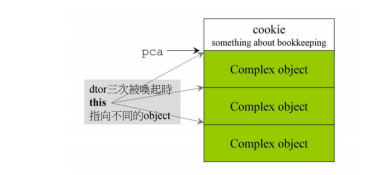
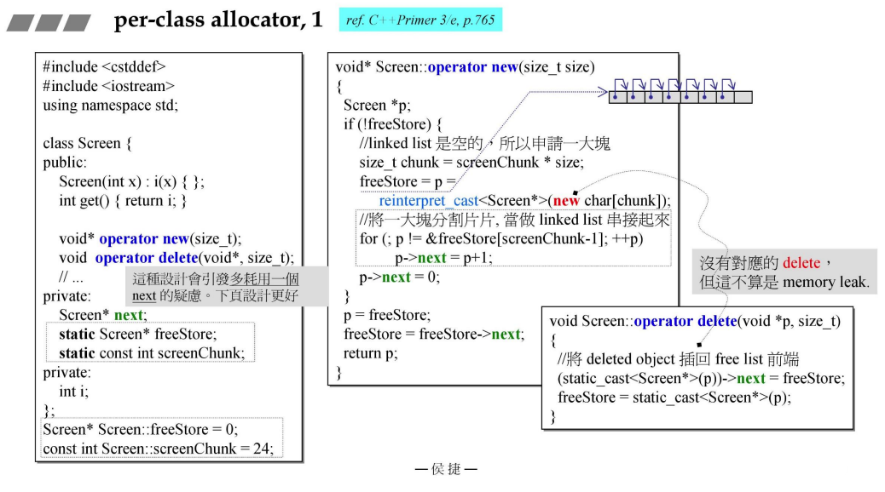
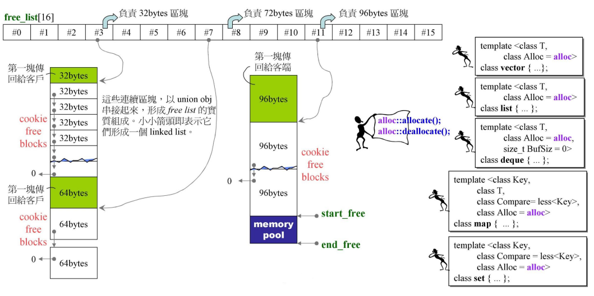

### 内存管理

### 预备


#### 1、new/delete表达式

```c++
Complex* pc = new Complex(1,2);
```

此时new会有两个动作：分配内存和调用构造函数

编译器转化为如下代码：

```c++
Complex *pc;
try {
    1、void * mem = operator new(siezof(Complex)); // allocate
    2、pc = static_cast<Complex*>(mem); // 转型
    3、pc->Complex::Complex(1,2); // construct 我们不能直接调用构造函
    数 这里编译器行为 所以可以
}
catch(std::bad_alloc) {
    // 若allocation失败就不执行constructor
}
```

APP想要直接调用ctor，可以运用placement new

```c++
new(p)Complex(1,2);
```

**operator new 函数代码如下**：

```c++
void *operator new(size_t size,const std::nothrow_t&) _THROW0()
// nothrow_t表示不抛出异常
{
    void *p;
    while((p == malloc(size)) == 0)
    {
        _TRY_BEGIN
        	if (_callnewh(size) == 0) break; //_callnewh 调用new handle函数 下面会解释
        _CATCH(std::bad_alloc) return(0);
        _CATCH_END
    }
    return (p);
}
```

> Effective C++ 条款49：了解new-handler的行为 
>
> 当operator new无法满足某一内存分配需求时，会返回一个null指针。但在此之前 会先调用一个客户指定的错误处理函数。即new-handler。为了指定这个“用以处 理内存不足”的函数。客户必须先调用set_new_handler 
>
> ```c++
> namespace std {
>     typedef void (*new_handler)();
>     new_handler set_new_handler(new_handler p) throw();
> }
> ```
>
> set_new_handler的参数是一个指针，指向operator new无法分配足够内存时应该 调用的函数，返回值也是个指针，指向set_new_handler被调用前正在执行（但马 上要被替换）的那个new_handler函数。

同理 delete

```c++
Complex* pc = new Complex(1,2);
...
delete pc;
```

编译器转化为如下：

```c++
pc->~Complex(); // 先析构
operator delete(pc); // 再释放内存
```

**operator delete 代码如下**：

```c++
void __cdecl operator delete(void *p) _THROW0()
{
    free(p);
}
```

> 注意区分： new 、 operator new() 、 new() ，第一个是 new 表达式，第二个 是重载函数，第三个是 placemen new 。

#### 2、array new & array delete

```c++
Complex* pca = new Complex[3]; // 唤起3次默认构造函数ctor，而不是传参的构造函数
...
delete[] pac; // 唤起3次dtor
string* psa = new string[3];
...
delete psa; // 只唤起1次dtor！
```

> 没对每个object调用dtor，有什么影响？ 
>
> + 对class without ptr member可能没有影响 
> + 对class with ptr member通常有影响

+ 若是没带指针的类如上面的 class Complex ，则在 new 出1个 Complex[] 数 组并放置3个对象后，在 delete 时指调用 1 次或 3 次 dtor 都没问题，因为其 不带指针，其 delete 时系统回收带 cookie 的那块内存地址同时连其中所存放的三个 Complex object 的内容也被回收，所以其内部的 Complex object 是 否被调用 1 次或 3 次 dtor 都无所谓了

  

  如上图，如果只调用 delete pca ，因为 Complex object 没有 ptr member 。所 以 delete 的时候已经回收了所分配的内存。

+ 若是带指针的类如上面的 class string ，则在则在 new 出 1 个 String[] 数组并放置3个对象后，其 psa 指针指向的地址空间存放有 str1，str2，str3 三个指针，且这三个指针又指向外面内存的地址。所以此时若只是 delete psa ，则系统回收时虽会将带 cookie 的那块内存地址回收，且调用了一次 dtor 函数释放了 str3 指向的外部的内存空间。但此时记录指向外部内存空间 的 str1 和 str2 随着存放 cookie 的那块内存空间被释放而被删除掉了，由此 便会造成原本由 str1 和 str2 指向的外部内存空间泄漏【并不是带 cookie 的 那块内存地址泄漏】。

> 
>
> 如下图所示：
>
> 

#### 3、array size在内存块中

+ 数组内部存放的数据是简单型的基本类型的元素时：

  

  运用关键字new创建出来的对象是分配到堆(heap)的内存中的，且用pi去接受指向堆内 存的这块地址的存放元素的起始位置。 而在这个int型例子中内存地址存放的是不带指针且是基本类型的数据时，所以释放时 加不加[ ] 都不会产生内存泄漏。 **int这种简单类型是没有构造或析构函数的，所以析构10次或析构1次都无影响！**

+ 数组内部存放元素是一个复合的类元素时 ：


此时数组内部存放的是复合类型的类元素【虽然也不带指针】，但如果此时只是 delete p，则编译器会将p看成指向一块整块的内存空间，试图去解析这块内存空间的布局时遇到3无法解析则整个布局会乱掉。而使用delete[] p 时，则可以解析3的信息意义。

#### 4、operaotr new & placement new

`operator new`用于分配一块原始内存。其功能等同于`malloc`，其形式为：

```cpp
void * operator new(size_t sz);
```

参数`size_t sz`表示分配内存的多少。

`new operator (expression)`调用`operator new`是隐式传入第一个参数 `size_t sz`的。同样也可以像调用普通函数一样调用`new operator`，例如：

```cpp
void * buff = operator new(sizeof(std::string));
```

`operator new`将会返回一块可以容纳`std::string`的原始内存。同样，也 可以重载`operator new`，但是第一个参数类型必须是`size_t`。事实上， `placement new`是`operator new`的一种特定形式，其在标准库中定义为：

```cpp
void * operator new(size_t sz, void * buff)
{
    return buff;
}
```

通过`placement new`可以控制对象存放位置。再联想一下，内存的分配、初始化、释放都是要消耗时间的，如果可以将不使用的内存， 重新回收利用，就能节省分配和释放的时间。

所以利用`operator new`和`placement new`可以使用一个简单的内存复用的**内存池**。

#### 5、placement new

+ placement new允许我们将object建构于allocated memory（已经分配好的内存） 中。
+ placement new根本没分配memory，所以一般无所谓的placement delete。但基于后面会重写placement new()，所以也必须写placement delete【实际上是operator delete，只是形式上称为placement delete】。
+ 其表述形式为： new( p) 或 ::operator new(size, void*) 【即有第二传入参数，且为指针类型】

> 其实new(p)的p就是参数，就是::operator new(size, void*)的第二参数

```c++
#include <new>
void* operator new(size_t, void* loc){
    return loc;
}
char* buf = new char[sizeof(Complex) * 3];
Complex* pc = new(buf)Complex(1, 2);
...
delete[] buf;
```

第一行的 new char[sizeof(Complex) * 3] ;创建出可以存放3个 Complex 类大小 的内存空间：


第二行的`new(buf)Complex(1, 2)`实际上编译器在编译时转化为：

```c++
Complex *pc;
try {
    void * mem = operator new(sizeof(Complex), buf);
    pc = static_cast<Complex*>(mem);
    pc->Complex::Complex(1,2);
}
catch(std::bad_alloc) {
    // 若allocation失败就不执行constructor
}
// 上述operator new
void* operator new(size_t,void* loc)
{
    return loc;
}
// 这里的operator new也是重载版本。

```

而这里的 operator new(size_t, void* loc) 的内部操作为传入什么指针就传出 什么指针的 void 类型，并没有实际进行分配内存的操作，则在空间足够时，就用接 收到的返回指针去调用构造函数，从而将创建出来的对象放在原先已 new 好的内存空间地址。

#### 6、重载

##### 6.1、C++应用程序，分配内存路径


如果是正常情况下，调用new之后走的是第二条路线**，如果在类中重载了operator new()，那么走的是第一条路线，但最后还是要调用到系统的::operator new()函数**，这在后续的例子中会体现。


对于GNU C，背后使用的allocate()函数最后也是调用了系统的::operator new()函数。

##### 6.2、重载new 和 delete

#### 

上面这张图演示了如何重载系统的::operator new()函数，该方法最后也是模拟了系统的做法，效果和系统的方法一样，但一般不推荐重载::operator new()函数，因为它对全局有影响，如果使用不当将造成很大的问题。

如果是在类中重载operator new()方法，那么该方法有N多种形式，但必须保证函数参数列表第一个参数是size_t类型变量；对于operator delete()，第一个参数必须是void* 类型，第二个size_t是可选项，可以去掉。


对于operator new[]和operator delete[]函数的重载，和前面类似。


##### 6.3、示例


**如果类定义了operator new delete，那么new和delete对象的时候就使用类定义的，没有就用全局的。**

##### 6.4、重载new()和delete()

我们可以重载class member operator new()，写出多个版本，前提是每一个版本的声明 都必须有独特的参数列，其中第一参数必须是size_t。其余参数以new所指定的 placement arguments为初值。出现在new(...)小括号内的便是所谓的placement arguments。

**我们也可重载class member operator delete()，但它们绝不会被delete调用。只要当new 所调用的ctor抛出异常，才会调用这些重载版本的operator delete()。它只能是这样被调用，主要用来归还未能完全创建成功的对象所占用的memory。**


operator new 先于构造函数，分配内存，要是不是静态，哪来的this指针啊！

> 关于类成员的operate new的static是这样的：
>
> …… 。当我们将上述（标准库中new/delete的各重载版本）运算符函数定义成类的成员时，它们是隐式静态的。我们无须显示地声明 [static](https://www.zhihu.com/search?q=static&search_source=Entity&hybrid_search_source=Entity&hybrid_search_extra={"sourceType"%3A"answer"%2C"sourceId"%3A"30788218"})，当然这么做也不会引发错误。——《[C++ Primer](https://www.zhihu.com/search?q=C%2B%2B+Primer&search_source=Entity&hybrid_search_source=Entity&hybrid_search_extra={"sourceType"%3A"answer"%2C"sourceId"%3A"30788218"})》19.1.1

> 重载的new() 其实就不算placement new 了，相当于一个new表达式了，当然要用delete去释放内存。

#### 7、allocator

接下来的几个版本是我们自行开发的小型的内存分配器。

##### 7.1、per-class allocator v1版本

想利用类内重载 operator new 去接管内存的分配，然后利用内存池的观念【即创建出一大段连续空间的内存，然后将其切割成一小段一小段】，将创建的元素对象放在内存池切分好的各分段小内存片中，这样避免了多次调用 new 而造成生成多个带有 cookie 的内存空间。

通过内存池的观念，可以生成一大段只带有两个头尾 cookie 的内存空间，而该一大段内存空间又被切分成每一小段的内存空间，且其中 的每一小段内存空间片都可以共享这一整体的 cookie 信息。

+ 降低malloc使用次数 
+ 降低cookie用量



**这就是个小型的分配器（内存池），但是只针对于这个类**

v2版本啥的略了，应该不会考。

##### 7.2、static allocator

特点：将内存的动作抽取到单一的class——`allocator` 中。


##### 7.3、global allocator（with multiple free-lists)


### 相关面经

#### 1、new/delete与malloc/free的异同

**相同点**

- 都可用于内存的动态申请和释放

**不同点**

- 前者是C++关键字，后者是C/C++语言标准库函数
- new自动计算要分配的空间大小，malloc需要手工计算
- new是类型安全的，malloc不是。例如：

```cpp
int *p = new float[2]; //编译错误
int *p = (int*)malloc(2 * sizeof(double));//编译无错误
```

- new调用名为**operator new**的标准库函数分配足够空间并调用相关对象的构造函数，delete对指针所指对象运行适当的析构函数；然后通过调用名为**operator delete**的标准库函数释放该对象所用内存。后者均没有相关调用
- **new是封装了malloc，直接free不会报错，但是这只是释放内存，而不会析构对象**

#### 2、既然有了malloc/free，C++中为什么还需要new/delete呢？直接用malloc/free不好吗？

在对非基本数据类型的对象使用的时候，对象创建的时候还需要执行构造函数，销毁的时候要执行析构函数。而malloc/free是库函数，是已经编译的代码，所以不能把构造函数和析构函数的功能强加给malloc/free，所以new/delete是必不可少的。

#### 3、被free回收的内存是立即返回给os吗？

不是的，被free回收的内存会首先被ptmalloc使用双链表保存起来，当用户下一次申请内存的时候，会尝试从这些内存中寻找合适的返回。这样就避免了频繁的系统调用，占用过多的系统资源。同时ptmalloc也会尝试对小块内存进行合并，避免过多的内存碎片。

#### 4、C++几种类型的new

**（1）new**

```c++
void* operator new(std::size_t) throw(std::bad_alloc);
void operator delete(void *) throw();
```

**new**在空间分配失败的情况下，抛出异常**std::bad_alloc**而不是返回NULL

**（2）nothrow new**

nothrow new在空间分配失败的情况下是不抛出异常，而是返回NULL，定义如下：

```c++
void * operator new(std::size_t,const std::nothrow_t&) throw();
void operator delete(void*) throw();
```

```c++
#include <iostream>
#include <string>
using namespace std;

int main()
{
    char *p = new(nothrow) char[10e11];
    if (p == NULL) 
    {
        cout << "alloc failed" << endl;
    }
    delete p;
    return 0;
}
//运行结果：alloc failed
```

**（3）placement new**

**这种new允许在一块已经分配成功的内存上重新构造对象或对象数组**。placement new不用担心内存分配失败，因为它根本不分配内存，它做的唯一一件事情就是调用对象的构造函数。定义如下：

```c++
void* operator new(size_t,void*);
void operator delete(void*,void*);
```

使用placement new需要注意两点：

- palcement new的主要用途就是**反复使用一块较大的动态分配的内存来构造不同类型的对象或者他们的数组**

- placement new构造起来的对象数组，要显式的调用他们的析构函数来销毁（析构函数并不释放对象的内存），**千万不要使用delete**

  当我们使用delete编译器会试图去删除对象在堆上的内存空间，但是此时的对象并不在堆上，可能在栈上或者在静态存储区（每个存储区的地址范围不同，我们很可能拿着一个栈上的地址去堆上删除），此时程序会挂掉。

  > 因为placement new是用别人开辟好的内存，不知道在哪，可能在栈上呢？
  >
  > 哼！别人的内存，为啥要释放掉！哼！

```c++
#include <iostream>
#include <string>
using namespace std;
class ADT{
    int i;
    int j;
public:
    ADT(){
        i = 10;
        j = 100;
        cout << "ADT construct i=" << i << "j="<<j <<endl;
    }
    ~ADT(){
        cout << "ADT destruct" << endl;
    }
};
int main()
{
    char *p = new(nothrow) char[sizeof ADT + 1];
    if (p == NULL) {
        cout << "alloc failed" << endl;
    }
    ADT *q = new(p) ADT;  //placement new:不必担心失败，只要p所指对象的的空间足够ADT创建即可
    //delete q;//错误!不能在此处调用delete q;
    q->ADT::~ADT();//显示调用析构函数
    delete[] p;
    return 0;
}
//输出结果：
//ADT construct i=10j=100
//ADT destruct
```

#### 5、delete p、delete [] p、allocator都有什么作用？

+ delete[]时，数组中的元素按逆序的顺序进行销毁

+ new在内存分配上面有一些局限性，new的机制是将内存分配和对象构造组合在一起，同样的，delete也是将对象析构和内存释放组合在一起的。allocator将这两部分分开进行，allocator申请一部分内存，不进行初始化对象，只有当需要的时候才进行初始化操作。

  allocator就是用来分配内存的... 构建了一个内存池。

#### 6、delete如何知道释放内存的大小的？

**在 new [] 一个对象数组时，需要保存数组的维度，C++ 的做法是在分配数组空间时多分配了 4 个字节的大小，专门保存数组的大小，在 delete [] 时就可以取出这个保存的数，就知道了需要调用析构函数多少次了。**

#### 7、malloc申请的存储空间可以用delete释放吗？

当然从理论上说使用malloc申请的内存是可以通过delete释放的。不过一般不这样写的。而且也不能保证每个C++的运行时都能正常。

#### 8、malloc实现简单原理

malloc是从堆里面申请内存，也就是说函数返回的指针是指向堆里面的一块内存。操作系统中有一个记录空闲内存地址的链表。当操作系统收到程序的申请时，就会遍历该链表，然后就寻找第一个空间大于所申请空间的堆结点，然后就将该结点从空闲结点链表中删除，并将该结点的空间分配给程序。

#### 9、malloc、realloc和calloc的区别

##### 9.1、malloc函数

```c++
void* malloc(unsigned int num_size);
int *p = (int *)malloc(20*sizeof(int)); //申请20个int类型的空间
```

##### 9.2、realloc函数

```c++
void realloc(void *p, size_t new_size);
```

给动态分配的空间分配额外的空间，用于扩充容量。

##### 9.3、calloc函数

```c++
void* calloc(size_t n,size_t size);
int *p = calloc(20, sizeof(int)); 
```

省去了人为空间计算；malloc申请的空间的值是随机初始化的，calloc申请的空间的值是初始化为0的


#### 10、为啥有placement new没有placement delete？

因为析构函数可以直接调用哦，另外没有placement delete，但是有placement delete 函数，也就是重载的operator delete。具体上翻。

#### 11、什么是内存池？

内存池是一种内存分配的方式。通常我们习惯直接使用new、malloc等申请内存，这样做的缺点在于：**由于所申请内存块的大小不定，当频繁使用时会造成大量的内存碎片并进而降低性能**。

内存池则是真正使用内存之前，先申请分配一定数量的、大小相等的内存块留作备用。当有新的内存需求时，就从内存池中分出一部分内存块， 若内存块不够再继续申请新的内存。**这样做的一个显著优点是尽量避免了内存碎片，使得内存分配效率得到提升。**

**减少实际分配次数。**

### std::allocator

#### 1、VC6 malloc()


- `cookie` 主要记录当前分配的内存块的大小；
- VC6下`cookie` 占用的大小是 8 个字节；
- 假设对象很小，但是对象很多，那么就会有大量的`cookie`，消耗了大量的内存；
- 内存管理的目标：提高效率，精简空间
- 是否有办法将`cookie` 去除呢？

#### 2、不同编译器的标准分配器的实现

##### 2.1、VC6 标准分配器之实现


- 调用流程：`allocate`->`_Allocate`-> `operator new`-> `malloc`
- VC6编译器里面的allocator 并没有做任何内存管理，只是将malloc以allocate 的样子呈现出来；

+ VC6的 allocator 只是以 ::operator new 和 ::operator delete 完成 allocate() 和 deallocate() ，没有任何特殊设计；
+ VC下的容器的第二个模板参数都是`allocator`，所以VC6下使用容器，则最终内存分配都是靠`malloc` 获得的，而`malloc` 所分配的内存块中带着 `cookie`

##### 2.2、G2.9 标准分配器之实现

G2.9std::allocator的实现和上面VC6一样。只是以 ::operator new 和 ::operator delete 完成 allocate() 和 deallocate() ，没有任何特殊设计。

**STL 中使用的不是这个分配器，这个文件并没有被包含到任何的STL头文件中**

**G2.9 容器使用的分配器，不是 std::allocator 而是 std::alloc**


- `alloc` 是个类，`alloc::allocate`说明`allocate`是`alloc`这个类的静态函数；
- 分配单位是字节

使用方法

- G2.9版本的`std::alloc`，写法：

```cpp
vector<string, std::alloc<string>> vec;
```

#### 3、G2.9 std::alloc 运行模式

G4.9版本和G2.9版本是一样的，只是G4.9的写法更为复杂一些，所以为了方便，看G2.9版本足以。




+ G2.9的容器使用的分配器是std::alloc；

+ 分配器一定要提供两个重要的函数：

  + allocate （分配）

  + deallocate （回收）

+ **16条链表，超过这个链表最大管理的内存块大小范围（128bytes）的内存分配不再受std::alloc管理，而是通过malloc进行分配**。

+ #0 串联 8 字节的内存块，#1 串联 16 字节的内存块，#2 串联 24 字节的内存块… 链表间的内存块相差 8 字节；
+ 如果容器中的每个元素需求的内存块的大小不是8的倍数，比如需要6，则进入std::alloc这个系统后，会被调成8；这个设计在所有的分配器上都一样，malloc也是这样的设计；
+ 如果使用容器1，每个元素的大小都是 32 字节，#3 是管理32字节的内存块的，一开始#3 是空的，它就会去挖一块 20 * 32 大小的内存以备使用（20应该是开发std::alloc的人员的经验值）；当这 20块 32字节的内存使用完之后，又会再要 20 * 32 字节大小的内存，以此类推
+ 实际上挖的大小是 20 * 2 * 32字节，而一半拿来切 32 字节的内存块，另一半空置等待使用。若此时使用另一个容器2，每个元素的大小是 64 字节，则需要 #7 链表来管理 64 字节的内存块，当 #7 链表需要的时候，将剩余的 20 * 32 切割成每个内存块 64 字节的大小，可以切出 10 个，可以看到它们 #3 和 #7 的内存块是相连的；至此，分配的内存都使用完了；
+ 如果此时再使用一个容器3，每个元素大小为 96，容器向分配器要 96 个字节，这个大小的内存块由 #11 管理，当前 #11 是空的，且没有可以切割的内存，于是向系统要 20 * 2 * 96 字节的内存，同样地，一半用于切割成 20 个 96 字节的内存块，一半空闲以备使用，即图中的start_free ~ end_free这一段内存；
+ 容器不再需要元素的时候，要归还内存，根据内存大小就回收到负责该大小的内存块的链表上；
+ 如果容器中的每个元素的大小为 256bytes，超出了链表的内存块的范围，则这些内存的分配就不再归std::alloc 管理，而是调用malloc 进行分配，将分配得到的空间传回给容器；
+ 容器每次通过动态分配得到指针，容器本身是不知道分配得到的内存是否带cookie；
+ std::alloc里管理的内存块都是没有cookie的；当然链表为空时，向系统申请的 20 * 2 * x 字节是通过malloc申请的

##### 3.1、std::alloc 运行一瞥


+ 定义了 16 个指针，一开始全部为空


+ 此处的申请 32 bytes，是应用端使用了容器，容器向分配器申请了 32bytes；
+ 分配器的客户是容器，而不是程序员写的程序，如果程序员向直接使用分配器，必须记住申请的内存的大小，归还的时候将大小进行告知
+ 而容器中的元素大小是相同的，容器的第一个模板参数是类型，sizeof(类型) 就可以知道元素的大小；
+ RoundUp是个函数，将数字调到16的倍数，该值是个追加量：RoundUp(0>>4) 中的0 > > 4就是0除以16；
+ 图中的这一整块是用malloc分配的，所以头尾都有cookie；
+ pool 就是依靠 start_free 和 end_free 这两个指针围起来的；


+ 接上页，此时容器申请64bytes，使用上页中的 `pool` 进行切割；


+ 容器申请 96个字节，#11 链表是空的，而且pool 此时是空的，所以用malloc分配 `90 × 20 × 2 + R o u n d U p ( 1280 > > 4 ) `大小的内存，分配的内存前后都有cookie，注意RoundUp 后面的参数就是`累计申请量 > > 4 = 累计申请量  /   16 累计申请`，追加量会越来越大；

后面就略了。

##### 3.2、std::alloc源码剖析


- 之前讲的核心的都在“第二级分配器”中，如果第二级分配器分配失败就会到第一级分配器中再试一次；
- 第一级分配器模拟 new handler，通过一个循环不断地给你机会去分配；
- G4.9中已经没有这个第一级分配了，所以此处跳过这个讲解


其他就不写了，结束！！

### malloc实现

主要是讲ptmalloc，什么tcmalloc、jemalloc先不看，没时间

C语言提供了动态[内存](https://so.csdn.net/so/search?q=内存&spm=1001.2101.3001.7020)管理功能, 在C语言中, 程序员可以使用 malloc() 和 free() 函数显式的分配和释放内存。

#### 1、brk（sbrk）和mmap函数

##### 1.1、brk()和sbrk()

```c++
#include <unistd.h>
int brk( const void *addr )
void* sbrk ( intptr_t incr );
```

两者的作用是扩展heap的上界brk 
brk（）的参数设置为新的brk上界地址，成功返回1，失败返回0 
sbrk（）的参数为申请内存的大小，返回heap新的上界brk的地址

##### 1.2、mmap()

```
#include <sys/mman.h>
void *mmap(void *addr, size\_t length, int prot, int flags, int fd, off\_t offset);
int munmap(void *addr, size_t length);
```

mmap的第一种用法是映射此盘文件到内存中；第二种用法是匿名映射，不映射磁盘文件，而向映射区申请一块内存。 
malloc使用的是mmap的第二种用法（匿名映射）。 
munmap函数用于释放内存

#### 2、malloc实现原理

因为brk、sbrk、mmap都属于系统调用，若每次申请内存，都调用这三个，那么每次都会产生系统调用，影响性能；其次，这样申请的内存容易产生碎片，因为堆是从低地址到高地址，如果高地址的内存没有被释放，低地址的内存就不能被回收。 

所以malloc采用的是内存池的管理方式（ptmalloc），ptmalloc 采用边界标记法将内存划分成很多块，从而对内存的分配与回收进行管理。为了内存分配函数malloc的高效性，ptmalloc会预先向操作系统申请一块内存供用户使用，当我们申请和释放内存的时候，ptmalloc会将这些内存管理起来，并通过一些策略来判断是否将其回收给操作系统。这样做的最大好处就是，使用户申请和释放内存的时候更加高效，避免产生过多的内存碎片。

glibc中malloc的内存分配逻辑如下：


+ 分配内存 < `DEFAULT_MMAP_THRESHOLD`，走__brk，从内存池获取，失败的话走brk系统调用

+ 分配内存 > `DEFAULT_MMAP_THRESHOLD`，走__mmap，直接调用mmap系统调用

其中，`DEFAULT_MMAP_THRESHOLD`默认为128k，可通过`mallopt`进行设置。
 重点看下小块内存(`size > DEFAULT_MMAP_THRESHOLD`)的分配，glibc使用的内存池如下图示：


内存池保存在bins这个长128的数组中，每个元素都是一双向个链表。其中：

- bins[0]目前没有使用
- bins[1]的链表称为`unsorted_list`，用于维护free释放的chunk。
- bins[2,63)的区间称为`small_bins`，用于维护＜512字节的内存块，其中每个元素对应的链表中的chunk大小相同，均为`index*8`。
- bins[64,127)称为`large_bins`，用于维护>512字节的内存块，每个元素对应的链表中的chunk大小不同，index越大，链表中chunk的内存大小相差越大，例如: 下标为64的chunk大小介于[512, 512+64)，下标为95的chunk大小介于[2k+1,2k+512)。同一条链表上的chunk，按照从小到大的顺序排列。

> **chunk数据结构**
>
> 
>
> **使用的chunk：**
>
> 　　1、chunk指针指向chunk开始的地址；mem指针指向用户内存块开始的地址。 
> 　　2、p=0时，表示前一个chunk为空闲，prev_size才有效。 
> 　　3、p=1时，表示前一个chunk正在使用，prev_size无效，p主要用于内存块的合并操作；ptmalloc 分配的第一个块总是将p设为1, 以防止程序引用到不存在的区域。
> 　　4、M=1 为mmap映射区域分配；M=0为heap区域分配 。
> 　　5、 A=0 为主分配区分配；A=1 为非主分配区分配。
>
> **空闲chunk：**
>
> 　1、当chunk空闲时，其M状态是不存在的，只有AP状态（因为M表示是由brk还是mmap分配的内存，而mmap分配的内存free时直接ummap，不会放到空闲链表中。换言之空闲链表中的都是brk分配的，所以不用额外记录) 
>
> ​	2、原本是用户数据区的地方存储了四个指针，指针fd指向后一个空闲的chunk,而bk指向前一个空闲的chunk，malloc通过这两个指针将大小相近的chunk连成一个双向链表。 在large bin中的空闲chunk，还有两个指针，fd_nextsize和bk_nextsize，用于加快在large bin中查找最近匹配的空闲chunk。不同的chunk链表又是通过bins或者fastbins来组织的。

glibc在内存池中查找合适的chunk时，采用了**最佳适应**的伙伴算法。举例如下：

1. 如果分配内存<512字节，则通过内存大小定位到smallbins对应的index上(`floor(size/8)`)
   - 如果smallbins[index]为空，进入步骤3
   - 如果smallbins[index]非空，直接返回第一个chunk
2. 如果分配内存>512字节，则定位到largebins对应的index上
   - 如果largebins[index]为空，进入步骤3
   - 如果largebins[index]非空，扫描链表，找到第一个大小最合适的chunk，如size=12.5K，则使用chunk B，剩下的0.5k放入unsorted_list中

3. 遍历unsorted_list，查找合适size的chunk，如果找到则返回；否则，将这些chunk都归类放到smallbins和largebins里面

4. index++从更大的链表中查找，直到找到合适大小的chunk为止，找到后将chunk拆分，并将剩余的加入到unsorted_list中

5. 如果还没有找到，那么使用top chunk

   或者，内存<128k，使用brk；内存>128k，使用mmap获取新内存

> **top chunk**
>  如下图示: `top chunk`是堆顶的chunk，堆顶指针brk位于top chunk的顶部。移动brk指针，即可扩充top chunk的大小。**当`top chunk`大小超过128k(可配置)时，会触发`malloc_trim`操作，调用`sbrk(-size)`将内存归还操作系统**。
>
> 

`free`释放内存时，有两种情况：

1. chunk和top chunk相邻，则和top chunk合并
2. chunk和top chunk不相邻，则直接插入到`unsorted_list`中

**内存碎片**

以上图chunk分布图为例，按照glibc的内存分配策略，我们考虑下如下场景(假设brk其实地址是512k)：

1. malloc 40k内存，即chunkA，brk = 512k + 40k = 552k
2. malloc 50k内存，即chunkB，brk = 552k + 50k = 602k
3. malloc 60k内存，即chunkC，brk = 602k + 60k = 662k
4. free chunkA。

此时，由于brk = 662k，而释放的内存是位于[512k, 552k]之间，无法通过移动brk指针，将区域内内存交还操作系统，因此，在[512k, 552k]的区域内便形成了一个内存空洞 ---- 内存碎片。

按照glibc的策略，free后的chunkA区域由于不和top chunk相邻，因此，无法和top chunk 合并，应该挂在`unsorted_list`链表上。

**相当于把这些用的内存地址记下，之后还可以继续用。**


malloc除了有unsorted bin，small bin,large bin三个bin之外，还有一个**fast bin**。一般的情况是,程序在运行时会经常需要申请和释放一些**较小的内存空间**。当分配器合并了相邻的几个小的 chunk 之后,也许马上就会有另一个小块内存的请求,这样分配器又需要从**大的空闲内存中切分出一块**,这样无疑是**比较低效**的，故而，malloc 中在分配过程中引入了 fast bins，**不大于 max_fast(默认值为 64B)的 chunk 被释放后，首先会被放到 fast bins中**，fast bins 中的 chunk 并不改变它的使用标志 P。这样也就无法将它们合并,当需要给用户分配的 chunk 小于或等于 max_fast 时,malloc 首先会在 fast bins 中查找相应的空闲块，然后才会去查找 bins 中的空闲 chunk。在某个特定的时候,m**alloc 会遍历 fast bins 中的 chunk,将相邻的空闲 chunk 进行合并，并将合并后的 chunk 加入 unsorted bin 中,然后再将 usorted bin 里的 chunk 加入 bins 中**。


