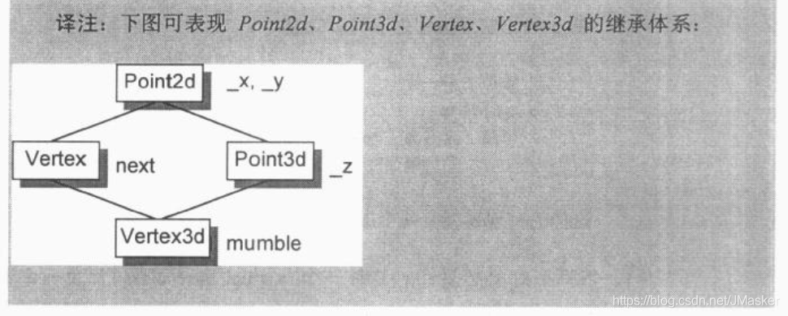

## C++对象模型

C++11新标准规定，可以为数据成员提供一个**类内初始值。**创建对象时，类内初始值将用于初始化数据成员。没有初始值的成员将默认初始化。

对类内初始值的限制与之前介绍的类似：**或者放在花括号里，或者放在等号右边，记住不能使用圆括号。**

初始化方式：声明时初始化（也称就地初始化，c++11后支持）

```c++
class A
{
public:
 int a = 1; // 声明时初始化
 A() {}
};
```

1、所有函数代码都在程序编译连接时放在一块，称为代码区，无论是静态还是非静态函数都一样，不存在 “构造一个类的对象（第一次构造对象）时，就会给成员函数(非静态成员函数)分配代码区空间 ”。而是程序加载时，所有的代码已在内存空间存在。只有函数中用到的局部变量才是函数调用时分配空间。

2、静态成员函数和成员函数之间根本的区别是：静态成员函数实际上是一个全局函数，不依赖一个类的对象。函数定义时之所以把静态成员函数定义在类中，是一种弱逻辑。普通成员函数依赖一个类的对象，也就是它有this指针，必须指向一个类的对象。

3、建立类的对象时只是给成员变量分配空间，析构时也只回收这些空间，代码段里的函数以及静态函数和变量都是在程序结束后回收。

4、加了const的静态成员相当于编译期常量，编译器不会为它开辟任何空间

C++对象模型尽量以空间优化和存取速度优化的考虑来表现非静态数据成员，并且保持和C语言struct数据配置的兼容性。它把数据直接存放在每一个类对象之中。对于继承而来的非静态数据成员也是如此。不过并没有定义其间的排列顺序。

至于静态数据成员，则被放置在程序的一个global data segment中，不会影响个别的类对象的大小。

在程序之中，不管该类被产生出多少个对象，静态数据成员永远只存在一份实例（即使该class没有任何对象实例，其静态数据成员也已经存在）。

每一个类对象因此必须有足够的大小去容纳它所有的非静态数据成员。有时候他的值可能比你想的还要大，因为它可能：

+ **由编译器自动加上的额外的数据成员（主要满足各种virtual特性）**
+ **因为对齐的需要**

### 1、数据成员的布局

```c++
class Point3D {
public:
private:
	float x;
	static List<Point3D*> *freeList;
	float y;
	static const int chunkSize = 250;
	float z;
};
```

每个Point3D对象是由三个float组成的，顺序是x、y、z。静态数据成员存放在程序的data segment中。

C++标准要求，在同一个access section（也就是private、public、protected等区段）中，成员的排列只需符合**“较晚出现的成员在类对象中有较高的地址”**这一条件即可。也就是说，各个成员并不一定得连续排列。

什么东西会被介入被声明的成员之间呢？**成员的边界调整可能需要填补一些字节。**

编译器可能还会合成一些内部使用的数据成员，以支持整个对象模型。vptr就是这样的东西。目前所有编译器都把它安插在每一个“内含虚函数的类”的对象中。

vptr传统上被放在所有显示声明的成员最后，不过如今也有放在整个类对象的最前端。当然你放成员的中间也可以。

**C++标准也允许编译器将多个access sections中的数据成员自由排列，不必在乎它们出现在类声明中的顺序**

```c++
class Point3D {
public:
	//
private:
	float x;
	static List<Point3D*> *freeList;
private:
	float y;
	static const int chunkSize = 250;
private:
	float z;
};
```

编译器可以把y或z或其他啥放在第一个。

但目前编译器都是把一个以上的access sections连锁在一起，依照声明的顺序，成为一个连续区块。**access sections的多少不会招来额外负担，例如一个section声明8个成员，或是在8个sections中总共声明8个成员，得到的对象大小一样。**

### 2、数据成员的存取

已知

```cpp
Point3d origin, *ptr = &origin;
origin.x = 0.0
*ptr->x = 0.0;
```

问题：x的存取效率是什么？
回答：这得看x和Point3d是怎么声明的

问题：通过orgin存取和通过ptr存取，有什么重大差异吗？
回答：有

#### 2.1、静态数据成员

被编译器提出于类之外，**并被视为一个全局变量（但只在类生命范围内可见）**。

每一个静态数据成员只有一个实例，存放在程序的data segment中。每次程序取用静态数据时，就会被内部转化为对该唯一extern实例的直接参考操作。

例如：

```c++
// origin.chunkSize = 250;
Point3D::chunkSize = 250;
// pt->chunkSize = 250;
Point3D::chunkSize = 250;
```

从指令执行的观点来看，这是C++语言中**“通过一个指针和通过一个对象来存取成员，结论完全相同”**的唯一一种情况。这是因为“经由这两种方式”对一个静态数据成员进行存取操作只是书面上的一种便利。**成员并不在类对象之中，因此存取静态成员并不需要通过类对象**。

如果chunkSize是一个从复杂继承关系中继承而来的静态成员呢？也一样，程序对于静态成员还是只有一个实例，存取路径还是那么直接。

若取一个静态数据成员的地址，会得到一个指向其数据类型的指针，而不是一个指向其类成员的指针，因为静态成员并不包含在一个类对象中。

```c++
&Point3D::chunkSize;
```

会得到如下类型的内存地址：

```c++
const int*
```

如果有两个类，每一个都声明了一个静态成员freeList，那么当他们都被放在data segment中，会导致命名冲突。编译器的解决方法是暗中对每一个静态数据成员编码，以获得一个独一无二的程序识别代码。

#### 2.2、非静态数据成员

非静态数据成员直接存放在每一个类对象中，除非经由显示或隐式的类对象，否则没法直接存取它们。只要程序员在一个成员函数中直接处理一个非静态数据成员，所谓**“implicit class object”**就会发生。

```c++
void Point3d::translate(const Point3D &pt) {
	x += pt.x;
	y += pt.y;
	z += pt.z;
}
```

表面上所看到的对于x、y、z的直接存取，事实上是经由一个 **“implicit class object”** （由this指针表达）完成的。事实上这个函数的参数是：

```c++
void Point3d::translate(Point3D *const this, const Point3D &pt) {
	this->x += pt.x;
	this->y += pt.y;
	this->z += pt.z;
}
```

欲对一个非静态数据成员进行存取操作，编译器需要把 **类对象的起始地址加上数据成员的偏移位置**（offset）。

```c++
origin._y = 0.0;
// 那么地址&origin._y将等于
&origin + (&Point3D::_y - 1);
```

___

**这段可以跳过**

指向数据成员的指针，其offset值总是被加上1，这样可以使编译系统区分**“一个指向数据成员的指针，用以指向类的第一个成员”**和**“一个指向数据成员的指针，没有指出任何成员”**

为了区分p1和p2，每一个真正的member offset值都被加上1。

```c++
class Point3d{
public:
    virtual ~Point3d();
    //…

    static Point3d origin;
    float x,y,z;
};
float Point3d::*p1 = 0;
float Point3d::*p2 = &Point3d::x;
//Point3d::* 的意思是“指向Point3d data member”的指针类型
if( p1 == p2 ){
    cout <<” p1 & p2 contain the same value.”;
    cout <<”they must address the same member!”<<endl;
}
```

> `&Pont3d::x`这是直接对**类**的成员而非其**对象**实例的成员来取地址，实际上它获得到的并不是地址，而是成员在类中偏移（offset）。
>
> &C::其实整体是一个运算符，&表示取指针，&C::表示取成员变量在类中的偏移量。

**但我自己测试的时候发现并没有+1**

每一个非静态数据成员的偏移位置在编译器可获知，甚至如果成员属于一个基类子对象也是一样。

---


```c++
origin.x = 0.0;
pt->x = 0.0;
```

两者存取有什么重大差异？

- 当Point3d是一个派生类，而其继承结构中有一个虚基类，并且被存取的成员(比如本例的x)是一个从该虚基类继承来的成员时，就会有重大差异
- 这时候我们不能说pt必然指向哪一种类类型(pt可能是当前类，也可能是父类)(因此我们也就不知道编译器这个成员真正的offset位置)，所以这个**存取操作必须延迟到执行期，经由一个额外的间接导引**，才能够解决。
- 但是如果使用origin，就不会有这种问题，它的类型一定是Point3d类；即使它继承自虚基类，**成员的偏移量位置也在编译期就固定了**

> 最后会补充说，直接跳到最后看！

### 3、继承与数据成员

在C++继承模型中，一个继承类对象表现出来的东西，是其自己的成员加上其基类成员的总和。基类成员和继承类成员排列顺序不强制指定。

```c++
class Point2D {
public:
private:
	float x,y;
};
class Point3D {
private:
	float x,y,z;
};
```

这两个类和“提供两层或三层继承结构，每一层（代表一个维度，2D或3D）是一个class，派生自较低维层次”有何不同？

下图是Point2D和Point3D的对象布局图。


#### 3.1、只要继承不要多态

```c++
class Point2D {
public:
    Point2D(float x = 0.0, float y = 0.0):_x(x),_y(y) { };
    float x() { return _x; }
    float y() { return _y; }

    void x(float newX) { _x = newX; }
    void y(float newY) { _y = newY; }

    void operator+=(Point2D& rhs) {
        _x += rhs.x();
        _y += rhs.y();
    }
protected:
    float _x,_y;
};

class Point3D : public Point2D {
public:
    Point3D(float x = 0.0, float y = 0.0, float z = 0.0) : Point2D(x,y),_z(z) { };
    float z() { return _z; }
    void z(float newZ) { _z = newZ; }
    void operator+=(Point3D& rhs) {
        Point2D::operator+=(rhs);
        _z += rhs.z();
    }
protected:
    float _z;
};
```


C++语言保证"**出现在继承类中的基类子对象有其完整原样性**"，看个栗子：

```c++
class Concrete {
public:
private:
	int val;
	char c1;
	char c2;
	char c3;
};
```


在一台32位机器中，每一个Concrete类对象占8字节。

现在我们将Concrete分裂成三层结构：

```c++
class Concrete1 {
public:
private:
	int val;
	char bit1;
};
class Concrete2 : public Concrete1 {
public:
private:
	char bit2;
};
class Concrete3 : public Concrete2 {
public:
private:
	char bit3;
};
```

现在Concrete3为16字节，因为出现在继承类中的基类子对象有其完整原样性。

Concrete1内含两个成员：val和bit1，加起来是5字节，而一个Concrete1对象实际为8字节，包括填补用的3字节，使得对象能符合一台机器的边界。


让我们声明以下一组指针：

```c++
Concrete2 *pc2;
Concrete1 *pc1_1, *pc1_2;
```

其中pc1_1和pc1_2两者都可以指向前三种类对象。下面这个指定操作：

```c++
*pc1_1 = *pc1_2;
```

应该执行默认的“memberwise”复制操作，对象是被指之对象的Concrete1部分。

如果pc1_1实际指向一个Concrete2对象或Concrete3对象，则上述操作应该将复制内容指定给其**Concrete1子对象**。

然鹅，如果C++把继承类成员（Concrete2::bit2或Concrete3::bit3）和Concrete1子对象捆绑在一起去去除填补空间，那上述操作没法保留了。

```c++
pc1_1 = pc2; // 令pc1_1指向Concrete2
*pc1_1 = *pc1_2; // 会把Concrete1对象逐对象拷贝，包括padding的三个字节，那么实际pc1_2指向的Concrete2对象的bit2会被覆盖掉，出现一个无法确定的值。
```


#### 3.2、加上多态（加上虚函数）

```c++
class Point2d{
	public:
		Point2d(float x=0.0,float y=0.0):_x(x),_y(y){};
		float x(){return _x;}
		float y(){return _y;}
		void x(float newX){ _x=newX; }
		void y(float newY){ _y=newY; }
		//修改1：加上z的保留空间，当前什么也没做，2d的z点返回0.0也是合理的
		virtual float z(){return 0.0;}
		virtual void z(float){}
		//修改2：设定下面的运算符操作为virtual
		virtual void operator+=(const Point2d& rhs){
			_x += rhs.x();
			_y += rhs.y();
		}
		//...
	protected:
		float _x,_y;
};
```

当我们想以多态的方式处理2d或者3d坐标点时，在设计之中导入一个virtual接口才显得合理，也就是说用下面的代码：

```c++
void foo(Point2d &p1,Point2d &p2){
	//...
	p1 += p2;
	//...
}
```

其中p1和p2可能是2d也可能是3d坐标点，支持这样的弹性正是面向对象程序设计的中心，支持这种弹性势必会给我们的Point2d类带来空间和时间上的额外负担：

+ 导入一个和Point2d有关的虚函数表，存放它所声明的每一个虚函数地址，还有支持runtime type identification相关的东西。
+ 每一个类对象要加一个虚函数表指针vptr，提供执行期的链接，使得每一个对象都能找到相应的虚函数表。
+ 构造函数需要为vptr提供初始值，让它指向类对应的虚函数表。这可能意味着所有派生类和基类的构造函数都要重新设定vptr的值。
+ 析构函数需要消除vptr。vptr很可能已经在派生类析构函数中被设定为派生类的虚函数表地址，析构函数的调用次序反向的，从派生类到基类。

以下是新的Point3d声明：

```c++
class Point3d:public Point2d{
	public:
		Point3d(float x=0.0,float y=0.0,float z=0.0):Point2d(x,y),_z(z){};		
		float z(){return _z;}
		void z(float newZ){ _z=newZ; }
		//修改：参数改成const Point2d& rhs（原来是Point3d&）
		void operator+=(const Point2d& rhs){
			Point2d::operator+=(rhs);
			_z += rhs.z();
		}
		//...
	protected:
		float _z;
};

//修改后最大的好处就是可以把operator+=运用在一个Point3d对象和Point2d对象上
Point2d p2d(2.1,2.2);
Point3d p3d(3.1,3.2,3.3);
p3d+=p2d;
//得到的p3d新值为(5.2,5.4,3.3)
```

Point2d和Point3d两个类经过上述的修改，**两个z()和operator+=()都变成了虚函数**，每一个Point3d对象内含一个额外的vptr（继承自Point2d）；多一个Point3d虚函数表。此外，每一个虚函数的调用也比以前复杂。

vptr可以放置在对象的头端也可以放置在尾端。

vptr放置在尾端可以保留基类是C struct的对象布局，因而允许在C程序代码中也能使用：

```c++
Struct no_virts{
	int d1,d2;
};
class has_virts:public no_virts{
	public:
		virtual void foo();
		//...
	private:
		int d3;
}
```

或者将vptr放在前端


Point2D和Point3D加上了虚函数之后的继承布局。


#### 3.3、多重继承

单一继承提供了一种“自然多态”形式，是关于classes体系中的基类和派生类之间的转换，观察上一小节的图，会看到基类和派生类对象都是从相同的地址开始，它们之间的差异只在于派生类对象比较大，用以容纳它自己的non-static数据成员。下面这样的指定操作：

```c++
Point3d p3d;
Point2d *p = &p3d;
```

把一个派生类对象指定给基类（不管继承深度有多深）的指针或者引用，该操作不需要编译器介入去调停或者修改地址，它可以很自然地发生，而且提供了最佳执行效率。

如果把vptr放在对象的头端，且基类没有虚函数而派生类有虚函数，那么单一继承的自然多态就会被打破，这种情况下把一个派生类对象转换为基类，就需要编译器介入，用以调整地址（因vptr插入之故），在既是多重继承又是虚拟继承的情况下，编译器的介入更有必要。

假设现在有这样的多重继承：


```c++
class Point2d {
	public:
		//有虚函数，所以Point2d对象中有vptr
	protected:
		float _x,_y;
};
class Point3d ： public Point2d {
	public:
		//...
	protected:
		float _z;
};

class Vertex {
	public:
		//有虚函数，所以Vertex对象中有vptr
	protected:
		Vertex *next;
};

class Vertex3d:public Point3d,public Vertex{
	public:
		//...
	protected:
		float mumble;
};
```


对一个多重派生对象，将其地址指定给最左端（也就是第一个）基类的指针时，情况和单一继承一样，因为两者都指向相同的起始地址，需要付出的成本只有地址的指定操作而已。

至于第二个或者后继的基类地址的指定操作，需要修改地址：加上（或减去，如果down_cast话）介于中间的base class subobject(s)大小，例如：

```c++
Vertex3d v3d;
Vertex *pv;
Point2d *p2d;
Point3d *p3d;	//Point3d的定义看回上一小节

pv=&v3d;	//内部转化为：
pv=(Vertex*)(((char*)&v3d)+sizeof(Point3d));

p2d=&v3d;	//这两个操作只需要简单地拷贝地址就行了
p3d=&v3d;	//因为Point2d和Point3d和Vertex3d的对象起始地址都相同

Vertex3d *pv3d;
Vertex *pv;
pv=pv3d;
//不能简单地转换成下面这样，因为如果p3d为0，那么将获得sizeof(Point3d)的值，这是错误的
pv=(Vertex*)(char*)v3d+sizeof(Point3d);	//错误
//应该加个条件判断，如果是引用则不需要加这个判断
pv=pv3d?(Vertex*)(char*)v3d+sizeof(Point3d):0;	//正确
```

如果存取第二个或者后继的**基类中的一个数据成员，不需要付出额外的成本，因为数据成员的位置在编译时就固定了**。因此存取一个数据成员只是一个简单的offset运算，就像是单一继承一样简单，不管是经由一个指针，引用还是对象来存取。

#### 3.4、虚拟继承

```c++
//多重继承
class ios{//...};
class istream:public ios{//...};
class ostream:public ios{//...};
class iostream:public istream,public ostream{//...};
//虚拟继承
class ios{//...};
class istream:virtual public ios{//...};
class ostream:virtual public ios{//...};
class iostream:public istream,public ostream{//...};
```


**虚拟继承使iostream对象布局中只存在一份ios subobject实体。**

虚拟继承一般的实现方法：类里如果含有一个或者多个virtual base class subobject，像istream那样，将被分割成两部分：一个不变局部和一个共享局部。不变局部中的数据，不管后继如何衍化，总是拥有固定的offset（从object的起始地址算起），所以这一部分数据可以直接存取。共享局部所表现的就是virtual base class subobject。这一部分数据，其位置会因为每次的派生操作而有变化，所以它们只能被简洁存取。不同编译器之间用于间接存取的方法不同，下面说明3种主流策略：



```c++
class Point2d{
	public:
		//...
	protected:
		float _x,_y;
};

class Vertex:public virtual Point2d{
	public:
		//...
	protected:
		Vertex *next;
};

class Point3d:public virtual Point2d{
	public:
		//...
	protected:
		float _z;
};

class Vertex3d:public Vertex,public Point3d{
	public:
		//...
	protected:
		float mumble;
};
```

一般的布局策略是先安排好派生类中不变的部分，再建立共享部分。

**cfront编译器会在每一个派生类对象中安插一些指针，每个指针指向一个虚基类。要存取继承得来的虚基类成员，可以使用相关指针间接完成。** 举个例子：

```c++
void Point3d::operator+=(const Point3d &rhs){
	_x+=rhs._x;
	_y+=rhs._y;
	_z+=rhs._z;
};
//在cfront的策略下，这个运算符会被内部转化为：
//c++伪码
_vbcPoint2d->_x += rhs_vbcPoint2d->_x;	//vbc 即virtual base class
_vbcPoint2d->_y += rhs_vbcPoint2d->_y;
_z+=rhs._z;

//一个派生类和基类的实例之间的转换：
Point2d *p2d=pv3d;
//在cfront的实现模型下，会变成：
//c++伪码
Point2d *p2d=pv3d ? pv3d->_vbcPoint2d:0;
```

这种实现模型有两个缺点：

+ 每一个对象必须针对每一个虚基类背负一个额外的指针，但是我们希望每一个类对象的大小是固定的，不因为其虚基类的数量而变化。
+ 每有一层虚拟继承，间接存取的层次就会加一层（用指向一个虚基类A的指针去找到这个虚基类A，在虚基类A里用指向虚基类B的指针找到虚基类B，以此类推）。我们希望每次存取时间都是固定的，不因为虚拟衍化的深度而改变。

第二个问题的解决方法可以将所有虚基类的指针的放到派生类对象中，这样就不用间接存取了，用空间换时间。下图显示了这种模型的实现：


第一个问题有两种解决方法：

+ 微软的编译器引入虚基类表（类似于虚函数表），通过一个虚基类表指针指向虚基类表。

+ 在虚函数表中放置虚基类的offset（而不是地址）。下图显示了这种base class offset实现模型:

  

有的编译器将virtual base class offset和virtual function entries混杂在一起。而有的编译器如Sun编译器中，虚函数表的索引可以是正或者负，如果是正就索引到虚函数，如果是负就索引到virtual base class offset，这样的话，Point3d的operator+=运算符必须被转换成下面形式（为了可读性，没有做类型转换，也没有先执行对效率有帮助的地址预先计算操作）：

```c++
void Point3d::operator+=(const Point3d &rhs){
	//这里_vptr_Point3d[-1]存放的是虚基类距离对象起始地址的offset
	//this是对象起始地址，所以加起来就是虚基类的subobject
	(this+_vptr_Point3d[-1])->_x += (&rhs + rhs._vptr_Point3d[-1])->_x;
	(this+_vptr_Point3d[-1])->_y += (&rhs + rhs._vptr_Point3d[-1])->_y;
	_z+=rhs._z;
};
```

而派生类实体和基类实体之间的转换操作：

```c++
Point2d *p2d=pv3d;
//在上述实现模型下变成：
Point2d *p2d=pv3d?pv3d+pv3d->_vptr_Point3d[-1]:0;
```


### 4、单一、多重、虚拟继承下虚表布局


### 5、补充


```c++
Point3d origin, *ptr;
origin.x = 0.0
*ptr->x = 0.0;
```

**要注意，对于每个类来说，编译期成员的偏移量就确定了。**

当然你如果直接使用origin对象，那没问题，因为确定就是Point3d类，直接利用地址 + 偏移取就行了。

但使用指针出现以下情况。

```c++
Vertex3d v3d;
Point3d *ptr = &v3d();
```

在多重继承中，如果ptr->x，可以直接定位到，因为pt指向的地址已知（指向Point3d的开头），而且x的偏移量也是确定的（Point3d类继承了Point2d的数据成员，相当于是拷贝了一份）。（相当于Point3d的布局在继承类Vertex3d里还是没变，还是**地址（由编译器帮你找到Point3d子对象的开头） + 偏移**）

所以上面两种情况编译期估计直接编译为地址 + 偏移了，到时候运行直接根据这个地址取值。

但是在虚拟继承中，并没有拷贝，可以看上图，pt指向的还是Point3d的开头，但x并不在Point3d的子对象里，所以没办法在地址 + 偏移了，所以ptr->x调用语句应该会被编译成虚基表的地址 + 偏移，运行时会根据虚基表的地址找到Point2d的地址再 + 偏移。

再举个简单的例子：

```c++
#include <iostream>
#include <string>

class Base {
public:
  explicit Base(int a) : a_{a} {}
  int a_;
};

class Derived : public  virtual Base {
public:
  explicit Derived() : Base(0) {}
  int b_{0};
};

int main() {
  Derived d, *p = &d;
  ++d.b_; // 之所以如此是为了防止编译器优化
  ++d.a_;
  ++p->a_;
  return 0;
}
```


语句所对应的汇编实现如下所示

```nasm
        // ++d.b_
        movl    -24(%rbp), %eax // 直接通过b_内存offset
        addl    $1, %eax
        movl    %eax, -24(%rbp)
        
        // ++d.a_
        movl    -20(%rbp), %eax // 直接通过a_内存offset
        addl    $1, %eax
        movl    %eax, -20(%rbp)

        // ++p->a_
        movq    -8(%rbp), %rax // 通过调整vptr取得相应a_
        movq    (%rax), %rax
        subq    $24, %rax
        movq    (%rax), %rax
        movq    %rax, %rdx
        movq    -8(%rbp), %rax
        addq    %rdx, %rax
        movl    (%rax), %edx
        addl    $1, %edx
        movl    %edx, (%rax)
```

由上述汇编知，**当存在virtual base class的场景下，通过指针存取其基类成员 效率要比通过类对象存取数据成员低很多，因为多了vptr的调整步骤。**

在本文中，gcc是如何实现p->a_的步骤如下**：**

- **通过**movq -8(%rbp), %rax 和 movq (%rax), %rax 获得vtbl的vptr所指向的地址
- subq $24, %rax 使vptr指向vtbl的起点，也即vbase_offset处
- movq (%rax), %rax movq %rax, %rdx 这两句将vbase赋值给rdx
- addq %rdx, %rax 找到virtual base class在Derived中的位置，并获得相应的值


