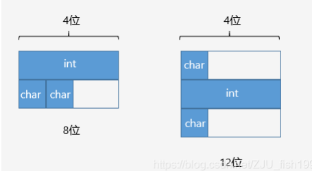
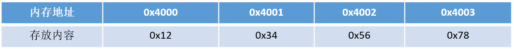
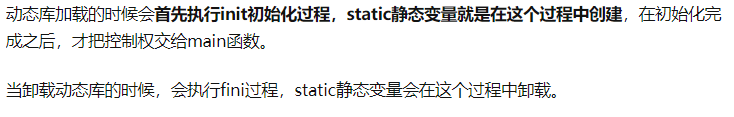

### C++基础面经

#### 1、C++声明与定义

##### 1.1、声明

声明是用来告诉编译器变量的名称和类型，而不分配内存。

```c++
extern int var; // 声明
extern int ble =10; // 定义
typedef int INT; // 声明
struct Node; // 声明
```

##### 1.2、定义

定义是为了给变量分配内存，可以为变量赋初值。

**变量/函数可以声明多次，变量/函数的定义只能一次。**

#### 2、C++内存区域

C++中的内存分区，分别是堆、栈、自由存储区、全局/静态存储区、常量存储区和代码区。

**栈：**在执行函数时，函数内局部变量的存储单元都可以在栈上创建，函数执行结束时这些存储单元自动被释放。栈内存分配运算内置于处理器的指令集中，效率很高，但分配的内存容量有限。

**堆**：就是那些由malloc分配的内存块，一般一个malloc就要对应一个free。

**自由存储区**：如果说堆是操作系统维护的一块内存，那么自由存储区就是C++中通过new和delete动态分配和释放对象的抽象概念。需要注意的是，自由存储区和堆比较像，但不等价。

**全局/静态存储区**：全局变量和静态变量被分配到同一块内存中，**在以前的C语言中，全局变量和静态变量又分为初始化的和未初始化的，在C++里面没有这个区分了，它们共同占用同一块内存区，在该区定义的变量若没有初始化，则会被自动初始化，例如int型变量自动初始为0。**

**常量存储区**：这是一块比较特殊的存储区，这里面存放的是常量，不允许修改。

**代码区**：存放函数体的二进制代码。

> C语言中分为堆、栈、BSS（存放未初始化全局变量与静态变量）、Data数据段（已初始化）、TEXT文本段。

#### 3、C++ 编译流程 & 动态链接 & 静态链接


**预编译**：展开头文件、宏替换、去掉注释、条件编译，即对#ifndef #define #endif进行判断检查，也正是在这一步，#ifndef #define #endif的作用体现出来，即防止头文件被多次重复引用

**编译：**将代码转成汇编代码

**汇编：**将汇编代码转换成机器码

**链接：**链接各个可重定位文件，形成可执行文件。

**构建静态库**


**构建动态库**


静态库与所有的软件一样，需要定期维护和更新 

几乎每个C程序都要使用标准I/O函数，每次都要复制到进程的代码段中，太浪费了。 

共享库 .so (linux) .dll(windows) 共享库在运行或加载时，可以被加载到任意的内存地址，还能和一个在内存中的程序链接起来，这个过程称为动态链接


当创建可执行文件时，静态执行一些链接，然后在程序加载时，动态完成连接过程。 此时，没有任何libvector.so的代码和数据节真的被复制到可执行文件prog21中，反之，链接器复制了一些重定位和符号表信息，它们使运行时可以解析对libvector.so中代码和数据的引用。

而静态链接库则是在链接器的时候就把目标程序和库里的函数代码链接合并在了一起成为一个可执行文件。

> 静态连接库就是把 (lib) ⽂件中⽤到的函数代码直接链接进⽬标程序，程序运⾏的时候不再需要其它的库⽂件；动态链接就是把调⽤的函数所在⽂件模块（DLL）和调⽤函数在⽂件中的位置等信息链接进⽬标程序，程序运⾏的时候再从 DLL 中寻找相应函数代码，因此需要相应 DLL ⽂件的⽀持。

#### 4、为何要在头文件中声明，源文件中定义？

1、预编译指令#include的作用是将所包含的文件全文复制到#include的位置，相当于是个展开为一个文件的宏。

2、C++允许多次声明，但只允许一次实现。

如果编译时有多个.cpp文件中#include了同一个含有函数实现的.h，这时候链接器就会在多个目标文件中找到这个函数的实现，而这在C++中是不允许的，此时就会引爆LNK1169错误:找到一个或多个重定义的符号。

因此为了让函数可以在各个.cpp中共享，正确的做法就是在.h中只声明函数，并在另一个.cpp中实现这个函数。这样就不会冲突了。

但是inline函数和constexpr可以在头文件中定义呢？inline和constexpr都是编译期展开的，不会到链接器的阶段。意思是，当链接器在工作的时候，已经完全没有inline和constexpr了，前者已经展开成代码嵌入目标文件相应位置，后者已经变成常数放在了相应位置。

**而头文件中可以写类成员函数的定义是因为类成员函数如果实现在类内部会自动变成inline函数。**

**#pragma once的作用是：在同一文件中多次include同一个头文件的时候，保证该头文件内容只会被替换一次。**

#### 5、存储类说明符

存储类说明符是一个名字的[声明语法](https://zh.cppreference.com/w/cpp/language/declarations)的*声明说明符序列*的一部分。它与名字的[作用域](https://zh.cppreference.com/w/cpp/language/scope)一同控制名字的两个独立性质：它的“存储期”和它的“链接”。

存储类定义 C++ 程序中变量/函数的范围（可见性）和生命周期。这些说明符放置在它们所修饰的类型之前。

##### 5.1、存储期

程序中的所有[对象](https://zh.cppreference.com/w/cpp/language/object)都具有下列存储期之一：

- **自动（automatic）**存储期。这类对象的存储在外围代码块开始时分配，并在结束时解分配。未声明为 static、extern 或 thread_local 的所有局部对象均拥有此存储期。举例：**普通局部变量。**
- **静态（static）**存储期。这类对象的存储在程序开始时分配，并在程序结束时解分配。这类对象只存在一个实例。所有在命名空间（包含全局命名空间）作用域声明的对象，加上声明带有 static 或 extern 的对象均拥有此存储期。举例：**非局部变量与静态局部变量**
- **线程（thread）**存储期。这类对象的存储在线程开始时分配，并在线程结束时解分配。每个线程拥有它自身的对象实例。只有声明为 thread_local 的对象拥有此存储期。thread_local 能与 static 或 extern 一同出现，它们用于调整链接。
- **动态（dynamic）**存储期。这类对象的存储是通过使用[动态内存分配](https://zh.cppreference.com/w/cpp/memory)函数来按请求进行分配和解分配的。关于具有此存储期的对象的初始化的细节，见 [new 表达式](https://zh.cppreference.com/w/cpp/language/new)。

##### 5.2、链接

如果某个名字具有链接，那么它所指代的实体与另一作用域中的声明所引入的相同名字指代相同的实体。如果有变量、函数或其他实体在数个作用域声明但没有足够的链接，那么就会生成该实体的多个实例。

**无链接**

**名字只能从它所在的作用域使用。** 在块作用域声明的下列任何名字均无链接：

- 未显式声明为 extern 的变量（不管有没有 static 修饰符）；
- [局部类](https://zh.cppreference.com/w/cpp/language/class#.E5.B1.80.E9.83.A8.E7.B1.BB)和它的成员函数；
- 在块作用域声明的其他名字，例如 typedef、枚举及枚举项。

**内部链接**

**名字可从当前翻译单元（当前文件）中的所有作用域使用。** 在命名空间作用域声明的下列任何名字均具有内部链接；

- **声明为 static 的变量**、变量模板 (C++14 起)、函数或函数模板；
- 未声明为 extern 且先前未声明为具有外部链接的非 volatile 非模板 (C++14 起)非 inline (C++17 起)且未被导出 (C++20 起)的 [const 限定的](https://zh.cppreference.com/w/cpp/language/cv)变量（包含 [constexpr](https://zh.cppreference.com/w/cpp/language/constexpr)） (C++11 起)；
- [匿名联合体](https://zh.cppreference.com/w/cpp/language/union)的数据成员。

**外部链接**

**名字能从其他翻译单元中的作用域使用。**

- 以上未列出的变量与函数（即未声明为 static 的函数、命名空间作用域内未声明为 static 的非 const 变量，和所有声明为 extern 的变量）；
- 枚举；
- **类以及其成员函数、静态数据成员**（不论是否 const）、嵌套类及枚举，及首次以类体内的 [friend](https://zh.cppreference.com/w/cpp/language/friend) 声明引入的函数的名字；
- 所有未列于上的模板名（即未声明为 static 的函数模板）。

##### 5.3、静态存储期变量

```c++
int global;    // 静态存储变量，外部链接
static int one_file; // 静态存储变量，内部链接

int func1(int n){
	static int count = 0;  // 静态存储变量，无链接
}
```

##### 5.4、存储期说明符


##### 5.5、分析static

static：静态或线程存储期与内部链接

- 当用于声明对象时，指定静态存储期（除非与thread_local协同出现）

static关键字可以用于如下情况：

- 在文件范围（全局范围/命名空间范围）声明变量或者函数时，static指定变量或者函数具有**内部链接**。在声明变量时，变量具有**静态持续时间**，并且除非您指定另一个值，否则编译器会将变量初始化为0
- 当用于声明类成员变量时，它会声明一个**静态成员变量**。它有如下特性：

- - 这个成员的一个副本由类的所有实例共享。
  - 必须在文件范围内定义静态数据成员。
  - 声明为const static的整型数据成员可以有初始值设定项。

当用于声明类成员函数时，它会声明一个**静态成员函数**。它有如下特性：

- 该函数由类的所有实例共享。
- 静态成员函数不能访问实例成员，它不关联到任何对象，因为该函数没有隐式this指针。如果要访问实例成员，请使用作为实例指针或引用的参数来声明函数。
- 静态成员函数不能为**virtual、const 或 volatile**

##### 5.6、分析thread_local

- thread_local指示对象具有**线程存储期**：

- - 使用说明符声明的变量thread_local只能在创建它的线程上访问。
  - 变量在创建线程时创建，销毁线程时销毁。
  - 每个线程都有自己的副本。

- thread_local 能与 static 或 extern 结合，以分别指定内部或外部连接（但静态数据成员始终拥有外部链接）

**全局变量**

```c
//需要包含的头文件
#include <iostream>
#include <thread>
#include <mutex>
std::mutex cout_mutex;    //方便多线程打印

static thread_local int x = 1;

void thread_func(const std::string& thread_name) {
    for (int i = 0; i < 3; ++i) {
        x++;
        std::lock_guard<std::mutex> lock(cout_mutex);
        std::cout << "thread[" << thread_name << "]: x = " << x << std::endl;
    }
    return;
}

int main() {
    std::thread t1(thread_func, "t1");
    std::thread t2(thread_func, "t2");
    t1.join();
    t2.join();
    return 0;
}

/*
thread[t2]: x = 2
thread[t2]: x = 3
thread[t2]: x = 4
thread[t1]: x = 2
thread[t1]: x = 3
thread[t1]: x = 4
*/
```

**局部变量**

```c
//需要包含的头文件
#include <iostream>
#include <thread>
#include <mutex>
std::mutex cout_mutex;    //方便多线程打印

void thread_func(const std::string& thread_name) {
    for (int i = 0; i < 3; ++i) {
        thread_local int x = 1;
        x++;
        std::lock_guard<std::mutex> lock(cout_mutex);
        std::cout << "thread[" << thread_name << "]: x = " << x << std::endl;
    }
    return;
}

int main() {
    std::thread t1(thread_func, "t1");
    std::thread t2(thread_func, "t2");
    t1.join();
    t2.join();
    return 0;
}
/*
thread[t2]: x = 2
thread[t2]: x = 3
thread[t2]: x = 4
thread[t1]: x = 2
thread[t1]: x = 3
thread[t1]: x = 4
*/
```

如果不加thread_local：

```c
thread[t2]: x = 2
thread[t2]: x = 2
thread[t2]: x = 2
thread[t1]: x = 2
thread[t1]: x = 2
thread[t1]: x = 2
```

**说明：thread_local的局部变量没有因为for循环作用域而重新赋值。这是因为线程存储期的变量都是和线程绑定的，所以只有第一次声明时被赋值。可以理解为线程的static变量。不过变量的作用域依然是在本身的作用域内。比如：在for循环外使用x就会编译时错误**

```c++
void thread_func(const std::string& thread_name) {
    for (int i = 0; i < 3; ++i) {
        thread_local int x = 1;
        x++;
        std::lock_guard<std::mutex> lock(cout_mutex);
        std::cout << "thread[" << thread_name << "]: x = " << x << std::endl;
    }
    x++;    //编译会出错：error: ‘x’ was not declared in this scope
    return;
}
```

#### 6、static

static是一个存储类说明符，控制变量、函数的“存储期”和“链接”。

**被static修饰过的变量和函数都具有了静态存储期**。

+ 第一个作用：隐藏

  当同时编译多个文件时，所有未加static前缀的全局变量和函数都具有全局可见性（外部链接）。加了static前缀的全局变量和函数就具有了内部链接，仅本文件可见。

  > 如果一个名称对编译单元(.cpp)来说是局部的，在链接的时候其他的编译单元无法链接到它且不会与其它编译单元(.cpp)中的同样的名称相冲突。

+ 第二个作用：静态存储期

  加了static的变量具有了静态存储期，存储在静态数据区。存储在静态数据区的变量会在程序刚开始运行时就完成初始化，也是唯一的一次初始化。共有两种变量存储在静态存储区：全局变量和static变量，只不过和全局变量比起来，static可以控制变量的可见范围，说到底static还是用来隐藏的。

+ 第三个作用：默认初始化为0

  > 其实全局变量也具备这一属性，因为全局变量也存储在静态数据区。在静态数据区，内存中所有的字节默认值都是0x00，某些时候这一特点可以减少程序员的工作量。

+ 第四个作用：C++中类成员/函数声明static

  1、函数体内static变量的作用范围为该函数体，不同于auto变量，该变量的内存只被分配一次，因此其值在下次调用时仍维持上次的值

  2、在模块内的static全局变量可以被模块内所有函数访问，但不能被模块外其它函数访问

  3、在模块内的static函数只可被这一模块内的其它函数调用，这个函数的使用范围被限制在声明它的模块内

  4、在类中的static成员变量属于整个类所拥有，对类的所有对象只有一份拷贝

  5、在类中的static成员函数属于整个类所拥有，这个函数不接收this指针，因而只能访问类的static成员变量

  6、static对象必须要在类外进行初始化，**static修饰的变量先于对象存在，所以static修饰的变量要在类外初始化**

  7、**由于static修饰的类成员属于类，不属于对象，因此static类成员函数是没有this指针的，this指针是指向本对象的指针。正因为没有this指针，所以static类成员函数不能访问非static的类成员，只能访问 static修饰的类成员**

  8、static成员函数不能被virtual修饰，static成员不属于任何对象或实例，所以加上virtual没有任何实际意义；静态成员函数没有this指针，虚函数的实现是为每一个对象分配一个vptr指针，而vptr是通过this指针调用的，所以不能为virtual；虚函数的调用关系，this->vptr->ctable->virtual function

> 类中的静态成员变量在类中仅仅是声明，没有定义，所以要在类的外面定义，**实际上是给静态成员变量分配内存**。
>
> 由于声明为static的变量只被初始化一次，因为它们在单独的静态存储中分配了空间，因此类中的静态变量**由对象共享。**对于不同的对象，不能有相同静态变量的多个副本。也是因为这个原因，静态变量不能使用构造函数初始化。

> 类的静态成员函数也不依赖于类的对象。**我们被允许使用对象和'.'来调用静态成员函数。但建议使用类名和范围解析运算符调用静态成员。**
>
> **允许静态成员函数仅访问静态数据成员或其他静态成员函数，它们无法访问类的非静态数据成员或成员函数。**

> 类的静态成员(变量和方法)属于类本身，在类加载的时候就会分配内存，可以通过类名直接去访问；非静态成员（变量和方法）属于类的对象，所以只有在类的对象产生（创建类的实例）时才会分配内存，然后通过类的对象（实例）去访问。
>
> 在一个类的静态成员中去访问其非静态成员之所以会出错是因为在类的非静态成员不存在的时候类的静态成员就已经存在了，访问一个内存中不存在的东西当然会出错。
>
> 况且静态成员函数没有隐含的this指针。

##### 6.1 static为何不能类内初始化？

我的理解：当多个文件都包含一个头文件，这个头文件的类可以类内初始化静态数据成员，按照static的隐藏性，每个文件都得分配一个内存给这个静态数据成员，浪费！所以在类外定义的时候，static关键字没有，就相当于定义一个普通的全局变量，整个源文件共享一个！而类内只是一个声明（所以这个定义也不能放在头文件，不然链接时报重复冲突的错误）。

> 在类内声明的`static`变量，相当于用`extern`声明的全局变量，**都仅仅是一个声明而已**，是**U**类型的符号，如果没有对应的定义，那么就无法被链接为可执行文件或者动态链接库。
>
> 而类外的`static`变量，**相当于普通的全局变量，都是真正的定义**，是**B**类型的符号，位于*BSS*代码段中，将被分配一定的内存空间。
>
> 之所以要这样设计，**是因为一个类的头文件会在编写代码时被各个模块所引用，而这些模块却要共享这同一个类内声明的静态变量，因此绝对不能为这个变量重复地分配空间**，只能仅仅给这些模块声明一个**U**符号使这些模块通过编译，然后将这个类的静态变量在类外定义一个**B**符号，并在链接时将所有同名的**U**符号替换掉。
>
> 也就是说static成员变量本意就是一个全局变量。

**static const 可以类内是因为它在编译期进行了值替换，只是一个值而已。**

#### 7、const

##### 7.1、字面值 & 常量表达式 & constexpr

**字面值**

一个形如42的值被称为字面值常量。字面值常量的形式和值决定了常量的类型。例如0x42是16进制表示的整型常量。‘a'是char型字面值。**字面值常量顾名思义由字面意思表示，是常量**。字面值常量在程序中是直接表示的，整型直接写出大小，字符直接写出字符。

**常量表达式**

常量表达式是指在编译过程中，该表达式的值不会改变，且编译过程中可以立即得到结果的表达式。一部分const对象是常量表达式，由常量表达式初始化的const对象也是常量表达式。常量表达式在程序运行时不会改变，即使一个程序多次启动或外部参数发生变化，该值也不会改变。编译器在编译时可能把常量表达式直接替换为立即数，具体要看编译环境。一般来讲，**字面值常量属于常量表达式。**

**const & constexpr**

const修饰的变量可以被常量表达式初始化（这时const变量可以用于指定数组大小），也可以被编译期不能计算出值的表达式初始化，比如大部分函数的返回值（这时const变量，不能用于指定数组大小）。

**constexpr修饰的变量，一定要用常量表达式初始化，一定是常量**（严格说，const还是不能被修改的变量，constexpr已经可以丧失变量概念了），一定可以用于指定数组的大小。

那么什么是常量？

1. 值不能被修改且 
2. 用编译期能计算出值的表达式初始化

```c++
const int a = 10;//是
const int b = a + 1;//是
int c = 10;//不是，不满足条件1
const int d = fun( void ); //不是，不满足条件2
```

**所以说大部分情况下，const只是一个只读的变量而已！！！**

##### 7.2、const对象默认为文件局部变量

注意：非const变量默认为extern。要使const变量能够在其他文件中访问，必须在文件中显式地指定它为extern。

> 未被const修饰的变量在不同文件的访问

```c++
// file1.cpp
int ext
// file2.cpp
#include<iostream>

extern int ext;
int main(){
    std::cout<<(ext+10)<<std::endl;
}
```

> const常量在不同文件的访问

```c++
//extern_file1.cpp
extern const int ext=12;
//extern_file2.cpp
#include<iostream>
extern const int ext;
int main(){
    std::cout<<ext<<std::endl;
}
```

> 小结：
> 可以发现未被const修饰的变量不需要extern显式声明！而const常量需要显式声明extern，并且需要做初始化！因为const变量在定义后就不能被修改，所以定义时必须初始化。

##### 7.3、指针与const

与指针相关的const有四种：

```c++
const char * a; //指向const对象的指针或者说指向常量的指针。
char const * a; //同上
char * const a; //指向类型对象的const指针。或者说常指针、const指针。
const char * const a; //指向const对象的const指针。
```

> 小结：
>
> 如果const位于`*`的左侧，则const就是用来修饰指针所指向的变量，即指针指向为常量；
> 如果const位于`*`的右侧，*const*就是修饰指针本身，即指针本身是常量。

##### 7.4、函数中使用const

> const修饰函数返回值

这个跟const修饰普通变量以及指针的含义基本相同：

（1）**const int**

```c++
const int func1();
```

这个本身无意义，因为参数返回本身就是赋值给其他的变量！

（2）**const int***

```c++
const int* func2();
```

指针指向的内容不变。

（3）int *const

```c++
int *const func2();
```

指针本身不可变。

> const修饰函数参数

（1）传递过来的参数及指针本身在函数内不可变，无意义！

```c++
void func(const int var); // 传递过来的参数不可变
void func(int *const var); // 指针本身不可变
```

表明参数在函数体内不能被修改，但此处没有任何意义，var本身就是形参，在函数内不会改变。包括传入的形参是指针也是一样。**输入参数采用“值传递”，由于函数将自动产生临时变量用于复制该参数，该输入参数本来就无需保护，所以不要加const 修饰。**

（2）**参数指针所指内容为常量不可变**

```c++
void StringCopy(char *dst, const char *src);
```

其中src 是输入参数，dst 是输出参数。给src加上const修饰后，如果函数体内的语句试图改动src的内容，编译器将指出错误。这就是加了const的作用之一。、

（3）**参数为引用，为了增加效率同时防止修改。**

```c++
void func(const A &a)
```

对于非内部数据类型的参数而言，像void func(A a) 这样声明的函数注定效率比较低。因为函数体内将产生A 类型的临时对象用于复制参数a，而临时对象的构造、复制、析构过程都将消耗时间。

为了提高效率，可以将函数声明改为void func(A &a)，因为“引用传递”仅借用一下参数的别名而已，不需要产生临 时对象。

> 但是函数void func(A &a) 存在一个缺点：
>
> “引用传递”有可能改变参数a，这是我们不期望的。解决这个问题很容易，加const修饰即可，因此函数最终成为 void func(const A &a)。

**以此类推，是否应将void func(int x) 改写为void func(const int &x)，以便提高效率？完全没有必要，因为内部数据类型的参数不存在构造、析构的过程，而复制也非常快，“值传递”和“引用传递”的效率几乎相当。**

> 小结：
> 1.对于非内部数据类型的输入参数，应该将“值传递”的方式改为“const 引用传递”，目的是提高效率。例如将void func(A a) 改为void func(const A &a)。
>
> 2.对于内部数据类型的输入参数，不要将“值传递”的方式改为“const 引用传递”。否则既达不到提高效率的目的，又降低了函数的可理解性。例如void func(int x) 不应该改为void func(const int &x)。

##### 7.5、类中使用const

在一个类中，任何不会修改数据成员的函数都应该声明为const类型。如果在编写const成员函数时，不慎修改数据成员，或者调用了其它非const成员函数，编译器将指出错误，这无疑会提高程序的健壮性。

**const 成员变量**：只在某个对象⽣命周期内是常量，⽽对于整个类⽽⾔是可以改变的。因为 类可以创建多个对象，不同的对象其 const 数据成员值可以不同。所以不能在类的声明中初始化 const 数据成员， 因为类的对象在没有创建时候，编译器不知道 const 数据成员的值是什么。**const 数据成员的初始化只能在类的构造函数的初始化列表中进⾏。**

> const修饰的变量初始化后不能改变，具有只读属性，const数据成员每个对象都有一个，如果你直接const int a=b ，那么每个对象创建后都是一样的值，所以只好将其改成用初始化列表初始化了

> const 成员函数中如果实在想修改某个变量，可以使⽤ mutable 进⾏修饰。

**const对象只能访问const成员函数**，**而非const对象可以访问任意的成员函数，包括const成员函数**。

**原因**：对象调⽤成员函数时，在形参列表的最前⾯加⼀个形参 this，但这是隐式的。this 指针是默认指向调⽤函数的当前对象的，所以，很⾃然， this 是⼀个常量指针 test * const，因为不可以修改 this 指针代表的地址。但当成员函数的参数列表（即⼩括号） 后加了 const 关键字（void print() const;），此成员函数为常量成员函数，此时它的隐式this形参为 const test * const，即不可以通过 this 指针来改变指向对象的值。

##### 7.6、补充static & const

+ 我们可以在类的内部也可以在类外部定义**静态成员函数**，在外部定义时不用再写static。
+ **因为静态数据成员不属于类的任何一个对象，所以它们并不是在创建类的对象时被定义的。所以它们不是由类的构造函数初始化的。**
+ **一般来说，我们不能在类的内部初始化静态数据成员。必须在类的外部定义和初始化每个静态数据成员！**

+ > 注意是静态数据成员，不是静态成员函数。

+ 类似全局变量，静态数据成员定义在任何函数之外。一旦被定义，就存在程序整个生命周期中。

+ **一般来说，静态数据成员不应该在类内部初始化。但可以为静态数据成员提供const整数类型的类内初始值，不过要求静态成员必须是字面值常量类型的constexpr**。初始值必须是常量表达式！因为这些成员本身就是常量表达式，

```c++
class Account {
public:
	static double rate() { return interestRate; }
	static void rate(double);
private:
	static constexpr int period = 30;  // 常量表达式
	double daily_tbl[period];
};
```

> 如果如上式，这个静态成员应用场景只是编译器可以替换他的值，不需要再外部定义了。
>
> 举个栗子：
>
> 如果period的唯一用途就是定义daily_tbl的维度，则不需要在Account外面专门定义period。
>
> 但如果需要把Account::period传递给一个接受const int&的函数时，必须定义period。
>
> 类内提供了初始值，再定义就不用指定初始值了，如下就可以了：
>
> `constexpr int Account::period`

+ **静态数据成员类型可以是它所属的类类型，非静态数据成员不可以！**

+ **静态数据成员还可以作为默认实参，非静态数据成员不可以**

  ```c++
  class Screen {
  public:
  	Screen &clear(char = bkground);
  private:
  	static const char bkground;
  }
  ```

  > 非静态数据成员不可以，因为它本身是对象的一部分。

#### 8、虚函数可以内联函数吗？

- 虚函数可以是内联函数，内联是可以修饰虚函数的，但是当虚函数表现多态性的时候不能内联。
- **内联是在编译期建议编译器内联，而虚函数的多态性在运行期，编译器无法知道运行期调用哪个代码，因此虚函数表现为多态性时（运行期）不可以内联。**
- `inline virtual` 唯一可以内联的时候是：编译器知道所调用的对象是哪个类（如 `Base::who()`），这只有在编译器具有实际对象而不是对象的指针或引用时才会发生。

#### 9、extern

##### 9.1、C++和C编译区别

在C++中常在头文件见到extern "C"修饰函数，那有什么作用呢？ 是用于C++链接在C语言模块中定义的函数。

C++虽然兼容C，但C++文件中函数编译后生成的符号与C语言生成的不同。因为C++支持函数重载，C++函数编译后生成的符号带有函数参数类型的信息，而C则没有。

例如`int add(int a, int b)`函数经过C++编译器生成.o文件后，`add`会变成形如`add_int_int`之类的, 而C的话则会是形如`_add`, 就是说：相同的函数，在C和C++中，编译后生成的符号不同。

这就导致一个问题：如果C++中使用C语言实现的函数，在编译链接的时候，会出错，提示找不到对应的符号。此时`extern "C"`就起作用了：告诉链接器去寻找`_add`这类的C语言符号，而不是经过C++修饰的符号。

**extern "C"的作用是，告诉C++编译器，下面的代码按照C的方式进行编译**

##### 9.2、C++调用C函数

C++调用C函数的例子: 引用C的头文件时，需要加`extern "C"`

```c++
//add.h
#ifndef ADD_H
#define ADD_H
int add(int x,int y);
#endif

//add.c
#include "add.h"

int add(int x,int y) {
    return x+y;
}

//add.cpp
#include <iostream>
#include "add.h"
using namespace std;
int main() {
    add(2,3);
    return 0;
}
```

编译：

```c++
//Generate add.o file
gcc -c add.c
```

链接：

```c++
g++ add.cpp add.o -o main
```

没有添加extern "C" 报错：

```c++
> g++ add.cpp add.o -o main                                   
add.o：在函数‘main’中：
add.cpp:(.text+0x0): `main'被多次定义
/tmp/ccH65yQF.o:add.cpp:(.text+0x0)：第一次在此定义
/tmp/ccH65yQF.o：在函数‘main’中：
add.cpp:(.text+0xf)：对‘add(int, int)’未定义的引用
add.o：在函数‘main’中：
add.cpp:(.text+0xf)：对‘add(int, int)’未定义的引用
collect2: error: ld returned 1 exit status
```

添加extern "C"后：

```c++
add.cpp
#include <iostream>
using namespace std;
extern "C" {
    #include "add.h" // 以C的方式编译 
}
int main() {
    add(2,3);
    return 0;
}
```

编译的时候一定要注意，先通过gcc生成中间文件add.o。

```c++
gcc -c add.c 
```

然后编译：

```c++
g++ add.cpp add.o -o main
```

而通常为了C代码能够通用，即既能被C调用，又能被C++调用，头文件通常会有如下写法：

```c++
#ifdef __cplusplus
extern "C"{
#endif
int add(int x,int y);
#ifdef __cplusplus
}
#endif
```

即在C++调用该接口时，会以C接口的方式调用。这种方式使得C++者不需要额外的extern C，而标准库头文件通常也是类似的做法，否则你为何不需要extern C就可以直接使用stdio.h中的C函数呢？

##### 9.3、C中调用C++函数

**`extern "C"`在C中是语法错误，需要放在C++头文件中。**

```c++
// add.h
#ifndef ADD_H
#define ADD_H
extern "C" {
    int add(int x,int y);
}
#endif

// add.cpp
#include "add.h"          // 这样add.cpp还是以c的方式编译 

int add(int x,int y) {
    return x+y;
}

// add.c
extern int add(int x,int y); // add.c 自然也能找到该函数了
int main() {
    add(2,3);
    return 0;
}
```

编译：

```
g++ -c add.cpp
```

链接：

```
gcc add.c add.o -o main
```

综上，总结出使用方法，在C语言的头文件中，对其外部函数只能指定为extern类型，C语言中不支持extern "C"声明，在.c文件中包含了extern "C"时会出现编译语法错误。**所以使用extern "C"全部都放在于cpp程序相关文件或其头文件中。**

#### 10、struct & class

##### 10.1、C中的struct

+ 在C中struct只单纯的用作数据的复合类型，也就是说，**在结构体声明中只能将数据成员放在里面**，而不能将函数放在里面。
+ 在C结构体声明中不能使用C++访问修饰符，如：public、protected、private 而在C++中可以使用。
+ 在C中定义结构体变量，如果使用了下面定义必须加struct。
+ C的结构体不能继承（没有这一概念）。
+ 若结构体的名字与函数名相同，可以正常运行且正常的调用！例如：可以定义与 struct Base 不冲突的 void Base() {}。

```c++
#include<stdio.h>

struct Base {            // public
    int v1; 
//    public:      //error
        int v2; 
    //private:
        int v3; 
    //void print(){       // c中不能在结构体中嵌入函数
    //    printf("%s\n","hello world");
    //};    //error!
};

void Base(){
    printf("%s\n","I am Base func");
}
//struct Base base1;  //ok
//Base base2; //error
int main() {
    struct Base base;
    base.v1=1;
    //base.print();
    printf("%d\n",base.v1);
    Base();
    return 0;
}
```

##### 10.2、C++中struct

与C对比如下：

- C++结构体中不仅可以定义数据，还可以定义函数。
- C++结构体中可以使用访问修饰符，如：public、protected、private 。
- C++结构体使用可以直接使用不带struct。
- C++继承
- 若结构体的名字与函数名相同，可以正常运行且正常的调用！但是定义结构体变量时候只用用带struct的！

例如：

> 情形1：不使用typedef定义结构体别名

未添加同名函数前：

```c++
struct Student {
    
};
Struct Student s; //ok
Student s;  //ok
```

添加同名函数后：

```c++
struct Student {
    
};
void Student(){}
Struct Student s; //ok
Student s;  //error
```

> 情形二：使用typedef定义结构体别名

```c++
typedef struct Base1 {         
    int v1;
    public:     //显示声明public
        int v2;
    void print(){       
        printf("%s\n","hello world");
    };    
}B;
//void B() {}  //error! 符号 "B" 已经被定义为一个 "struct Base1" 的别名
```

##### 10.3、struct & class

最本质的一个区别就是默认的访问控制

默认的继承访问权限。struct 是 public 的，class 是 private 的。

struct 作为数据结构的实现体，它默认的数据访问控制是 public 的，而 class 作为对象的实现体，它默认的成员变量访问控制是 private 的。

#### 11、union

联合（union）是一种节省空间的特殊的类，一个 union 可以有多个数据成员，但是在任意时刻只有一个数据成员可以有值。当某个成员被赋值后其他成员变为未定义状态。联合有如下特点：

- 默认访问控制符为 public
- 可以有含有构造函数、析构函数的类类型成员
- 不能含有引用类型的成员
- 不能继承自其他类，不能作为基类
- 不能含有虚函数
- 匿名 union 在定义所在作用域可直接访问 union 成员
- 匿名 union 不能包含 protected 成员或 private 成员，也不能定义成员函数
- 全局匿名联合必须是静态的，当在一个命名空间中声明匿名联合时（例如：在全局空间中），它必须被声明为static类型。也就是 `static union { };`

匿名union是一个未命名的union，并且在右花括号和分号之间没用任何声明，一旦我们定义了一个匿名union，编译器就自动地为该union创建一个未命名的对象：

```c++
union {
	char cval;
	int ival;
	double dval;
};
cval = 'c'; // 为刚刚定义的未命名的匿名union对象赋一个新值
```

匿名 union 在定义所在作用域可直接访问 union 成员。

#### 12、直接初始化与拷贝初始化

+ **当用于类类型对象时，初始化的拷贝形式和直接形式有所不同**：直接初始化直接调用与实参匹配的构造函数，拷贝初始化总是调用拷贝构造函数。**拷贝初始化首先使用指定构造函数创建一个临时对象，然后用拷贝构造函数将那个临时对象拷贝到正在创建的对象。**

+ ```c++
  string str1("I am a string");//语句1 直接初始化
  string str2(str1);//语句2 直接初始化，str1是已经存在的对象，直接调用拷贝构造函数对str2进行初始化
  string str3 = "I am a string";//语句3 拷贝初始化，先为字符串”I am a string“创建临时对象，再把临时对象作为参数，使用拷贝构造函数构造str3
  string str4 = str1;//语句4 拷贝初始化，这里相当于隐式调用拷贝构造函数，而不是调用赋值运算符函数
  // 这是虽然使用了"="，但是实际上使用对象str1来创建一个新的对象str4。也就是产生了新的对象，所以调用的是拷贝构造函数。
  // 如果对一个已存在的数使用 = 则是调用赋值运算符
  ```

+ 直接初始化是根据参数寻找最优匹配构造函数的过程，所以上面两个都是直接初始化，但是第二个调用的是拷贝构造函数初始化。

+ 拷贝初始化时，要求编译器将右侧运算对象拷贝到正在创建的对象中，如果需要还要进行类型转换。

  **拷贝初始化不仅是 = 定义变量是会发生，在下列情况也会发生**： 

  + 将一个对象作为实参传递给一个非引用类型的形参
  + 从一个返回类型是非引用类型的函数返回一个对象
  + 用花括号列表初始化一个数组中的元素或一个聚合类的成员。

#### 13、类型转换运算符

类型转换函数一般形式如下：

```c++
operator type() const;
```

type表示某种类型。类型转换运算符可以面向任意类型（除了void）进行定义，只要该类型能作为函数的返回类型。因此，我们不允许转换成数组或者函数类型，但允许转换成指针。

**类型转换运算符既没有显式的返回类型，也没有形参，而且必须定义成类的成员函数。**

+ 例子：

  ```c++
  class SmallInt {
  public:	
      SmallInt(int i = 0) : val(i) {              
          // 转换构造函数		
          if (i < 0 || i > 255) {			
              throw std::out_of_range("Bad SmallInt value");		
          }	
      }	
      operator int() const { 
          return val; 
      }
  private:	
      size_t val;
  };
  SmallInt si;
  si = 4; // 首先将4隐式地转换成SmallInt
  si + 3; // 将si隐式转换成int，然后执行整数的加法
  ```

  我们能使用类型转换运算符将一个SmallInt对象转换成int。然后再将所得的int转换成任何其他算术类型

  ```c++
  SmallInt si;si + 3.14; // si先转换成int，int转换成double
  ```

##### 13.1、显式的类型转换运算符

```c++
class SmallInt {
public:	
    explicit operator int() const { 
        return val; 
    }
private:	
    size_t val;
};
SmallInt si;
si + 3; // 错误
static_cast<int>(si) + 3; // 正确
```

但如果表达式出现在下列位置，可以隐式执行：

+ if、while及do语句的条件部分
+ for语句头的条件表达式
+ ！|| &&的运算对象
+ 条件运算符（？ ：）的条件表达式

> **被用作条件就可以隐式**

IO标准库定义了一个向bool的显式类型转换。

```c++
while(cin >> value)
```

执行输入运算符，它负责将数据读入value，返回cin。返回的cin作为条件，可以触发显示地类型转换为bool，当cin的条件状态是good就为真。

##### 13.2、避免有二义性的类型转换

+ 两个类提供相同的类型转换：A类定义了一个接受B的类对象的构造函数，B类定义了一个转换目标是A

  ```c++
  struct B;
  struct A {	
      A() = default;	
      A(const B&);
  };
  struct B {	
      operator A() const;
  };
  A f(const A&);
  B b;
  A a = f(b); // 二义性错误， 含义是 f(B::operator A()) 还是f(A::A(const B&));
  // 显式
  A a1 = f(b.operator A());
  A a2 = f(A(b));
  ```

+ 类定义了一组类型转换，它们的转换源（或者转换目标）类型本身可以通过其他类型联系在一起，则也会产生二义性。

  ```c++
  struct A {	
      A(int = 0);                 // 转换构造	
      A(double);	
      operator int() const;	
      operator double() const;
  };
  void f2(long double);
  A a;
  f2(a);      // 二义性错误：含义是f(A::operator int()) 还是 f(A::operator double())
  long lg;
  A a2(lg); // 二义性错误：含义是A::A(int) 还是A::A(double)
  ```

##### 13.3、重载函数与转换构造函数

+ 当调用重载函数时，如果两个或多个用户定义的类型转换都提供了**可行匹配**，则我们认为这些类型转换一样好。不会考虑任何可能出现的标准类型转换的级别。

  ```c++
  struct C {	
      C(int);
  };
  struct D {	
      D(double);
  };
  void xf(C&);
  void xf(D&);
  xf(10); // 二义性 调用C(10)还是D(10)
  ```

+ 在调用重载函数时，如果需要考量哪个类型转换匹配的好，这些类型转换必须是**同一个用户（类）**定义的类型转换才行。

  ```c++
  struct A {	
      A(int = 0);                 // 转换构造	
      A(double);	
      operator int() const;	
      operator double() const;
  };
  short lg;
  A a2(lg); // 匹配A(int) 因为short转int优于转double
  ```

##### 13.4、函数匹配与重载运算符

+ 重载运算符也是重载的函数。
+ 当我们使用重载运算符作用于类类型的运算对象时，候选函数中包含该运算符的普通非成员版本和内置版本。除此之外，如果左侧运算对象是类类型，则定义在该类中的运算符的重载版本也包含在内。

```c++
class SmallInt {	
    friend SmallInt operator+(const SmallInt&, const SmallInt&);
public:	
    SmallInt(int); // 转化源为int	
    operator int() const { return val; } // 转换目标为int
private:	
    size_t val;
};
SmallInt s1,s2;
SmallInt s3 = s1 + s2; // 使用重载的operator+int i = s3 + 0;   // 二义性错误
```

#### 14、explicit

+ explicit修饰构造函数时，可以防止隐式转换和拷贝初始化。

+ explicit 修饰类型转换函数时，可以防止隐式转换，但按语境转换除外

```c++
#include <iostream>
using namespace std;
struct A
{
    A(int) { }
    operaor bool() const { return true; }
};
struct B
{
    explicit B(int) {}
    explicit operator bool() const { return true; }
};
void doA(A a) {}
void doB(B b) {}
int main() {
    // B b2 = 1;    // 错误：被 explicit 修饰构造函数的对象不可以复制初始化  
    // doB(1);      // 错误：被 explicit 修饰构造函数的对象不可以从 int 到 B 的隐式转换
    B b1(1);        // OK：直接初始化
    if (b1);        // OK：被 explicit 修饰转换函数 B::operator bool() 的对象可以从B到bool的按语境转换 用作条件就可以隐式抓换
	// bool b2 = b1;                  // 错误：被 explicit 修饰转换函数 B::operator bool() 的对象不可以隐式转换
    bool b3 = static_cast<bool>(b1);  // OK：static_cast 进行直接初始化
}
```

+ 在构造函数前加explicit关键字可以抑制隐式转换。**只对一个实参的构造函数有效，需要多个实参的构造函数不能隐式转换，也无须将构造函数指定为explicit**
+ 隐式转换构造函数只能使用直接初始化了，因为拷贝形式的初始化也会发生隐式转换

#### 15、宏定义 & typedef  & using & 宏 & inline函数 & const

##### 15.1、宏定义

**#define**

宏定义，C语言中预处理命令一种。分为无参宏定义和带参宏定义。无参宏定义的一般形式为：#define 宏名 字符串；带参宏定义的一般形式为：#define 宏名（参数表） 字符串，被定义的字符串称为替换文本。
**不带参的**：

```c++
#define <宏名>　　<字符串>
#define A 1
```

**带参数的**：

```C++
#define <宏名> (<参数表>) <宏体>
#define A(x) x
```

编译预处理时，对程序中所有出现的“宏名”，都用宏定义中的[字符串](https://so.csdn.net/so/search?q=字符串&spm=1001.2101.3001.7020)去代换，这称为“宏代换”或“宏展开”。。宏展开是在预处理阶段完成的，这个阶段把替换文本只是看作一个字符串，并不会有任何的计算发生，在展开时在宏出现的地方只是**简单地使用字符串来代替**，并不会增添任何的符号。**这只是一种简单的代换，字符串中可以含任何字符，可以是常数，也可以是表达式，预处理程序对它不作任何检查。如有错误，只能在编译已被宏展开后的源程序时发现。**

宏定义不是说明或语句，在行末不必加分号，如加上分号则连分号也一起置换。

这里补充几点宏相关知识点：

宏中包含几个特殊符号：`#`，`##`，`\`

+ ```c++
  #define exp(s) printf("test s is:%s\n",s)
  #define exp1(s) printf("test s is:%s\n",#s)
  #define exp2(s) #s 
  int main() {
      exp("hello");
      exp1(hello);
      string str = exp2(bac);
      cout<<str<<" "<<str.size()<<endl;
      /**
       * 忽略传入参数名前面和后面的空格。
       */
      string str1 = exp2( asda  bac );
      /**
       * 当传入参数名间存在空格时，编译器将会自动连接各个子字符串，
       * 用每个子字符串之间以一个空格连接，忽略剩余空格。
       */
      cout<<str1<<" "<<str1.size()<<endl;
      return 0;
  }
  /*
  test s is:hello
  test s is:hello
  bac 3
  asda bac 8 
  */
  ```

+ **符号连接操作符（##）：“##”是一种分隔连接方式，它的作用是先分隔，然后进行强制连接。将宏定义的多个形参转换成一个实际参数名。**

  注意事项：

  + **当用##连接形参时，##前后的空格可有可无。**
  + **连接后的实际参数名，必须为实际存在的参数名或是编译器已知的宏定义。**
  + **如果##后的参数本身也是一个宏的话，##会阻止这个宏的展开，也就是只替换一次。**

  ```c++
  #define expA(s) printf("前缀加上后的字符串为:%s\n",gc_##s)  //gc_s必须存在
  // 注意事项2
  #define expB(s) printf("前缀加上后的字符串为:%s\n",gc_  ##  s)  //gc_s必须存在
  // 注意事项1
  #define gc_hello1 "I am gc_hello1"
  int main() {
      // 注意事项1
      const char * gc_hello = "I am gc_hello";
      expA(hello);
      expB(hello1);
  }
  /*
  前缀加上后的字符串为:I am gc_hello
  前缀加上后的字符串为:I am gc_hello1
  */
  #define STRCPY(a, b)    strcpy(a ## _p, #b)
  int main()
  {
      char var1_p[20];
      char var2_p[30];
       /* 注意这里 */
      STRCPY(STRCPY(var1,var2),var2);
      /* 这里是否会展开为： strcpy(strcpy(var1_p,"var2")_p,"var2“）？
       * 答案是否定的：
       * 展开结果将是：  strcpy(STRCPY(var1,var2)_p,"var2")
       * ## 阻止了参数的宏展开!
       * 如果宏定义里没有用到 # 和 ##, 宏将会完全展开
       */
  }  
  ```

+ #### 续行操作符（\）:**当定义的宏不能用一行表达完整时，可以用”\”表示下一行继续此宏的定义。注意 \ 前留空格。

+ **避免语义曲解**

  ```c++
  #define fun() f1();f2();
  if(a>0)
  	fun()
  // 展开后
  if(a>0)
  	f1();
  	f2();
  // 为了解决这种问题，在写代码的时候，通常可以采用`{}`块。
  #define fun() {f1();f2();}
  if(a>0)
  	fun();
  // 宏展开
  if(a>0)
  {
      f1();
      f2();
  }; // 但是会发现上述宏展开后多了一个分号，实际语法不太对。(虽然编译运行没问题，正常没分号)
  ```

##### 15.2、typedef

四种用法

+ 定义类型别名

  ```c++
  char *pa, *pb;
  //char* pa,pb;
  typedef char* pCHAR;
  pCHAR pa,pb;
  ```

+ typedef struct

  在c语言中typedef struct定义结构名，在声明时可以省略struct关键字。

  ```c++
  typedef struct B
  {
      int x;
      int y;
  }pB;
  pB b;
  ```

  而C++中无typedef时，在末尾定义的是变量，可以直接使用它对结构中的成员变量进行赋值；而有typedef 时，在末尾定义的是结构类型，相当于为struct定义的结构类型换了一个新的名字，使用时，需要先定义变量，然后对结构中的成员变量进行赋值。

  ```c++
  struct Teacher
  {   
      int age;
  }Tea;  //Tea是一个变量  
  
  typedef struct Student
  {   
      int age;
  }Stu;  //Stu是一个结构体类型 = struct Student
  
  void main()
  {
      Tea.age = 30;  //为结构成员赋值
      Stu Zhang;   //先声明结构类型变量
      Zhang.age = 15;   //访问结构成员并赋值
  }
  ```

+ 定义与平台无关的数据类型

  ```c++
  比如定义一个叫 REAL 的浮点类型，在目标平台一上，让它表示最高精度的类型为：
  
  typedef long double REAL; 
  //在不支持 long double 的平台二上，改为：
  typedef double REAL; 
  //在连 double 都不支持的平台三上，改为：
  typedef float REAL; 
  ```

  **也就是说，当跨平台时，只要改下 typedef 本身就行，不用对其他源码做任何修改。** 标准库就广泛使用了这个技巧，比如size_t。 另外，因为typedef是定义了一种类型的新别名，不是简单的字符串替换，所以它比宏来得稳健（虽然用宏有时也可以完成以上的用途）。

+ **为复杂的声明定义一个简单别名**

  ```c++
  int *(*a[5])(int, char*); //原声明
  
  typedef int *(*pFun)(int, char*);
  pFun a[5];
  ```

**如何理解复杂声明和定义**

c++创始人写的<the design and evolution of cpp>中的下面这个例子:

```c++
typedef int P();
// declares a function type P as returning an int and taking no arguments.
class X {
    static P(Q); // 等价于`static int Q()`, Q在此作用域中不再是一个类型
};
```

**任何声明变量的语句前面加上typedef之后，原来是变量的都变成一种类型**。**不管这个声明中的标识符号出现在中间还是最后**。

```cpp
typedef int P();
static P(Q); 
```

P是一个新定义的function类型, 它返回值为int, 无参数。P(Q); 实际上等价于P Q, 声明Q是一个**返回值为int, 无参数的函数**。

**右左法则**

当声明和定义逐渐复杂时，需要使用用于理解复杂定义的“ **右左法则** ”：

> 从变量名看起，先往右，再往左，碰到圆括号就调转阅读的方向；括号内分析完就跳出括号，还是先右后左的顺序。如此循环，直到分析完整个定义。

比如`int (*pfunc) (int)`，找到变量名pfunc，先往右是圆括号，调转方向，左边是一个`*`号，这说明pfunc是一个指针；然后跳出这个圆括号，先看右边，又遇到圆括号，这说明(*pfunc)是一个函数，所以pfunc是一个指向这类函数的指针，即函数指针，这类函数具有一个int类型的参数，返回值类型是int。

比如`int (*arr[10]) (int)`，先往右是[]运算符，说明arr是一个数组；再往左是一个`*`号，说明arr数组的元素是指针（**注意**：这里的*修饰的不是arr，而是arr[10]。原因是[]运算符的优先级比*要高，arr先与[]结合。）；跳出圆括号，先往右又遇到圆括号，说明arr数组的元素是指向函数的指针，它指向的函数有一个int类型的参数，返回值类型是int。

那么，怎么判断定义的是函数指针，还是数组指针，或是数组呢？可以抽象出几个模式：

```cpp
typedef (*var)(...); // 变量名var与*结合，被圆括号括起来，右边是参数列表。表明这是函数指针
typedef (*var)[];  //变量名var与*结合，被圆括号括起来，右边是[]运算符。表示这是数组指针
typedef (*var[])...;// 变量名var先与[]结合，说明这是一个数组（至于数组包含的是什么，由旁边的修饰决定）
```

下面可以利用右左法则去分析复杂的声明和定义：

```cpp
void * (* (*fp1) (int)) [10];
```

找到变量名fp1，往右看是圆括号，调转方向往左看到`*`号，说明fp1是一个指针；跳出内层圆括号，往右看是参数列表，说明fp1是一个函数指针，接着往左看是*号，说明指向的函数返回值是指针；再跳出外层圆括号，往右看是[]运算符，说明函数返回的是一个数组指针，往左看是void *，说明数组包含的类型是void *。 简言之 ，fp1是一个指向函数的指针，该函数接受一个整型参数并返回一个指向含有10个void指针数组的指针。

```cpp
typedef double (* (* (*fp3) ()) [10]) ();
fp3 a;
```

如果创建许多复杂的定义，可以使用typedef。这一条显示typedef是如何缩短复杂的定义的。

跟前面一样，先找到变量名fp3（这里fp3其实是新类型名），往右看是圆括号，调转方向往左是`*`，说明fp3是一个指针；跳出圆括号，往右看是空参数列表，说明fp3是一个函数指针，接着往左是`*`号，说明该函数的返回值是一个指针；跳出第二层圆括号，往右是[]运算符，说明函数的返回值是一个数组指针，接着往左是*号，说明数组中包含的是指针；跳出第三层圆括号，往右是参数列表，说明数组中包含的是函数指针，这些函数没有参数，返回值类型是double。简言之，fp3是一个指向函数的指针，该函数无参数，且返回一个含有10个指向函数指针的数组的指针，这些函数不接受参数且返回double值。

这二行接着说明：a是fp3类型中的一个。

```cpp
int (* (*fp4()) [10]) ();
```

这里fp4不是变量定义，而是一个函数声明。

找到变量名fp4，往右是一个无参参数列表，说明fp4是一个函数，接着往左是`*`号，说明函数返回值是一个指针；跳出里层圆括号，往右是[]运算符，说明fp4的函数返回值是一个指向数组的指针，往左是*号，说明数组中包含的元素是指针；跳出外层圆括号，往右是一个无参参数列表，说明数组中包含的元素是函数指针，这些函数没有参数，返回值的类型是int。简言之，fp4是一个返回指针的函数，该指针指向含有10个函数指针的数组，这些函数不接受参数且返回整型值。

##### 15.3、using

using的几种作用如下：

+ 引入命名空间，一般为了代码的冲突，都会用命名空间。using namespace std更加方便

+ 改变访问性

  ```c++
  class Base{
  public:
       std::size_t size() const { return n; }
  protected:
       std::size_t n;
  };
  class Derived : private Base {
  public:
       using Base::size;
  protected:
       using Base::n;
  };
  ```

  类Derived私有继承了Base，对于它来说成员变量n和成员函数size都是私有的，如果使用了using语句，可以改变他们的可访问性，如上述例子中，size可以按public的权限访问，n可以按protected的权限访问。 

+ 函数重载

  在继承过程中，派生类可以覆盖**重载函数的0个或多个实例，一旦定义了一个重载版本，那么其他的重载版本都会变为不可见。**

  如果对于基类的重载函数**，我们需要在派生类中修改一个，又要让其他的保持可见，必须要重载所有版本，这样十分的繁琐。**

  ```c++
  #include <iostream>
  using namespace std;
  class Base{
      public:
          void f(){ cout<<"f()"<<endl;
          }
          void f(int n){
              cout<<"Base::f(int)"<<endl;
          }
  };
  class Derived : private Base {
      public:
          using Base::f;
          void f(int n){
              cout<<"Derived::f(int)"<<endl;
          }
  };
  int main()
  {
      Base b;
      Derived d;
      d.f();
      d.f(1);
      return 0;
  }
  /*
  f()
  Derived::f(int)
  */
  ```

+ 指定别名

  C中常用typedef A B这样的语法，将B定义为A类型，也就是给A类型一个别名B

  对应typedef A B，使用using B=A可以进行同样的操作。

  ```c++
  typedef vector<int> V1; 
  using V2 = vector<int>;
  ```


##### 15.4、inline函数

当程序执行函数调用指令时，CPU将存储该函数调用后指令的内存地址，将函数的参数复制到堆栈上，最后将控制权转移到指定的函数。然后，CPU执行函数代码，将函数返回值存储在预定义的内存位置/寄存器中，并将控制权返回给调用函数。如果函数的执行时间少于从调用者函数到被调用函数（被调用者）的切换时间，则这可能会成为开销。对于大型函数和/或执行复杂任务的函数，与函数运行所花费的时间相比，函数调用的开销通常微不足道。但是，对于小型的常用功能，进行函数调用所需的时间通常比实际执行函数代码所需的时间多得多。对于小功能，由于小功能的执行时间少于切换时间，因此会产生开销。

C++提供了inline函数，以减少函数调用的开销。内联函数是在调用时在行中扩展的函数。调用内联函数时，将在内联函数调用时插入或替换内联函数的整个代码。替换由C++编译器在编译时执行。如果内联函数很小，则可以提高效率。

inline函数看起来像函数，动作像函数，但是又比宏方便很多，调用inline函数省去了参数压栈、生成汇编语言的 CALL调用、返回参数、执行return等过程所花费的额外开销。

不过inline函数也有缺点：增加目标码的大小。所以，inline函数对于函数体积很小，却又频繁调用这样的函数来说，可能比函数调用产生的代码更少，但是效率却不可同日而语。有一点需要注意的是：**inline只是对编译器提出一个申请，并不是强制命令。编译器可以忽略内联请求。** 

inline可以显示声明，也可以隐式声明。隐式声明方式是将函数定义在类定义之中（函数定义时没有inline关键字），编译器也会当作inline函数。另外，定义在类中的friend函数也会被隐式声明为inline函数。

**显式声明的时候必须与函数定义体放在一起才能使函数成为内联，仅将inline放在函数声明前面不起任何作用。**

此外，inline函数通常放在头文件中，因为大多数build environments在编译期进行inlining，编译器必须知道函数什么样子才能把**函数调用**替换成**函数本体**。

大多数virtual函数不能inlining：因为virtual直到**运行时**才知道调用哪个函数，而inline是在编译时进行替换。

> 补充：constexpr函数
>
> + 指能用于常量表达式的函数。函数的返回类型以及所有形参的类型都得是字面值类型（算术类型，引用，指针）。函数体必须有且只有一条return语句
>
>   ```c++
>   constexpr int new_sz() {return 42;}
>   constexpr int foo = new_sz(); // foo是一个常量表达式
>   ```
>
>   编译器把对constexpr函数的调用替换成结果值。constexpr函数被隐式地指定为内联函数。
>
> + constexpr函数不一定返回常量表达式。（也能把constexpr当普通函数用的意思！但就没有返回常量表达式那味道了。）

**内联函数和constexpr函数可以在程序中多次定义，毕竟编译器想展开函数只有函数声明不够，还需要定义。所以通常将其定义在头文件。**

##### 15.5、各类比较

###### 宏定义与函数的比较

+ 宏定义在预处理的时候完成替换，之后被替换的文本参与编译，相当于直接插入了代码，**运行时**不存在函数调用，执行起来更快，函数调用在运行时需要跳转到具体的调用函数。有函数调用的时间
+ 宏定义属于在结构体中插入代码，没有返回值；函数调用具有返回值
+ **宏定义参数没有类型，不进行类型检查，函数参数具有类型，需要检查类型**
+ 宏的参数是不占内存空间的,因为只是做字符串的替换,而函数调用时的参数传递则是具体变量之间的信息传递,形参作为函数的局部变量,显然是占用内存的.
+ 宏定义不要在最后加分号，函数是需要的

###### 宏定义与内联函数的比较

+ 内联函数同宏函数一样将在被调用处进行代码展开，省去了参数压栈、栈帧开辟与回收，结果返回等，从而提高程序运行速度。**但是内联函数在编译时展开，而宏是由预处理器对宏进行展开**。

+ 内联函数可以进行诸如**类型安全检查、语句是否正确等编译功能**，宏不具有这样的功能；宏不是函数，而inline是函数。

+ **宏在定义时要小心处理宏参数，一般用括号括起来，否则容易出现二义性。而内联函数不会出现二义性。**

  ```c++
  // 宏定义
  #define MAX(a，b) ((a)>(b)?(a):(b))
  MAX(a,"Hello")； //错误地比较int和字符串，没有参数类型检查
  // 内联函数
  #include <stdio.h>
  inline int add(int a, int b)
  {
      return (a + b);
  }
  int main(void)
  {
      int a;
      a = add(1, 2);
      printf("a+b=%d\n", a);
      return 0;
  }
  /*
  以上a = add(1, 2);处在编译时将被展开为：
  a = (a + b);
  */
  ```

+ 宏函数的一个优点是无类型，可用于任意类型。

+ 一般建议用内联函数替换宏定义。

###### 宏定义与typedef的比较

+ 作用域问题：typedef如果放在所有函数之外，它的作用域就是从它定义开始直到文件尾，如果放在某个函数内，定义域就是从定义开始直到该函数结尾。#define不管是在某个函数内，还是在所有函数之外，作用域都是从定义开始直到整个文件结尾。
+ 宏主要用于定义常量以及书写复杂的内容，typedef主要用于定义类型别名
+ 宏替换发生在预处理阶段，属于文本插入替换；typedef是编译的一部分。
+ 宏不检查类型，typedef会检查数据类型。
+ `typedef char* String_t` 定义了一个新的类型别名，有类型检查。
  `#define String_d char *` 只做了简单的替换，无类型检查。
  + 前者在**编译**的时候处理，后者在**预编译**的时候处理。
  + **同时定义多个变量的时候有区别**，主要区别在于这种使用方式：
    `String_t a,b;` `String_d c,d;`
    a，b，c 都是`char *`类型，而d为`char`类型

###### 宏定义与const的比较

- const 常量限定符，声明的常量只读，不允许修改
- 在 C++ (不是 C) 中可以用 const 值声明数组长度
- 对于全局 const 值，C++ 中默认是内部链接(跟 static 一样只允许在本文件内可见)，而不是 C 中的默认外部链接，若想在其他文件中使用必须在其他文件中重新定义或将 const 值放在头文件中(默认是外部链接放在头文件中编译可能会出现错误，默认是内部链接就不会出错)

**C++ 中推荐使用 const 代替 #define 声明常量**

```c++
#define N 12
const int N = 12；
```

+ 宏定义是字符替换，没有数据类型的区别，同时这种替换没有类型安全检查，const常量是常量的声明，有类型区别，需要在编译阶段进行类型检查
+ 宏定义是在预处理阶段展开，不能对宏定义进行调试。
+ 宏定义是直接替换，不会分配内存，const定义的变量只是值不能改变，但要分配内存空间。
+ **const 能够用于更复杂的数据类型(如：数组，结构体和类)**
+ **const 能够明确指定常量类型**
+ **const 标识符遵循变量的作用域规则，可以创建作用域为全局(仅在本文件中使用)、命名空间、函数或数据块的常量**

###### typedef与using的区别

```c++
typedef void (*FP) (int, const std::string&);
using FP = void (*) (int, const std::string&);
```

都用作给类型起别名的时候，很明显，using更加清晰明了。

using还可以给模板起别名。

```c++
template <typename T>
using Vec = MyVector<T, MyAlloc<T>>;

// usage
Vec<int> vec;
```

typedef不可以，只能包装一下再使用。

```c++
template <typename T>
using Vec = MyVector<T, MyAlloc<T>>;

// usage
Vec<int> vec;
```

**麻烦！！！**

#### 16、decltype

##### 16.1、基本使用

decltype的语法是:

```c++
decltype (expression)
```

这里的括号是必不可少的，decltype的作用是“查询表达式的类型“，因此，上面语句的效果是，返回 expression 表达式的类型。注意，decltype 仅仅“查询”表达式的类型，并不会对表达式进行“求值”。

**推导出表达式类型**

```c++
int i = 4;
decltype(i) a; //推导结果为int。a的类型为int。
```

**与using/typedef合用，用于定义类型**

```c++
using size_t = decltype(sizeof(0));//sizeof(0)的返回值为size_t类型
using ptrdiff_t = decltype((int*)0 - (int*)0);
using nullptr_t = decltype(nullptr);
vector<int >vec;
typedef decltype(vec.begin()) vectype;
for (vectype i = vec.begin; i != vec.end(); i++)
{
//...
}
```

**重用匿名类型**

在C++中，我们有时候会遇上一些匿名类型，如:

```c++
struct 
{
    int d ;
    double b;
}anon_s;
```

而借助decltype，我们可以重新使用这个匿名的结构体：

```c++
decltype(anon_s) as ;//定义了一个上面匿名的结构体
```

**泛型编程中结合auto，用于追踪函数的返回值类型**

这也是decltype最大的用途了。

```c++
template <typename T>
auto multiply(T x, T y)->decltype(x*y)
{
	return x*y;
}
```

##### 16.2、判别规则

对于decltype(e)而言，其判别结果受以下条件的影响：

如果e是一个没有带括号的标记符表达式或者类成员访问表达式，那么的decltype（e）就是e所命名的实体的类型。此外，如果e是一个被重载的函数，则会导致编译错误。 

否则 ，假设e的类型是T，如果e是一个将亡值，那么decltype（e）为T&& 

否则，假设e的类型是T，如果e是一个左值，那么decltype（e）为T&。 

否则，假设e的类型是T，则decltype（e）为T。

标记符指的是除去关键字、字面量等编译器需要使用的标记之外的程序员自己定义的标记，而**单个标记符对应的表达式**即为标记符表达式。例如：

```c++
int arr[4]
```

则arr为一个标记符表达式，而arr[3]+0不是。

```c++
int i = 4;
int arr[5] = { 0 };
int *ptr = arr;
struct S{ double d; }s ;
void Overloaded(int);
void Overloaded(char);//重载的函数
int && RvalRef();
const bool Func(int);

//规则一：推导为其类型
decltype (arr) var1; //int 标记符表达式
decltype (ptr) var2;//int *  标记符表达式
decltype(s.d) var3;//doubel 成员访问表达式
//decltype(Overloaded) var4;//重载函数。编译错误。

//规则二：将亡值。推导为类型的右值引用。

decltype (RvalRef()) var5 = 1;

//规则三：左值，推导为类型的引用。
decltype ((i))var6 = i;     //int&
decltype (true ? i : i) var7 = i; //int&  条件表达式返回左值。
decltype (++i) var8 = i; //int&  ++i返回i的左值。
decltype(arr[5]) var9 = i;//int&. []操作返回左值
decltype(*ptr)var10 = i;//int& *操作返回左值
decltype("hello")var11 = "hello"; //const char(&)[9]  字符串字面常量为左值，且为const左值。

//规则四：以上都不是，则推导为本类型

decltype(1) var12;//const int
decltype(Func(1)) var13=true;//const bool
decltype(i++) var14 = i;//int i++返回右值
```

#### 17、enum

枚举类型使我们可以将一组**整型常量**组织在一起。和类一样，**每个枚举类型定义了一种新的类型，枚举属于字面值常量类型。**

C++包含了两种枚举：限定作用域的和不限定作用域的。C++11新标准引入了限定作用域的枚举类型。定义限定作用域的枚举类型的一般形式是：首先是关键字enum class，随后是枚举类型名字以及用花括号括起来的以逗号分隔的枚举成员列表，最后是一个分号。

```c++
enum class open_modes {input, output, append};
```

定义一个名为open_modes的枚举类型，它包含三个枚举成员：input、output和append。

定义**不限定作用域的枚举类型时省略掉关键字class**，枚举类型的名字是可选的：

```c++
enum color {red, yellow, green}; 
```

```c++
enum {floatPrec = 6, doublePrec = 10, double_doublePrec = 10}; // 未命名的、不限定作用域的枚举类型
```

如果enum未命名，我们只能在定义该enum时定义它的对象。和类的定义类似，我们需要在enum定义的右侧花括号和最后的分号之间提供逗号分隔的声明列表。

```c++
enum {x=0,c=1} xf;
```

##### 17.1、枚举成员

在限定作用域的枚举类中，枚举成员的名字遵循常规的作用域准则，并且在枚举类型的作用域外是不可访问的。

与之相反，在不限定作用域的枚举类型中，枚举成员的作用域与枚举类型本身的作用域相同。

```c++
enum color {red, yellow, green}; // 不限定作用于的枚举类型
enum stoplight {red, yellow, green}; // 错误：重复定义了枚举成员
enum class peppers {res, yellow, green}; // 正确：枚举成员被隐藏了
color eyes = green; // 正确，不限定作用域的枚举类型的枚举成员位于有效的作用域中
peppers p = green; // 错误: peppers的枚举成员不在有效的作用域
color hair = color::red; // 正确，允许显式访问枚举成员
peppers p2 = peppers::red; // 正确
```

默认情况，枚举值从0开始，依次加1。不过我们也可以为一个或几个枚举成员指定专门的值：

```c++
enum class intTypes {
	charTyp = 8, shortType = 16, intTyp = 16, longTyp = 32, long_longTyp = 64
};
```

枚举值不一定唯一。

**枚举成员是const的，因此在初始化枚举成员时提供的初始值必须是常量表达式。也就是说，每个枚举成员本身就是一个常量表达式。可以在任何需要常量表达式的地方使用枚举成员。**

##### 17.2、和类一样，枚举也定义新的类型

 只要enum有名字，我们就能定义并初始化该类型的成员。要想初始化enum对象或者为enum对象赋值，必须使用该类型的一个枚举成员或者该类型的另一个对象：

```c++
open_modes om = 2;   // 错误: 2不属于类型open_modes
om = open_modes::input // 正确
```

**一个不限定作用域的枚举类型的对象或枚举成员自动地转换成整型**。因此，我们可以在任何需要整型值的地方使用它们：

```c++
int i = color::red;
int j = peppers::red;
```

##### 17.3、指定enum的大小

尽管每个enum都定义了唯一的类型，但实际上enum是由某种整型类型表示的。在C++11新标准中，我们可以在enum的名字后加上冒号以及我们想在该enum中使用的类型：

```c++
enum intValues : unsigned long long {
	charTyp = 255, shortTyp = 65535, intTyp = 65535, longTyp = 4294967295UL,
	long_longTyp = 18446744073709551615ULL
};
```

如果我们没指定enum的潜在类型，则**默认情况下限定作用域的enum成员类型是int**。**对于不限定作用域的枚举类型来说，其枚举成员不存在默认类型，我们只知道成员的潜在类型足够大，肯定能容纳枚举值**

##### 17.4、枚举类型的前置声明

在C++11新标准中，我们可以提前声明enum。**enum的前置声明必须指定其成员的大小**：

```c++
enum intValues : unsigned long long; // 不限定作用域的，必须指定成员类型
enum class open_mode; // 限定作用域的枚举类型可以使用默认成员类型int
```

和其他声明语句一样，enum的声明和定义必须匹配，这意味着该enum的所有声明和定义中成员的大小必须一致。而且，**我们不能在同一个上下文中先声明一个不限定作用域的enum名字，然后再声明一个同名的限定作用域的enum**：

```c++
enum class intValues;
enum intValues; // 错误，intValues已经被声明为限定作用域的enum
enum intValues : long; // 错误：intValues已经被声明成int
```

##### 17.5、形参匹配与枚举类型

要想初始化一个enum对象，必须使用该enum类型的另一个对象或者它的一个枚举成员。

因此，即使某个整型值恰好与枚举成员的值相等，它也不能作为函数的enum实参使用：

```c++
// 不限定作用域的枚举类型， 潜在类型因机器而异
enum Tokens {INLINE = 128, VIRTUAL = 129};
void ff(Tokens);
void ff(int);
int main()
{
	Tokens curTok = INLINE;
	ff(128); // 匹配ff(int)
	ff(curTok); // 匹配ff(Tokens)
	ff(INLINE); // 匹配ff(Tokens)
	return 0;
}
```

尽管我们不能直接将整型值传给enum形参，但是可以将一个不限定作用域的枚举类型的对象或枚举成员传给整型形参。此时，enum的值提升为int或更大的整型，实际提升结果由枚举类型的潜在类型决定。

#### 18、前置声明简单介绍

通常来说，你都不需要主动去写class A这种前置声明。**应该仅当出现了头文件循环依赖导致编译失败的时候，才去考虑去写前置声明！**

头文件循环依赖，就是说两个头文件互相include了对方，这样编译会出问题。举个例子。

有a.h(里面用了类型B的指针，所以include了b.h）：

```cpp
#pragma once

#include "b.h"
class A {
public:
    A():_b(nullptr) {}
    ~A() {}

    void set_b(B* b) {
        _b = b;
    }
    B* get_b() {
        return _b;
    }

private:
    B* _b;
};
```

有b.h:

```cpp
#pragma once
#include "a.h"

class B {
public:
    B(int i):_i(i) {}
    ~B() {}

    int i() {
        return _i;
    }

    void foo(A& a) {
        B* b = a.get_b();
        b->_i += _i;
    }

private:
    int _i;
};
```

有main.cpp （包含main函数）

```cpp
#include "a.h"
#include "b.h"
#include <iostream>
using namespace std;

int main() {
    A a;
    B b(3);
    a.set_b(&b);

    B b2(7);
    b2.foo(a);

    cout << a.get_b()->i() << endl;
    return 0;
}
```

编译main.cpp失败，报错：

```text
./b.h:13:14: error: unknown type name 'A'
 void foo(A& a) {
 ^
1 error generated.
```

修改方法，**因为a.h中只出现了类型B的指针，而未调用其成员函数或成员变量**，故可以修改a.h删除include "b.h"，增加类型B的前置声明。

```cpp
#pragma once

class B; // 前置声明！
class A {
public:
    A():_b(nullptr) {}
    ~A() {}

    void set_b(B* b) {
        _b = b;
    }
    B* get_b() {
        return _b;
    }

private:
    B* _b;

};
```

编译main.cpp通过。

当前前置声明也不是万能的解药，请注意前面的加粗黑字：

> 因为a.h中只出现了类型B的指针，而未调用其成员函数或成员变量，故……

换言之，如果a.h中使用了类型B的成员函数，则无法通过更改为前置声明的方式，来让编译通过。

比如：

```cpp
#pragma once
#include <iostream>
class B;
class A {
public:
    A():_b(nullptr) {}
    ~A() {}

    void set_b(B* b) {
        std::cout<< b->i() << std::endl; // !使用了B的成员函数
        _b = b;
    }
    B* get_b() {
        return _b;
    }

private:
    B* _b;

};
```

编译报错：

```text
./a.h:10:22: error: member access into incomplete type 'B'
        std::cout<< b->i() << std::endl;
                     ^
./a.h:3:7: note: forward declaration of 'B'
class B;
```

**这时候只能老老实实地改代码，重新梳理并设计类A和类B的关系！**

看起来有点乱，记不住？其实不难理解，因为对C++而言，不管是什么指针，它的大小都是确定的。所以只要a.h中只是出现B的指针（或引用）而没有调用其具体的成员函数，C++[编译器](https://www.zhihu.com/search?q=编译器&search_source=Entity&hybrid_search_source=Entity&hybrid_search_extra={"sourceType"%3A"answer"%2C"sourceId"%3A"1760926865"})是可以不去在此时理解B的具体定义的（故只添加class B的声明即可），一旦a.h中用到了B的成员，则不然，此时就需要知道B的大小了，不然如果你#include a.h，定义A的对象，如何分配内存，B的大小根本不知道！必须#include b.h！。

#### 19、friend

友元提供了一种普通函数或者类成员函数访问另一个类中的私有或保护成员的机制。也就是说有两种形式的友元：

+ 友元函数：普通函数访问某个类中的私有或保护成员。
+ 友元类：类A中的成员函数访问类B中的私有或保护成员

优点：提高了程序的运行效率。

缺点：破坏了类的封装性和数据的透明性。

总结：

- 能访问私有成员
- 破坏封装性
- 友元关系不可传递
- 友元关系的单向性
- 友元声明的形式及数量不受限制

##### 19.1、友元函数

在类声明的任何区域中声明，而定义则在类的外部。

注意，友元函数只是一个普通函数，并不是该类的类成员函数，它可以在任何地方调用，友元函数中通过对象名来访问该类的私有或保护成员。

```c++
#include <iostream>
using namespace std;
class A
{
public:
    A(int _a):a(_a){};
    friend int geta(A &ca);  ///< 友元函数
private:
    int a;
};
int geta(A &ca) 
{
    return ca.a;
}
int main()
{
    A a(3);    
    cout<<geta(a)<<endl;

    return 0;
}
```

##### 19.2、友元类

友元类的声明在该类的声明中，而实现在该类外。

```c++
friend class <友元类名>;
```

类B是类A的友元，那么类B可以直接访问A的私有成员。

```c++
#include <iostream>
using namespace std;
class A
{
public:
    A(int _a):a(_a){};
    friend class B;
private:
    int a;
};
class B
{
public:
    int getb(A ca) {
        return  ca.a; 
    };
};
int main() 
{
    A a(3);
    B b;
    cout<<b.getb(a)<<endl;
    return 0;
}
```

##### 19.3、注意

- 友元关系没有继承性 假如类B是类A的友元，类C继承于类A，那么友元类B是没办法直接访问类C的私有或保护成员。
- 友元关系没有传递性 假如类B是类A的友元，类C是类B的友元，那么友元类C是没办法直接访问类A的私有或保护成员，也就是不存在“友元的友元”这种关系。

+ 类除了把非成员普通函数定义成友元，还可以把其他类、其他类的成员函数定义为友元

+ 一个类指定了友元类，友元类的成员函数都可以访问此类的所有成员。

+ 友元在类里面声明过、**定义过**了，也需要在外面声明使得可见。

  ```c++
  struct X {
  	friend void f() {/*友元函数可以定义在类的内部*/}
  	X() {f();}
  	void g();
  	void h();
  };
  void X::g() { return f(); } // 错误：f还没声明
  void f();  
  void X::h() { return f(); } // 正确
  ```

#### 20、C实现C++多态

##### 20.1、C++实现案例

C++中的多态：在C++中会维护一张虚函数表，根据赋值兼容规则，我们知道父类的指针或者引用是可以指向子类对象的。

如果一个父类的指针或者引用调用父类的虚函数则该父类的指针会在自己的虚函数表中查找自己的函数地址，如果该父类对象的指针或者引用指向的是子类的对象，而且该子类已经重写了父类的虚函数，则该指针会调用子类的已经重写的虚函数。

```c++
#include <iostream>
using namespace std;
class A
{
    public:
        virtual void f()//虚函数实现
        {
            cout << "Base A::f() " << endl;
        }
};
class B:public A    // 必须为共有继承，否则后面调用不到，class默认为私有继承！
{
    public:
        virtual void f()//虚函数实现,子类中virtual关键字可以没有
        {
            cout << "Derived B::f() " << endl;
        }
};
int main() 
{
    A a;//基类对象
    B b;//派生类对象
    A* pa = &a;//父类指针指向父类对象
    pa->f();//调用父类的函数
    pa = &b; //父类指针指向子类对象，多态实现
    pa->f();//调用派生类同名函数
    return 0;
}
```

##### 20.2、C实现

**封装**：C语言中是没有class类这个概念的，但是有struct结构体，我们可以考虑使用struct来模拟，使用函数指针把属性与方法封装到结构体中。

**继承：**结构体嵌套

**多态：**类与子类方法的函数指针不同

在C语言的结构体内部是没有成员函数的，如果实现这个父结构体和子结构体共有的函数呢？我们可以考虑使用函数指针来模拟。但是这样处理存在一个缺陷就是：父子各自的函数指针之间指向的不是类似C++中维护的虚函数表而是一块物理内存，如果模拟的函数过多的话就会不容易维护了。

模拟多态，必须保持函数指针变量对齐(在内容上完全一致，而且变量对齐上也完全一致)。否则父类指针指向子类对象，运行崩溃！

```c++
#include <stdio.h>
/// 重定义一个函数指针类型
typedef void (*pf) ();

/**
 * @brief 父类 
 */ 
typedef struct _A
{
    pf _f;
}A;


/**
 * @brief 子类
 */
typedef struct _B
{ 
    A _b; ///< 在子类中定义一个基类的对象即可实现对父类的继承。 
}B;

void FunA() 
{
    printf("%s\n","Base A::fun()");
}
void FunB() 
{
    printf("%s\n","Derived B::fun()");
}
int main() 
{
    A a;
    B b;
    a._f = FunA;
    b._b._f = FunB;
    A *pa = &a;
    pa->_f();
    pa = (A *)&b;   /// 让父类指针指向子类的对象,由于类型不匹配所以要进行强转 
    pa->_f();
    return 0;
}
```

#### 21、空类大小多少？

1、C++空类的大小不为0，不同编译器设置不一样，vs设置为1；

2、C++标准指出，不允许一个对象（当然包括类对象）的大小为0，不同的对象不能具有相同的地址；

3、带有虚函数的C++类大小不为1，因为每一个对象会有一个vptr指向虚函数表，具体大小根据指针大小确定；

4、C++中要求对于类的每个实例都必须有独一无二的地址,那么编译器自动为空类分配一个字节大小，这样便保证了每个实例均有独一无二的内存地址。

5、要确保两个不一样的对象拥有不同的地址，就用那1byte来在内存中占用不同地址了！

#### 22、请说一下几种情况下，下面几个类的大小各是多少？

```c++
class A {};
int main(){
  cout<<sizeof(A)<<endl;// 输出 1;
  A a; 
  cout<<sizeof(a)<<endl;// 输出 1;
  return 0;
}
```

空类的大小是1， 在C++中空类会占一个字节，这是为了让对象的实例能够相互区别。具体来说，空类同样可以被实例化，并且每个实例在内存中都有独一无二的地址，因此，编译器会给空类隐含加上一个字节，这样空类实例化之后就会拥有独一无二的内存地址。

**当该空白类作为基类时，该类的大小就优化为0了，子类的大小就是子类本身的大小。这就是所谓的空白基类最优化。**

```c++
class A { 
    virtual Fun(){} 
};
int main(){
  cout<<sizeof(A)<<endl;// 输出 4(32位机器)/8(64位机器);
  A a; 
  cout<<sizeof(a)<<endl;// 输出 4(32位机器)/8(64位机器);
  return 0;
}
```

因为有虚函数的类对象中都有一个虚函数表指针 __vptr，其大小是4字节

```c++
class A { 
    static int a; 
};
int main(){
  cout<<sizeof(A)<<endl;// 输出 1;
  A a; 
  cout<<sizeof(a)<<endl;// 输出 1;
  return 0;
}
```

静态成员存放在静态存储区，不占用类的大小, 普通函数也不占用类大小

#### 23、类的对象存储空间

+ 非静态成员的数据类型大小之和
+ 编译器加入的额外成员变量（如指向虚函数表的指针）
+ 为了边缘对齐优化加入的padding

空类（无非静态数据成员）的对象的size为1，当作为基类时，size为0

#### 24、类对象的大小受哪些因素的影响？

+ 类的非静态成员变量大小，静态成员不占据类的空间，成员函数也不占据类的空间大小；
+ 内存对齐另外分配的空间大小，类内的数据也是需要进行内存对齐操作的；
+ 虚函数的话，会在类对象插入vptr指针，加上指针大小；
+ 当该类是某类的派生类，那么派生类继承的基类部分的数据成员也会存在在派生类中的空间中，也会对派生类进行扩展。

#### 25、C++中类的数据成员和成员函数分布情况

类分为成员变量和成员函数，我们先来讨论成员变量。

**一个类对象的地址就是类所包含的这一片内存空间的首地址**，这个首地址也就对应具体某一个成员变量的地址。（在定义类对象的同时这些成员变量也就被定义了），举个例子：

```c++
#include <iostream>
using namespace std;

class Person
{
public:
    Person()
    {
        this->age = 23;
    }
    void printAge()
    {
        cout << this->age <<endl;
    }
    ~Person(){}
public:
    int age;
};

int main()
{
    Person p;
    cout << "对象地址："<< &p <<endl;
    cout << "age地址："<< &(p.age) <<endl;
    cout << "对象大小："<< sizeof(p) <<endl;
    cout << "age大小："<< sizeof(p.age) <<endl;
    return 0;
}
//输出结果
//对象地址：0x7fffec0f15a8
//age地址：0x7fffec0f15a8
//对象大小：4
//age大小：4
```

从代码运行结果来看，对象的大小和对象中数据成员的大小是一致的，也就是说，成员函数不占用对象的内存。**这是因为所有的函数都是存放在代码区的，不管是全局函数，还是成员函数。**

要是成员函数占用类的对象空间，那么将是多么可怕的事情：定义一次类对象就有成员函数占用一段空间。

我们再来补充一下静态成员函数的存放问题：**静态成员函数与一般成员函数的唯一区别就是没有this指针**，因此不能访问非静态数据成员。

就像我前面提到的，**所有函数都存放在代码区，静态函数也不例外。所有有人一看到 static 这个单词就主观的认为是存放在全局数据区，那是不对的。**

#### 26、关于this指针你知道多少？

+ this指针是类的指针，指向对象的首地址
+ this指针只能在成员函数中使用，在全局函数、静态成员函数中都不能使用this。
+ this指针只有在成员函数中才有定义，且存储位置会因编译器不同有不同存储位置。

**this指针的用处**

一个对象的this指针并不是对象本身的一部分，不会影响sizeof(对象)的结果。this作用域是在类内部，当在类的非静态成员函数中访问类的非静态成员的时候（全局函数、静态函数中不能使用this指针），编译器会自动将对象本身的地址作为一个隐含参数传递给函数，也就是说，即使你没有写上this指针，编译器在编译的时候也是加上this的，它作为非静态成员函数的隐含形参，对各成员的访问均通过this进行。

**类的this指针有以下特点**

(1）**this**只能在成员函数中使用，全局函数、静态函数都不能使用this。实际上，**传入参数为当前对象地址，成员函数第一个参数为**为`T * const this`

如：

```C++
class A{
public:    
    int func(int p){}
};
```

其中，**func**的原型在编译器看来应该是：

**`int func(A * const this,int p);`**

（2）由此可见，**this**在成员函数的开始前构造，在成员函数的结束后清除。这个生命周期同任何一个函数的参数是一样的，没有任何区别。当调用一个类的成员函数时，编译器将类的指针作为函数的this参数传递进去。如：

```c++
A a;
a.func(10);//此处，编译器将会编译成：A::func(&a,10);
```

看起来和静态函数没差别，对吗？不过，区别还是有的。编译器通常会对this指针做一些优化，因此，this指针的传递效率比较高。

**this指针的存放**

this指针会因编译器不同而有不同的放置位置。**可能是栈，也可能是寄存器，甚至全局变量。**

#### 27、内存泄漏

**1) 内存泄漏**

一般我们常说的内存泄漏是指**堆内存的泄漏**。堆内存是指程序从堆中分配的，大小任意的(内存块的大小可以在程序运行期决定)内存块，使用完后必须显式释放的内存。应用程序般使用malloc,、realloc、 new等函数从堆中分配到块内存，使用完后，程序必须负责相应的调用free或delete释放该内存块，**否则，这块内存就不能被再次使用，我们就说这块内存泄漏了**。

**2) 解决方法**

- 智能指针管理
- 一定要将基类的析构函数声明为**虚函数**
- 对象数组的释放一定要用**delete []**
- 有new就有delete，有malloc就有free，保证它们一定成对出现

#### 28、在类的析构函数中调用delete this，会发生什么

会导致堆栈溢出。

原因很简单，delete的本质是“为将被释放的内存调用一个或多个析构函数，然后，释放内存”。显然，delete this会去调用本对象的析构函数，而析构函数中又调用delete this，形成无限递归，造成堆栈溢出，系统崩溃。

#### 29、在成员函数中调用delete this会出现什么问题？对象还可以使用吗？ 

在类对象的内存空间中，只有数据成员和虚函数表指针，并不包含代码内容，类的成员函数单独放在代码段中。在调用成员函数时，隐含传递一个this指针，让成员函数知道当前是哪个对象在调用它。

当调用delete this时，类对象的内存空间被释放。在delete this之后进行的其他任何函数调用，**只要不涉及到this指针的内容，都能够正常运行。一旦涉及到this指针，如操作数据成员，调用虚函数等，就会出现不可预期的问题。**

#### 30、为什么是不可预期的问题

delete this释放了类对象的内存空间，但是内存空间却并不是马上被回收到系统中，可能是缓冲或者其他什么原因，导致这段内存空间暂时并没有被系统收回。此时这段内存是可以访问的，你可以加上100，加上200，但是其中的值却是不确定的。当你获取数据成员，可能得到的是一串很长的未初始化的随机数；访问虚函数表，指针无效的可能性非常高，造成系统崩溃。

#### 31、sizeof和strlen的区别

+ sizeof是运算符，sizeof的参数可以是任何数据的类型或者数据，其值在编译时即计算好了。它的功能是：获得保证能容纳实现所建立的最大对象的字节大小。
+ strlen是函数，参数必须是字符型指针（char*）。当数组名作为参数传入时，实际上数组就退化成指针了。 它的功能是：返回字符串的长度。该函数实际完成的功能是从代表该字符串的第一个地址开始遍历，直到遇到结束符NULL。返回的长度大小不包括NULL。

```c++
char* ss = "0123456789";
sizeof(ss); // 4 ss是指向字符串常量的字符指针，sizeof 获得的是一个指针的之所占的空间
sizeof(*ss); // 1 *ss是第一个字符 其实就是获得了字符串的第一位'0' 所占的内存空间，是char类
strlen(ss); // 10
```

```c++
char a[] = {'a','b'};
char b[] = {'a','b'};
char c[] = {'a','b'};
cout << strlen(a) << strlen(b) << strlen(c) << endl; // 6 4 2
// 可以发现竟然都不一样，为啥？因为strlen以’\0‘结尾，所以加个’\0‘，就好
char a[] = {'a','b','\0'};
cout << strlen(a);  // 2
cout << sizeof(a);  // 3
```

**指针变量的sizeof值与指针所指的对象没有任何关系**

**数组的sizeof值等于数组所占用的内存字节数**

```c++
char a[] = {'1','2','3'};
cout << sizeof(a) << endl;  // 3
char aa[] = "aa";
cout << sizeof(aa) << endl; // 3
cout << strlen(aa) << endl; // 2
int b[] = {1,2,3};  
cout << sizeof(b) << endl;   // 3 * 4 = 12
```

> 总结：
>
> 但凡是char a[] = {}这种里面都不会自动添加'\0'，而char a[] = ""这种会添加

#### 32、a和&a的区别

假设数组int a[10]; int (*p)[10] = &a;其中：

+ a是数组名，是数组首元素地址，+1表示地址值加上一个int类型的大小，如果a的值是0x00000001，加1操作后变为0x00000005。*(a + 1) = a[1]。
+ &a是数组的指针，其类型为int (*)[10]（就是前面提到的数组指针），其加1时，系统会认为是数组首地址加上整个数组的偏移（10个int型变量），值为数组a尾元素后一个元素的地址。
+ 若(int *)p ，此时输出 *p时，其值为a[0]的值，因为被转为int *类型，解引用时按照int类型大小来读取。

#### 33、数组名和指针（这里为指向数组首元素的指针）区别

- 二者均可通过增减偏移量来访问数组中的元素。

- 数组名不是真正意义上的指针，可以理解为**常量指针**，所以**数组名没有自增、自减**等操作。

- **当数组名当做形参传递给调用函数后，就失去了原有特性，退化成一般指针，多了自增、自减操作，但sizeof运算符不能再得到原数组的大小了。**

  ```c++
  void xf(int a[]) {
  	cout << sizeof(a) << endl; // 退化成指针 指针大小 
  }
  int main()
  {
       int a[2] = {1,2};
       cout << sizeof(a) << endl; // 数组大小 3字节
       cout << sizeof(&a) << endl; // 指针大小 
       xf(a); 
       return 0;
  }
  ```

#### 34、数组详解

**数组是用来存储相同类型的变量的顺序集合**。

使用大括号{ }赋初值，{ }之间的值的数目不能大于声明时[ ]中指定的元素数目。如果忽略了数组大小，数组的大小则为初始化时元素个数。

```c++
int a[5] =  {0,1,2,3,4}; 
int b[]  =  {0,1,2,3,4};	//b和a的效果是一样
int aa[2][5] = {0,1,2,3,4, 5,6,7,8,9}; //二维数组
```

> 这里注意，如果使用{}赋值，如果是char类型，就不会自动添加'\0'了。如果你是char a[] = "abc"，sizeof(a)其实是4，因为自动添加了一个'\0'，这也是为啥char a[3]="abc"出错的原因，因为还有个空字符，其实得是4！

##### 34.1、数组与指针

数组和指针是两种不同的类型，数组是具有确定数量元素的[集合](https://so.csdn.net/so/search?q=集合&spm=1001.2101.3001.7020)，指针只是一个标量值。
数组都是占有一块连续的内存位置，数组的地址就是占据内存空间的第一块存储单元的编号。而指针只是一个地址编号。

```c++
int a[10];
int *const p = a;

std::cout << sizeof(a); // 40
std::cout << sizeof(p); // 64位机器上为8
```

##### 34.2、&a 与 &a[0]

**&a表示数组地址，其结果是指向该数组的指针**。

**&a[0]表示数组首元素的地址，其结果是指向该数组首元素的指针**。

它们意义不同，但是地址的值相同。因为数组是一连续内存，它的地址是所占内存单元的第一块存储单元地址。而第一块存储单元就是数组的首元素，所以两者相同。

注意：指向数组的指针和指向数组首元素的指针是两种不同类型的指针

##### 34.3、权威的解释——decay

除了作为 **sizeof** 和 **&** 这2个操作符的操作数，表达式中的数组都会被自动转换为指向其首元素的指针 ，转换而来的指针不是一个左值（lvalue）。因此有一个专用的称谓叫做 “decay”(衰退) 。

```c++
char a[10];
char * p = a;  			//这里的a被转换为 char* 型指针，所以可以赋值给p
a = p; 					//ERROR! a虽然被转换为指针了，但转换后得到的指针无确切地址，不是lvalue，不能被赋值
char (*pa) [10] = &a; 	//a是&的操作数，没有发生转换，&a意为取数组a的地址，得到一个指向数组a的指针
sizeof(a); 				//a未发生转换，仍是数组，所以表达式得到的值是数组的大小
&a; 					//a未发生转换，仍是数组，所以表达式得到的值是数组的地址
*a;						//a被转换为指针，操作符*是作用于指针的，而非数组
*(a+1); 				//a被转换为指针，所以并不是数组a与1相加，而是转换后得到的指针在参与运算
a[0]; 					//a被转换为指针，所谓数组的下标本质是指针运算
a == a; a - a;			//a被转换为指针，本质是指针运算
```

除了sizeof和&外，**用于初始化数组的串字面量**也会让数组名不转换

```c++
char a[4] = "abc"; 				//注意，此处是初始化，而非赋值
char * p = "abc";
a[1] = 'x'; 					//正确
p[1] = 'x';						//编译没问题，运行时出错 其实是const char*
printf("%d\n", sizeof("abc")); 	//输出 4
printf("%p\n", &("abc")); 		//本机输出 0x403031 ，证明没有转换，因为转换后非lvalue，无法取值
```

第一行代码中的串字面量 “abc” 的本质是一个长度为4（被追加了’\0’）的字符数组，其用于初始化另一个数组a时不会发生转换。这就是所谓的用于初始化数组的串字面量不会decay。

第二行代码中的串字面量同第一行中的一样，也是一个长度为4的字符数组，只是是否和上一行的是同一个就不得而知了，C标准没有规定。**这个字符数组此刻并未用于初始化一个数组，所以它被转换为指向其首元素的指针，然后用于初始化另一个指针p了。**

**所以第一行可以认为是用数组初始化数组，第二行是用指针初始化指针。**

##### 34.4、重点：（&a)[0] 和 &a[0]

&a[0] 它的结果是一个指向a的首元素的指针。

而表达式 (&a)[0] 的不同之处在于提高了取址操作符&的优先级。于是，在 (&a)[0] 中，数组 a 作为操作符&的操作数，不会发生转换。子表达式 &a 是取数组a的地址得到指向该数组的指针，而接下来的运算就是指针运算了，**结果便是数组a本身**。也会有转换行为！

所以（&a）[1]就是非法操作了！

#### 35、字符数组和字符串和string

```c++

char a[] = {'a','b','c','d','e','f'};    //字符数组
char b[]="abcdef";                       //字符串
char *c = (char*)"abcdef";               //字符串
string d = b;                            //C++string类
//string类可接受char * 和char[]的直接赋值
//但是反过来就不可以
 
cout<<"sizeof(a): "<<sizeof(a)<<endl; // 6
cout<<"sizeof(b): "<<sizeof(b)<<endl; // 7
cout<<"sizeof(c): "<<sizeof(c)<<endl; // 4
cout<<"sizeof(d): "<<sizeof(d)<<endl; // 4
 
// cout<<a<<endl;                         //输出这个会有一堆乱码
char a1[] = {'a','b','c','d','e','f','\0'};
cout<<a1<<endl;                           //正常输出 abcdef
 
cout<<"length of b: "<<strlen(b)<<endl;   // 6
cout<<"length of c: "<<strlen(c)<<endl;   // 6
cout<<"length of d: "<<d.length()<<endl;  // 6
```

> string的实现在各库中可能有所不同，但是在同一库中相同一点是，无论你的string里放多长的字符串，它的sizeof()都是固定的，字符串所占的空间是从堆中动态分配的，与sizeof()无关。

#### 36、内存对齐

 **为什么要进行内存对齐？** 

内存对齐让数据读取更高效 在硬件设计上，数据读取的处理器只能从地址为k的倍数的内存处开始读取数 据。这种读取方式相当于将内存分为了多个"块“，假设内存可以从任意位置开始 存放的话，数据很可能会被分散到多个“块”中，处理分散在多个块中的数据需要 移除首尾不需要的字节，再进行合并，非常耗时。 为了提高数据读取的效率，程序分配的内存并不是连续存储的，而是按首地址为 k的倍数的方式存储；这样就可以一次性读取数据，而不需要额外的操作。



**结构体内存对齐**

+ 第一个成员的首地址为0

+ 每个成员的首地址是自身大小的整数倍

+ 结构体的总大小，为其成员中所含最大类型的整数倍。

#### 37、堆和栈的区别

+ 堆是不连续的内存区域（因为系统是用链表来存储空闲内存地址，自然不是连续的）。栈是一块连续的内存区域，大小是操作系统预定好的。
+ 对于堆，频繁的new/delete会造成大量碎片，使程序效率降低。对于栈，它是有点类似于数据结构上的一个先进后出的栈，进出一一对应，不会产生碎片。
+ 堆向上，向高地址方向增长。栈向下，向低地址方向增长。
+ 堆由C/C++函数库提供，机制很复杂。所以堆的效率比栈低很多。栈是其系统提供的数据结构，计算机在底层对栈提供支持，分配专门 寄存器存放栈地址，栈操作有专门指令。

#### 38、堆快还是栈快

毫无疑问是栈快一点。

因为操作系统会在底层对栈提供支持，会分配专门的寄存器存放栈的地址，栈的入栈出栈操作也十分简单，并且有专门的指令执行，所以栈的效率比较高也比较快。

而堆的操作是由C/C++函数库提供的，在分配堆内存的时候需要一定的算法寻找合适大小的内存。并且获取堆的内容需要两次访问，第一次访问指针，第二次根据指针保存的地址访问内存，因此堆比较慢。

#### 39、区别以下指针类型

```c++
int *p[10]
int (*p)[10]
int *p(int)
int (*p)(int)
```

- int *p[10]表示指针数组，强调数组概念，是一个数组变量，数组大小为10，数组内每个元素都是指向int类型的指针变量。
- int (*p)[10]表示数组指针，强调是指针，只有一个变量，是指针类型，不过指向的是一个int类型的数组，这个数组大小是10。
- int *p(int)是函数声明，函数名是p，参数是int类型的，返回值是int *类型的。

#### 40、c与c++的区别

+ C++中，允许有相同的函数名，不过它们的参数类型不能完全相同，这样这些函数就可以相互区别开来。而这在C语言中是不允许的。也就是C++可以重载，C语言不允许。
+ C++中new和delete是对内存分配的运算符，取代了C中的malloc和free。
+ 标准C++中的字符串类取代了标准C函数库头文件中的字符数组处理函数（C中没有字符串类型）。

#### 41、c++顶层const和底层const

- **顶层**const：指的是const修饰的变量**本身**是一个常量，无法修改，指的是指针，就是 * 号的右边
- **底层**const：指的是const修饰的变量**所指向的对象**是一个常量，指的是指针，就是 * 号的左边

- 使用命名的强制类型转换函数const_cast时，**只能改变运算对象的底层const**

#### 42、final和override关键字

+ 对虚函数重写时，后面加个override表示重写了
+ 不希望某个虚函数被重写或者某个类被继承，就在后面加个final

#### 43、野指针和悬空指针

都是指向无效内存区域（这里的无效指的是“不安全不可控”）的指针，访问行为将会导致未定义的行为。

+ 野指针

  野指针，指的是没有被初始化过的指针

  ```C++
  int main(void) { 
  
      int* p;     // 未初始化
      std::cout<< *p << std::endl; // 未初始化就被使用
  
      return 0;
  }
  ```

  因此，为了防止出错，对于指针初始化nullptr，这样在使用时编译器就会直接报错，产生非法内存访问。

+ 悬空指针

  悬空指针，**指针最初指向的内存已经被释放了的一种指针。**

**产生原因及解决办法：**

野指针：指针变量未及时初始化 => 定义指针变量及时初始化，要么置空。

悬空指针：指针free或delete之后没有及时置空 => 释放操作后立即置空。

#### 44、指针和引用的区别

+ 指针是一个变量，存储的是一个地址。引用则是原变量的别名，和原变量实质上是一个东西。
+ 指针可以有多级，而引用只有一级
+ 指针声明和定义可以分开，但引用在声明时必须初始化。
+ `sizeof`指针得到的是指针的大小，而`sizeof`引用得到的是引用所绑定的变量的大小。
+ 当把指针作为参数进行传递时，也是将实参的一个拷贝传递给了形参，两者指向相同，但并不是同一个指针。在函数中改变这个指针指向不影响实参。
+ 引用一旦初始化之后就不可以再改变（变量可以被引用为多次，但引用只能作为一个变量引用）；指针变量可以重新指向别的变量。

> **实际上，引用本身是一个变量，它底层是由一个常量指针的方式实现的**。引用占用的内存和指针占用的内存长度一样，在 32 位环境下是 4 个字节，在 64 位环境下是 8 个字节，之所以不能获取引用的地址，是因为编译器进行了内部转换。
>
> ```cpp
> int a = 99;
> int &r = a;
> r = 18;
> cout<<&r<<endl;
> ```
>
> 编译时会被转换成如下的形式：
>
> ```cpp
> int a = 99;
> int *r = &a;
> *r = 18;
> cout<<r<<endl;
> ```

#### 45、辨析字符串

```c++
const char* arr = "123";  // 字符串"123"在常量区
char* brr = "123"; // 用C++编译器通过不了
const char crr[] = "123";  // 不能修改，编译器可能会优化将其放到常量区
char drr[] = "123" // 字符串"123"保存在栈区，可以通过drr修改
```

C++中，string转换成C风格字符串都是`const char*`

#### 46、C++类型安全

如果C++使用得当，它将远比C更有类型安全性。相比于C语言，C++提供了一些新的机制保障类型安全：

+ 操作符new返回的指针类型严格与对象匹配，而不是void*
+ C中很多以void*为参数的函数可以改写为C++模板函数，**而模板是支持类型检查的**
+ 引入const关键字代替`#define`；他是进行const类型检查的。
+ 一些#define宏可被改写为inline函数，结合函数的重载，可在类型安全的前提下支持多种类型，当然改写为模板也能保证类型安全
+ C++提供了**dynamic_cast**关键字，使得转换过程更加安全，因为dynamic_cast比static_cast涉及更多具体的类型检查。

#### 47、C++中的重载、重写和隐藏的区别

**（1）重载**

重载是指在同一范围定义中的同名成员函数才存在的重载关系。主要特点就是函数名相同。参数类型和数目有所不同。**不能出现参数个数和类型均相同，仅仅依靠返回值不同来区分的函数。** 

**（2）重写**

重写指的是在派生类中覆盖基类中的同名函数，**重写就是重写函数体**，**要求基类函数必须是虚函数**且：

- 与基类的虚函数有相同的参数个数
- 与基类的虚函数有相同的参数类型
- 与基类的虚函数有相同的返回值类型

**（3）隐藏**

隐藏指的是某些情况下，派生类中的函数屏蔽了基类中的同名函数，包括以下情况：

- 两个函数参数相同，但是基类函数不是虚函数。**和重写的区别在于基类函数是否是虚函数。**
- **两个函数参数不同，无论基类函数是不是虚函数，都会被隐藏。和重载的区别在于两个函数不在同一个类中。**不在一个作用域。

#### 48、深拷贝和浅拷贝的区别

**浅拷贝**

浅拷贝只是拷贝一个指针，并没有新开辟一个地址，拷贝的指针和原来的指针指向同一块地址，如果原来的指针所指向的资源释放了，那么再释放浅拷贝的指针的资源就会出现错误。

**深拷贝**

深拷贝不仅拷贝值，还开辟出一块新的空间用来存放新的值，即使原先的对象被析构掉，释放内存了也不会影响到深拷贝得到的值。在自己实现拷贝赋值的时候，如果有指针变量的话是需要自己实现深拷贝的。

#### 49、C++一般如何定义常量？常量一般存放在哪个位置？

两种定义方法：

- 使用 **#define** 预处理器。
- 使用 **const** 关键字。

常量定义必须初始化。

**const 如果修饰在函数参数或局部栈变量的话, 那肯定存放在栈上无疑了。**

对于全局对象，常量存放在全局/静态存储区，其实还是相当于变量，只不过这个变量`readonly`。

对于字面值常量，常量存放在常量存储区。

#### 50、如何用代码判断大小端存储

大端存储：字数据的高字节存储在低地址中

小端存储：字数据的低字节存储在低地址中

例如：32bit的数字0x12345678

**所以在Socket编程中，往往需要将操作系统所用的小端存储的IP地址转换为大端存储，这样才能进行网络传输**

小端模式中的存储方式为：


大端模式中的存储方式为：



了解了大小端存储的方式，如何在代码中进行判断呢？下面介绍两种判断方式：

**方式一：使用强制类型转换**-这种法子不错

```c++
#include <iostream>
using namespace std;
int main()
{
    int a = 0x1234;
    //由于int和char的长度不同，借助int型转换成char型，只会留下低地址的部分
    char c = (char)(a);
    if (c == 0x12)
        cout << "big endian" << endl;
    else if(c == 0x34)
        cout << "little endian" << endl;
}
```

**方式二：巧用union联合体**

```c++
#include <iostream>
using namespace std;
//union联合体的重叠式存储，endian联合体占用内存的空间为每个成员字节长度的最大值
union endian
{
    int a;
    char ch;
};
int main()
{
    endian value;
    value.a = 0x1234;
    //a和ch共用4字节的内存空间
    if (value.ch == 0x12)
        cout << "big endian"<<endl;
    else if (value.ch == 0x34)
        cout << "little endian"<<endl;
}
```

#### 51、在执行int main(int argc, char *argv[])时的内存结构，你了解吗？

参数的含义是程序在命令行下运行的时候，需要输入argc 个参数，每个参数是以char 类型输入的，依次存在数组里面，数组是 argv[]，所有的参数在指针char * 指向的内存中，数组的中元素的个数为 argc 个，第一个参数为程序的名称。

#### 52、如果有一个空类，它会默认添加哪些函数？

```c++
1)  Empty(); // 缺省构造函数//
2)  Empty( const Empty& ); // 拷贝构造函数//
3)  ~Empty(); // 析构函数//
4)  Empty& operator=( const Empty& ); // 赋值运算符//
```

#### 53、你知道Debug和release的区别是什么吗？

1) 调试版本，包含调试信息，所以容量比Release大很多，并且不进行任何优化（优化会使调试复杂化，因为源代码和生成的指令间关系会更复杂），便于程序员调试。Debug模式下生成两个文件，除了.exe或.dll文件外，还有一个.pdb文件，该文件记录了代码中断点等调试信息；

2) 发布版本，不对源代码进行调试，编译时对应用程序的速度进行优化，使得程序在代码大小和运行速度上都是最优的。（调试信息可在单独的PDB文件中生成）。Release模式下生成一个文件.exe或.dll文件。

#### 54、为什么不能把所有的函数写成内联

+ 内联函数以代码复杂为代价，它以省去函数调用的开销来提高执行效率。所以一方面**如果内联函数体内代码执行时间相比函数调用开销较大，则没有太大的意义**
+ 另一方面每一处内联函数的调用都要复制代码，消耗更多的内存空间，因此以下情况不宜使用内联函数：
  + **函数体内的代码比较长，将导致内存消耗代价**
  + **函数体内有循环，函数执行时间要比函数调用开销大**

#### 55、函数指针 

函数指针是一个指针，指向的是函数，函数的类型是由其返回的数据类型和其参数列表共同决定。而函数的名称则不是其类型的一部分。

一个具体函数的名字，如果后面不跟调用符号(即括号)，则该名字就是该函数的指针(注意：大部分情况下，可以这么认为，但这种说法并不很严格)。

`int (*pf)(const int&, const int&)`

上面的pf就是一个函数指针，指向所有返回类型为int，并带有两个const int&参数的函数。注意`*pf`两边的括号是必须的，否则上面的定义就变成了：

`int *pf(const int&, const int&)`

而这声明了一个函数pf，其返回类型为`int *`， 带有两个const int&参数。

**函数指针使函数可以作为另一函数的输入参数。**

**c语言实现多态也需要函数指针。**

#### 56、重载运算符

+ 我们只能重载已有的运算符，而无权发明新的运算符；对于一个重载的运算符，其优先级和结合律与内置类型一致才可以；不能改变运算符操作数个数

+ 两种重载方式：成员运算符和非成员运算符，成员运算符比非成员运算符少一个参数；下标运算符、箭头运算符必须是成员运算符

+ ```c++
  (1)"."（类成员访问运算符） 
  (2)" .*"（类成员指针访问运算符） 
  (3) "::"（域运算符） 
  (4)"siezof"（长度运算符） 
  (5) " ?:"（条件运算符）
  ```

  以上五个不能重载

#### 57、回调函数

+ 当有信号或者有事件发生的时候，系统或其他函数将会自动调用你定义的一段函数

+ 就相当于一个中断处理函数，由系统在符合你设定的条件时自动调用。为此，你需要做三件事：1，声明；2，定义 3，设置触发条件，就是在你的函数中把你的回调函数名称转化为地址作为一个参数，以便于系统调用
+ **回调函数就是一个通过函数指针调用的函数。**如果你把函数的指针（地址）作为参数传递给另一个函数，当这个指针被用为调用它所指向的函数时，我们就说这是回调函数

#### 58、函数调用过程

函数的调用过程：

1）从栈空间分配存储空间

2）从实参的存储空间复制值到形参栈空间

3）进行运算

形参在函数未调用之前都是没有分配存储空间的，在函数调用结束之后，形参弹出栈空间，清除形参空间。

数组作为参数的函数调用方式是地址传递，形参和实参都指向相同的内存空间，调用完成后，形参指针被销毁，但是所指向的内存空间依然存在，不能也不会被销毁。

当函数有多个返回值的时候，不能用普通的 return 的方式实现，需要通过传回地址的形式进行，即地址/指针传递。

#### 59、形参和实参的区别？

1) **形参变量只有在被调用时才分配内存单元，在调用结束时， 即刻释放所分配的内存单元。**因此，形参只有在函数内部有效。 函数调用结束返回主调函数后则不能再使用该形参变量。
2) 实参可以是常量、变量、表达式、函数等， 无论实参是何种类型的量，在进行函数调用时，它们都必须具有确定的值， 以便把这些值传送给形参。 因此应预先用赋值，输入等办法使实参获得确定值，会产生一个临时变量。

#### 60、值传递、指针传递、引用传递的区别和效率

1) 值传递：有一个形参向函数所属的栈拷贝数据的过程，如果值传递的对象是类对象 或是大的结构体对象，将耗费一定的时间和空间。（传值）
2) 指针传递：同样有一个形参向函数所属的栈拷贝数据的过程，但拷贝的数据是一个固定为4字节的地址。（传值，传递的是地址值）
3) 引用传递：同样有上述的数据拷贝过程，但其是针对地址的，相当于为该数据所在的地址起了一个别名。（传地址）

效率上讲，指针传递和引用传递比值传递效率高。一般主张使用引用传递，代码逻辑上更加紧凑、清晰。

#### 61、C++中指针参数传递和引用参数传递有什么区别？底层原理你知道吗？

1）指针参数传递本质上是值传递，它所传递的是一个地址值。

值传递的过程中，**被调函数的形式参数作为被调函数的局部变量处理**，会在栈中开辟内存空间以存放主调函数传递过来的实参值，从而形成了实参的一个副本。

值传递的特点是，被调函数对形式参数的任何操作都是作为局部变量进行的，不会影响主调函数的实参变量的值（形参指针变了，实参指针不会变）。

2）引用参数传递过程中，被调函数的形式参数也作为局部变量在栈中开辟了内存空间，但是这时存放的是由主调函数放进来的实参变量的地址。

被调函数对形参的任何操作都被处理为间接寻址，即通过栈中存放的地址访问主调函数中的实参变量。

因此，被调函数对形参的任何操作都会影响主调函数中的实参变量。

#### 62、C++中新增了string，它与C语言中的char*有什么区别？它是如何实现的

string继承自basic_string,其实是对`char*`进行了封装，封装的string包含了`char*`数组，容量，长度等等属性。

string可以进行**动态扩展**，在每次扩展的时候另外申请一块原空间大小两倍的空间（$2^n$），然后将原字符串拷贝过去，并加上新增的内容。

#### 63、静态变量什么时候初始化



#### 64、类如何实现只能静态分配和只能动态分配

1）首先讲解一下什么是类对象的静态分配和动态分配。

**类对象的静态分配**：例如 A a；这个方式是由编译器在编译阶段完成的，主要是通过直接移动栈顶指针，挪出适当的空间，然后在这个 内存空间上调用构造函数形成一个栈对象。也就是说直接调用类的构造函数来生成一个类对象。

**类对象的动态分配**：例如：A* a = new A()；编译器对于类对象的内存分配是在运行时动态分配的，使用new产生的对象会建立在堆区。这个过程分为两步进行：

（1）执行函数operator new()函数，找到合适的内存进行分配。

（2）调用构造函数，初始化这片内存空间。

2）接下来说说如何只能静态分配和如何只能动态分配。

**如何只能静态分配（也就是不能产生堆对象）？**

只能静态分配，也就是说不能使用new和delete来产生或者释放空间内存，由于operator new()和operator delete()可以重载，将这两部分设置为private即可。

```c++
class test{
    private:
        void operator new()(size_t t){}
        void operator delete(void *p){}
    public:
        test(){}
        ~test(){}
}；
```

**如何只能动态分配（也就是说不产生栈对象）？**

怎样才能实现类的构造函数不能被直接调用呢？首先想到的就是将类的构造函数设为private，这样就无法在类外部调用构造函数来构造对象了，只能使用new运算符。但是，这种做法行不通。为什么？？？因为前边已经说过，new运算符过程分为两步，C++提供new运算符的重载，其实只允许重载operator new( )函数，而operator（）函数用于内存分配，无法提供构造函数功能。因此，将构造函数设为private不可行。

从另外一个角度分析，对象静态分配时，是由编译器负责分配内存空间的，调用构造函数在栈空间中构造对象。当对象使用完毕，编译器又会调用析构函数来释放栈空间中的类对象。如果编译器无法调用类的析构函数，会怎样呢？**其实，编译器在为类对象分配栈空间时，会先检查类的析构函数的访问性（其实不光是析构函数，只要是非静态的函数，编译器都会进行检查）。如果类的析构函数在类外部无法访问，则编译器拒绝在栈空间上为类对象分配内存。**
因此，可以将析构函数设为private，这样就无法在栈上建立类对象了。实现如下：

```c++
class A
{
public:
     A(){}
     void destory(){delete this;}
private:
     ~A(){}
};
```

这样在使用A a; 来建立对象时会编译错误，提示析构函数无法访问。这样就只能用new运算符来建立对象了，并且构造函数可以调用，因为是public。但是必须提供一个destory函数来实现内存空间的释放。
**上面的方法虽然能实现只能动态建立对象，但是有一个缺点：无法实现继承。**因为如果A作为基类的话，则析构函数通常要设为virtual，然后在子类中被重写，以实现多态。因此析构函数不能设为private。为了解决这个问题该怎么办呢？别忘了，C++还提供了第三种访问控制，就是protected。将析构函数设为protected，类外无法访问protected成员，但是子类可以访问。完美解决问题。

```c++
class A
{
protected:
     A(){}
     ~A(){}
public:
     static A* create(){return new A();}
     void destory(){delete this;}
};
```

> 派生类可以继承定义在基类的成员，但是派生类的成员函数不一定有权访问从基类继承而来的成员。派生类能访问公有成员，但不能访问私有成员。基类还有一类protected成员，派生类有权访问，但其他用户禁止访问。

#### 65、++i和i++

```c++
// ++i前缀形式：
int& int::operator++() //这里返回的是一个引用形式，就是说函数返回值也可以作为一个左值使用
{//函数本身无参，意味着是在自身空间内增加1的
  *this += 1;  // 增加
  return *this;  // 取回值
}
```

```c++
// i++
const int int::operator++(int) //函数返回值是一个非左值型的，与前缀形式的差别所在。
{//函数带参，说明有另外的空间开辟
  int oldValue = *this;  // 取回值
  ++(*this);  // 增加
  return oldValue;  // 返回被取回的值
}
```

简单得到理解，就是i++返回的是一个临时变量，函数返回后不能被寻址得到，它只是一个数据值，而非地址，因此不能作为左值。

### C++新特性

#### 1、C++11有哪些新特性

+ nullptr替代NULL
+ 引入了auto和decltype两个关键字实现了类型推导
+ 基于范围的for循环
+ 类和结构体中的列表初始化
+ Lambda表达式（匿名函数）
+ 右值引用和move语义

#### 2、auto、decltype和decltype(auto)的用法

**（1）auto**

C++新标准引入了auto类型说明符，用它就能让编译器替我们去分析表达式所属的类型。

**auto让编译器通过初始值来进行类型推导。从而获得定义变量的类型，所以说auto定义的变量必须有初始值。**

在**auto**的推断过程中，一般遵循四个原则：

+ 同一条声明语句只能有一个基本数据类型，所以该语句中所有变量的初始基本数据类型都必须一致
+ 符号&和*只从属于某个声明符，而非基本类型的一部分
+ 当引用被当做初始值的时候，真正用于推断 **auto** 类型的初始值实际上是引用对象的值。
+ **当用于推断 auto 类型的初始值是常量时，如果可以忽略其常量性质，则忽略其常量性质。**

```c++
int i = 0;
const int c1 = i;
const int &c2 = i;
const int *p2 = &i;
int *const p3 = &i;

// 前两条规则的示例
auto j = 0, *p = &j;		//j的类型是int，p的类型是int *，该语句的基本数据类型是int
auto sz = 0, pi= 3.14;		//错误，sz和pi的类型不同
auto &n = c1, *p1 = &c1;	//n的类型是const int &，p1的类型是const int *，该语句的基本数据类型是const int

// 后两条规则的示例
auto a = i;		//i是一个int型变量，所以a是int型
auto b = c1;	//c1是一个const int型的常量，初始值本身是个常量，故忽略其常量性质，所以b是int型
auto c = c2;	//c2是一个const int &型的引用，所以实际上的初始值是引用对象c1，故c是int型
auto d = &c1;	//c1是一个const int型的常量，对其取地址得到的const int*型的初始值，注意该初始值本身并不是一个常量，而是其指向的对象是常量，故d是const int*型
auto e = p2;	//p2是一个const int*型，初始值并不是常量，故e是const int*型
auto f = p3; 	//p3是一个int *类型的常量指针，所以忽略其常量性质，则f是int *类型
auto &g = c1;	//c1是一个const int型的常量，如果忽略其常量性质，则得到g是与从绑定的int &型变量，显然违背了基本原则，所以该处不能忽略c1的常量性质，则g是const int &类型
```

> 顶层const 是自身为常量。

**（2）decltype**

有的时候我们还会遇到这种情况，**我们希望从表达式中推断出要定义变量的类型，但却不想用表达式的值去初始化变量。**还有可能是函数的返回类型为某表达式的值类型。

这些时候auto显得就无力了，所以C++11又引入了第二种类型说明符decltype，**它的作用是选择并返回操作数的数据类型。在此过程中，编译器只是分析表达式并得到它的类型，却不进行实际的计算表达式的值。**

```c++
int func() { return 0; }

// 普通类型
decltype(func()) sum = 5;
// sum的类型是函数func的返回值的类型int, 但是这时不会实际调用函数func()
int a = 0;
decltype(a) b = 4; // a的类型是int, 所以b的类型也是int

// 不论是顶层const还是底层const，decltype都会保留
const int c = 3;
decltype(c) d = c; // d的类型和c一样，都是顶层const  const int
int e = 4;
const int* f = &e; // f也是底层const
decltype(f) g = f; // g为底层const

// 引用与指针类型
// 1、如果表达式是引用类型，那么decltype的类型也是引用
const int i = 3, &j = i;
decltype(j) k = 5; // k的类型是 const int&

//2. 如果表达式是引用类型, 但是想要得到这个引用所指向的类型, 需要修改表达式:
int i = 3, &r = i;
decltype(r + 0) t; // 加法的结果是int，因此t是int类型，可以不初始化。

//3. 对指针的解引用操作返回的是引用类型
int i = 3, j = 6, *p = &i;
decltype(*p) c = j; // c是int&类型, c和j绑定在一起

//4. 如果一个表达式的类型不是引用, 但是我们需要推断出引用, 那么可以加上一对括号, 就变成了引用类型了
int i = 3;
decltype((i)) j = i; // 此时j的类型是int&类型, j和i绑定在了一起
```


#### 3、C++中NULL和nullptr的区别

算是为了与C语言兼容而定义的一个问题

NULL来自C语言，一般由宏定义实现，而 nullptr 则是C++11的新增关键字。

**在C语言中，NULL被定义为(void*)0，而在C++语言中，NULL则被定义为整数0。**

在C++中指针必须有明确的类型定义。但是将NULL定义为0带来的另一个问题是无法与整数的0区分。因为C++中允许有函数重载，所以可以试想如下函数定义情况：

```c++
#include <iostream>
using namespace std;

void fun(char* p) {
    cout << "char*" << endl;
}

void fun(int p) {
    cout << "int" << endl;
}

int main()
{
    fun(NULL);
    return 0;
}
//输出结果：int
```

那么**在传入NULL参数时，会把NULL当做整数0来看，如果我们想调用参数是指针的函数，该怎么办呢?。nullptr在C++11被引入用于解决这一问题，nullptr可以明确区分整型和指针类型，能够根据环境自动转换成相应的指针类型，但不会被转换为任何整型，所以不会造成参数传递错误。**

由于nullptr是明确的指针类型，所以不会与整形变量相混淆。但nullptr仍然存在一定问题，例如：

```c++
#include <iostream>
using namespace std;

void fun(char* p)
{
    cout<< "char* p" <<endl;
}
void fun(int* p)
{
    cout<< "int* p" <<endl;
}

void fun(int p)
{
    cout<< "int p" <<endl;
}
int main()
{
    fun((char*)nullptr);//语句1
    fun(nullptr);//语句2
    fun(NULL);//语句3
    return 0;
}
//运行结果：
//语句1：char* p
//语句2:报错，有多个匹配
//3：int p
```

在这种情况下存在对不同指针类型的函数重载，此时如果传入nullptr指针则仍然存在无法区分应实际调用哪个函数，这种情况下必须显示的指明参数类型。

#### 4、使用智能指针管理内存资源，RAII是咋回事？

RAII意为资源获取即初始化，也就是说在构造函数中申请分配资源，在析构函数中释放资源。

因为C++的语言机制保证了，当一个对象创建的时候，自动调用构造函数，当对象超出作用域的时候会自动调用析构函数。所以，在RAII的指导下，我们应该使用类来管理资源，将资源和对象的生命周期绑定。

智能指针（std::shared_ptr和std::unique_ptr）即RAII最具代表的实现，使用智能指针，可以实现自动的内存管理，再也不需要担心忘记delete造成的内存泄漏。

#### 5、说一下C++中的四种cast转换

##### 5.1、static_cast

+ 任何具有明确定义的类型转换，只要不包含底层const，都可使用

  > 底层const：指针所指对象为常量

+ 例如，将较大的算术类型赋值给较小的类型，非const转为const，void*转指针。

##### 5.2、const_cast

+ 只能改变运算对象的底层const，将const转为非const。

##### 5.3、reinterpret_cast

+ 几乎什么类型都可以转换，比如int转指针，但可能会出问题，尽量不要使用。

##### 5.4、dynamic_cast

+ **用于动态类型转换，只能用于含有虚函数的类，用于类层次间的向上或向下转换。只能转指针或引用。**向下转换时，非法的对于指针返回NULL，对于引用抛出异常。
+ 向上转换：子类转基类 
+ 向下转换：基类转子类。

#### 6、 volatile、mutable和explicit关键字的用法

##### 6.1、volatile

关键字volatile告诉编译器不应该对这样的对象进行优化。

遇到这个关键字声明的变量，编译器对访问该变量的代码就不再进行优化，从而可以提供对特殊地址的稳定访问。

当要求使用 volatile 声明的变量的值的时候，**系统总是重新从它所在的内存读取数据**，即使它前面的指令刚刚从该处读取过数据。

**volatile定义变量的值是易变的，每次用到这个变量的值的时候都要去重新读取这个变量的值，而不是读寄存器内的备份。多线程中被几个任务共享的变量需要定义为volatile类型。**

**volatile 指针**

volatile 指针和 const 修饰词类似，const 有常量指针和指针常量的说法，volatile 也有相应的概念

修饰由指针指向的对象、数据是 const 或 volatile 的：

```cpp
const char* cpch;volatile char* vpch;
```

指针自身的值——一个代表地址的整数变量，是 const 或 volatile 的：

```cpp
char* const pchc;char* volatile pchv;
```

**多线程下的volatile**

有些变量是用volatile关键字声明的。当两个线程都要用到某一个变量且该变量的值会被改变时，应该用volatile声明，**该关键字的作用是防止优化编译器把变量从内存装入CPU寄存器中。**如果变量被装入寄存器，那么两个线程有可能一个使用内存中的变量，一个使用寄存器中的变量，这会造成程序的错误执行。volatile的意思是让编译器每次操作该变量时一定要从内存中真正取出，而不是使用已经存在寄存器中的值。

##### 6.2、mutable

mutable的中文意思是“可变的，易变的”，被mutable修饰的变量，将永远处于可变的状态，即使在一个const函数中。我们知道，如果类的成员函数不会改变对象的状态，那么这个成员函数一般会声明成const的。但是，有些时候，我们需要**在const函数里面修改一些跟类状态无关的数据成员，那么这个函数就应该被mutable来修饰**。

##### 6.3、explicit

explicit关键字用来修饰类的构造函数，被修饰的构造函数的类，不能发生相应的隐式类型转换，只能以**显示的方式进行类型转换**，注意以下几点：

- explicit 关键字只能用于类内部的构造函数声明上
- **explicit 关键字作用于单个参数的构造函数，需要多个实参的构造函数不能用于隐式转换，所以无须指定。**
- **explicit只能在类内出现，在类外定义时不需要出现。**

#### 7、C++的异常处理方法

##### 7.1、try、throw和catch关键字

```c++
#include <iostream>
using namespace std;
int main()
{
    double m = 1, n = 0;
    try {
        cout << "before dividing." << endl;
        if (n == 0)
            throw - 1;  //抛出int型异常
        else if (m == 0)
            throw - 1.0;  //拋出 double 型异常
        else
            cout << m / n << endl;
        cout << "after dividing." << endl;
    }
    catch (double d) {
        cout << "catch (double)" << d << endl;
    }
    catch (...) {
        cout << "catch (...)" << endl;
    }
    cout << "finished" << endl;
    return 0;
}
//运行结果
//before dividing.
//catch (...)
//finished
```

throw可以抛出各种数据类型的信息，代码中使用的是数字，也可以自定义异常class。**catch根据throw抛出的数据类型进行精确捕获（不会出现类型转换），如果匹配不到就直接报错，可以使用catch(...)的方式捕获任何异常（不推荐）。**当然，如果catch了异常，当前函数如果不进行处理，或者已经处理了想通知上一层的调用者，可以在catch里面再throw异常。

##### 7.2、函数的异常声明列表

有时候，程序员在定义函数的时候知道函数可能发生的异常，可以在函数声明和定义时，指出所能抛出异常的列表，写法如下：

```C++
int fun() throw(int,double,A,B,C){...};
```

这种写法表名函数可能会抛出int,double型或者A、B、C三种类型的异常，**如果throw中为空，表明不会抛出任何异常，如果没有throw则可能抛出任何异常**

##### 7.3、C++标准异常类exception

C++ 标准库中有一些类代表异常，这些类都是从 exception 类派生而来的，如下图所示


- bad_typeid：使用typeid运算符，如果其操作数是一个多态类的指针，而该指针的值为 NULL，则会拋出此异常，例如：

  ```c++
  #include <iostream>
  #include <typeinfo>
  using namespace std;
  
  class A{
  public:
    virtual ~A();
  };
  
  using namespace std;
  int main() {
      A* a = NULL;
      try {
            cout << typeid(*a).name() << endl; // Error condition
        }
      catch (bad_typeid){
            cout << "Object is NULL" << endl;
        }
      return 0;
  }
  //运行结果：Object is NULL
  ```

- bad_cast：在用 dynamic_cast 进行从多态基类对象（或引用）到派生类的引用的强制类型转换时，如果转换是不安全的，则会拋出此异常

- bad_alloc：在用 new 运算符进行动态内存分配时，如果没有足够的内存，则会引发此异常

- out_of_range:用 vector 或 string的at 成员函数根据下标访问元素时，如果下标越界，则会拋出此异常

#### 8、智能指针

+ 动态内存管理通过一对运算符来完成：new，在动态内存中为对象分配空间并返回一个指向该对象的指针。delete，接受一个动态对象的指针，销毁该对象，并释放与之关联的内存。

+ 忘记释放内存，就会导致内存泄漏。

+ 为了更容易且更安全使用动态内存，新的标准库提供了两种智能指针类型来管理动态对象。

  智能指针行为类似常规指针，重要的区别是它负责自动释放所指向的对象。因为智能指针就是一个类，当超出类的作用域，类就会自动调用析构函数释放资源。

+ shared_ptr允许多个指针指向同一个对象，unique_ptr "独占" 指向的对象。

+ weak_ptr（伴随类），指向shared_ptr所管理的对象。

##### 8.1、auto_ptr 

+ auto_ptr被销毁时会自动删除它所指之物，所以一定要注意别让多个auto_ptr同时指向一个对象！
+ 若选择auto_ptr，复制动作会使它指向null，而复制所得的指针将取得资源的唯一拥有权！

##### 8.2、shared_ptr

+ auto_ptr太菜了！还是shared_ptr比较好，实现共享式拥有概念，多个智能指针可以指向相同对象，该对象和其相关资源会在"最后一个引用被销毁"时候释放。解决了auto_ptr在对象所有权上的局限性（auto_ptr是独占的），在使用引用计数的机制上提供了可以共享所有权的智能指针。

  ```c++
  shared_ptr<string>p1; // 指向string  默认初始化的智能指针保存着一个空指针。
  ```

  + 默认初始化的智能指针中保存着一个空指针
  + 解引用一个智能指针返回它指向的对象。

  ```c++
  shared_ptr<T>p;    // 空智能指针，可以指向类型为T的对象 
  p;       //  将p作为一个条件判断，如果p指向一个对象，为true
  *p;      //  解引用p，得到指向对象
  p->mem;  //  (*p).mem
  p.get(); // 返回p保存的指针，若智能指针释放了对象，返回的指针所指向的对象也就没了
  swap(p,q); // 交换p和q中的指针
  p.swap(q);// shared_ptr独有操作
  p.unique() // 若p.use_count()为1 返回true
  p.use_count() // 返回与p共享对象的智能指针数量
  shared_ptr<string>p;
  if (p && p->empty()) {	
      *p = "hi";                // p不为空且p指向的对象为空string，将“hi”赋给该对象
  }
  ```

  **make_shared函数**

  + 最安全的分配和使用动态内存的方法是调用一个名为make_shared的标准库函数。此函数在动态内存中分配一个对象并初始化它，返回此对象的shared_ptr。

  + `make_shared<T>(args) ` 用args来初始化对象

  + ```c++
    shared_ptr<int>p3 = make_shared<int>(42);  // 指向一个值为42的int的shared_ptr
    shared_ptr<string>p4 = make_shared<string>(10,'9');  // 指向一个值为"9999999999"的string的shared_ptr
    shared_ptr<int>p5 = make_shared<int>();  // 指向一个值初始化为0的int的shared_ptr
    ```

  + make_shared用其参数来构造给定类型的对象。

    ```c++
    shared_ptr<T>p(q,d); // p接管了内置指针q所指向的对象的所有权。q必须能转换为T*类型，p将使用可调用对象d来代替delete
    p.reset() // 若p是唯一指向其对象的shared_ptr，reset会释放此对象。若传递了内置指针q，将p中内置指针换为q，否则会让p置为空
    p.reset(q);
    p.reset(q,d); // 若还有参数d，会调用d而不是delete。
    ```


##### 8.3、weak_ptr

+ 是一种不控制所指向对象生存期的智能指针。它指向一个shared_ptr管理的对象。将一个weak_prt绑定到一个shared_ptr不会改变shared_ptr的引用计数。

+ 一旦最后一个指向对象的shared_ptr被销毁，对象就会被释放，即使有weak_ptr指向对象，对象还是被释放。

```c++
weak_ptr<T>w(sp); // 与shared_ptr sp指向相同对象的weak_ptr。T必须能转换为sp指向的类型。
w = p; // p可以说shared_ptr 或 weak_ptr，赋值后w和p共享对象
w.reset(); // 将w置空
w.use_count(); // 与w共享对象的shared_ptr数量
w.expired(); // w.use_count() 为0 返回true
w.lock(); // 如果expired为true，返回一个空shared_ptr 否则返回一个指向共享对象的shared_ptr
```

+ **创建一个weak_ptr，需要用shared_ptr来初始化。**

+ weak_ptr只是提供了对管理对象的一个访问手段。**weak_ptr设计的目的是为了配合shared_ptr**，它只可以从一个shared_ptr或者weak_ptr对象来构造。它的构造和析构不会引起引用计数的增加或减少。

+ 可以解决循环引用问题

  **循环引用**：循环引用是指使用多个智能指针share_ptr时，出现了指针之间相互指向，从而形成环的情况，有点类似于死锁的情况，这种情况下，智能指针往往不能正常调用对象的析构函数，从而造成内存泄漏。举个例子：

  ```c++
  #include <bits/stdc++.h>
  using namespace std;
  struct ListNode
  {
      int _data;
      shared_ptr<ListNode> _prev;
      shared_ptr<ListNode> _next;
      ~ListNode() {
          cout << "~ListNode()" << endl;
      }
  };
  
  int main()
  {
      shared_ptr<ListNode> node1(new ListNode);
      shared_ptr<ListNode> node2(new ListNode);
      cout << node1.use_count() << endl;
      cout << node2.use_count() << endl;
  
      node1->_next = node2;
      node2->_prev = node1;
      
      cout << node1.use_count() << endl;
      cout << node2.use_count() << endl;
  
      return 0;
  }
  /*
  1
  1
  2
  2
  循环引用分析：
  1、node1和node2两个智能指针对象指向两个节点，引用计数变成1，我们不需要手动delete。
  2、node1的_next指向node2，node2的_prev指向node1，引用计数变成2。
  3、node1和node2析构，引用计数减到1，所以底层的ListNode对象仍然存在。node1管理的ListNode对象保存_next，node2管理的对象保存_prev
  4、以上_next和_prev析构才能将引用计数减为0
  5、但是_next属于node的成员，node1释放了，_next才会析构，而node1由_prev管理，_prev属于node2成员，所以这就叫循环引用，谁也不会释放
  */
  ```

##### 8.4、unique_ptr

实现独占式，保证同一时间只有一个智能指针可以指向该对象。

```c++
// 特有操作
unique_ptr<T,D>u; // u会使用一个类型为D的可调用对象来释放它的指针
unique_ptr<T,D>u(d); // 空unique_ptr 指向类型T的对象 用类型D的对象d来代替delete
u = nullptr; // 释放u指向对象 将u置为空
u.release(); // u放弃对指针控制权，返回指针，将u置空
u.reset(); // 释放u指向对象
u.reset(q); // 释放对象，令u的内置指针为q ，否则置为空
u.reset(nullptr);
```

+ **定义一个unique_ptr，必须将其绑定到一个new返回的指针上（必须直接初始化），因为没有类似make_shared的函数。**

+ 因为一个unique_ptr拥有它指向的对象，**所以不允许普通拷贝和赋值。**

+ 但通过release或者reset可以将指针所有权从一个unique_ptr转移到另一个unique_ptr

```c++
unique_ptr<string>p2(p1.release());
unique_ptr<string>p3(new string("xf"));
p2.reset(p3.release());
```

**向unique_ptr传递删除器**

+ 注意传递的删除器对象一般是函数指针，所以类型一般是函数指针类型，decltype(函数名)*。
+ decltype作用于某个函数，它返回函数类型而不是指针类型。

#### 9、auto_ptr

+ auto_ptr的出现，主要是为了解决“有异常抛出时发生内存泄漏”的问题；抛出异常，将导致指针p所指向的空间得不到释放而导致内存泄漏
+ auto_ptr构造时取得某个对象的控制权，在析构时释放该对象。我们实际上是创建一个auto_ptr类型的局部对象，该局部对象析构时，会将自身所拥有的指针空间释放，所以不会有内存泄漏
+ auto_ptr的构造函数是explicit，阻止了一般指针隐式转换为 auto_ptr的构造，所以不能直接将一般类型的指针赋值给auto_ptr类型的对象，必须用auto_ptr的构造函数创建对象
+ 由于auto_ptr对象析构时会删除它所拥有的指针，所以使用时避免多个auto_ptr对象管理同一个指针
+ auto_ptr内部实现，析构函数中删除对象用的是delete而不是delete[]，所以auto_ptr不能管理数组

#### 10、lambda

##### 10.1 谓词

是一个可调用的表达式，其返回结果是一个能用作条件的值。

一元谓词（接受单一参数）和二元谓词（接受两个参数）。接受谓词参数的算法对输入序列的元素调用谓词。元素类型必须能转换为谓词的参数类型。

我们可以向一个算法传递任何类别的可调用对象。**对于一个对象或一个表达式，如果可以对其使用调用运算符（），则称它为可调用对象。**

**可调用对象有函数、函数指针、重载了调用运算符的类以及lambda表达式**

一个lambda表达式表示一个可调用单元。**我们可以将其理解为一个未命名的内联函数。**可以定义在函数内部。

```c++
[捕获列表](参数列表)-> 返回类型 {函数体}
```

**捕获列表是lambda所在函数中定义的局部变量的列表**，其他三块和普通函数一样。

可以忽略参数列表和返回类型，但必须永远包含捕获列表和函数体

```c++
auto f = [] {return 42;}// 定义可调用对象f，不接受参数，返回42 
cout << f() << endl; // 42
```

> lambda不能有默认参数

**使用捕获列表**

如果编写一个可以传递给find_if的可调用表达式，希望这个表达式能将输入序列的每个string长度与一个固定值sz比较。find_if只能接受一元谓词，这时候就需要捕获列表了。

```c++
[sz](const string &a) { return a.size() >= sz;}
```

这里lambda表达式捕获了sz，并且只要单一的参数string，仍然是一元谓词，可以被find_if接受使用！

##### 10.2 lambda捕获和返回

**当定义一个lambda时，编译器将该表达式翻译成一个未命名类的未命名对象。未命名类含有一个重载的函数调用运算符。**

例如对于传递给stable_sort作为最后一个实参的lambda表达式来说：

```c++
stable_sort(words.begin(), words.end(), [](const string &a, const string &b) { return a.size() < b.size();});
```

其行为类似于下面这个类的一个未命名对象：

```c++
class shortstring {
public:	
    bool operator()(const string &a, const string &b) const{		
        return a.size() < b.size();	
    }
};
```

```c++
stable_sort(words.begin(), words.end(), shortstring()); // 第三个参数是shortstring类的对象
```

**lambda其实就是函数对象（伪函数）。**

所以你用auto定义一个用lambda初始化的变量，其实是定义了一个从lambda生成的类型的对象。

##### 10.3、值捕获

采用值捕获的前提是变量可以拷贝。并且于参数不同，被捕获的变量的值是在lambda创建时拷贝，而不是调用时拷贝

```c++
void fcn1(){	
    size_t v1 = 42;	
    auto f = [v1]{ return v1;}	
    v1 = 0;	
    auto j = f(); // j = 42 因为创建时拷贝，而不是现在调用时。
}
```

##### 10.4、引用捕获

```c++
void fcn1(){	
    size_t v1 = 42;	
    auto f = [&v1]{ return v1;}	
    v1 = 0;	
    auto j = f(); // j = 0
}
```

函数可以直接返回一个可调用对象。如果函数返回一个lambda，此lambda不能包含引用捕获，就像函数不能返回一个局部变量的引用一样。

**当以引用方式捕获一个变量时，必须保证在lambda执行时变量是存在的**

##### 10.5、隐式捕获

除了显式列出我们希望使用的来自所在函数的变量之外，还可以让编译器根据lambda体中的代码来推断我们要使用哪些变量。

为了指示编译器推断捕获列表，应在捕获列表写一个&或=，&告诉编译器采用捕获引用方式，=则表示采用值捕获方式。

```c++
// sz隐式捕获，值捕获方式
wc = find_if(words.begin(),words.end(),[=](const string &s){return s.size()>=sz;})
```

如果希望对一部分变量引用捕获，一部分值捕获。混合使用隐式捕获和显式捕获

```c++
// os隐式捕获，引用捕获方式  c显示捕获,值捕获 
for_each(words.begin(),words.end(),[&,c](const string &s){os << s << c;})
```

**混合使用隐式捕获和显式捕获时，捕获列表中的第一个元素必须是一个&或=。且显式捕获的变量必须使用和隐式捕获不同的方式。你是&我就值捕获。**

##### 10.6、可变lambda

默认情况下，**对于一个值被拷贝的变量**，lambda不会改变其值。如果我们希望能改变一个被捕获的变量的值，就必须在参数列表首加关键字mutable。**引用的话只要它绑定的值不是const就能改变。**

```c++
void f(){	
    size_t v = 10;	
    auto f = [v]()mutable{ return ++v;};	
    v = 0;	
    auto j = f(); // j = 11;
}
```

##### 10.7、指定lambda返回类型

默认情况，如果一个lambda函数体包含return以外任何语句，编译器假定此lambda返回void。与其他返回void的函数类似，被推断返回void的lambda不能返回值。

```c++
[](int i){ return i < 0 ? -i : i; } // 只要return一条语句 正确 
[](int i){ if (i < 0) return -i; else return i; } // 不止return一条语句 编译器推断void返回类型，但返回了int值，出错
```

**所以需要使用尾置返回类型**

```c++
[](int i)->int { if (i < 0) return -i; else return i; }
```


#### 11、移动构造函数


##### 11.1、移动构造函数的由来

没有移动构造函数之前有哪些性能瓶颈

```cpp
#include <bits/stdc++.h>
using namespace std;

class A {
    public:
    A() {
        cout << "A construct..." << endl;
        ptr_ = new int(100);
    }
    A(const A &a) {
        cout << "A copy construct..." << endl;
        ptr_ = new int();
        memcpy(ptr_, a.ptr_, sizeof(int));
    }
    ~A() {
        cout << "A deconstruct..." << endl;
        if (ptr_) {
            delete ptr_;
        }
    }
    A& operator=(const A &a) {
        cout << "A operator= ..." << endl;
        return *this;
    }
    int * getVal() {
        return ptr_;
    }
    
    private:
    int* ptr_;
};

int main() {
    vector<A> vec;
    vec.push_back(A());
    return 0;
}
```

这样的程序在C++中是很常见，但就是这样很常见的代码确有非常大的性能问题。为什么呢？因为在将A对象放入vector时，在vector内部又创建了一个A对象，并调用了其拷贝构造函数进行了深拷贝。（A对象里有指针）

我们看一下上面代码运行的结果就一目了然了，其结果如下：

```cpp
A construct...          //main中创建的A对象
A copy construct ...    //vector内部创建的A对象
A deconstruct ...       //vector内部创建的A对象被析构
A deconstruct ...       //main中创建的A对象析构
```

上面的运行结果印证了我们之前的讨论，在vector内部确实又创建了一个A对象。如果在A对象中分配的是一个比较大的空间，且vector中要存放大量的A对象时（如 100000个)，就会不断的做分配/释放堆空间的操作，这会造成多在的性能消耗呀！

有什么办法可以解决这个问题呢？这就要用到我们今天要讲的移动构造函数了。

##### 11.2、**移动构造函数的使用**

从C++11开始，类中不光可以有构造函数、拷贝构造函数，还增加了一种新的构造函数即移动构造函数。移动构造函数起什么作用呢？就像它的名字一样，**它可以实现指针的移动，即可以将一个对象中的指针成员转移给另一个对象。指针成员转移后，原对象中的指针成员一般要被设置为NULL，防止其再被使用。**

还是以我们上面的代码为例，如果我们有了移动构造函数，那么在将A对象push到vector时，vector内部虽然还是会再分A对象，**但在进行数据的拷贝时就不是深拷贝了，而变成了浅拷贝**，这样就大大提高了程序的执行效率。

如何为A增加移动构造函数呢？我们来看一下代码：

```c++
class A {
    public:
    ...
        A(A && a){
            std::cout << "A move construct ..." << std::endl;
            ptr_ = a.ptr_;
            a.ptr_ = nullptr;
    }
    ...
};
```

std::move可以将任何一值变成右值，所以我们不管3721，在创建A对象时直接调用std::move“造”个右值给它就好了。于是我们修改main代码如下：

```cpp
int main(){
    std::vector<A> vec;
    vec.push_back(std::move(A()));
}
```

经这样修后，我们运行一下程序看现在它的结果是什么样子吧。结果如下:

```cpp
A construct...          //main中创建A对象
A move construct ...    //vector内部通过移动构造函数创建A对象，减少了对堆空间的频繁操作
A deconstruct ...       //释放vector中的A对象
A deconstruct ...       //释放main中创建的A对象
```

从上面的结果我们可以看出我们新增加的移动构造函数确实被调用了，这样就大大减了频繁对堆空间的分配/释放操作，从而提高了程序的执行效率。这里需要注意的是，在移动构造函数操作之后原A对象的指针地址已经指向NULL了，因此此时就不能再通过其访问之前的堆空间了。

##### 11.3、C++的左值与右值

在C++中右值指的的临时值或常量，更**准确的说法是保存在CPU寄存器中的值为右值，而保存在内存中的值为左值。**

计算机是由CPU、内存、主板、总线、各种硬件等组成的，这个大家应该都清楚。而CPU又是由逻辑处理器，算术单元、寄存器等组成的。我们的程序运行时并不是直接从内存中取令运行的，因为内存相对于CPU来说太慢了。一般情况下都是先将一部分指令读到CPU的指令寄存器，CPU再从指令寄存器中取指令然后一条一条的执行。对于数据也是一样，先将数据从内存中读到数据寄存器，然后CPU从数据寄存器读数据。

比如说一个常数5，我们在使用它是不会在内存中为其分配一个空间，而是直接把它放到寄存器中，所以它在C中就是一个右值。再比如说我们定义了一个变量 a，它在内存中会分配空间，因此它在C中就是左值。那么`a+5`是左值还是右值呢？当然是右值对吧，因为a+5的结果存放在寄存器中，它并没有在内存中分配新空间，所以它是右值。

通过上面的描述你就应该对 C++ 中的左值和右值比较清楚了。我们来看个例子吧：

```c++
#include<iostream>

int main(int argc, char *argv[]){
    
    int && a = 5;  // 正确，5会被直接存放在寄存器中，所以它是右值
    int b = 10;
    int && c = b;  // 错误，b在内存中有空间，所以是左值；左值不能赋值给右值
    int && d = b + 5; // 正确，虽然 b 在内存中，但 b+5 的结果放在寄存器中，它没有在内存中分配空间，因此是右值 
}
```

在C++中使用`&&`表示右值引用，在上面的例子中，我首先将常数5赋值给右值引用a，因为常数5是右值，所以这条语句可以编译成功；紧接着我定义了变量b，因为它是左值，所以当将b赋值给右值引用c时，编译器会报错；最后一行将`b+5`赋值给右值引用d，由于`b+5`不会在内存中占用空间所以这也是右值，因此最后一句编译也没有任何问题。

接下来我们看一个有意思的情况，代码如下：

```cpp
int && e = a;
```

这种情况是否是合法的呢？实际上当你这么做的时候编译器会报错，因为a是左值而e必须接收右值。那有没有办法将一个左值转成右值呢？这个问题我们前面其实已经回答过了，通过std::move就可以解决这个问题。我们来看一个例子：

```cpp
int && e = std::move(a);
```

之前我们直接将a赋值给e是肯定不行的，但上面的操作编译器就不会报错了，因为通过std::move可以将一个左值转成右值。但这里有一点需要特别注意：**e虽然接收的必须是右值，但它本身是左值。换句话说e是一种特殊的变量，它是只能接收右值的变量。我们再从左值的本质来看，e也是占内存空间的，所以它肯定是左值。**

##### 11.4、std::move的实现

上面我们已经看到了std::move的神奇之处，你可能很好奇std::move是如何做到的呢？实际上std::move就是一个类型转换器，将左值转换成右值而以。我们来看一下它的实现吧！

```cpp
template <typename T>
typename remove_reference<T>::type&& move(T&& t)
{
    return static_case<typename remove_reference<T>::type&&>(t);
}
```

**首先，move的函数参数T&&是一个指向模板类型参数的右值引用。通过引用折叠，此参数可以与任何类型的实参匹配。特别是，既可以传递给move一个左值，也可以传递给它一个右值（万能引用）：**

```cpp
string s1('hi!'), s2;
s2 = std::move(string("bye!"));
s2 = std::move(s1);
```

第一个赋值中，传递给move的实参是string的构造函数的右值结果——`string("bye!")`。在`std::move(string("bye!"))`中：

- 推断出T的类型是string
- 因此，`remove_reference`用string进行实例化
- `remove_reference<string>`的`type`的成员是`string`
- move的返回类型是`string&&`
- move的函数参数类型是`string&&`

第二个赋值，传递给move的实参是一个左值。这样：

-  推断出的T的类型是`string&`（string的引用，而非普通的string） 
-  因此，`remove_reference`用`string&`进行实例化 
-  `remove_reference<string&>`的`type`的成员是`string` 
-  move的返回类型是`string&&` 
-  move的函数参数类型是`string& &&`，折叠为`string&` 

> 我们可以显式地将一个左值转换成一个右值引用，利用static_cast

##### 11.5、转发

某些函数需要将其一个或多个实参连同类型不变地转发给其他函数。在此情况下，我们需要保持被转发实参的所有性质，包括实参类型是否是const以及实参是左值还是右值。

举个例子：

```cpp
template <typename F, typename T1, typename T2>
void flip(F f, T1 t1, T2 t2) 
{   
    f(t2,t1);
}
void f (int v1, int &v2)
{    
    cout << v1 << " " << ++v2 << endl;
}
f(42, i); // 会改变i
flip(f,j,42); // 通过flip f不会改变j 因为j先传递给了flip的t1，t1是普通非引用参数，所以j被拷贝了。
```

虽然有效果，但上述写法不能用于接受右值引用参数的函数

```cpp
void g(int &&i, int& j) 
{
    cout << i << " " << j << endl;
}

flip(g, i, 42);
```

通过`flip`传递给`g`参数`t2`，即使我们传递给`flip`一个右值，但等到传递给`g`时，就又是一个名为`t2`的左值了。

那咋办？使用`std::forward`保持类型信息

std::forward被称为**完美转发**，它的作用是保持原来的`值`属性不变。啥意思呢？通俗的讲就是，如果原来的值是左值，经std::forward处理后该值还是左值；如果原来的值是右值，经std::forward处理后它还是右值。

`forward`必须通过显式模板实参来调用，返回该显式模板实参类型的右值引用，`forward<T>`返回类型是`T&&`

```cpp

template <typename type>
in(type &&arg) 
{   
    f(std::forward<type>(arg));
}
```

使用`type`作为`forward`的显式模板实参类型，它是从`arg`推断出来的。

如果实参是一个右值，则`type`是一个普通类型，`forward<type>`则返回`type&&`。

如果实参是左值，`type`本身是一个左值引用类型（比如`int&`），那么`forward<type>`返回（`int& &&`即`int&`）。

```cpp
void flip(F f, T1 &&t1, T2 &&t2) 
{   
    f(std::forward<T2>(t2),std::forward<T1>(t1));
}
```

调用`flip(g，i，42)`，`i`以`int&`类型传给`g`，`42`以`int&&`传给`g`。

###### 11.5.1、完美转发

```cpp
template<typename T>
void print(T & t){
    std::cout << "Lvalue ref" << std::endl;
}

template<typename T>
void print(T && t){
    std::cout << "Rvalue ref" << std::endl;
}
template<typename T>
void testForward(T && v){ 
    print(v);//v此时已经是个左值了,永远调用左值版本的print
    print(std::forward<T>(v)); //本文的重点
    print(std::move(v)); //永远调用右值版本的print
    
    std::cout << "======================" << std::endl;
}
int main(int argc, char * argv[])
{
    int x = 1;
    testForward(x); //实参为左值
    testForward(std::move(x)); //实参为右值
}
/*
Lvalue ref
Lvalue ref
Rvalue ref
======================
Lvalue ref
Rvalue ref
Rvalue ref
======================
*/
```

`std::forward`不是独自运作的，在我的理解里，完美转发 = `std::forward` + 万能引用 + 引用折叠。三者合一才能实现完美转发的效果。

`std::forward`的正确运作的前提，是引用折叠机制，为T &&类型的万能引用中的模板参数T赋了一个恰到好处的值。我们用T去指明`std::forward`的模板参数，从而使得`std::forward`返回的是正确的类型。

**先考虑**`testForward(x);`**这一行代码。**

根据万能引用的实例化规则，实例化的testForward大概长这样：

```cpp
T = int &
void testForward(int & && v){
    print(std::forward<T>(v));
}
```

又根据引用折叠，上面的等价于下面的代码：

```cpp
T = int &
void testForward(int & v){
    print(std::forward<int &>(v));
}
```

最终`std::forward<int &>(v)`的作用就是将参数强制转型成`int &`，而`int &`为左值。所以，调用左值版本的print。

同理可得`testForward(std::move(x))`的情况。

#### 12、左值引用和右值引用

C++11正是通过引入右值引用来优化性能，具体来说是通过移动语义来避免无谓拷贝的问题。通过move语义来将临时生成的左值中的资源无代价的转移到另外一个对象中去。

+ C++11中所有的值必定属于左值和右值两者之一，右值又可以细分为纯右值，将亡值。

  在C++11中可以取地址的、有名字的就是左值，反之，不能取地址的、没有名字的就是右值（将亡值（prvalue，Pure Rvalue）或纯右值（xvalue，eXpiring Value））。

  **举个例子，int a = b+c, a 就是左值，其有变量名为a，通过&a可以获取该变量的地址；表达式b+c、函数int func()的返回值是右值，在其被赋值给某一变量前，我们不能通过变量名找到它，＆(b+c)这样的操作则不会通过编译。**

+ 其中**纯右值**的概念等同于我们在C++98标准中右值的概念，**指的是临时变量和不跟对象关联的字面量值**；将亡值则是C++11新增的跟右值引用相关的表达式，这样表达式通常是将要被移动的对象（移为他用），比如返回右值引用T&&的函数返回值、std::move的返回值，或者转换为T&&的类型转换函数的返回值。

+ **右值引用和左值引用都是属于引用类型。无论是声明一个左值引用还是右值引用，都必须立即进行初始化。**而其原因可以理解为是引用类型本身自己并不拥有所绑定对象的内存，只是该对象的一个别名。左值引用是具名变量值的别名，而右值引用则是不具名（匿名）变量的别名。左值引用通常也不能绑定到右值，但常量左值引用是个“万能”的引用类型。它可以接受非常量左值、常量左值、右值对其进行初始化。不过常量左值所引用的右值在它的“余生”中只能是只读的。相对地，非常量左值只能接受非常量左值对其进行初始化。

**右值引用的特定：**

- 特点1：通过右值引用的声明，右值又“重获新生”，其生命周期与右值引用类型变量的生命周期一样长，只要该变量还活着，该右值临时量将会一直存活下去

  > 比如  int && a = 1； a活着 1 活着

- 特点2：右值引用独立于左值和右值。意思是右值引用类型的变量可能是左值也可能是右值

- 特点3：T&& t在发生自动类型推断的时候，它是左值还是右值取决于它的初始化。

#### 13、function

C++语言中有几种可调用的对象：函数、函数指针、lambda表达式、bind创建的对象、重载了函数调用运算符的类

可调用的对象也有类型。每个lambda有它自己唯一的（未命名）类类型；函数及函数指针的类型则由其返回值类型和实参类型决定等。

**不同类型可能具有相同的调用形式**

```c++
// 普通函数
int add(int i, int j) { 
    return i + j; 
}
// lambda,其产生一个未命名的函数对象类
auto mod = [](int i, int j) { 
    return i % j; 
};
// 函数对象类
struct divide {	
    int operator() (int denominator, int divisor) {		
        return denominator / divisor;	
    }
};
```

这些可调用对象分别对其参数执行了不同的算术运算，尽管它们的类型各不相同，但是共享同一种调用形式：

```c++
int(int,int);
```

##### 13.1 标准库function类型

```c++
function<T> f;  // f是一个用来存储可调用对象的空function，这些可调用对象的调用形式应该与函数类型T相同
function<T> f(nullptr); // 显式构造一个空function
function<T> f(obj); // 在f中存储可调用对象obj的副本
f; // 将f作为条件：当f含有一个可调用对象为真
f(args); // 调用f中的对象，参数为args

//定义为function<T>的成员的类型
result_type           // 该function类型的可调用对象返回的类型
// 当T有一个或两个实参时定义的类型。如果T只有一个实参，则argument_type是该类型的同义词，如果有两个，first_argument_type和second_argument_type分别代表两个实参的类型 
argument_type          
first_argument_type   
second_argument_type  
```

```c++
function<int(int,int)> f1 = add;   // 函数指针function<int(int,int)> f2 = divide(); // 函数对象类的对象
function<int(int,int)> f3 = [](int i, int j) { return i * j; }; // lambda
```

