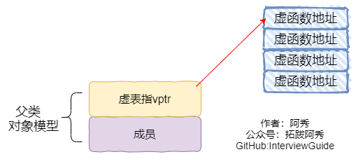
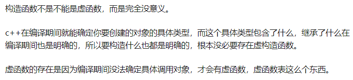

### 多态 & 虚函数相关

#### 1、多态

多态性可以简单地概括为“一个接口，多种方法”，程序在运行时才决定调用的函数

C++多态性是通过虚函数来实现的，虚函数允许子类重新定义成员函数，而子类重新定义父类的做法称为覆盖(override)，或者称为重写。

而重载则是允许有多个同名的函数，而这些函数的参数列表不同，允许参数个数不同，参数类型不同，或者两者都不同。编译器会根据这些函数的不同列表，将同名的函数的名称做修饰，从而生成一些不同名称的预处理函数，来实现同名函数调用时的重载问题。但这并没有体现多态性。

多态与非多态的实质区别就是函数地址是早绑定还是晚绑定。如果函数的调用，在编译器编译期间就可以确定函数的调用地址，并生产代码，是静态的，就是说地址是早绑定的。而如果函数调用的地址不能在编译器期间确定，需要在运行时才确定，这就属于晚绑定。

简单看一道题：

```c++
#include<iostream>
using namespace std;
 
class A
{
public:
	void foo()
	{
		printf("1\n");
	}
	virtual void fun()
	{
		printf("2\n");
	}
};
class B : public A
{
public:
	void foo()
	{
		printf("3\n");
	}
	void fun()
	{
		printf("4\n");
	}
};
int main() {
    A a;
    B b;
    B *ptr = (B *)&a; 
    ptr->foo(); // 3
    ptr->fun(); // 2
}
```

这是一个用子类的指针去指向一个强制转换为子类地址的基类对象。结果，这两句调用的输出结果是3，2。

因为foo是一个普通成员函数，所以调用就和调用普通函数一样，ptr是子类指针，自然调用子类的成员函数。

而fun是虚函数，但指向的还是一个基类对象，因此通过虚函数列表找到基类中fun函数的地址。

**非虚成员函数的地址，你说的对，它不是虚的，也就是说它不需要在虚表中。为什么？好吧，它不依赖于对象的运行时类型，只依赖于静态类型，这意味着编译器可以在编译时确定要调用哪个函数，因此调用被解析，而不是在执行期间使用后期绑定(bind)。函数本身在代码部分的某个地方，因此在编译时函数地址直接插入调用地址。**

c++的多态性，一言以蔽之就是：

在基类的函数前加上**virtual**关键字，在派生类中重写该函数，运行时将会根据所指对象的实际类型来调用相应的函数，如果对象类型是派生类，就调用派生类的函数，如果对象类型是基类，就调用基类的函数。




**上图中展示了虚表和虚表指针在基类对象和派生类对象中的模型，下面阐述实现多态的过程：**

1、当类中声明虚函数时，c++编译器会在静态编译的时候为这个类生成一个虚函数表，虚函数表是一个存储类成员函数指针的数据结构，一个虚函数表只属于一个类。虚函数表是由编译器自动生成与维护的。virtual成员函数的地址会被c++编译器放入虚函数表中。

2、在定义一个对象的时候或者说动态编译的时候（未调用构造函数之前），那么c++编译器会为这个对象隐式的分配4个字节大小的内存，这个内存里是一个 指针变量，此时这个指针变量还是为NULL，当执行函数的构造函数的时候，编译器会默认的为这个指针变量赋值。这个指针变量会指向该类的虚函数表

3、对于子类而言，子类的初始化比较特殊，必须先调用父类的构造函数，这时候这个隐藏的指针变量会被初始化为父类中虚函数表的地址。随后子类对象又会再次调用自身的构造函数，**这个隐藏的指针变量又会再一次被赋值为子类对应的类的虚函数表的地址。**

#### 2、静态联编和动态联编

**将源代码中的函数调用解释为执行特定的函数代码块的过程称为函数名联编。**

意思就是，同一个名称的函数有多种，联编就是把调用和具体的实现进行链接映射的操作。它是计算机程序彼此关联的过程。

**静态联编**是指在编译阶段就将函数实现和函数调用关联起来，因此静态联编也叫早绑定。

**动态联编**是指在程序执行的时候才将函数实现和函数调用关联，因此也叫运行时绑定或者晚绑定。

#### 3、为什么析构函数一般写成虚函数

由于类的多态性，基类指针可以指向派生类的对象，如果删除该基类的指针，就会调用该指针指向的派生类析构函数，而**派生类的析构函数又自动调用基类的析构函数，这样整个派生类的对象完全被释放。**

**如果析构函数不被声明成虚函数，则编译器实施静态绑定，在删除基类指针时，只会调用基类的析构函数而不调用派生类析构函数，这样就会造成派生类对象析构不完全，造成内存泄漏。**

#### 4、构造函数能否声明为虚函数或者纯虚函数，析构函数呢？

析构函数可以为虚函数，并且一般情况下基类析构函数要定义为虚函数。

**析构函数可以是纯虚函数**，含有纯虚函数的类是抽象类，此时不能被实例化。但派生类中可以根据自身需求重新改写基类中的纯虚函数。

**构造函数不能声明为虚函数！**

+ 构造函数在程序编译的时候就需要/可以明确类型、分配内存，而虚函数是在运行时动态确定其类型的。
+ 虚函数需要依赖对象中指向类的虚函数表的指针，而这个指针是在构造函数中初始化的(这个工作是编译器做的，对程序员来说是透明的)，如果构造函数是虚函数的话，那么在调用构造函数的时候，而此时虚函数表指针并未初始化完成，这就会引起错误。



#### 5、基类的虚函数表存放在内存的什么区

首先整理一下虚函数表的特征：

+ 虚函数表是全局共享的元素，即全局仅有一个，在编译时就构造完成
+ 虚函数表类似一个数组，类对象中存储vptr指针，指向虚函数表，即虚函数表不是函数，不是程序代码，不可能存储在代码段
+ 虚函数表存储虚函数的地址，即虚函数表的元素是指向类成员函数的指针，而类中虚函数的个数在编译时期可以确定，即虚函数表的大小可以确定。即大小是在编译时期确定的，不必动态分配内存空间存储虚函数表，所以不在堆中。

C++中**虚函数表位于只读数据段（.rodata），也就是C++内存模型中的常量区；而虚函数则位于代码段（.text），也就是C++内存模型中的代码区。**

#### 6、构造函数、析构函数、虚函数可否声明为内联函数

首先，将这些函数声明为内联函数，在语法上没有错误。因为inline同register一样，只是个建议，编译器并不一定真正的内联。

> register关键字：这个关键字请求编译器尽可能的将变量存在CPU内部寄存器中，而不是通过内存寻址访问，以提高效率

但是！构造函数和析构函数声明为内联函数是没有意义的。

《Effective C++》中所阐述的是：**将构造函数和析构函数声明为inline是没有什么意义的，即编译器并不真正对声明为inline的构造和析构函数进行内联操作，因为编译器会在构造和析构函数中添加额外的操作（申请/释放内存，构造/析构对象等），致使构造函数/析构函数并不像看上去的那么精简**。

**将虚函数声明为inline，要分情况讨论**

有的人认为虚函数被声明为inline，但是编译器并没有对其内联，他们给出的理由是inline是编译期决定的，而虚函数是运行期决定的，即在不知道将要调用哪个函数的情况下，如何将函数内联呢？

上述观点看似正确，其实不然，如果虚函数在编译期就能够决定将要调用哪个函数时，就能够内联，那么什么情况下编译器可以确定要调用哪个函数呢，答案是当用对象调用虚函数（此时不具有多态性）时，就内联展开

**综上**，**当是指向派生类的指针（多态性）调用声明为inline的虚函数时，不会内联展开；当是对象本身调用虚函数时，会内联展开，当然前提依然是函数并不复杂的情况下**。

#### 7、构造函数和析构函数可以调用虚函数吗？

1、在C++中，提倡不在构造函数和析构函数中调用虚函数；

2、构造函数和析构函数调用虚函数时都不使用动态联编，如果在构造函数或析构函数中调用虚函数，则**运行的是为构造函数或析构函数自身类型定义的版本**；

3、因为父类对象会在子类之前进行构造，此时子类部分的数据成员还未初始化，因此调用子类的虚函数时不安全的，故而C++不会进行动态联编；

4、析构函数是用来销毁一个对象的，在销毁一个对象时，先调用子类的析构函数，然后再调用基类的析构函数。所以在调用基类的析构函数时，派生类对象的数据成员已经销毁，这个时候再调用子类的虚函数没有任何意义

> 《Effective C++》的解释是： 派生类对象构造期间进入基类的构造函数时，对象类型变成了基类类型，而不是派生类类型。 同样，进入基类析构函数时，对象也是基类类型。

#### 8、纯虚析构函数是否需要定义？

**需要定义，因为派生类析构函数会调用基类的析构函数，你没定义链接会失败啊！最好不要把虚析构函数定义为纯虚析构函数。**

#### 9、静态成员函数能定义为虚函数吗？

**1、静态成员函数不属于任何类对象或类实例，所以即使给此函数加上virutal也是没有任何意义的。**

2、那没有任何意义。 虚拟成员函数的要点在于它们是根据调用它们的**对象实例的动态类型来调度的**。 另一方面，静态函数与任何实例无关，而是类的属性。 因此，它们是虚拟的毫无意义。 

3、一般成员函数如下：

```c++
a.func(10);//此处，编译器将会编译成：A::func(&a,10);
```

但静态函数是没有this的，所以找不到虚表。

 static函数没有“虚函数”一说。因为static函数实际上是“加上了访问控制的全局函数”，全局函数哪来的什么虚函数？ 

#### 10、虚函数的代价?

1、带有虚函数的类，每一个类会产生一个虚函数表，用来存储指向虚成员函数的指针

2、带有虚函数的类的每一个对象，都会有有一个指向虚表的指针，会增加对象的空间大小

3、不能再是内联的函数，因为内联函数在编译阶段进行替代，而虚函数表示等待，在运行阶段才能确定到底是采用哪种函数，虚函数不能是内联函数。

#### 11、哪些函数不能是虚函数？

1、构造函数

2、内联函数

3、静态函数

4、友元函数与普通函数，两者不属于类的成员函数，不能被继承。对于没有继承特性的函数没有虚函数的说法。

#### 12、为什么析构函数必须是虚函数？为什么C++默认的析构函数不是虚函数

1、将可能被继承的父类析构函数设为虚函数，当我们new一个子类，使用基类指针指向该子类对象，释放基类指针时能够释放子类的空间，防止内存泄漏。

2、默认的析构不是虚函数是因为需要额外的虚函数表和虚表指针，占用额外的内存，所以对于不会被继承的类来说，其析构函数如果是虚函数，就会浪费内存。因此C++默认的析构函数不是虚函数。而只有当需要当作父类时，才设置为虚函数。

#### 13、静态多态和动态多态

**静态多态主要是重载，在编译的时候就已经确定，动态多态是用虚函数机制实现，在运行期间动态绑定。**

#### 14、静态函数和虚函数的区别 

静态函数在编译的时候就已经确定运行时机，虚函数在运行的时候动态绑定。

#### 15、静态类型和动态类型，静态绑定和动态绑定

+ 静态类型：对象在声明时采用的类型，在编译期已经确定。
+ 动态类型：通常是指一个指针或引用目前所指对象的类型，是在运行期决定的
+ 静态绑定：绑定的是静态类型，所对应的函数或属性依赖于对象的静态类型，发生在编译期
+ 动态绑定：绑定的是动态类型，所对应的函数或属性依赖于对象的动态类型，发生在运行期

至此总结一下静态绑定和动态绑定的区别：

- 静态绑定发生在编译期，动态绑定发生在运行期；
- 对象的动态类型可以更改，但是静态类型无法更改；
- 要想实现多态，必须使用动态绑定；
- 在继承体系中只有虚函数使用的是动态绑定，其他的全部是静态绑定；

#### 16、绝不重新定义继承而来的虚函数的缺省参数值

+ 讨论范围：继承一个带有缺省参数值的virtual函数

+ 注意：virtual函数是动态绑定，但缺省参数值却是静态绑定

+ 

```c++
class Shape {
public:		
    enum ShapeColor { Red, Green, Blue};    
    virtual void draw(ShapeColor color = Red) const = 0;
};
class Rectangle: public Shape {
public:    
    virtual void draw(ShapeColor color = Green) const;
};
class Circle: public Shape {
public:    
    virtual void draw(ShapeColor color)const;      
    // 以上这么些则当以客户为对象调用此函数，必须要指定参数值    
    // 静态绑定下这个函数并不从base继承缺省参数值    
    // 动态绑定下这个函数会从base继承缺省参数值
};
Shape* ps;
Shape* pc = new Circle;
Shape* pr = new Rectangle;
pc->draw(Shape::Red); // 调用Circle::draw(Shape::Red)
pr->draw(Shape::Red); // 调用Rectangle::draw(Shape::Red)
// virtual函数是动态绑定，但缺省值则是静态绑定 调用一个定义于继承类的虚函数的同时，使用基类为它所指定的缺省参数值
pr->draw();   // 调用Rectangle::draw(Shape::Red)
// Rectangle的缺省值应该是Green，但由于pr的静态类型是Shape*，所以此一调用的缺省参数值来自Shape类。
```

缺省参数值总是由静态类型提供！

### 构造 & 析构相关

#### 1、构造函数、析构函数的执行顺序？构造函数和拷贝构造的内部都干了啥？

 **1) 构造函数顺序**

1、基类构造函数。如果有多个基类，则构造函数的调用顺序是某类在**类派生表**中出现的顺序，而不是它们在成员初始化表中的顺序。

2、成员类对象构造函数。如果有多个成员类对象则构造函数的调用顺序是对象在**类中被声明的顺序**，而不是它们出现在成员初始化表中的顺序。

3、派生类构造函数。

**2) 析构函数顺序**

1、调用派生类的析构函数

2、调用成员类对象的析构函数

3、调用基类的析构函数

#### 2、构造函数、析构函数可否抛出异常？

（1）**C++只能析构已经完成的对象**，对象只有在其构造函数执行完毕才算是完全构造妥当，在构造函数中发生异常，控制权转出构造函数之外。

**因此，在对象b的构造函数中发生异常，对象b的析构函数不会被调用。因此会造成内存泄漏。**

（2）用auto_ptr对象来取代指针类成员，便对构造函数做了强化，免除了抛出异常时发生资源泄漏的危机，不再需要在析构函数中手动释放资源。

（3）析构函数不能抛出异常，**我的了解是因为不能确定析构调用原因，如果因为已经有了异常而调用析构函数，那么再次抛出异常就会崩溃了**

> 通常异常发生时，c++的机制会调用已经构造对象的析构函数来释放资源，此时若析构函数本身也抛出异常，则前一个异常尚未处理，又有新的异常，会造成程序崩溃的问题。

```c++
class Widget{
  public:
    ...
    ~Widget(){...}        //假设此析构函数可能会抛出异常
};

void doSomething(){
  std::vector<Widget> v;
}                         //在这一行调用了v的析构函数，资源被释放
```

当v被调用析构函数，它包含的所有Widget对象也都会被调用析构函数。又因为v是一个容器，如果在释放第一个元素时触发了异常，它也只能继续释放别的元素，否则会导致其它元素的资源泄露。如果在释放第二个元素的时候又触发了异常，那么程序同样会导致崩溃。

不仅仅是std::vector，所有STL容器的类甚至包括数组也都会像这样因为析构函数抛出异常而崩溃程序，所以在C++中，不要让析构函数抛出异常！

解决方法：

- **把可能抛出异常的代码移出析构函数**

我们设计DBConn类的更安全的接口，让其他函数来承担这个风险，而且这样也可以事先在析构函数这样的紧要关头前对异常做出处理。

```text
class DBConn{
  public:
    ...
    ~DBConn();
    void close();        //当要关闭连接时，手动调用此函数
  private:
    ...
    closed = true;       //显示连接是否被手动关闭
};

void DBConn::close(){    //当需要关闭连接，手动调用此函数
  db.close();
  closed = true;
}

DBConn::~DBcon(){
  if(!closed)            //析构函数虽然还是要留有备用，但不用每次都承担风险了
    try{
      db.close();
    }catch(...){
      //记录访问历史
      //消化异常或者主动关闭
    }
}
```

通过以上的做法，当关闭连接时，我们先手动调用close()方法，这样就算抛出了异常，我们也可以事先处理，然后再调用析构函数。当然析构函数还是要检查是否被手动关闭并留有备用方案。如果没有被手动关闭，析构函数还是需要在消化掉异常和终止程序中做出选择。

#### 3、类什么时候会析构？

1、对象生命周期结束，被销毁时；

2、delete指向对象的指针时，或delete指向对象的基类类型指针，而其基类虚构函数是虚函数时；

3、对象i是对象o的成员，o的析构函数被调用时，对象i的析构函数也被调用。

#### 4、构造函数的几种关键字？

**default：**

default关键字可以显式要求编译器生成合成构造函数，防止在调用时相关构造函数类型没有定义而报错

**delete：**

delete关键字可以删除构造函数、赋值运算符函数等，这样在使用的时候会得到友善的提示

#### 5、构造函数、拷贝构造函数和赋值操作符的区别？

**构造函数：**

对象不存在，没用别的对象初始化，在创建一个新的对象时调用构造函数

**拷贝构造函数**

对象不存在，但是使用别的已经存在的对象来进行初始化

**赋值运算符**

对象存在，用别的对象给它赋值，这属于重载“=”号运算符的范畴，“=”号两侧的对象都是已存在的

**拷贝构造函数和赋值操作符的区别**

- 拷贝构造函数是函数，赋值运算符是运算符重载。
- 拷贝构造函数会生成新的类对象，赋值运算符不能。

#### 6、什么时候会自动生成默认构造函数？

只有默认构造函数”被需要“的时候编译器才会生成默认构造函数。

1. **带有默认构造函数的类成员对象**，如果一个类没有任何构造函数，但它含有一个成员对象，而后者有默认构造函数，那么编译器就为该类合成出一个默认构造函数。

2. **带有默认构造函数的基类**，如果一个没有任务构造函数的派生类派生自一个带有默认构造函数基类，那么该派生类会合成一个构造函数调用上一层基类的默认构造函数；

3. **带有虚函数的类**，这样的类也满足编译器需要合成默认构造函数的类，原因是含有虚函数的类对象都含有一个虚表指针vptr，编译器需要对vptr设置初值以满足虚函数机制的正确运行，编译器会把这个设置初值的操作放在默认构造函数中。

4. **虚拟继承**下，虚继承也会在子类对象中被合成一个指向虚基类的指针，因此也要被初始化，所以必须要构造函数，虚基类或者虚继承保证子类对象中只有一份虚基类的对象。

5. 合成的默认构造函数中，只有基类子对象和成员类对象会被初始化。所有其他的非静态数据成员都不会被初始化。

   ```c++
   class xf {
   public:
       string a;
       int b;
   };
   int main() {
       xf c;
       cout << c.b << endl;
       cout << c.a << endl;
       return 0;
   }
   /*
   8  可见b并没有被初始化，随机附了一个值
   
   */
   ```


#### 7、什么时候需要合成拷贝构造函数？

1) 对一个对象做显示的初始化操作，X xx = x;

2) 当对象被当做参数交给某个函数时；

3) 当函数传回一个类对象时；

4) 如果一个类没有拷贝构造函数，但是含有一个类类型的成员变量，该类型含有拷贝构造函数，此时编译器会为该类合成一个拷贝构造函数

5) 如果一个类没有拷贝构造函数，但是该类继承自含有拷贝构造函数的基类，此时编译器会为该类合成一个拷贝构造函数
6) 如果一个类没有拷贝构造函数，但是该类声明或继承了虚函数，此时编译器会为该类合成一个拷贝构造函数
7) 如果一个类没有拷贝构造函数，但是该类含有虚基类，此时编译器会为该类合成一个拷贝构造函数

#### 8、C++中有哪几种构造函数

- 默认构造函数
- 初始化构造函数（有参数）
- 拷贝构造函数
- 移动构造函数（move和右值引用）
- 委托构造函数 （委托构造函数使用类的其他构造函数执行初始化过程）

+ 一个委托构造函数使用它所属类的其他构造函数执行它自己的初始化过程。或者说它把它自己的一些（或者全部）职责委托给了其他构造函数。

  ```c++
  class Sales_data {
  public:	
  	Sales_data(std::string s, unsigned cnt, double price):bookNo(s), units_sold(cnt), revenue(cnt * price) { }  // 1
  	
  	// 委托构造函数
  	Sales_data() : Sales_data("",0,0) { }  // 2
  	Sales_data(std::string s) : Sales_data(s,0,0) { }  // 3
  	Sales_data(std::istream &is) : Salse_data() { read(is, *this); }  // 委托2，2委托1
  }
  ```

#### 9、C++中拷贝赋值函数的形参能否进行值传递？

不能，因为会递归调用，值传递的过程中又会调用拷贝赋值。

#### 10、类成员初始化的方式？构造函数的执行顺序？为什么用成员初始化列表快一些？

1、**赋值初始化**，通过在函数体内进行赋值初始化。**列表初始化**，在冒号后使用初始化列表进行初始化。还有一种是**声明时初始化**。

这两种方式的主要区别在于：

对于在函数体中初始化，是在所有的数据成员被分配内存空间后才进行的。

列表初始化是给数据成员分配内存空间时就进行初始化，就是说分配一个数据成员只要冒号后有此数据成员的赋值表达式(此表达式必须是括号赋值表达式)，那么分配了内存空间后在进入函数体之前给数据成员赋值，**就是说初始化这个数据成员此时函数体还未执行。**

2、一个派生类构造函数的执行顺序如下：

1. 虚拟基类的构造函数（多个虚拟基类则按照继承的顺序执行构造函数）。
2.  基类的构造函数（多个普通基类也按照继承的顺序执行构造函数）。
3.  类类型的成员对象的构造函数（按照初始化顺序）
4.  派生类自己的构造函数。

3、**方法一是在构造函数当中做赋值的操作，而方法二是做纯粹的初始化操作。我们都知道，C++的赋值操作是会产生临时对象的。临时对象的出现会降低程序的效率。**

#### 11、有哪些情况必须用到成员列表初始化

+ 当初始化一个引用成员时
+ 当初始化一个常量成员时
+ 当调用一个基类的构造函数，而它拥有一组参数时

#### 12、如何禁止程序自动生成拷贝构造函数

为了阻止编译器默认生成拷贝构造函数和拷贝赋值函数，我们需要手动去重写这两个函数，某些情况下，为了避免调用拷贝构造函数和拷贝赋值函数，我们需要将他们设置成private，防止被调用。

类的成员函数和friend函数还是可以调用private函数，如果这个private函数只声明不定义，如果某些人不慎调用任何一个，则会产生一个链接错误。

所以还有一种办法，定义一个专门阻止拷贝动作的base class

```c++
class Uncopyable {
protected:
	Uncopyable() { };   // 允许继承类对象构造和析构
	~Uncopyable() { };
private:
	Uncopyable(const Uncopyable&); // 阻止拷贝
	Uncopyable& operator=(const Uncopyable&);
};
```

为阻止某个类对象被拷贝，只需要继承Uncopyable类就行。

任何想拷贝这个继承类对象的，编译器会试着生成一个拷贝构造函数和拷贝赋值操作符，这些合成版本会尝试调用基类的对应兄弟，但会被编译器拒绝，因为基类拷贝函数是private，只有基类的成员函数和友元函数才能调用。

### 模板相关

#### 1、模板类和模板函数的区别是什么？

函数模板的实例化是由编译程序在处理函数调用时自动完成的，而类模板的实例化必须由程序员在程序中显式地指定。

即函数模板允许隐式调用和显式调用而类模板只能显示调用。在使用时类模板必须加，而函数模板不必。

#### 2、模板函数和模板类的特例化

**引入原因**

编写单一的模板，他能适应多种类型的需求，使每种类型都具有相同的功能，但**对于某种特定类型，如果要实现其特有的功能，单一模板就无法做到，这时就需要模板特例化。**

**定义**

**对单一模板提供的一个特殊实例，它将一个或多个模板参数绑定到特定的类型或值上。**

**（1）模板函数特例化**

必须为原函数模板的每个模板参数都提供实参，且使用关键字template后跟一个空尖括号对<>，表明将原模板的所有模板参数提供实参，举例如下：

```c++
template<typename T> // 模板函数
int compare(const T &v1, const T &v2) {
    if(v1 > v2) return -1;
    if(v2 > v1) return 1;
    return 0;
}

// 模板特例化，满足针对字符串特定的比较，要提供所有实参，这里只有一个T
template<>
int compare(const char* const &v1, const char* const &v2) {
	return strcmp(p1,p2);
}
```

**本质**

**特例化的本质是实例化一个模板，而非重载它。**


**（2）类模板特例化**

原理类似函数模板，**不过在类中，我们可以对模板进行特例化，也可以对类进行部分特例化。**对类进行特例化时，仍然用template<>表示是一个特例化版本，例如：

```c++
template<>
class hash<sales_data>
{
    size_t operator()(sales_data& s);
    //里面所有T都换成特例化类型版本sales_data
    //按照最佳匹配原则，若T != sales_data，就用普通类模板，否则，就使用含有特定功能的特例化版本。
};
```

**类模板的部分特例化**

不必为所有模板参数提供实参，可以**指定一部分而非所有模板参数**，**一个类模板的部分特例化本身仍是一个模板**，使用它时还必须为其特例化版本中未指定的模板参数提供实参(特例化时类名一定要和原来的模板相同，只是参数类型不同，按最佳匹配原则，哪个最匹配，就用相应的模板)

**特例化类中的部分成员**

**可以特例化类中的部分成员函数而不是整个类**，举个例子：

```c++
template<typename T>
class Foo
{
    void Bar();
    void Barst(T a)();
};

template<>
void Foo<int>::Bar()
{
    //进行int类型的特例化处理
    cout << "我是int型特例化" << endl;
}

Foo<string> fs;
Foo<int> fi;//使用特例化
fs.Bar();//使用的是普通模板，即Foo<string>::Bar()
fi.Bar();//特例化版本，执行Foo<int>::Bar()
//Foo<string>::Bar()和Foo<int>::Bar()功能不同
```

**模板参数数量偏特化**

```c++
#include <iostream>

using namespace std;

template<typename T, typename U, typename W>
struct TC//泛化的TC类模板
{
	void functest()
	{
		cout << "泛化版本" << endl;
	}
};
//偏特化：从参数上进行偏特化，绑定2个类型模板，留一个类型模板参数
template<typename U>//因为另外两个被我绑定到具体类型，所以这里留一个U类型模板参数
struct TC<int, U, int>
{
	//对特化版本做单独处理
	void functest()
	{
		cout << "偏特化int，int版本" << endl;
	}
};
int main()
{
	TC<double, double, double>itest;
	itest.functest();

	TC<int, double, int>iditest;
	iditest.functest();

	return 0;
}
```

**模板参数范围特化**

```c++
#include <iostream>

using namespace std;

template<typename T>
struct TC//泛化的TC类模板
{
	void functest()
	{
		cout << "泛化版本" << endl;
	}
};
//偏特化：模板参数范围上的特化版本
template<typename T>
struct TC<const T>//const的特化版本
{
	//对特化版本做单独处理
	void functest()
	{
		cout << "偏特化const版本" << endl;
	}
};
template <typename T>
struct TC<T *>//T* 的特化版本
{
	void functest()
	{
		cout << "const T*特化版本" << endl;
	}
};
template <typename T>
struct TC<T &>//T* 的特化版本
{
	void functest()
	{
		cout << "T &左值引用特化版本" << endl;
	}
};

template <typename T>
struct TC<T &&>//T* 的特化版本
{
	void functest()
	{
		cout << "T &&右值引用特化版本" << endl;
	}
};


int main()
{
	TC<double> td;
	td.functest();

	TC<const double> td2;
	td2.functest();

	TC<double *> tpd;
	tpd.functest();

	TC<const double *> tpd2;
	tpd2.functest();

	TC<int &>tcyi;
	tcyi.functest();

	TC<int &&>tcyi2;
	tcyi2.functest();

	return 0;
}
```

1、函数模板只有特化，没有偏特化；

> 没有函数偏特化，仅仅是因为C++标准语言说不行,另外我觉得有了函数重载，函数偏特化也没什么用。

2、模板、模板的特化和模板的偏特化都存在的情况下，编译器在编译阶段进行匹配，优先特殊的；

3、模板函数不能是虚函数；因为每个包含虚函数的类具有一个virtual table,包含该类的所有虚函数的地址，因此vtable的大小是确定的。模板只有被使用时才会被实例化，将其声明为虚函数会使vtable的大小不确定。所以，成员函数模板不能为虚函数

#### 3、为什么一般模板定义要放在头文件中？

**编译器在编译时，看到模板并不会进行任何操作，而是在模板实际使用时（实例化），才会进行代码生成。**

因为模板必须实例化才会进行编译，否则是不会编译成二进制代码，当你在main.cpp中调用了一个模板，实例化它，编译成二进程代码，但如果你头文件只有声明，你链接期就要去别的cpp文件找，问题是定义模板的cpp文件并没有实例化它，所以不会编译成二进程代码，所以就找不到，链接错误！

[C++ 模板类的声明和定义都要放在 .h （头）文件中的原因 ](https://www.jianshu.com/p/dc94f0cbfcf7)

