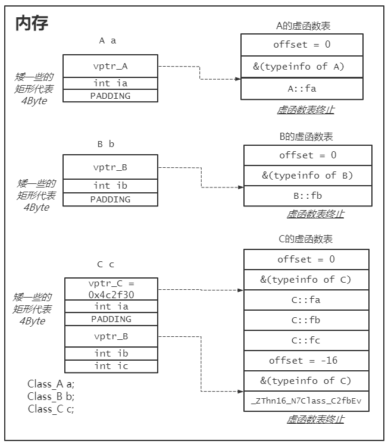

[果冻虾仁：C++为什么要弄出虚表这个东西？](https://www.zhihu.com/question/389546003/answer/1194780618)

[C++多态为什么只有指针或引用能实现](https://blog.csdn.net/weixin_43327696/article/details/107671931)

> 补充一点，base b = a，发生向上转型的时候，虚表不会赋值。我用对象直接调用虚函数，编译时即可确定，调用的函数是**自己**定义的函数。
>
> 同理我一个继承类对象去调用虚函数，它的类型是确定的，肯定就是我这个继承类类型，所以编译期就能确定调用的是继承类的虚函数，把函数地址确定下来了，也不用走虚函数表那一套，到运行时才调用。

考虑一下这种情况，如果没有虚函数和虚表：

```cpp
struct Animal {
    void name() { std::cout << "Unknown" << std::endl; }
};

struct Cat : Animal {
    void name() { std::cout << "Tom" << std::endl; }
};

struct Mouse : Animal {
    void name() { std::cout << "Jerry" << std::endl; }
};

Animal *p = nullptr;
bool isCat;

std::cin >> isCat;
if (isCat)
    p = new Cat();
else
    p = new Mouse();
p->name(); // 请问调用的是哪个类的name函数？不通过虚表如何实现动态分发？
```

```cpp
class Base
{
public:
    virtual ~Base(){}
    virtual void f() { std::cout << "Base" << std::endl; }
};

class A : public Base
{
public:
    void f() { std::cout << "A" << std::endl; }
};

void f(Base* b)
{
    b->f();
}

void test()
{
    Base* b = new Base;
    Base* b2 = new A;
    f(b);
    f(b2);
}
```

就是因为你没法在编译期间判断具体的调用对象是基类还是派生类，比如上面的代码，编译器没法知道在函数f中，参数b到底是Base还是A.

**就是编译期确定不了真正的类型！！！**

[多重继承中，虚表第二个槽对应的是type_info的信息，继承类的就是继承类的，第一个槽是校准this用的](https://www.zhihu.com/question/29251261/answer/1297439131)



**这里如果B* b = &c，那么b指向C中B的子对象头部，也就会拿到vptr_B，那么b + offset就能回到vptr_C的位置，就可以找到C::fb。同时也校准了this。毕竟调用C::fb，参数需要this**

**但图中也可以直接去调用_ZThn16_N7Class_C2fbEv这个函数，这个函数会去调用C::fb**  感觉这个要好一点。

```c
Dump of assembler code for function _ZThn16_N7Class_C2fbEv:
        0x00000000004b1be0 <+0>:\tsub    $0x10,%rcx //%rcx即this
        0x00000000004b1be4 <+4>:\tjmpq   0x4213f0 <Class_C::fb()>
```

**先校准this，再调用C::fb**

一言以蔽之就是多态的时候，编译器最后翻译的代码会是去调用虚表存的地址，但此时是不知道调用的到底是哪个函数的，只有运行的时候才知道。而不是多态直接把对应的函数地址放到call指令后面了。


**RTTI**

运行时类型识别（RTTI）的功能由两个运算符实现：

+ typeid运算符，用于返回表达式的类型
+ dynamic_cast运算符，用于将基类的指针或引用安全地转换成派生类的指针或引用。

**我们将这两个运算符用于某种类型的指针或引用，如果这类型含有虚函数，则运算符将使用指针或引用所绑定对象的动态类型。** 

特别适用于以下情况：**想使用基类对象的指针或引用执行某个派生类的操作并且该操作不是虚函数**

一般来说我们尽可能使用虚函数，但没有只能使用一个RTTI运算符。

**dynamic_cast运算符**

举个栗子：

Base类至少含有一个虚函数，Derived是Base的公有派生类。如果有一个指向Base的指针bp，则我们可以在运行时将它转换成指向Derived的指针：

```c++
if (Derived *dp = dynamic_cast<Derived*>(bp)) {
	// 使用dp指向的Derived对象
} else {
	// 使用bp指向的Base对象
}
```

```c++
void f(const Base &b) {
	try {
		const Derived &d = dynamic_cast<const Derived&>(b);
	}catch(bad_cast) {
		// 处理类型转换失败的情况
	}
}
```

**typeid运算符**

typeid运算符可以作用于任意类型的表达式。顶层const会被忽略。如果表达式是一个引用，typeid会返回该引用所引对象的类型。

如果是对象数组或函数操作，不会执行向指针的标准类型转换。对数组a执行typeid(a)，所得是数组类型而不是指针类型。

当运算对象不属于类类型或者没有任何虚函数的类，则指示的是运算对象的静态类型。当**运算对象是定义了至少一个虚函数的类的左值时，typeid的结果到运行时才会求得**。

**使用RTTI**

```c++
class Base {
	friend bool operator==(const Base&, const Base&);
public:
	// Base的接口成员
protected:
	virtual bool equal(const Base&) const;
};
class Derived: public Base {
public:
	// Derived的接口成员
protected:
	bool equal(const Base&) const;
};

// 如果运算对象类型不同则返回false，否则当运算对象是Base，就调用Base的equal，是Derived就调用Derived的equal 比较成员。
bool operator==(const Base& lhs, const Base& rhs) {
	return typeid(lhs) == typeid(rhs) && lhs.equal(rhs);
}
bool Derived::equal(const Base& rhs) const
{	
    // 我们清楚两个类型相等，所以转换不会抛出异常
    auto r = dynamic_cast<const Derived&>(rhs);
    // 执行比较操作并返回结果
}

bool Base::equal(const Base& rhs) {
    // 执行比较
}
```

**typeid详解**

typeid运算符，后接一个类型名或一个表达式，该运算符返回一个类型为std::type_info的对象的const引用。type_info是std中的一个类，它用于记录与类型相关的信息。类type_info的定义大概如下：

```c++
class type_info
{
    public:
        virtual ~type_info();
        bool operator==(const type_info&)const;
        bool operator!=(const type_info&)const;
        bool before(const type_info&)const;
        const char* name()const;
    private:
        type_info(const type_info&);
        type_info& operator=(const type_info&);
       
        // data members
};
```

从上面的定义也可以看到，type_info提供了两个对象的相等比较操作，但是用户并不能自己定义一个type_info的对象，而只能通过typeid运算符返回一个对象的const引用来使用type_info的对象。

type_info的name函数可以返回typeid(a) a的类型。

```cpp
int i = 1;
const char* name = typeid(i).name();
```

这里的typeid(i)根本不需要做任何运行时动作，而是纯编译时行为——它使用变量i的静态类型直接就知道这是对int类型做typeid运算，于是可以直接找出int对应的std::type_info对象返回出来。

此时的typeid运算符就跟sizeof运算符的大部分情况一样，只需要编译器算出表达式的静态类型就足够了。

算出表达式的静态类型是C++编译器的基本功能了，类型检查、类型推导等许多功能都依赖它。

而当typeid运算符应用在一个指向多态类型对象的指针上的时候，typeid的实现才需要有运行时行为。

**实际实现的时候，通常是在类的vtable里会有个slot保存着指向该类对应的std::type_info对象的指针。**

运行的时候再去找。
