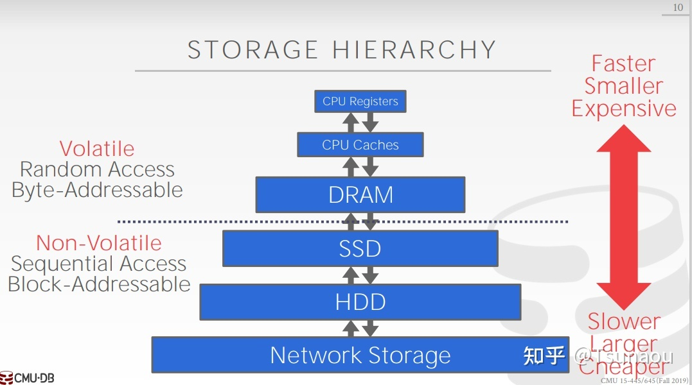
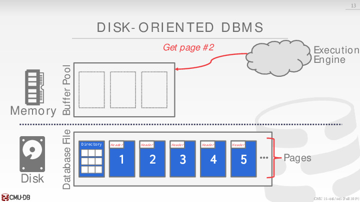
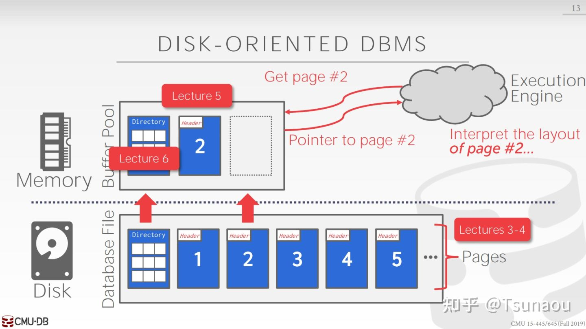
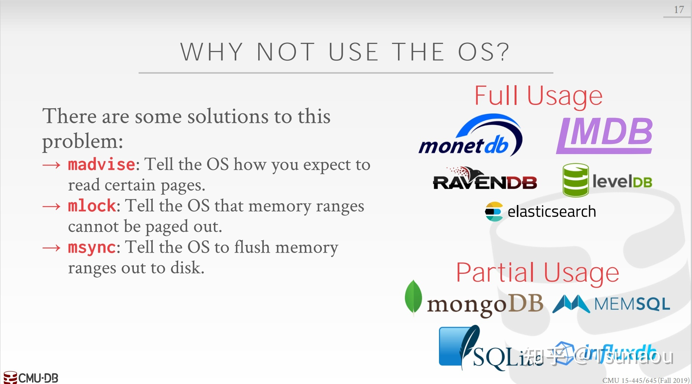
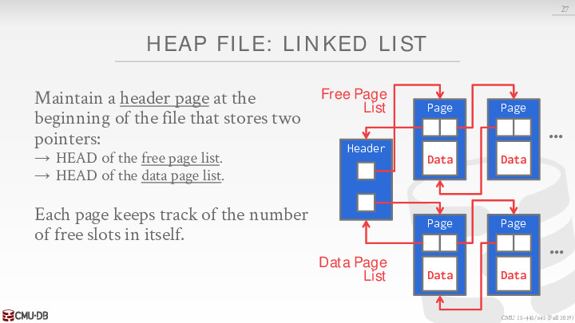
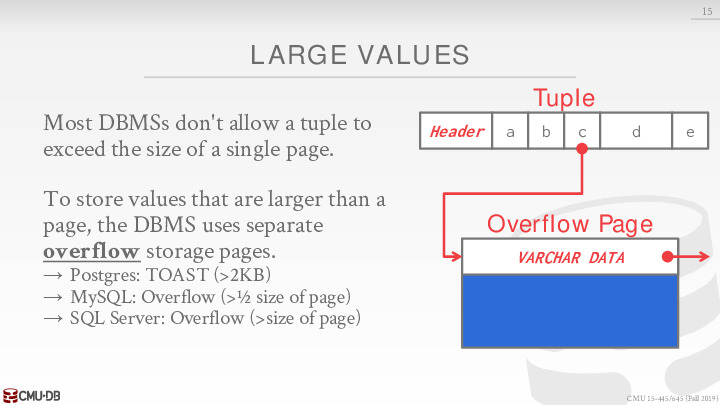

### Lecture 1 数据库存储

#### 1 Disk-Oriented Architecture

##### 1.1 System Design Goals

我们关注是面向磁盘的数据库系统（disk-oriented DBMS），这意味着每次进行查询时数据都不在内存中，我们需要从磁盘去获取数据，这就对数据库的设计和机制有了一定的要求：如何防止数据丢失、保存无效、错误数据等。这就涉及到易失性存储（Volatile）和非易失性存储（Non-Volatile）的区别。



在本门课程中，内存指代DRAM，磁盘指代SSD、HDD或者网络存储（例如云存储）等内容。实际上，现在还存在一种叫非易失性内存的玩意，目前还没有被广泛使用，但是已经存在了。

面向磁盘的数据库需要处理比物理内存更大的数据，这意味着数据库需要有**缓存区管理器**，它提供服务给上层的数据库，让数据库能访问任何一个数据，而这个数据实际上已经由缓存区管理器由硬盘 load 进内存。缓存区管理器的工作就是将数据 (实际上是**页**) 从硬盘读进内存 或 从内存写入硬盘，目的是让上层的数据库有更高效的缓存机制 (caching)，更少的 I/O操作，更高的性能，更短的运行时间。

> 几个概念：
>
> + 缓存区：Buffer Pool
> + 缓存区管理器：Buffer Manager /buffer pool manager
> + 页:　page / Buffer page

###### 1.1.1 Demo

假设我们刚刚打开数据库，此时数据库的 Buffer Pool 是空的：


Execution Engine调用了buffer pool manager 的一个函数: `getpage(int : 2)`, 为了得到第二个 page。目前我们只将Execution Engine 视作一个需要 page 的数据库高层的部分，需要 buffer pool manager提供的服务：



这时候数据库需要从硬盘中读 **directory page** 到内存，directory page 是 buffer pool 的 header,　记录了每一个 page 对应的文件。

当 directory page 进入内存，buffer pool manager 从它上面读到了 page 2 对应的文件位置：


接下来 page 2 被读到内存中，Execution Engine 得到它想要的东西：一个 page2 内容在内存的指针。


##### 1.2 Why not use the OS?

上述整个机制完全和**操作系统中虚拟内存**一致。操作系统给每一个进程 (process) 提供虚拟内存大小的地址空间 (address space)，而虚拟内存的大小往往比机器的物理内存要大，进程被**欺骗**而使用虚拟内存对应的地址。而操作系统通过 MMU 映射每一个虚拟内存到物理内存，从而向进程提供对应的物理内存的地址上的数据。

而当进程使用超过物理内存大小的地址空间 (address space) 时，操作系统也是在硬盘和内存中缓存 page，进行 swap。

那既然操作系统和数据库的缓存页机制类似，我们向自己提出一个直击灵魂的问题：
**为什么数据库不直接用操作系统的页，而浪费时间 (?) 开发一个 buffer pool manager 做类似的事情呢？**

###### 1.2.1 Demo


上面的 demo 的意思是，当我们在物理内存已满的情况下，继续需要 page2，这时候会出现一个 page fault (页缺失)，我们需要从物理内存中去掉一个 page，来给 page2 提供空间。当然 demo 最开始的时候，我们需要 page1 的时候，和我们需要 page3 的时候，它们都不再物理内存中，这时候我们也遇到了 page Fault。

**所以如果我们使用mmap的话，那么会出现缺页异常的现象，当缺页异常时，进程会被阻塞，只能等待新的 page 加载结束，这会带来性能下降问题。**

##### 1.3 conclusion

由于系统假设数据全存储在磁盘上，因此DBMS的任务就是从磁盘到内存之间来回移动数据，因为系统不能直接对磁盘进行操作。一个数据库系统的目标就是让**上层应用感觉所有的操作都在内存上，即使内存总是远远小于磁盘的**。磁盘的读写会带来很大的开销，因此一个好的设计应该让DBMS在等待磁盘的数据时能够处理其他查询（对内存）。



上图是面向磁盘的数据库管理系统示意图。数据库中的文件被组织成页（Page），第一页是目录页（Directory，**当然这里其实不知道目录页是啥**）。为了对数据进行操作，DBMS需要从磁盘取出数据放到内存中，那么内存中就有一个缓冲池（Buffer Pool）来管理磁盘和内存之间数据的来回移动。同时DBMS还提供了一个执行引擎来进行查询。引擎向缓冲池请求特定page，缓冲池负责将请求的page放到内存供引擎访问。那么，我们的缓冲池管理器（Buffer Pool Manager）就需要确保执行引擎访问内存时不会缺页。

这种设计从宏观来讲类似于操作系统中的虚拟内存（Virtual Memory）：

此处需要去**复习下虚拟内存**的概念（毕竟也是经常考的八股文）。

那么为什么数据库系统需要自己来管理内存而不是让操作系统来帮我们完成内存管理呢？这基于很多方面的考量：

实现虚拟内存的一种方法是使用mmap（memory mapping）。通过mmap我们可以将文件的内容映射到进程的地址空间，进程在地址空间上读取，操作系统负责在磁盘和内存之间来回移动页面。然而，如果mmap遇到page fault，那么这个进程将会被阻塞（操作系统要将page从磁盘load到内存）。

> 内存映射是[虚拟内存](https://so.csdn.net/so/search?q=虚拟内存&spm=1001.2101.3001.7020)系统的重要特性，即虚拟内存中的虚拟页（Virtual Page）总是对应于磁盘上的物理页（Physical Page）。
>
> > 内存映射：将虚拟地址空间中的虚拟页与磁盘上的文件对象对应起来
>
> 内存映射技术，可以使得使用文件来初始化虚拟内存的内容（只在**第一次引用到相应内存时，才会缓存进主存**）：
>
> + 普通磁盘文件：一个区域可以映射到一个普通磁盘文件的连续部分，比如一个可执行目标文件。文件区被分成页大小的片，每一片包含一个虚拟页面的初始内容。因为按需进行页面调度，所以这些虚拟页面没有实际交换进入物理内存，直到CPU第一次引用到页面（即发射一个虚拟地址，落在地址空间这个页面的范围之内）。如果区域比文件区要大，那么就用0来填充这个区域的余下部分。
> + **匿名文件：**一个区域也可以映射到一个匿名文件，匿名文件由内核创建，包含的全是二进制零。CPU第一次引用这样一个区域内的虚拟页面时，内核就在物理内存中找到一个合适的牺牲页面，如果该页面被修改过，就将这个页面换出来，用二进制零覆盖牺牲页面并更新页表，将这个页面标记为是驻留在内存中的。**注意在磁盘和内存之间并没有实际的数据传送。因为这个原因，映射到匿名文件的区域中的页面有时也叫做请求二进制零的页。**
>
> Linux进程可以使用mmap函数来创建新的虚拟内存区域，并将对象映射到这些区域中。
>
> ```c++
> #include <unistd.h>
> #include <sys/mman.h>
> void *mmap(void *start, size_t length, int prot, int flags, int fd, off_t offset);
> ```
>
> mmap函数要求内核创建一个新的虚拟内存区域，最好是从地址start开始的一个区域，并将文件描述符fd指定的对象的一个连续的片映射到这个新的区域。连续对象片大小为length字节，从距文件开始处偏移量offset字节的地方开始。
>
> 可以实现 **文件-内存** 的快速拷贝以实现快速文件IO
>
> + **传统系统调用读取文件**：首先进程执行系统调用read，内核首先检查文件页缓存区是否有请求的内容，如果没有（第一次打开）那么内核将磁盘上文件拷贝到内核的文件缓存区中，接着从文件缓存区拷贝内容到user space。需要执行两次拷贝。
>
>   而下一次请求相同的文件内容时，直接从内核文件缓存区中返回即可，执行一次拷贝。
>
> + **采取mmap读取文件：**采取mmap技术，直接将磁盘上的文件映射为进程虚拟[地址空间](https://so.csdn.net/so/search?q=地址空间&spm=1001.2101.3001.7020)下的虚拟页（被缓存进主内存时，发生一次拷贝）。
>
>   进程对文件的访问就像访问本地内存一样简单高效。只**进行一次拷贝**。

当然，如果我们的数据库只需要读取数据的话，使用mmap实际上是可行的，但是问题在于我们并不仅仅需要读。如果有写操作，**那么操作系统是不知道哪些page需要在其他page执行前从内存刷到磁盘上的，这将会与日志与并发控制的实现有关。**



当然，就如上图所示，我们也可以通过一些指令来指导操作系统进行page的替换（madvise, mlock, msync），也还是有数据库完全使用或者部分使用mmap，例如早期的MongoDB（但是后来MongoDB花大价钱收购了WiredTiger作为其默认的存储引擎，可以看到mmap还是存在一些问题的）。但总的来说，让DBMS自己管理page始终会是一个更加高效且安全的做法，这可以更好的支持：

- Flushing dirty pages to disk in the correct order：将脏页按照正确顺序刷新到磁盘
- Specialized prefetching：专门的预取规则
- Buffer replacement policy：缓冲区替换策略
- Thread/process scheduling：线程与进程的调度

> Note: The OS is **not** your friend.

#### 2 Database Storage

##### 2.1 File Storage

DBMS 通常将自己的所有数据作为一个或多个文件存储在磁盘中，而 OS 只当它们是普通文件，并不知道如何解读这些文件。

###### 2.1.1 Storage Manager

下面一个问题，DBMS 如何将数据库的数据放到磁盘文件上？ 这里有个选择，DBMS 是否要用操作系统的文件系统，还是拿一块 raw storage 自己管理。现在一般的选择是还是使用操作系统文件系统，毕竟方便。既然用文件系统，那么 DBMS 就需要把数据库数据存成一个或多个文件。每个文件有多个 page 组成。page 其实就是固定大小的数据块，那为什么要有这层抽象？这个和我们使用的存储的磁盘有关，它除了慢，还有个特点是对顺序读写比较友好，因为随机读需要磁头不断的机械移动的。所以操作系统的文件系统和磁盘间的 I/O，需要**尽量批量读**，读写数据的最小单位称为数据块 block，一般是 4KB，因为 4KB 比较经济。而数据库的 page 是基于文件系统的，所以设计成 **4KB 的倍数**会比较合理。

storage manager 能够理解解释对应的数据库文件，将数据库文件表示成一个 page 的集合。它也记录下 page 的读与写操作，另外 page 上剩下的存储空间大小也会被记录下来。


###### 2.1.2 Database Pages

OS 的文件系统通常将文件切分成 pages 进行管理，DBMS 也不例外。通常 page 是固定大小的一块数据，每个 page 内部可能存储着 tuples、meta-data、indexes 以及 logs 等等，大多数 DBMS 不会把不同类型数据存储在同一个 page 上。每个 page 带着一个唯一的 id，DBMS 使用一个 indirection layer 将 page id 与数据实际存储的物理位置关联起来。

注意：有几个不同的 page 概念需要分清楚

- Hardware Page：通常大小为 4KB
- OS Page: 通常大小为 4KB
- Database Page：(1-16KB)

不同 DBMS 管理 pages 的方式不同，主要分为以下几种：

- Heap File Organization
- Sequential/Sorted File Organization
- Hashing File Organization

> - Self-contained 指这个 page 拥有 metadata (元数据)，这个 metadata 用来告诉我们如何 interpret 该 page。
> - 每一个 page 有一个唯一的 page id:
>   - 如果数据库只有一个文件，在这种简单的情况下，page id 可以是对应数据在该文件的 offset
>   - 大多数情况，数据库有多个文件。这是 page id 可以是对应数据所在的**那一个**文件的路径＋在该文件中的 offset
>   - 因此每一个 page id 可以对应上某些数据，这些数据的大小是一个 page 的大小
>   - 在数据库的高层组成成分中 (比如 execution engine)，都需要将对应的 page id 当做参数，从 buffer pool manager 中获得对应的 page (和数据)。


上图说，我们有多种途径去对硬盘上的 page 位置进行管理，heap file 是其中的一种途径，我们重点看一下 heap file。

heap file 指的是一个无序的 pages 集合，pages 管理模块需要记录哪些 pages 已经被使用，而哪些 pages 尚未被使用。那么具体如何来记录和管理呢？主要有以下两种方法 Linked List 和 Page Directory。

> A **heap file** is an unordered collection of pages where tuples that are stored in random order.

**Linked List**

Header page 有两个指针：

- `free page list` 指向一个 free page 的 list
- `data page list` 指向一个 not free page 的 list

如果我们想寻找某一个特定的 page，我们只能低效地遍历扫描。总体上 linked list 不是一个好主意。

[](https://cakebytheoceanluo.github.io/images/CMU1544564/Lec03/36.jpg)

**Page Directory**

page directory 是一种比较常见的方式，　它提供了一种映射：`page id -> offset in file`, 这样我们可以通过 page id 找到对应的数据。

另外我们需要同步 (sync) page directory 上的信息和实际上的 page 信息。这需要我们在每次更改 page 的时候，同时也需要更改 page directory 上的信息。

[](https://cakebytheoceanluo.github.io/images/CMU1544564/Lec03/37.jpg)

##### 2.2 Page Layout

每个 page 被分为两个部分：header 和 data，如下图所示：


header 中通常包含以下信息：

- Page Size
- Checksum
- DBMS Version
- Transaction Visibility
- Compression Information


data 中记录着真正存储的数据，数据记录的形式主要有两种：

- Tuple-oriented：记录数据本身
- Log-structured：记录数据的操作日志

###### 2.2.1 Tuple-oriented

**Strawman Idea**

在 header 中记录 tuple 的个数，然后不断的往下 append 即可，如下图所示：


这种方法有明显的两个缺点：

- 一旦出现删除操作，每次插入就需要遍历一遍，寻找空位，否则就会出现空间浪费
- 无法处理变长的数据记录（tuple）

为了解决这两个问题，就产生了 slotted pages。

***Slotted Pages***

如下图所示，header 中的 slot array 记录每个 slot 的信息，如大小、位移等 


对于 slotted pages，如果我们删除 tuple3 与更改 header 后，　我们可以有两种选择：

+ 将原 tuple3 的位置留空，不改变其他 tuple 的位置
+ 将 tuple4 向右移动，占有原 tuple3 的空间，也调整 tuple4 的指针和 header (当然在普遍情况下，需要调整**所有** tuple３之后的 tuple)

> **例子**：
>
> + 新增记录时：在 slot array 中新增一条记录，记录着改记录的入口地址。slot array 与 data 从 page 的两端向中间生长，二者相遇时，就认为这个 page 已经满了
> + 删除记录时：假设删除 tuple #3，可以将 slot array 中的第三条记录删除，并将 tuple #4 及其以后的数据都都向下移动，填补 tuple #3 的空位。而这些细节对于 page 的使用者来说是透明的
> + 处理定长和变长 tuple 数据都游刃有余

###### 2.2.2 Log-Structured 

og-structured 只存储日志记录，如下图所示：


每次记录新的操作日志即可，增删改的操作都很快，但有得必有失，在查询场景下，就需要遍历 page 信息来生成数据才能返回查询结果。

为了加快查询效率，通常会对操作日志在记录 id 上建立索引，如下图所示：


优点：

- 速度很快，只需要向文件中写入一行 log 信息
- 自带 log, 在 recovery 很大帮助
- 适合 append only 的存储形式　(大部分的分布式存储是 append only)

缺点:

- 数据读写较慢，需要依靠 log 生成 tuple (这个生成过程叫 replay)
- 数据分散，且难以缓存 (data ends up spread out wide and hard to cache.)

##### 2.3 Tuple Layout

上节讨论了 page 的 layout 可以分成 header 与 data 两部分，而 data 部分又分为 tuple-oriented 和 log structured 两种，那么在 tuple-oriented 的 layout 中，DMBS 如何存储 tuple 本身呢？

由于 tuple 本身还有别的元信息，如：

- Visibility Info (concurrency control)：即 tuple 粒度的权限和并发控制
- Bit Map for **NULL** values

因此不难猜到，tuple 中还可以分为 header 和 data 两部分，如下图所示：


通常 DBMS 会按照你在建表时候指定的顺序（并不绝对）来存储 tuple 的 attribute data，如下图所示：


有时候，为了提高操作性能，DBMS 会在存储层面上将有关联的表的数据预先 join 起来，称作 denormalize，如下图所示：


pre-join of table foo and bar

如果表 bar 与表 foo 经常需要被 join 起来，那么二者可以在存储阶段就预先 join 到一起，这么做当然有利有弊：

- 利：减少 I/O
- 弊：更新操作复杂化

在 DBMS 层面上，由于它需要跟踪每一个 tuple，因此通常会给每个 tuple 赋予一个唯一的标识符（record identifier），通常这个标识符由 page_id + offset/slot 组成，有时候也会包含文件信息。这属于 DBMS 实现的细节，虽然它是唯一的，但 DBMS 可能随时修改它，因此 DBMS 上层的应用不应该依赖于它去实现自己的功能。

#### 3 Tuple Storage

在文件中，一个 tuple 无非就是一串字节，而如何解读这些字节中隐含的数据类型和数据本身，就是 DBMS 的工作。DBMS 的 catelogs 保存着数据表的 schema 信息，有了这些信息，DBMS 就能够解读 tuple 数据。

##### 3.1 Data Representation

数据库支持的数据类型主要包括：

| 类型                            | 实现                                                  |
| ------------------------------- | ----------------------------------------------------- |
| INTEGER/BIGINT/SMALLINT/TINYINT | C/C++ Representation                                  |
| FLOAT/REAL vs. NUMERIC/DECIMAL  | IEEE-754 Standard / Fixed-point Decimals              |
| VARCHAR/VARBINARY/TEXT/BLOB     | Header with length, followed by data bytes            |
| TIME/DATE/TIMESTAMP             | 32/64-bit integer of (micro) seconds since Unix epoch |

###### 3.1.1 前言

数据库中给小数 (分数) 有两种类型

- Variable Precision Numbers: 可变精度数字，可能有会 rounding error
- Fixed Precision Numbers: 固定精度数字，在给定的精度下没有误差

PostgreSQL 中具体对应的数据类型是:

- Variable Precision Numbers: `REAL`
- Fixed Precision Numbers: `DECIMAL(precision, scale), NUMERIC(precision, scale)`

`DECIMAL(precision, scale)`:

+ precision：精度必须为正。一个数字的精度是整个数字中有效位数的总数，即小数点两边的位数。
+ scale：刻度必须为零或正。数字的刻度是小数点右边小数部分中小数位数的计数。

比如数字23.5141，precision为6，scale为4。整数可以被认为具有0的刻度。

###### 3.1.2 FLOAT/REAL/DOUBLE vs. NUMERIC/DECIMAL

float，real，double类型的数字按照 IEEE-754 标准存储，无法保证精确度要求很高的计算的正确性，如：

```c
#include <stdio.h>

int main(int argc, char* argv[]) {
    float x = 0.1;
    float y = 0.2;
    printf("x+y = %.20f\n", x+y)
    printf("0.3 = %.20f\n", 0.3)
}

// =>
// x+y = 0.30000001192092895508
// 0.3 = 0.29999999999999998890
```

> 对 `FLOAT`, `REAL/DOUBLE` 的操作会比较快，因为 CPU 有直接对应的指令 (instruction) 可以使用，但是因为精度有限的原因，使用这几个依然会失去精度(和编程语言中一样)。因为计算机对数字存储是离散的，有限的，必然会失去一定精度，结果是近似的。

如果希望允许数据精确到任意精度（arbitrary precision），则可以使用 numeric/decimal 类型类存储，它们就像 VARCHAR 一般，长度不定，以 Postgres（一个DBMS） 的 NUMERIC 为例，它的实际数据结构如下所示：

```c++
typedef unsigned char NumericDigit;
typedef struct {
    int ndigits;           // # of Digits
    int weight;            // Weight of 1st Digit
    int scale;             // Scale Factor
    int sign;              // Positive/Negative/NaN
    NumericDigit * digits; // Digit Storage
} numeric;
```

> 定点数就是小数点是固定的，所以我们用 int 分别存储小数点前后的数字就可以实现，定点数是可以做到精确计算的。但是局限也很明显，只能表示固定精度，并且操作复杂，比较慢。

###### 3.1.3 Large Values



- 如果 `c` 很大，甚至超过了一个 page 的大小。比如 `c` 是一个 tuple 中一个很长的 `VARCHAR` 字段。String 总是数据库中最麻烦的。对于这个超过一个 page 大小的 `c`，我们可以把它额外存储在一个 *overflow page* 上，这时上图中的 `c` 实际上是一个指向 overflow page 的一个指针。
- 当然 overflow page 可以是多个。假如一个 overflow page 依然不够大，我们可以使用几个 overflow page，它们之间继续用*指针*相连。
- 整体上 overflow page 只是一种实现存储 large value 的方式。它对使用数据库的应用是**透明的 (transparent)**, 使用数据库的应用只获得那个很长的 `c` 字符串，而不必知道它是如何被存储，存储在哪儿。

###### 3.1.4 External Value Storage


外部存储，实际不会将该属性的数据保存在tuple中，而是往里面保存一个指针或者是一个文件路径，它们指向能找到该数据的本地磁盘，或者网络存储，或者某些外部存储设备。

实际你无法修改该文件中的内容，可以读取数据，但无法修改。

**overflow page**与**External File**：overflow page和普通page一样，当你执行select查询时，需要把page加载到内存中去读，而External File则是直接去存储该内容的存储设备中去读取。

> 这样实现简单，但是DBMS无法提供持久性保证，而且也无法对这些外部文件提供事务隔离能力。

##### 3.2 System Catalogs

除了数据本身，DBMS 还需要存储数据的元数据，即数据字典，它们包括：

+ Table, columns, indexes, views
+ Users, permissions
+ Internal statistics

几乎所有 DBMSs 都将这些元数据也存储在一个特定的数据库中，它们本身也会被存储为 table、tuple。根据 SQL-92 标准，你可以通过 INFORMATION_SCHEMA 数据库来查询这些数据库的元信息，但一般 DBMSs 都会提供更便捷的命令来查询这些信息，示例如下：

```SQL
-- SQL-92
SELECT *
  FROM INFORMATION_SCHEMA.TABLES
 WHERE table_catalog = '<db name>';
 
SELECT *
  FROM INFORMATION_SCHEMA.TABLES
 WHERE table_name = 'student';
 
-- MYSQL
SHOW TABLES;
DESCRIBE student;
```


#### 4 Storage Levels 


revisions表 ：保存的是每篇文章新的更新记录

latest：该page最新版本

##### 4.1 OLTP

On-line Transaction Processing 通常是对很小一部分 tuple 的写操作

OLTP 场景包含简单的读写语句，且每个语句都只操作数据库中的一小部分数据，举例如下：

```sql
SELECT P.*, R.*
  FROM pages AS P
 INNER JOIN revisions AS R
    ON P.latest = R.revID
 WHERE P.pageID = ?;
 
UPDATE useracct
   SET lastLogin = NOW(),
       hostname = ?
 WHERE userID = ?
 
 INSERT INTO revisions
 VALUES (?,?...,?)
```

##### 4.2 OLAP

On-line Analytical Processing 通常是对很大一部分是 tuple 做读操作，同复杂的分析聚合

OLAP 主要处理复杂的，需要检索大量数据并聚合的操作，举例如下：

```sql
SELECT COUNT(U.lastLogin)
       EXTRACT (month FROM U.lastLogin) AS month
  FROM useracct AS U
 WHERE U.hostname LIKE '%.gov'
 GROUP BY EXTRACT(month FROM U.lastLogin);
```

#### 5 Storage Models

Relational Data Model 将数据的 attributes 组合成 tuple，将结构相似的 tuple 组合成 relation，但它并没有指定这些 relation 中的 tuple，以及 tuple 的 attributes 的存储方式。一个 tuple 的所有 attributes 并不需要都存储在同一个 page 中，它们的实际存储方式可以根据数据库应用场景优化，如 OLTP 和 OLAP。

目前常见的 Data Storage Models 包括：

- 行存储：N-ary Storage Model (NSM)
- 列存储：Decomposition Storage Model (DSM)

##### 5.1 NSM

NSM 将一个 tuple 的所有 attributes 在 page 中连续地存储，这种存储方式非常适合 OLTP 场景，如下图所示：


DBMS 针对一些常用 attributes 建立 Index，如例子中的 userID，一个查询语句通过 Index 找到相应的 tuples，返回查询结果，流程如下：


但对于一个典型的 OLAP 查询，如下图所示：


尽管整个查询只涉及到 tuple 的 hostname 与 lastLogin 两个 attributes，但查询过程中仍然需要读取 tuple 的所有 attributes

总结一下，NSM 的优缺点如下：

- Advantages
  - 高效插入、更新、删除，涉及表中小部分 tuples
  - 有利于需要整个 tuple （所有 attributes）的查询
- Disadvantages
  - 不利于需要检索表内大部分 tuples，或者只需要一小部分 attributes 的查询

##### 5.2 DSM

DSM 将所有 tuples 的单个 attribute 连续地存储在一个 page 中，这种存储方式特别适用于 OLAP 场景，如下图所示：


这时候，就可以优雅地处理 OLAP 查询浪费 I/O 的问题：


由于 DSM 把 attributes 分开存储，也引入了新的问题，比如：

如何跟踪每个 tuple 的不同 attributes？可能的解决方案有：

1. Fixed-length Offsets：每个 attribute 都是定长的，直接靠 offset 来跟踪（常用）
2. Embedded Tuple Ids：在每个 attribute 前面都加上 tupleID

如下图所示：


总结一下，DSM 的优缺点如下：

- Advantages
  - 减少 I/O 操作
  - 更好的查询处理和数据压缩支持
- Disadvantages
  - 涉及少量 tuples、多数 attributes 的查询低效

