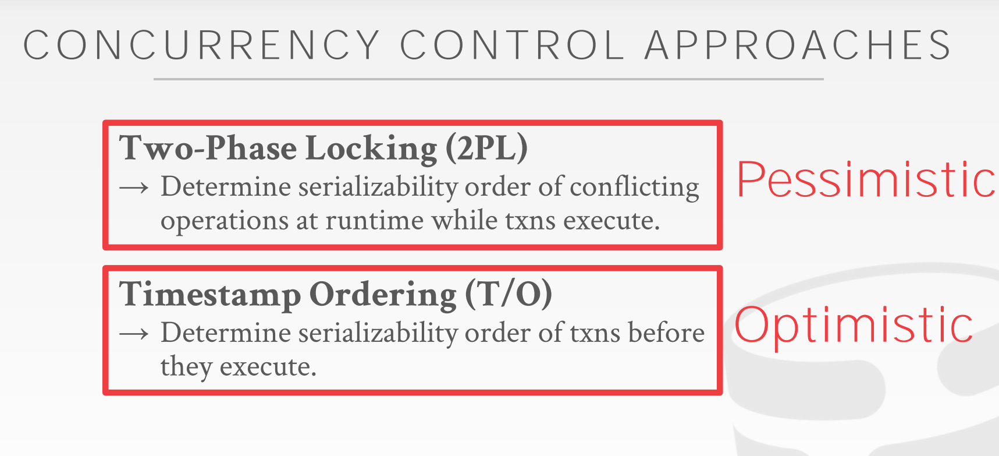
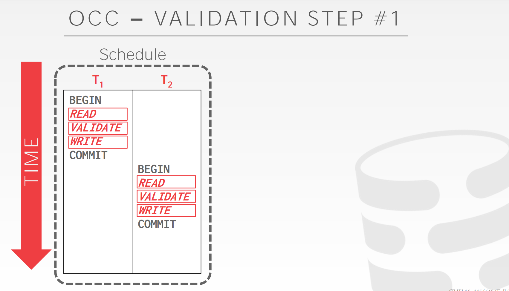
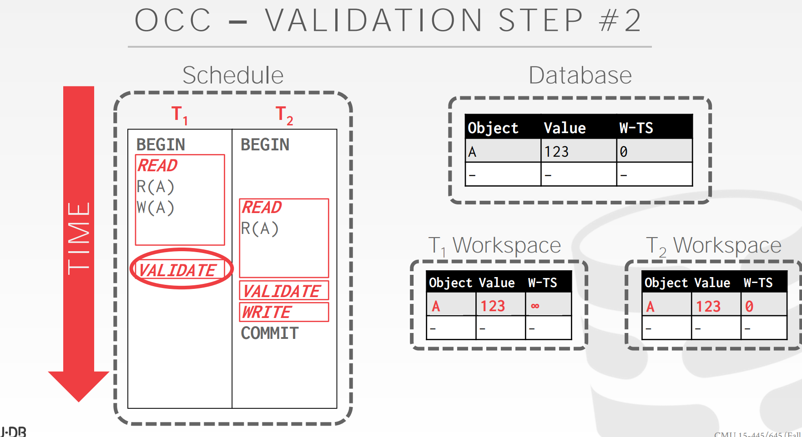
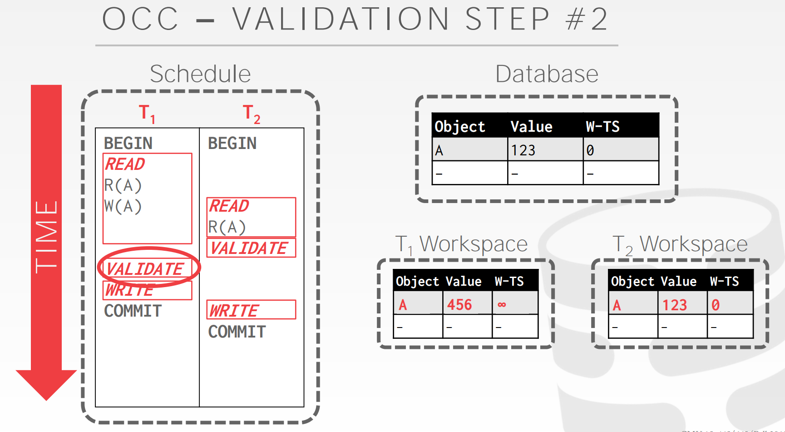
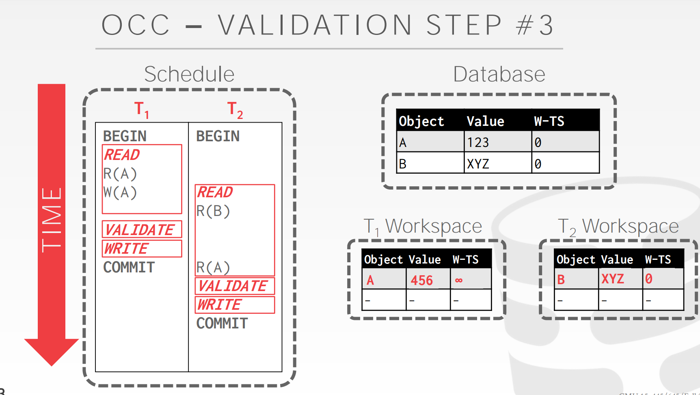
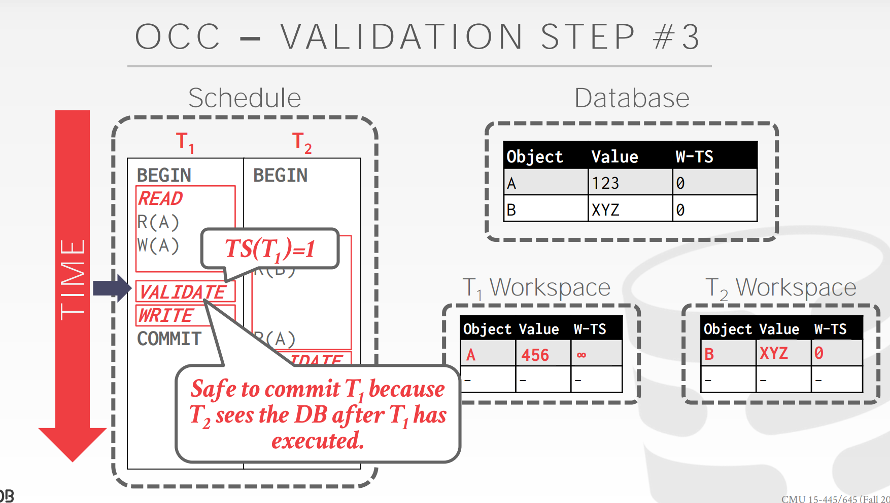
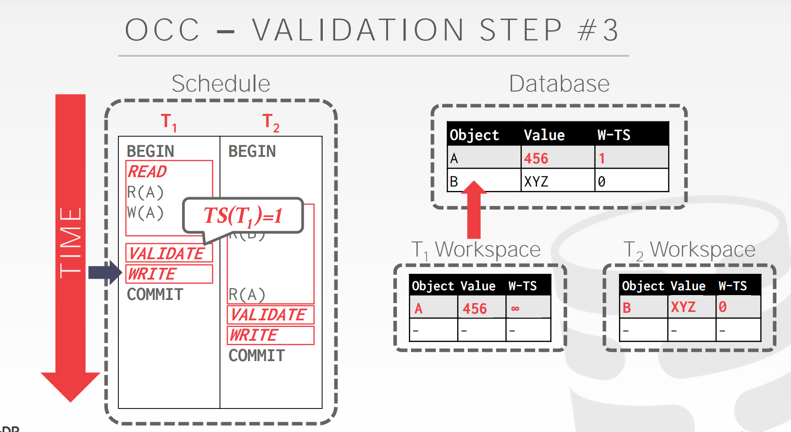
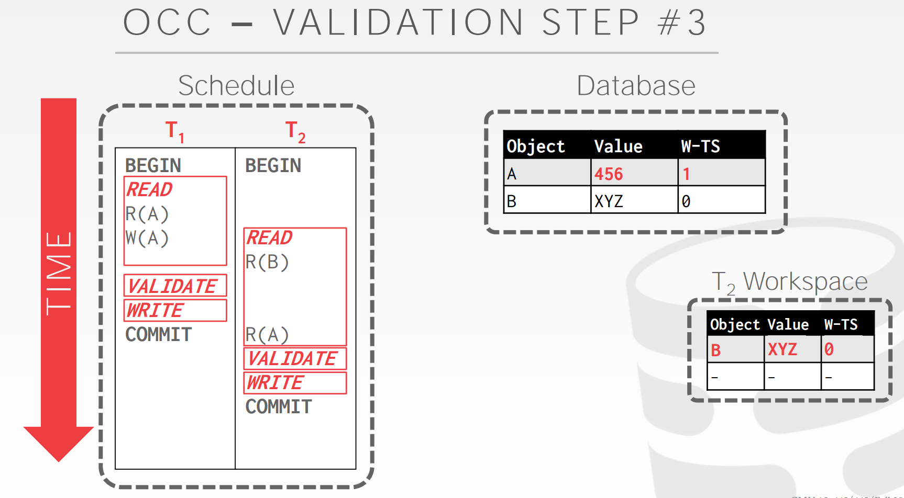
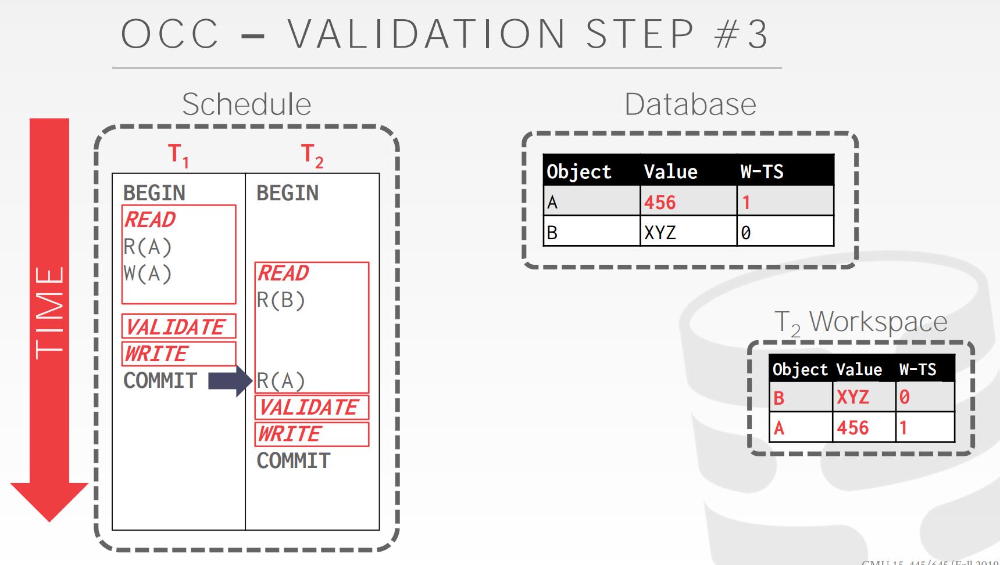
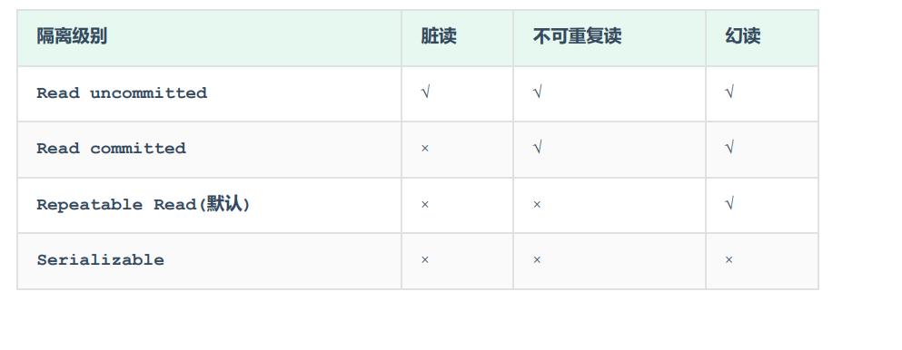

### Lecture 13 Timestamp Ordering Concurrency Control

基于时间戳 Timestamp顺序并发控制

 

两阶段锁是一种机制，数据库可以通过它在运行时生成Serializable schedule



上节课介绍的 2PL 是悲观的并发控制策略，本节课介绍的 Timestamp Ordering (T/O) 则是一个乐观的策略，其乐观表现在事务访问数据时无需显式加锁。

T/O 的核心思想就是利用时间戳来决定事务之间的等价执行顺序：如果 $TS(T_i)<TS(T_j)$，那么数据库必须保证实际的 schedule 与先执行$T_i$ **，后执行** $Tj$的结果等价。要实现 T/O，就需要一个单调递增的时钟，来决定任意事务 TiT_iTi 发生的时间。满足条件的时钟方案有很多，如：

- 系统单调时钟 (System Clock)
- 逻辑计数器 (Logical Counter)
- 混合方案 (Hybrid)

今天要讲的内容有：

+ Basic Timestamp Ordering Protocol
+ Optimistic Concurrency Control
+ Partition-based Timestamp Ordering
+ Isolation Levels

基于时间戳顺序的方案的基本思想是在不获取锁的情况下，你想让系统中的事务能够对数据库中的对象进行读写操作。

#### 1 Basic T/O

Basic T/O 是 T/O 方案的一种具体实现。在 Basic T/O 中，事务读写数据不需要加锁，每条数据 X 都会携带两个标记：

- W-TS(X)：最后一次写 X 发生的时间戳
- R-TS(X)：最后一次读 X 发生的时间戳

在每个事务结束时，Basic T/O 需要检查该事务中的每个操作，是否读取或写入了未来的数据，一旦发现则中止、重启事务。

##### 1.1 Basic T/O Reads

读取数据时的逻辑如下所示：

```go
func read(X) val {
    if TS(T_i) < W_TS(X) {
        abort_and_restart(T_i)
    } else {
        val := read_data(X)
        R_TS(X) = max(R_TS(X), TS(T_i))
        // make a local copy of X to ensure repeatable reads for T_i
        return val
    }
}
```

如果事务 $T_i$发生在 W-TS(X) 之前，即尝试读取未来的数据，则中止 $T_i$ ；如果事务 $T_i$ 发生在 W-TS(X) 之后，意味着它正在读取过去的数据，符合规范。 $T_i$ 读取数据后，如果有必要，则更新 R-TS(X)，同时保留一份 X 的副本，用来保证 $T_i$ 结束之前总是能读到相同的 X。

##### 1.2 Basic T/O Writes

写入数据时的逻辑如下所示：

```go
func write(X, val) {
    if TS(T_i) < R_TS(X) || TS(T_i) < W_TS(X) {
        abort_and_restart(T_i)        
    } else {
        X = val
        W_TS(X) = max(W_TS(X), TS(T_i))
        // make a local copy of X to ensure repeatable reads for T_i
    }
}
```

如果事务 $T_i$ 发生在 W-TS(X) 或 R-TS(X) 之前，即尝试写入已经被未来的事务读取或写入的数据，则中止 $T_i$ ；反之，意味着它正尝试修改过去的数据，符合规范。 $T_i$ 写入数据后，如果有必要，则更新 W-TS(X)，同时保留一份 X 的副本，用来保证 $T_i$ 结束之前总是能读到相同的 X。

##### 1.3 Example 1

如下图所示：有两个事务$T_1$和$T_2$，它们的时间戳分别为 1，2，即 $T_1$发生在 $T_2$ 之前，它们要访问的数据为 A 和 B，假设它们是数据库预填充的数据，R-TS 和 W-TS 都为 0。


$T_1$ 先读取 B，将 R-TS(B) 更新为 1


$T_2$读取 B，将 R-TS(B) 更新为 2


$T_2$ 修改 B，将 W-TS(B) 更新为 2


$T_1$读取 A，将 W-TS(A) 更新为 1


$T_2$读取 A，将 R-TS(A) 更新为 2


$T_2$ 修改 A，将 W-TS(A) 更新为 2


由于整个过程，没有发生违背规范的操作，因此两个事务都能够成功提交。

##### 1.4 Example 2

类似地，我们可以看下面这个例子：


不难看出， $T_1$在 $T_2$ 修改 A 后又修改了 A，该操作肯定会违反规范：


因此 $T_1$ 将被数据库中止。但实际上，仔细分析上述例子，如果我们忽略掉 $T_1$的 W(A) 操作，即不更新 A 数据，也不修改 W-TS(A)，那么 $T_1$ 和 $T_2$ 都可以正常提交，且结果和二者先后执行等价，这便是所谓的 Thomas Write Rule (TWR)：

```go
func write(X, val) {
    if TS(T_i) < R_TS(X) {
        abort_and_restart(T_i)
        return
    }
    
    if TS(T_i) < W_TS(X) {
        // ignore write
        return
    }
    
    X = val
    W_TS(X) = TS(T_i)
    // ...
}
```

example 2 符合 TWR，可以允许让两个事务顺利提交。TWR 优化了 Basic T/O 的写检查，使得一些本不必中止的事务顺利进行，提高了事务并发程度。

##### 1.5 Summary

如果不使用 TWR 优化，Basic T/O 能够生成 conflict serializable 的 schedule，如果使用了 TWR，则 Basic T/O 生成的 schedule 虽然与顺序执行的效果相同，但不满足 conflict serializable。Basic T/O 的优势在于：

+ 不会造成死锁，因为没有事务需要等待
+ 如果单个事务涉及的数据不多、不同事务涉及的数据基本不相同 (OLTP)，可以节省 2PL 中控制锁的额外成本，提高事务并发度

其缺点在于：

+ 长事务容易因为与短事务冲突而饿死
+ 复制数据，维护、更新时间戳存在额外成本
+ 可能产生不可恢复的 schedule (具体见下节)

如果一个 schedule 能够保证每个事务提交前，修改过其读取过数据的事务都已提交，那么这个 schedule 就是 recoverable。如果不能保证 recoverable，DBMS 就无法在发生崩溃之后恢复数据，举例如下：


$T_2$在$ T_1$ 修改 A 之后读取 A，符合规范。但是在$T_2$ 提交之后， $T_1$中止，前者依赖的数据实际上并未真实写入，数据库发生故障以后将无法恢复。因此 Basic T/O 可能产生不可恢复的 schedules。

#### 2 Optimistic Concurrency Control(OCC)

OCC 是 H.T. KUNG 在 CMU 任教时提出的并发控制算法。在 OCC 中，数据库为每个事务都创建一个私有空间：

- 所有被读取的数据都复制到私有空间中
- 所有修改都在私有空间中执行

OCC 分为 3 个阶段：

+ Read Phase：追踪、记录每个事务的读、写集合，并存储到私有空间中
+ Validation Phase：当事务提交时，检查冲突
+ Write Phase：如果校验成功，则合并数据；否则中止并重启事务

DBMS 需要维持所有活跃事务的全局视角，并将 Validation Phase 和 Write Phase 的逻辑放入一个 critical section 中。

##### 2.1 Example 

事务 $T_1$读取 A 时，将 A 复制到自己的 workspace 中，可以看到，与 Basic T/O 相比，OCC 只需要记录一个时间戳，W-TS。


事务 $T_2$ 读取 A 时，同样将 A 复制到自己的 workspace 中：


事务 $T_2$完成数据操作，在 Validation Phase 中获得事务时间戳 1，由于没有数据写入，跳过 Write Phase


事务 $T_1$ 修改 A 的值为 456，由于尚不知道自己的事务时间戳，将 W-TS(A) 设置为无穷大：


事务 $T_1$在 Validation Phase 获得事务时间戳 2，并通过校验，将 W-TS(A) 修改为 2，并合并到数据库中


##### 2.2 Read Phase

追踪事务的读写集合 (read/write sets)，将 read set 存放在 private workspace 中用来保证 repeatable read，将 write set 存放在 private workspace 中用来作冲突检测。

##### 2.3 Validation Phase

在进入 Validation Phase 后，每个事务都会被赋予一个时间戳，然后与其它正在运行的事务执行 Timestamp Ordering 检查，检查的方式有两种：

+ Backward Validation
+ Forward Validation

如下图所示，在 Backward Validation 中，需要检查待提交的事务 (txn #2) 的读写集合是否与已经提交的事务的读写集合存在交集：


与此类似，在 Forward Validation 中，需要检查待提交的事务 (txn #2) 的读写集合是否与尚未提交的事务的读写集合存在交集：


如果$TS(T_i) < TS(T_j)$，那么以下 3 个条件之一必须成立：

> Condition 1: $T_i$ completes all three phases before $T_j$ begins

如果事务 $T_i$在事务 $T_j$开始之前已经完成 OCC 的所有 3 个阶段，那么二者之间不存在任何冲突。



> Condition 2: $T_i$completes before $T_j$ starts its **Write Phase**, and $T_i$ does not write to any object read by $T_j$

如果$T_i$在$T_j$ 的 Write Phase 开始前就已提交，同时$T_i$ 没有修改任意 $T_j$ 读取的数据，即$WriteSet(T_i) \cap ReadSet(T_j) = \emptyset$，则二者之间不存在冲突。



因为$T_1$与$T_2$都是先在自己的私有空间操作，本来上述例子的结果应该是A被修改，但由于是先在私有空间再操作，那么上述在$T_2$读取前有修改操作也没用，因为$T_2$后提交，会又把修改的A还原，**因为$T_2$的时间戳会比$T_1$大**。



这样就没问题了。因为是在validate分配时间戳，此时$T_2$时间戳早于$T_1$

> Condition 3: $T_i$ completes its **Read Phase** before $T_j$ completes its Read Phase, and $T_i$ does not write to any object that is either read or written by $T_j$ 

如果$T_i$在 $T_j$ 结束自己的 Read Phase 前结束 Read Phase，同时$T_i$ 没有修改任何 $T_j$读取或修改的数据，即满足：$WriteSet(T_i) \cap ReadSet(T_j) = \emptyset \space,  \space WriteSet(T_i) \cap WriteSet(T_j) = \emptyset$时，二者之间不存在冲突。











OCC 与 Basic T/O 的思路类似，都是在检查事务之间的 WW、WR 冲突。当冲突发生的频率很低时，即：

- 大部分事务都是读事务
- 大部分事务之间访问的数据间没有交集

OCC 的表现很好，如在数据库体量较大，workload 比较均衡的场景下。2PC 的性能瓶颈在于锁管理，尽管 OCC 没有加锁的成本，但它也存在性能问题:

+ 在 private workspace 与 global database 之间移动、合并数据开销大
+ Validation/Write Phase 需要在一个全局的 critical section 中完成，可能造成瓶颈
+ 在 Validation Phase 中，待提交事务需要和其它事务做冲突检查，即便实际上并没有冲突，这里也有很多获取 latch 的成本 (锁住其它事务的 private workspace，对比是否有冲突，再释放锁)
+ 事务中止的成本比 2PL 高，因为 OCC 在事务执行快结束时才检查数据冲突

#### 3 Partition-Based T/O

类似全局锁到分段锁的优化，我们也可以将数据库切分成不相交 (disjoint) 的子集，即 horizontal partitions 或 shards，然后在 partition 内部使用单调递增的时间戳确定各个事务的顺序，不同 partition 上的事务之间无需检测冲突。

假设数据库中存储着如下三张表：


我们可以按照 customer 的 c_id 对数据库分片：


每个 partition 使用一个锁保护：

- 当事务需要访问多个 partitions 时，就在所需的多个 partitions 上排队
- 如果事务的时间戳是整个 partition 中最小的，那么该事务就获得锁
- 当事务获取其所需访问的所有 partitions 的全部锁，它就可以开始执行

##### 3.1 Reads

如果事务已经获取分片上的锁，该事务就能够读取它想读取的任意数据。如果事务尝试访问一个未获取锁的分片，那么它将被中止后重启。

##### 3.2 Writes

写事务直接在原地修改数据，并在内存中维护一个缓冲区，用来记录修改的数据以便事务中止后回滚。如果事务尝试修改一个未获取锁的分片，那么它将被中止后重启。

##### 3.3 Example

假设有两个事务同时开启，并分别被分配了全局的时间戳 100 和 101，二者都需要获取 partition 1 上的锁，如下图所示：


由于事务 #100 的时间戳较小，它将获得 partition 1 的锁，从而执行事务：


随后事务 #101 才能够获得 partitio 1 的锁，执行事务内容


Partition-based T/O 的性能取决于以下两点：

- DBMS 是否在事务开启前就能知道事务所需的所有 partitions
- 是否大多数事务只需要访问单个 partition

multi-partition 的事务将使得更多其它事务陷入等待状态，取了锁而未使用的 partition 也可能陷入空转。

#### 4 Isolation Level

到现在为止，我们都只考虑事务读取和更新数据，如果我们再考虑插入、删除操作，就会遇到新的问题。

##### 4.1 The Phantom Problem 幻读问题

考虑插入操作，则可能出现 Phantom Read：


**即在单个事务内部，同样的查询，读到不一样的数据。**这种现象发生的原因在于，尽管 $T_1$ 锁住了已经存在的记录，但新生成的记录并不会被锁住，因此实际上 **conflict serializability 能保证事务可序列化的前提是数据集合是固定的**，出现记录新增和删除时，这个结论就不成立了。

**Predicate Locking**

predicate locking 指的是通过一个逻辑表达式来为潜在的记录加锁，如：`status = 'lit'` 。然而，predicate locking 的成本很高，对每条新插入的数据都需要做校验。基本没有 DBMS 用这种方式实现，一种更高效的做法是 index locking。

**Index Locking**

同样以上文中的例子为例，如果在 `status` 字段上有索引，那么我们可以锁住满足 `status = 'lit'` 的 index page，如果尚未存在这样的 index page，我们也需要能够找到可能对应的 index page，锁住它们。

**Locking Without An Index**

同样以上文中的例子为例，如果在 `status` 字段上没有索引，那么事务就需要执行以下操作：

- 获取 table 的每个 page 上的锁，防止其它记录的 `status` 被修改成 `lit` 
- 获取 table 本身的锁，防止满足 `status = 'lit'` 的记录被插入或删除

**Repeating Scans**

另一种比较暴力的做法是在事务提交时，扫描 `status = 'lit'` 的所有数据，检查这些数据是否与事务操作之前的数据相同。目前没有任何商业数据库采用这种方案。

以上讨论的都是可序列化的并发控制方案。可序列化固然是一种很实用的特性，它可以将程序员从并发问题中解脱，但可序列化的方案要求比较严格，会对系统的并发度和性能造成较大的限制，因此我们也许能够用更弱的数据一致性保证去改善系统的扩展性。这也是所谓的数据库隔离级别。

更弱的数据库隔离级别将事务修改的数据暴露给其它事务，以此提高整体并发度，但这种并发度可能造成一系列问题，如 Dirty Reads/Writes (脏读、脏写)、Unrepeatable Reads (不可重复读)、Phantom Reads (幻读) 等等。

常见的数据库隔离级别从弱到强依次包括：Read Uncommitted -> Read Committed -> Repeatable Reads -> Serializable，总结如下表：


