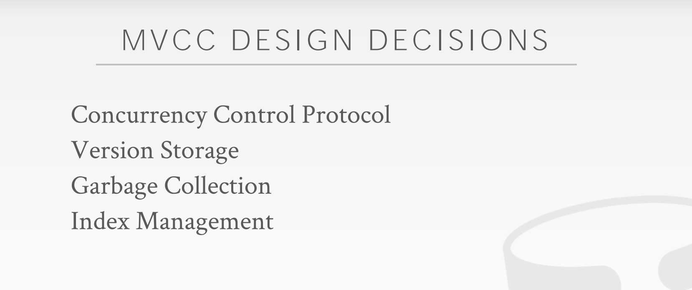

### Lecture 14 Multi-Version Concurrency Control

简而言之，实现 MVCC 的 DBMS 在内部维持着单个逻辑数据的多个物理版本，当事务修改某数据时，DBMS 将为其创建一个新的版本；当事务读取某数据时，它将读到该数据在事务开始时刻之前的最新版本。

MVCC 首次被提出是在 1978 年的一篇  MIT 的博士[论文](https://web.archive.org/web/20051025124412/http://www.lcs.mit.edu/publications/specpub.php?id=773)中。在 80 年代早期，DEC 的 Rdb/VMS 和 InterBase 首次真正实现了 MVCC，其作者是 Jim Starkey，NuoDB 的联合创始人。如今，Rdb/VMS 成了 Oracle Rdb，InterBase 成为开源项目 Firebird。

#### 1 MVCC

MVCC 的核心优势可以总结为以下两句话：

> Writers don't block readers. 写不阻塞读
>
> Readers don't block writers. 读不阻塞写

只读事务无需加锁就可以读取数据库某一时刻的快照，如果保留数据的所有历史版本，DBMS 甚至能够支持读取任意历史版本的数据，即 time-travel。

##### 1.1 Example 1

事务$T_1$和 $T_2$分别获得时间戳 1 和 2，二者的执行过程如下图所示。开始前，数据库存有数据 A 的原始版本 $A_0$， $T_1$先读取 A 数据：

然后 $T_2$修改 A 数据，这时 DBMS 中将增加 A 数据的新版本 $A_1$，同时标记 $A_1$的开始时间戳为 2， $A_0$ 的结束时间戳为 2：

$T_1$再次读取 A，因为它的时间戳为 1，根据记录的信息，DBMS 将 $A_0$返回给 $T_1$：

## 

##### 1.2 Example 2

例 2 与例 1 类似，$T_1$先修改数据 A：

此时 $T_2$读取 A，由于 $T_1$尚未提交， $T_2$ 只能读取 $A_0$：

$T_2$想修改 A，但由于有另一个活跃的事务 $T_1$正在修改 A ， $T_2$ 需要等待 $T_1$提交后才能继续推进：

$T_1$提交后， $T_2$创建了 A 的下一个版本 $A_2$ ：

MVCC 并不只是一个并发控制协议，并发控制协议只是它的一个组成部分。它深刻地影响了 DBMS 管理事务和数据的方式，使用 MVCC 的 DBMS 数不胜数。

#### 2 MVCC Design Decisions

##### 2.1 Concurrency Control Protocol

前面 2 节课已经介绍了各种并发控制协议，MVCC 可以选择其中任意一个（当出现了写写冲突的时候）：

**Approach #1：**Timestamp Ordering (T/O)：为每个事务赋予时间戳，并用以决定执行顺序 

**Approach #2：**Optimistic Concurrency Control (OCC)：为每个事务创建 private workspace，并将事务分为 read, write 和 validate 3 个阶段处理 

**Approach #3：**Two-Phase Locking (2PL)：按照 2PL 的约定获取和释放锁

##### 2.2 Version Storage

如何存储一条数据的多个版本？DBMS 通常会在每条数据上拉一条版本链表 (version chain)，所有相关的索引都会指到这个链表的 head，DBMS 可以利用它找到一个事务应该访问到的版本。不同的版本存储方案在 version chain 上存储的数据不同，主要有 3 种存储方案：

**Approach #1：**Append-Only Storage：新版本通过追加的方式存储在同一张表中 

**Approach #2：**Time-Travel Storage：老版本被复制到单独的一张表中

 **Approach #3：**Delta Storage：老版本数据的被修改的字段值被复制到一张单独的增量表 (delta record space) 中

###### 2.2.1 Append-Only Storage

如下图所示，同一个逻辑数据的所有物理版本都被存储在同一张表上，每次更新时，就往表上追加一个新的版本记录，并在旧版本的数据上增加一个指针指向新版本：

再次更新的行为类似：

也许你已经注意到，指针的方向也可以从新到旧，二者的权衡如下：

**Approach #1**：Oldest-to-Newest (O2N)：写的时候追加即可，读的时候需要遍历链表

 **Approach #2**：Newest-to-Oldest (N2O)：写的时候需要更新所有索引指针，读的时候不需要遍历链表

###### 2.2.2 Time-Travel Storage

单独拿一张表 (Time-Travel Table) 来存历史数据，每当更新数据时，就把当前版本复制到 TTT 中，并更新指针：

###### 2.2.3 Delta Storage

每次更新，仅将变化的字段信息存储到 delta storage segment 中：

DBMS 可以通过 delta 数据逆向恢复数据到之前的版本。

##### 2.3 Garbage Collection

随着时间的推移，DBMS 中数据的旧版本可能不再会被用到，如：

- 已经没有活跃的事务需要看到该版本
- 该版本是被一个已经中止的事务创建

这时候 DBMS 需要删除这些可以回收的物理版本，这个过程也被称为 GC。在 GC 的过程中，还有两个附加设计决定：

+ 如何查找过期的数据版本
+ 如何确定某版本数据是否可以被安全回收

GC 可以从两个角度出发：

Approach #1：Tuple-level：直接检查每条数据的旧版本数据

 Approach #2：Transaction-level：每个事务负责跟踪数据的旧版本，DBMS 不需要亲自检查单条数据

###### 2.3.1 Tuple-Level GC

*Background Vacuuming*

如下图所示，假设有 2 个活跃事务，它们的时间戳分别为 12 和 25：

这时有个 Vacuum 守护线程会周期性地检查每条数据的不同版本，如果它的结束时间小于当前活跃事务的最小时间戳，则将其删除：

为了加快 GC 的速度，DBMS 可以再维护一个脏页位图 (dirty page bitmap)，利用它，Vacuum 线程可以只检查发生过改动的数据，用空间换时间。Background Vacuuming 被用于任意 Version Storage 的方案。

*Cooperative Cleaning*

还有一种做法是当 **worker thread 查询数据时，顺便将不再使用物理数据版本删除**：

cooperative cleaning 只能用于使用 O2N 的 version chain 方案。

###### 2.3.2 Transaction-Level GC

让每个事务都保存着它的读写数据集合 (read/write set)，当 DBMS 决定什么时候这个事务创建的各版本数据可以被回收时，就按照集合内部的数据处理即可。

#### 2.4 Index Management

##### 2.4.1 Primary Key Index

主键索引直接指向 version chain 的头部。

###### 2.4.2 Secondary Indexes

二级索引有两种方式指向数据本身：

Approach #1：逻辑指针，即存储主键值或 Tuple Id Approach #2：物理指针，即存储指向 version chain 头部的指针

Physical Pointer

Logical Pointer by Primary Key

Logical Pointer by Tuple Id

