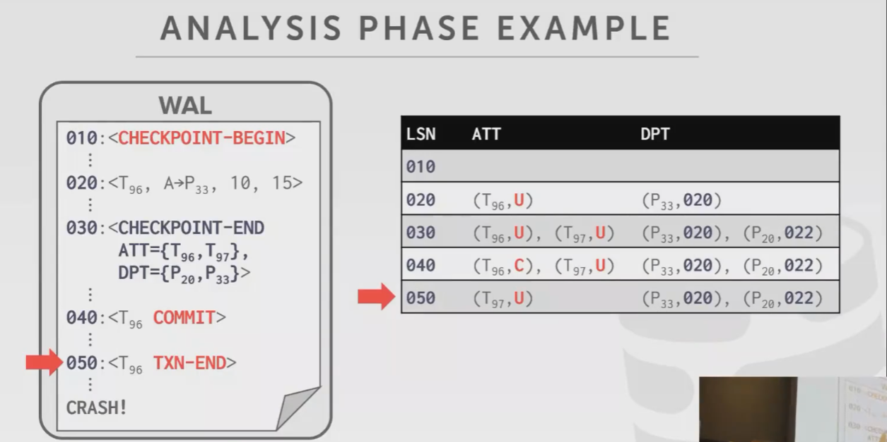
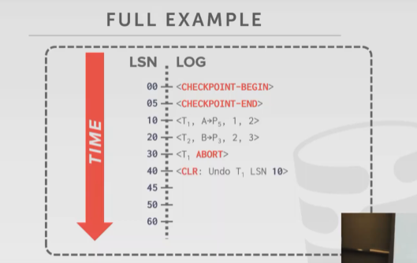
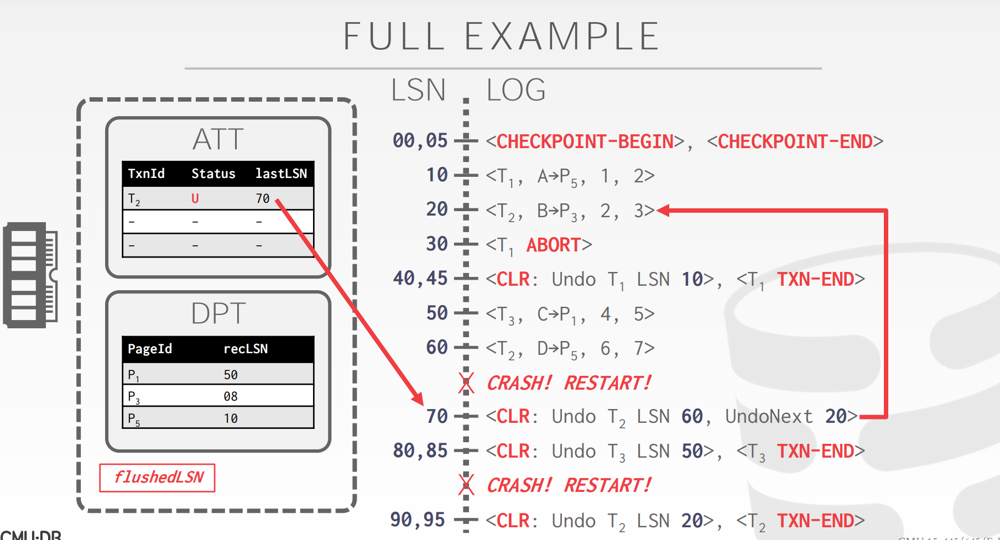

### Lecture 16 Crash Recovery Algorithms

上节课介绍到，故障恢复算法由两个部分构成：

- 在事务执行过程中采取的行动来确保出现故障时能够恢复 (上节课)
- 在故障发生后的恢复机制，确保原子性、一致性和持久性 (本节课)

#### 1 ARIES

本节课介绍的是 Algorithms for Recovery and Isolation Exploiting Semantics (ARIES)，由 IBM Research 在 90 年代初为 DB2 DBMS 研发的基于 WAL 的故障恢复机制，尽管并非所有 DBMS 都严格按照 ARIES paper 实现故障恢复机制，但它们的思路基本一致。

ARIES 的核心思想可以总结为 3 点：

+ Write-Ahead Logging (WAL)

  - 在数据落盘之前，所有写操作都必须记录在日志中并落盘

  - 必须使用 Steal + No-Force 缓存管理策略 (buffer pool policies)

+ Repeating History During Redo
  - 当 DBMS 重启时，按照日志记录的内容重做数据，恢复到故障发生前的状态

+ Logging Changes During Undo
  - 在 undo 过程中记录 undo 操作到日志中，确保在恢复期间再次出现故障时不会执行多次相同的 undo 操作

#### 2 Log Sequence Numbers

WAL 中的每条日志记录都需要包含一个全局唯一的 log sequence number (LSN)，一般 LSN 单调递增。DBMS 中的不同部分都需要记录相关的 LSN 信息，举例如下：

| name         | where            | Definition                                    |
| ------------ | ---------------- | --------------------------------------------- |
| flushedLSN   | memory           | 最后落盘的那个 LSN                            |
| pageLSN      | buffer pool page | 与某 page data 相关的最新 LSN                 |
| recLSN       | buffer pool page | 在上次落盘之后，与某 page data 相关的最老 LSN |
| lastLSN      | transaction      | 某事务最后一条日志的 LSN                      |
| MasterRecord | disk             | 最近一次 checkpoint 的 LSN                    |

在 buffer pool manager 中，每个 data page 都维护着 pageLSN，而 DBMS 本身需要追踪 flushedLSN，那么在 page x 落盘前，DBMS 必须保证以下条件成立：

$pageLSN \le flushedLSN$

当一个事务修改某 page 中的数据时，也需要更新该 page 的 pageLSN，在将操作日志写进 WAL 后，DBMS 会更新 flushedLSN 为最新写入的 LSN。

#### 3 Normal Execution

每个事务都会包含一些列的读和写操作，然后提交 (commit) 或中止 (abort)，本节我们来看下不存在故障时，事务的正常执行过程。在讨论之前，我们需要约定 4 个假设，简化问题：

+ 所有日志记录都能放进一个 page 中
+ 写一个 page 到磁盘能保持原子性
+ 没有 MVCC，使用严格的 2PL
+ 使用 WAL 记录操作日志，buffer pool policy 为 Steal + No-Force

##### 3.1 Transaction Commit

当事务提交时，DBMS 先写入一条 COMMIT 记录到 WAL  ，然后将 COMMIT 及之前的日志落盘，当落盘完成后，flushedLSN 被修改为 COMMIT 记录的 LSN，同时 DBMS  将内存中 COMMIT 及其之前的日志清除。后再写入一条 TXN-END 记录到 WAL 中，**作为内部记录，对于执行提交的事务来说，COMMIT 与 TXN-END 之间没有别的操作。**

##### 3.2 Transaction Abort

要处理事务回滚，就必须从 WAL 中找出所有与该事务相关的日志及其执行顺序。由于在 DBMS 中执行的所有事务的操作记录都会写到 WAL 中，因此为了提高效率，同一个事务的每条日志中需要记录上一条记录的 LSN，即 prevLSN，一个特殊情况是：第一条 BEGIN 记录的 prevLSN 为空。

实际上中止事务是 ARIES undo 操作的一种特殊情况：回滚单个事务。过程如下图所示：

可以看到，T4 的每条日志都记录着 prevLSN，当 T4 要中止时，DBMS 先向 WAL 中写入一条 ABORT 记录，然后寻着 LSN 与 prevLSN 连接串成的链表，找到之前的操作，倒序回滚，为了防止在回滚过程中再次故障导致部分操作被执行多次，回滚操作也需要写入日志中，等待所有操作回滚完毕后，DBMS 再往 WAL 中写入 TXN-END 记录，意味着所有与这个事务有关的日志都已经写完，不会再出现相关信息。那么，如何记录回滚操作呢？这就是我们马上要介绍的 CLR：

**Compensation Log Records**

CLR 记录的是 undo 操作，它除了记录原操作相关的记录，还记录了 undoNext 指针，指向下一个将要被 undo 的 LSN，CLR 本身也是操作记录，因此它也需要像其它操作一样写进 WAL 中，举例如下：

值得注意的是：CLR 永远不需要被 undone。

#### 4 Non-fuzzy & Fuzzy Checkpoints

##### 4.1 Non-fuzzy Checkpoints

使用 Non-fuzzy 的方式做 checkpoints 时，DBMS 会暂停所有工作，保证落盘的是一个 consistent snapshot，整个过程包括：（保证的是一致性，在制作checkpoints时没有更新修改的事务）

- 停止任何新的事务
- 等待所有活跃事务执行完毕
- 将所有脏页落盘

显然这种方案很糟糕。

##### 4.2 Slightly Better Checkpoints

Non-fuzzy 需要停止所有事务，并且等待所有活跃事务执行完毕，我们是否有可能改善这一点？一种做法是：checkpoint 开始后，暂停写事务，阻止写事务获取数据或索引的写锁 (write latch)，如下图所示：

checkpoint 开始时，txn 已经获取了 page#3 的写锁，后者可以继续往 page#3 中写数据，但不能再获取其它 page  的写锁，此时 DBMS 只管扫描一遍 buffer pool 中的 pages，将所有脏页落盘。这时，部分 txn 写入的数据可能会被 checkpoint 进程一起捎带落盘，这时磁盘中的数据 snapshot 处于 inconsistent  的状态。

即便如此，只要我们在 checkpoint 的时候记录哪些活跃事务正在进行，哪些数据页是脏的，故障恢复时读取 WAL 就能知道存在哪些活跃事务的数据可能被部分写出，从而恢复 inconsistent 的数据。因此整个 checkpoint 过程需要两类信息：

- 活跃事务表：Active Transaction Table (ATT)
- 脏页表：Dirty Page Table (DPT)

活跃事务表中记录着活跃事务的事务 id、事务状态 (Running/Committing/Candidate for Undo) 以及 lastLSN (最新的日志记录 LSN)，当事务提交或中止后，相应的记录才会被删除；

脏页表记录着 buffer pool 中所有包含未提交事务写入数据的页信息，其中还记录着每个脏页的 recLSN（The LSN of the log record that first caused the  page to be dirty）。一个完整的 WAL 举例如下：

在第一个 checkpoint 处：活跃事务有 T2，脏页有 P11 和 P22；在第二个 checkpoint  处，活跃事务有 T3，脏页有 P11 和 P33。

这种方案尽管比 Non-fuzzy 好一些，不需要等待所有活跃事务执行完毕，但仍然需要在 checkpoint 期间暂停执行所有写事务。

##### 4.3 Fuzzy Checkpoints

fuzzy checkpoint 允许任何活跃事务在它落盘的过程中执行。既然允许活跃事务执行，checkpoint 在 WAL 中的记录就不是孤零零的一条，而是一个区间，因此我们需要两类记录来标记这个区间：

- CHECKPOINT-BEGIN：checkpoint 的起点
- CHECKPOINT-END：checkpoint 的终点，同时包含 ATT 和 DPT 记录

当 checkpoint 成功完成时，CHECKPOINT-BEGIN 记录的 LSN 才被写入到数据库的 MasterRecord 中，任何在 checkpoint 之后才启动的事务不会被记录在 CHECKPOINT-END 的 ATT 中，举例如下：

显然实践中使用的是 fuzzy checkpoint，这也是接下来要介绍的 ARIES 的故障恢复算法的基础。

#### 5 ARIES-Recovery Phases

ARIES 故障恢复一共分三步：

- 分析 (analysis)：从 WAL 中读取最近一次 checkpoint，找到 buffer pool 中相应的脏页以及故障时的活跃事务
- 重做 (redo)：从正确的日志点开始重做所有操作，包括将要中止的事务
- 撤销 (undo)：将故障前未提交的事务的操作撤销

整体流程如下图所示：

通过 MasterRecord 找到最后一个 BEGIN-CHECKPOINT 记录，然后分别进行 3 个阶段：

1. 分析：找到最后一个 checkpoint 之后哪些事务提交或中止了
2. 

##### 5.1 Analysis Phase

从最近的 BEGIN-CHECKPOINT 开始往近处扫描日志：

+ 如果发现 TXN-END 记录，则从 ATT 中移除该事务
+ 遇到其它日志记录时
  - 将事务放入 ATT 中，将 status 设置为 UNDO
  - 如果事务提交，将其状态修改为 COMMIT（因为崩溃时可能还没来得及写TXN-END）
  - 如果是数据更新记录，按需更新 DPT 以及 recLSN

当 Analysis Phase 结束时：

- ATT 告诉 DBMS 在发生故障时，哪些事务是活跃的
- DPT 告诉 DBMS 在发生故障时，哪些脏数据页可能尚未写入磁盘

##### 5.2 Redo Phase

Redo Phase 的目的在于回放历史，重建崩溃那一瞬间的数据库状态，即重做所有更新操作 (包括后来发生中止事务的操作)，同时重做 CLRs。尽管 DBMS 可以通过一些手段避免不必要的读写，但本节课不讨论这些优化技术。

从 DPT 中找到最小的 recLSN，从那里开始重做更新记录和 CLR，除非遇到以下两种情况：

+ 受影响的 page 不在 DPT 中
+ 受影响的 page 在 DPT 中，但那条记录的 LSN 小于那个 page 的 recLSN

以上两点表示page做的修改已经落盘了。

重做时，需要：

+ 重新执行日志中的操作
+ 将 pageLSN 修改成日志记录的 LSN
+ 不再新增操作日志，也不强制刷盘

在 Redo Phase 结束时，会为所有状态为 COMMIT 的事务写入 TXN-END 日志，同时将它们从 ATT 中移除。

##### 5.3 Undo Phase

将所有 Analysis Phase 判定为 U (candidate for undo) 状态的事务的所有操作按执行顺序倒序撤销，并且为每个 undo 操作写一条 CLR。

##### 5.4 Example

我们有一个事务$T_1$对Page5进行了一个修改。事务$T_2$对Page3进行了修改。此时T1 ABORT（中止）

正常的执行过程中，T1中止了（注意不是崩溃！数据库害能正常运行），咋办？创建一个CLR，我们想从LSN 10开始撤销$T_1$的修改（undo）。

做了CLR，就可以给$T_1$添加一条TXN-END消息，以此表示这个事务已经完全结束了。

$T_3$和$T_2$做了很多修改，然后我们的服务器崩溃了。所以在分析阶段，我们需要回看并将对应的信息填充到ATT和DPT

我们如果现在需要进行undo操作，那我们就要添加一些新的log条目去反转这些修改

对事务$T_3$添加了一个clr，这是我们对这个事务所要做的最后一件事，所以再创建一个TXN-END表示结束。此时可以将所有脏页刷出到磁盘，所有修改信息都已经写入到我们的预写日志并已刷出到磁盘。

如果又崩溃了，我要恢复。

只有一个$T_2$，需要去撤销它的修改

此时需要从LSN 70开始undo，但现在没有东西给你undo，因为服务器崩溃了，内存没东西，需要先redo之后才有东西undo。

