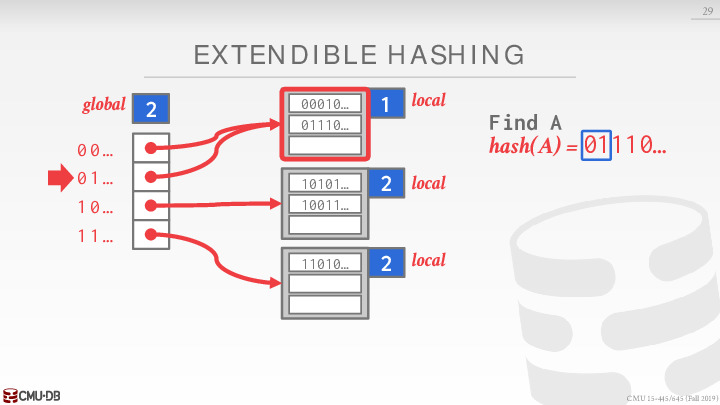
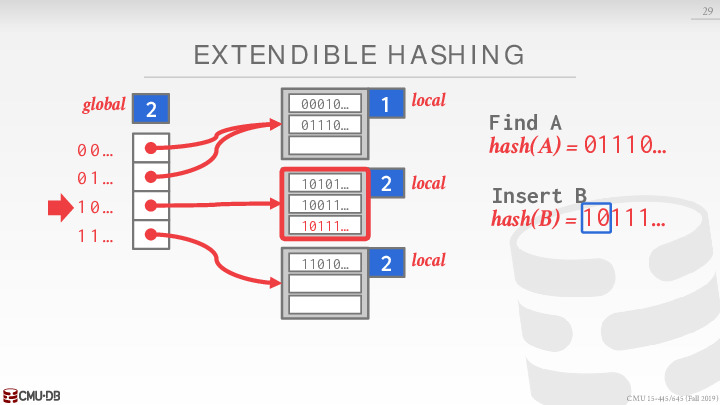
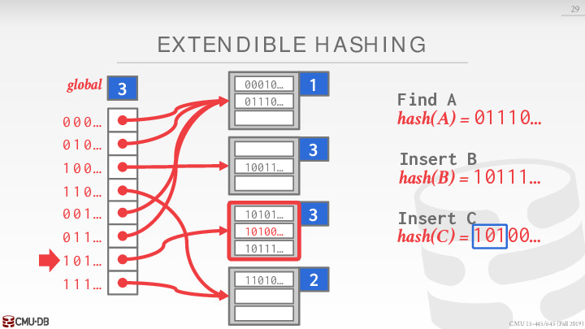
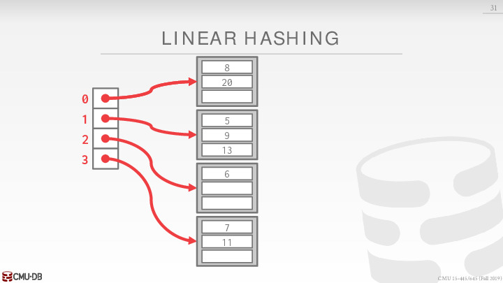
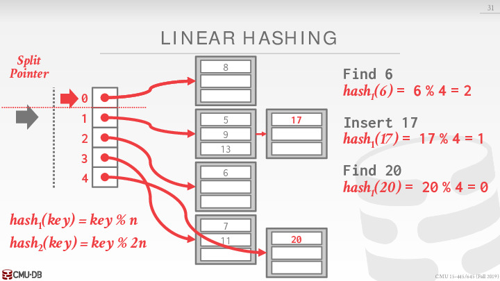

### Lecture 3 Hash Tables

本节开始之前，先看一下目前课程的进度状态：

为了支持 DBMS 更高效地从 pages 中读取数据，DBMS 的设计者需要灵活运用一些数据结构及算法，其中对于 DBMS 最重要的两个是：

- Hash Tables
- Trees

#### 1 Data Structure in DBMS

- Internal Metadata: 用于管理数据库内部元数据的数据结构，如 page table, page directory。
- Core Data Storage: 存储 tuple / 表格的数据结构，如：Memacache 数据库用 hash table,　MySQL 使用 B + 树
- Temporary Data Structures: 对 SQL Query 暂时的数据结构，如一个使用 hash join 的 SQL Query 需要新建一个 hash table, 然后对它查询，这个 hash table 是暂时的，即 Query 结束就清除释放
- Table Indexes: 辅助型索引数据结构，使得查询更快，不需遍历所有 tuple

在做相关的设计决定时，通常需要考虑两个因素：

- Data Organization：如何将这些数据结构合理地放入 memory/pages 中，以及为了支持更高效的访问，应当存储哪些信息
- Concurrency：如何支持数据的并发访问

#### 2  Hash Table Overview

- 空间复杂度是 O(n), hash table 并不是一个能节省存储空间的数据结构。
- 查询时间复杂度：
  - average case：O(1)。从算法理论上，它的复杂度是一个常数。但在工业中，一个常数也有**大小**之分。比如**小的常数时间复杂度**代表 CPU 指令数较少，而**大的常数时间复杂度**代表 CPU 指令数较多，即使它们对应的 CPU 指令数都是常数，但是运行时间还是有区别。
  - worst case：O(n)。比如 hash function 效果很不平均，将所有指 hash 到了一个位置，反而形成了一个 list。这种不平均的 hash function 比如是：$f(x)=1$。即常数函数。

Hash Table 主要分为两部分：

- Hash Function：
  - How to map a large key space into a smaller domain
  - Trade-off between being fast vs. collision rate
- Hashing Scheme：
  - How to handle key collisions after hashing
  - Trade-off between allocating a large hash table vs. additional instructions to find/insert keys

> - hash function: 即我们之前提到的f函数，f(key)→int∈D，D是一个 int 的集合。我们希望这个 hash function 很快，并且冲突概率很低：
>   - 我们前面提到的 f(x)=1 常数函数很快，但是它把任何一个 key 都匹配到 1 这个位置，即它的冲突概率是 100%, 这个非常不好，使我们的 hash table 变成了 list, 查询的时间复杂度变成了 O(n) 的 average case
> - hash scheme:　即如何去处理一定会发生的冲突。

#### 3 Hash Function

由于 DBMS 内使用的 Hash Function  并不会暴露在外，因此没必要使用加密（cryptographic）哈希函数，我们希望它速度越快，collision rate 越低越好。目前各 DBMS 主要在用的 Hash Functions 包括：

#### 4 Static Hashing Schemes

Static Hashing Schemes 正如 staic 所说，这种 scheme 下的 hash table 的容量是固定的。如果我们需要在 hash 的同时，发现容量不够，只能 resize 到更大的容量，这时我们需要将所有的 key 再重新 hash 进扩大容量的 hash table。这种 resize 在 static hashing scheme 意味者 rehashing，这个操作对性能来说是灾难级别的。很显然如果我们能一开始就知道**合适的容量** ,　就能直接避免这部分的浪费时间。

##### 4.1 Linear Probe Hashing

Linear Probe Hashing 是 open address hashing 的一种。

Linear Probing 方式虽然简单，但并不是解决冲突的最好的策略，因为它会导致**同类哈希的聚集 (Primary Clustering)**。这导致搜索哈希表时，冲突依然存在。如果我们要访问 Edward 的信息，因为 Edward 的社保号 111-00-1235 哈希为 1235，然而我们在 1235 位置找到的是 Bob，所以再搜索 1236，找到的却是 Danny，以此类推直到找到 Edward。

###### 4.1.2 Insert

hash table 存储不仅仅是 `value`，而是 `(key, value)` 这一对。这是因为 Linear Probe Hashing 会遇到冲突，在查询时需要比较 key 来确定是否找到 (key 相等) 或者只是一次冲突 (key 不相等)。

下图中 C 和 A 的 hash 位置相同 (冲突), 我们将 C 写在 A 的后面，并 A 连接 C：

下图中 D 和 C 的 hash 位置相同 (冲突), 我们将 D 写在 C 的后面，并 C 连接 D：

下图中 E 和 A/C 的 hash 位置相同 (冲突), 我们将 E 写在 C 的后面，**但是 C 后面被 D 占有了**，所以将 E 写在 D 后面，并 D 连接 E：

下图中 F 和 E 的 hash 位置相同 (冲突), 我们将 F 写在 E 的后面，并 E 连接 F：

###### 4.1.2 Delete

**Delete C**

下图中我们想删除 C, 我们已经见到 C 和 A 冲突。我们看第一个位置是 key 是 A, 而 A != C, 然后往下看：

下图中，我们发现在第二个位置，hash table 条目中的 key 是 C，而我们就想删去 C, C==C。这个条目被删除：

**Find D after delete C**

下图中，我们想寻找 D。由于之前 D 和 C 的 hash 位置相同 (冲突)，而 C 已经被删除，D 失去了和 C 的联系。导致我们不能找到 D：

解决方法1：Tombstone

解决上述问题的第一种方法是使用一个墓碑:　在上面的例子中，我们删除了 C，但是留下了一个 C 的墓碑，墓碑依然保留着到 D 的链接。通过这个墓碑的链接我们可以找到 D:

**这种作法的缺点是：保存墓碑会占有空间。**

解决方法2：Movement

解决上述问题的第二种方法是移动：即删除一个条目之后，对 hash table 中和已被删除条目有联系的条目进行移动，移动至正确的地方。

下面的例子中，只能移动和已被删除**有联系的条目**

下图中检查 B 是否和被删除的条目 C 存在联系，发现 B 就在它自己应该在的地方，而和其他条目无任何联系，因次不移动 B。**无视那个从上到下的箭头**：

缺点就是删除会变得十分麻烦

**一般使用解决方法一**

###### 4.1.3 Non-Unique Keys

有两种处理**重复 key** 的方式:

- value list 存储重复 key 所拥有的 value
- 存储 key 和 value，这样即使 key 重复，value 值也不一样。**这种方式更加常见。**

> 在hash表中，如果我们想在哈希表中记录相同的key不同的value，可以有2种选择。一种选择是给每个key的slot指向一个专门的list，另一种方法是存储冗余的元素。实战中一般第二种方法用的多一些。

##### 4.2 Robin Hood Hashing

Robin Hood Hashing 和 Linear Probe Hashing 相比，更可以去平衡冲突，让冲突的 key 离它应该拥有的位置 (optimal position) 近一些。

下图中，C 与 A 冲突于红色箭头所指的位置。

- 这时 A 离它的 optimal postion 距离为 0, C 离它的 optimal postion 距离为 0。两值相等，C 不能获得 A 的位置。
- C 获得 A 后面空的位置，C 离它的 optimal postion 距离为 1

下图中，D 与 C 冲突于红色箭头所指的位置。

- 这时 C 离它的 optimal postion 距离为 1, D 离它的 optimal postion 距离为 0。D 的距离值小于 C 的距离值，D 不能获得 C 的位置。
- D 获得 C 后面空的位置，D 离它的 optimal postion 距离为 1

**下两张图中** , E 与 A 冲突于红色箭头所指的位置。

- 这时 A 离它的 optimal postion 距离为 0, E 离它的 optimal postion 距离为 0。两值相等，E 不能获得 A 的位置。
- E 获得 A 后面空的位置，然后 E 与 C 冲突。
- 这时 C 离它的 optimal postion 距离为 1, E 离它的 optimal postion 距离为 1。两值相等，E 不能获得 C 的位置。
- E 获得 C 后面空的位置，然后 E 与 D 冲突。这时 D 离它的 optimal postion 距离为 1, E 离它的 optimal postion 距离为 2。**E 的距离值大于 D 的距离值，E 获得 D 的位置。**
- D 只能向后移动，同时也更新自己离自己 optimal position 的距离

下图中，F 与 D 冲突于红色箭头所指的位置。

- 这时 D 离它的 optimal postion 距离为 2, F 离它的 optimal postion 距离为 1。F 的距离值小于 D 的距离值，F 不能获得 D 的位置。
- F 获得 D 后面空的位置，F 离它的 optimal postion 距离为 1

Robin Hood Hashing 平均了一下各个 key 离自己 optimal position 的距离。但是它在 insert 的时候，有可能会调整其他条目的位置，在我们的例子中，在 insert E 的时候调整了 D 的位置。说明它会需要更多 write operation 的次数，另外在 insert 的时候它也有更多条件需要检查，这会造成更多的 branch miss prediction。

**实际实现上 Linear Probe Hashing 更为常见。**

##### 4.3 Cuckoo Hashing

Cuckoo Hashing 使用多个 hash table, 每个 hash table 拥有自己的 hash function (hash function seed)。我们下面的例子是用两个表，当然也可以用三个来实现 Cuckoo Hashing。

**insert**

- 总向有空位置 (optimal position) 的 hash table 插入。如果多个 hash table 都有空位置可以插入，随意选择其中的一个即可。
- 如果所有的 hash table 都没有空位置可以插入。随机选择一个 hash table 中对应的位置插入，　并取出原来在这位置上的 key, 将它 insert 到其他的 hash table。

优点是查询快，路径短，最多两次就能查询到。

**缺点是插入性能差，在容量小的情况下很容易冲突。连锁的冲突会陷入死循环，解决只能增加容量并且 rehash。**

下图中，A 对应的位置都是空的，A 可以被插入至任何一个 hash table，例子中选择了 #1:

下图中，B 对应的位置只有在 #2 是空的，那么插入至 #2

下面几张图中

- C 对应的位置**都不是空的**，C 可以选择任何一个 hash table，代替占有位置的 key，例子中选择了 #2, 即代替了 B
- B 被 rehash 到 #1，在 #1 中 B 对应的位置也不是空的，B 代替占有位置的 key A
- A 被 rehash 到 #2, 在 #2 中对应的位置是空的

在 Cuckoo Hashing 中**有可能不终止**，即进入一个死循环，永远找不到能插入的地方。这时候说明 hash table 容量太小，需要 `resize` 到更大的容量。

#### 5 Dynamic Hashing Schemes

与 Static Hash Tables 需要预判最终数据量大小的情况不同，Dynamic Hash Tables 可以按需扩容缩容，本节主要介绍 Chained Hashing，Extendible Hashing 和 Linear Hashing。

> Dynamic Hashing Schemes 的特征就是在能持续容量增长，而不需要额外 rehash。即 resize 的操作花销不大。

##### 5.1 Chained Hashing

Chained Hashing 又称 Hashing with Chaining。特征是每一个 hash table 中的条目都是一个 linked list of bucket。如果 bucket 满了，那就再指向一个新的 bucket。

**这里的 bucket 可以具象成一个 page。**

优点是实现简单，不需要 resize。

缺点是每一个 linked list 如果很长，就变成 O(n)。

##### 5.2 Extendible Hashing

- global `n bit`: 指 key 中前 n 个 bit 是对左侧 directory 有效。
- local `m bit`: 指 global 中 `n bit` 中的前 `m` 个 bit **在这一个 bucket** 有效。
- n≥m 恒成立
- 如果 local bucket 满了 (overflow)，那就增加一个 local bit 去容纳更多。如果 n=m，那就先增加一个 global bit，再增加 local bit。使 n≥m 条件依然成立

###### 5.2.1 Find A

###### 5.2.2 Insert B - No Overflow

###### 5.2.3 Insert C - Overflow

 C 对应的 local bucket 已经满了，另外 local bit = global bit = 2

我们正如前面介绍的，先增加 global bit 到 3, 再将 local bit 增加到 3, 最后 insert C。

##### 5.3 Linear Hashing

Linear Hashing 的目的是不在 `resize` 的时候用一个 global latch，来提高性能。我们可以从下面例子中看出，在 Linear Hashing 中只需要去 latch 一个位置，即 `split pointer` 所指的地方。

作法是按照*顺序*去分裂 bucket，而不是分裂特定满的 bucket。顺序实际上只是 bucket id 顺序，有一个 `split pointer` 去跟踪下一个需要分裂的 bucket。而且 Linear Hashing 使用多个 hash function。

###### 5.3.1 Find 6

###### 5.3.2 Insert 17 - Overflow

- Overflow 的 bucket 后面会生成一个新的 bucket。

- `split pointer` 所指的 bucket 会进行分裂，分裂成两个 bucket，原内容重新用新的 hash function，再分配原内容到新旧两个 bucket。下面例子中:
  - hash2(8)=8%8=0→bucket0
  - hash2(20)=20%8=4→bucket4
- 分裂完以后，`split pointer` 指向下一个 bucket (bucket id)。

###### 5.3.3 Find 20

- 先应用 hash1
- hash1 的结果是 0, 0 这个位置**高于**`split pointer`, 说明 0 这个位置已经分裂过了。需要再应用hash2

###### 5.3.4 Find 9

- 先应用 hash1
- hash1 的结果是 1, 1 这个位置**没有高于**`split pointer`, 说明 1 这个位置没有分裂过了。不需要再应用 hash2

> 如果还有overflow的情况，继续向下分离，哈希函数多一个key % 3n

###### 5.3.5 Delete 20

这个例子中，分裂出的 bucket 因为删除的原因变成了空 bucket。这时候可以回收这个 bucket，同时是逆操作之前的分裂步骤，需要将 `split pointer` 向上移动。

###### 5.3.6 Insert 21

这里也视作一个 overflow。

这里每overflow一次，就按顺序分裂一个bucket，当split point为4的时候，即分裂完一轮了，当前bucket=8

把split point重置成0，开始下一轮，每轮的bucket数翻倍，所以hash函数中的取余的数也要翻倍，很容易理解

这样就实现了动态扩展

> 一开始n = 4的，第二轮 n = 8了。

hash table 一般不做table index，因为只能精确key查询，不能做范围查询。