### Lecture 7 Join Algorithms

在关系型数据库中，我们常常通过规范化 (Normalization) 设计避免信息冗余；因此查询时，就需要通过 Join 将不同 table 中的数据合并来重建数据。

以课程伊始时的 table 为例，通过将 Artist 与 Album 之间的多对多关系拆成 Artist, ArtistAlbum 以及 Album 三个 tables 来规范化数据，使得数据存储的冗余减少：


查询时我们就需要通过 Join 来重建 Artist 与 Album 的完整关系数据。

本课主要讨论 join 两个 tables 的过程。首先需要讨论的是：

- Join 的输出
- Join 的成本分析

#### 1 Join Operator Output

逻辑上 Join 的操作的结果是：对任意一个 tuple $r \in R$和任意一个在 Join Attributes 上对应的 tuple $s \in S$ ，将 r 和 s 串联成一个新的 tuple：


Join 操作的结果 tuple 中除了 Join Attributes 之外的信息与多个因素相关：

- query processing model
- storage model
- query

##### 1.1 Data

将外部表（通常把左边的表称作外部表）和内部表中的属性值复制到元组中，并将元组放入一个中间结果表中。

+ 这种方法的优点是，查询计划中的之后的操作永远不需要返回基表来获取更多数据。
+ 缺点是需要更多的内存来具体化整个元组

> 这里的优点和缺点来自一个原因：复制数据之后，产生的是无关联的副本，但是**复制的时间和空间开销较大。**

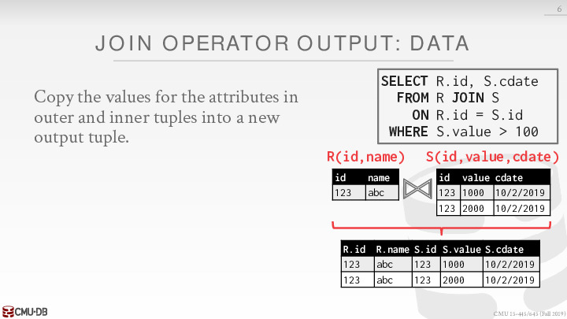

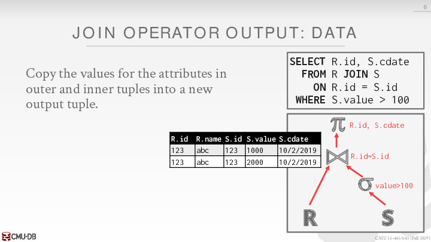

##### 1.2 Record IDs

> DBMS只复制join key和匹配元组的record ids
>
> Record IDs 相当于一个硬盘上的位置

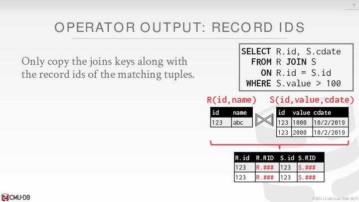

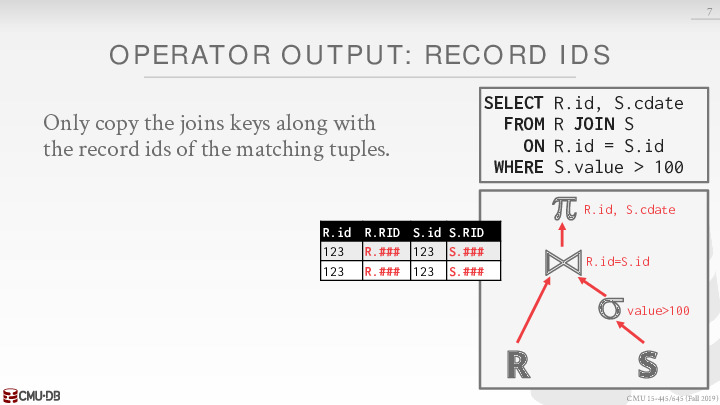

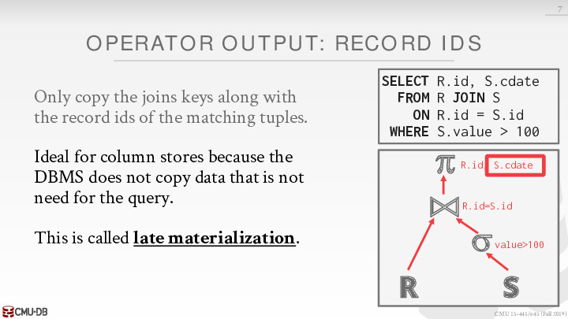

上述操作比较适合列式存储，这种优化方式叫做延迟物化。

###### 1.2.1 延迟物化

要理解延迟物化(Late Materialization), 首先解释一下什么是物化：为了能够把底层存储格式(面向Column的), 跟用户查询表达的意思(Row)对应上，在一个查询的生命周期的某个时间点，一定要把数据转换成Row的形式，这在Column-Store里面被称为物化(Materization)。

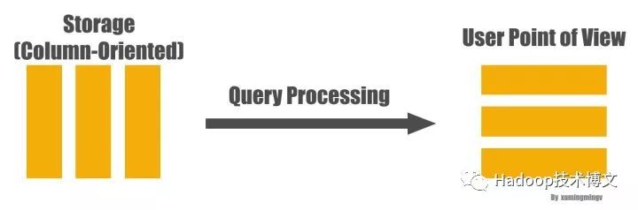

下面看个例子, 比如下面的查询：

```sql
SELECT nameFROM personWHERE id > 10 and age > 20
```

一般(Naive)的做法是从文件系统读出三列的数据，马上物化成一行行的person数据，然后应用两个过滤条件: `id > 10` 和 `age > 20` , 过滤完了之后从数据里面抽出 `name` 字段，作为最后的结果，大致转换过程如下图:

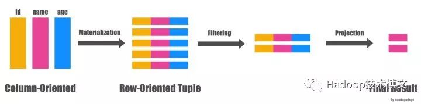

而延迟物化的做法则会先不拼出行式数据，直接在Column数据上分别应用两个过滤条件，从而得到两个满足过滤条件的bitmap, 然后再把两个bitmap做位与(bitwise AND)的操作得到同时满足两个条件的所有的bitmap，因为最后用户需要的只是 `name` 字段而已，因此下一步我们拿着这些`position` 对 `name` 字段的数据进行过滤就得到了最终的结果。如下图:

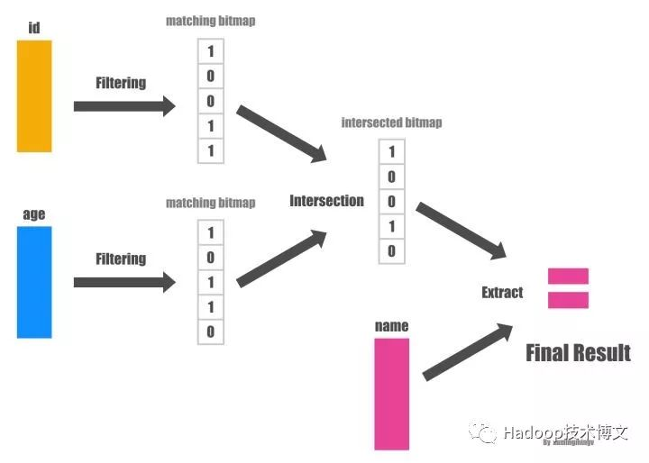

#### 2 I/O Cost Analysis

由于数据库中的数据量通常较大，无法一次性载入内存，因此 Join Algorithm 的设计目的，在于减少磁盘 I/O，因此我们衡量 Join Algorithm 好坏的标准，就是 I/O 的数量。**此外我们不需要考虑 Join 结果的大小，因为不论使用怎样的 Join Algorithm，结果集的大小都一样。**

以下的讨论都建立在这样的情景上：

- 对 R 和 S 两个 tables 做 Join
- R 中有 M 个 pages，m 个 tuples
- S 中有 N 个 pages，n 个 tuples

本节要介绍的 Join Algorithms 罗列如下：

- Nested Loop Join
  - Simple
  - Block
  - Index
- Sort-Merge Join
- Hash Join

不同的 Join Algorithms 有各自的适用场景，需要具体问题具体分析。

#### 3 Nested Loop Join

##### 3.1 Simple Nested Loop Join


对 R 中的每个 tuple，都全表扫描一次 S，是一种暴力解法，它的成本为：


***举例：***

假设：

- M  = 1000， m = 100,000
- N = 500, n = 40,000

成本：

$M + (m\times N) = 1000 + (100000 \times 500) = 50,000,100 \ I/Os$

假设 0.1 ms/IO，则总时长约为 1.3 小时

如果我们使用小表 S 作为 Outer Table，那么：

$N + (n\times M) = 500 + (40000 \times 1000) = 40,000,500 \ I/Os$

则总时长约为 1.1 小时。

##### 3.2 Block Nested Loop Join

- **Block 这里指 Page**
- Block NLJ 对当前的 Page 进行了**最大利用**。对每一个左边的每个 page 都需要连接右侧全部的 N 个 page。

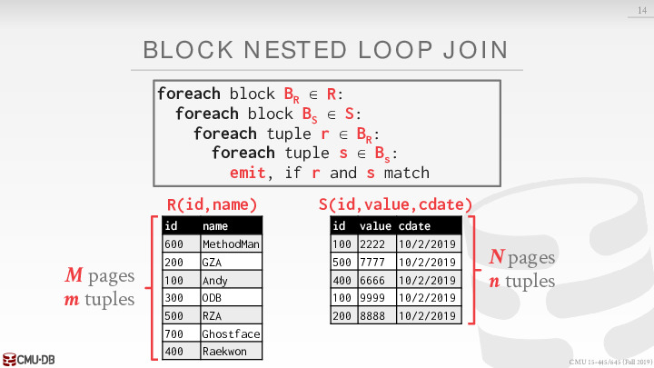

**举例：**

假设：

- M = 1000, m = 100,000
- N = 500, n = 40,000

成本：

使用大表 M 作为 Outer Table，成本为：

$M + (M \times N) = 1000 + (1000 \times 500) = 501,000 \ I/Os$

总共用时约 50 秒。

使用小表 S 作为 Outer Table，成本为：

$N + (N \times M) = 500 + (1000 \times 500) = 500,500 \ I/Os$

以上的计算都假设 DBMS 只为 Nested Loop Join Algorithm 分配 3 块 buffers，其中 2 块用于读入，1 块用于写出；若 DBMS 能为算法分配 B 块 buffers，则可以使用 B-2 块来读入 Outer Table，1 块用于读入 Inner Table，1 块用于写出，此时，成本为：

$M + (ceil(M / (B-2)) \times N)$

如果 Outer Table 能够直接放入内存中，则成本为 M + N。

##### 3.3 Index Nested Loop Join

之前的两种 Nested Loop Join 速度慢的原因在于，需要对 Inner Table 作多次全表扫描，若 Inner Table 在 Join Attributes 上有索引或者临时建一个索引 (只需全表扫描一次)：


此时 Join 的成本为：

$M + (m \times C)$

其中 C 为 index probe 的成本。

##### 3.4 Conclusion

从上面的讨论中，我们可以导出以下几个结论：

- 总是选择小表作为 Outer Table
- 尽量多地将 Outer Table 缓存在内存中
- 扫描 Inner Table 时，尽量使用索引

#### 4 Sort-Merge Join

Sort-Merge Join 顾名思义，分为两个阶段：

- Phase #1: Sort
  - 根据 Join Keys 对 tables 进行排序
  - 可以使用外部归并排序
- Phase #2: Merge
  - 同时从两个 tables 的一端开始扫描，对 tuples 配对
  - 如果 Join Keys 并不唯一，则有可能需要 backtrack

算法如下：

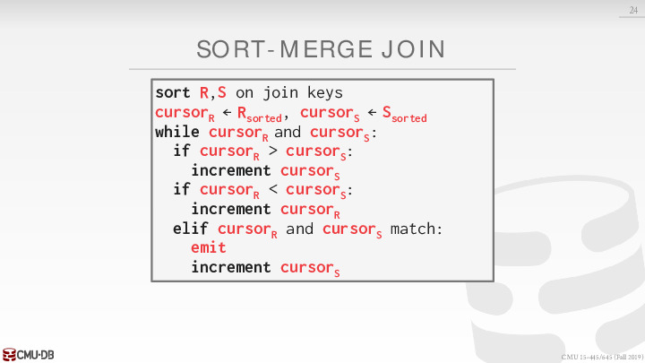

**例子：**

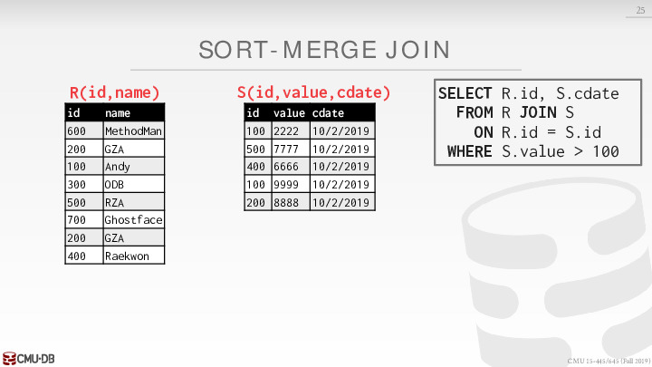

**Phase #1 - Sort**

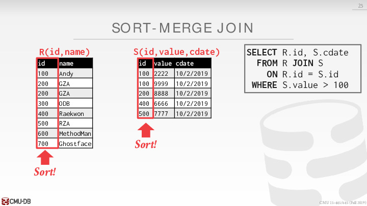

**Phase #2 - Merge**


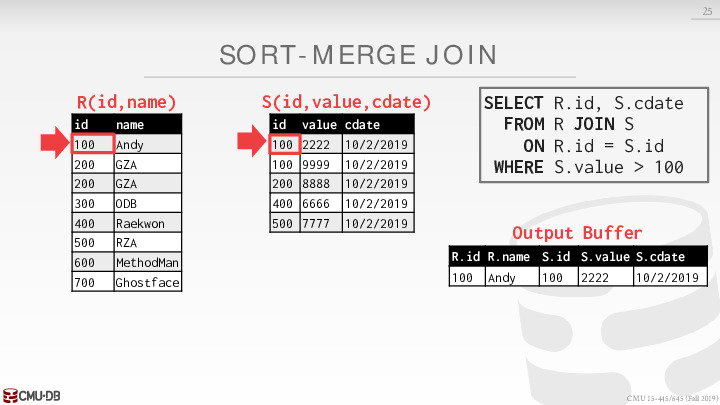

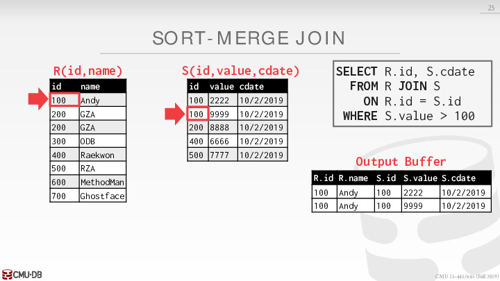

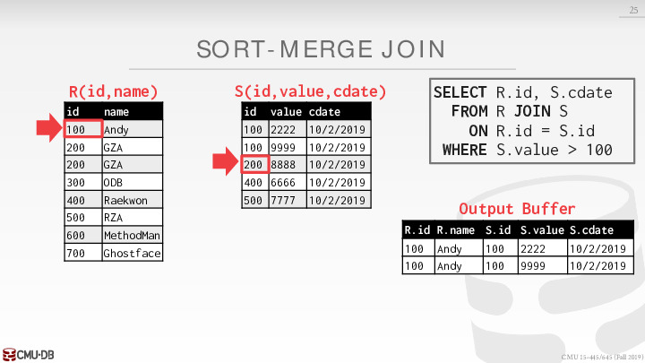


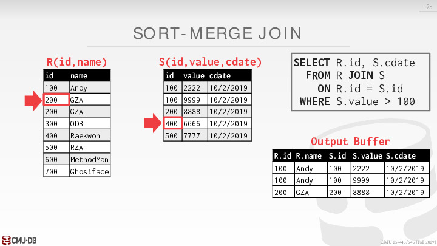


**注意这里需要回溯**

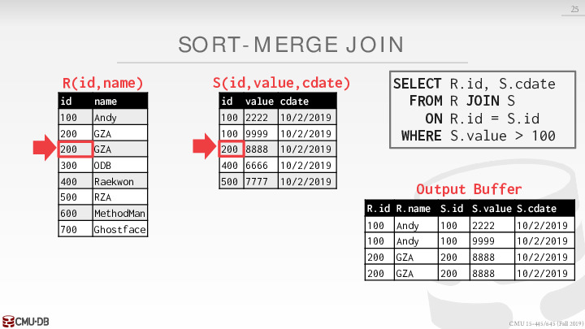

如果左侧 relation 出现数值相同的情况，右侧 relation 的 cursor 必须要回去 backtracking 到相同的数值。

Sort Merge 的成本分析如下：

- Sort Cost (R): $2M \times (log M / log B)$
- Sort Cost (S): $2N \times (log N / log B)$ 
- Merge Cost: M + N 

**举例：**

假设：

- M = 1000, m = 100,000
- N = 500, n = 40,000
- B = 100
- 0.1ms/IO

成本：

- Sort Cost (R)：$2000 \times (log 1000 / log 100) = 3000 \ I/Os$
- Sort Cost (S)：$1000 \times (log 500 / log 100) = 1350 \ I/Os$
- Merge Cost：$1000 + 500 = 1500 \ I/Os$ 
- Total Cost = $3000 + 1350 + 1500 = 5850 \ I/Os$ 
- Total Time = 0.59 secs

**小结：**

Sort-Merge Join 适用于：

- 当 tables 中的一个或者两个都已经按 Join Key 排好序，如聚簇索引
- SQL 的输出必须按 Join Key 排好序

#### 5 Hash Join

核心思想：

如果分别来自 R 和 S 中的两个 tuples 满足 Join 的条件，它们的 Join Attributes 必然相等，那么它们的 Join Attributes 经过某个 hash function 得到的值也必然相等，因此 Join 的时候，我们只需要对两个 tables 中 hash 到同样值的 tuples 分别执行 Join 操作即可。

##### 5.1 Basic Hash Join Algorithm

本算法分为两个阶段：

- Phase #1: Build
  - 扫描 Outer Table，使用 hash function $h_1$  对 Join Attributes 建立 hash table T
- Phase #2: Probe
  - 扫描 Inner Table，使用 hash function $h_1$ 获取每个 tuple 在 T 中的位置，在该位置上找到配对成功的 tuple(s)


这里明确 T 的定义：

- Key：Join Attributes
- Value：根据不同的查询要求及实现来变化
  - Full Tuple：可以避免在后续操作中再次获取数据，但需要占用更多的空间
  - Tuple Identifier：是列存储数据库的理想选择，占用最少的空间，但之后需要重新获取数据

但 Basic Hash Join Algorithm 有一个弱点，就是有可能 T 无法被放进内存中，由于 hash table 的查询一般都是随机查询，因此在 Probe 阶段，T 可能在 memory 与 disk 中来回移动。

##### 5.2 Grace Hash Join

当两个 table 都无法放入 memory 时，我们可以：

- Phase #1: Build
  - 将两个 tables 使用同样的 hash function 进行 partition，使得可能配对成功的 tuples 进入到相同的Partition
- Phase #2: Prob
  - 对两个 tables 的每一对 partition 分别进行 Join


如果每个 partition 仍然无法放入内存中，则可以递归地使用不同的 hash function 进行 partition，即 recursive partitioning：


成本分析：

假设我们有足够的 buffers 能够存下中间结果：

- Partitioning Phase:
  - Read + Write both tables
  - 2(M+N) I/Os
- Probing Phase
  - Read both tables
  - M+N I/Os

**举例**

假设：

- M = 1000, m = 100,000
- N = 500, n = 40,000
- 0.1ms/IO

计算：

- $3 \times (M + N) = 4,500 \ I/Os$
- 0.45 secs

如果 DBMS 已经知道 tables 大小，则可以使用 static hash table，否则需要使用 dynamic hash table

**Hash Join 在绝大多数场景下是最优选择，但当查询包含 ORDER BY 或者数据极其不均匀的情况下，Sort-Merge Join 会是更好的选择，DBMSs 在执行查询时，可能使用其中的一种到两种方法。**