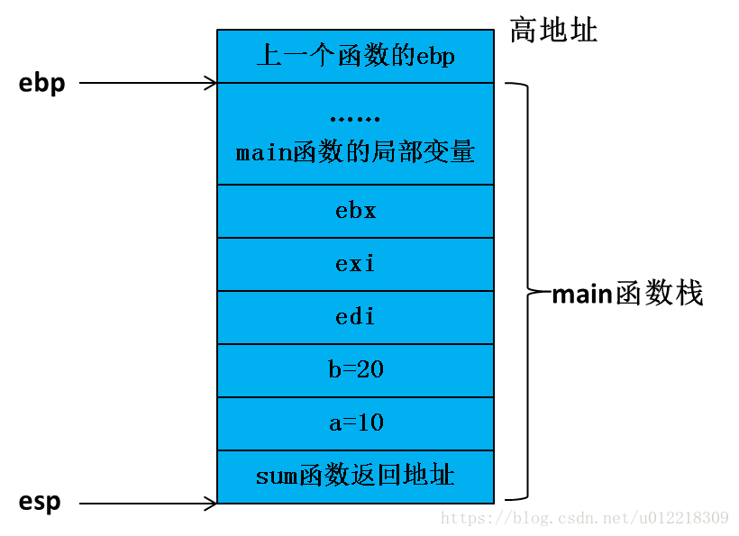

## Linux中各种栈

### 1 栈有什么用？

#### 1.1 函数调用

我们知道一个函数调用有以下三个基本过程：

+ 调用参数的传入
+ 局部变量的空间管理
+  函数返回 

函数的调用必须是高效的，而数据存放在 CPU通用寄存器 或者 RAM 内存 中无疑是最好的选择。以传递调用参数为例，我们可以选择使用 CPU通用寄存器 来存放参数。但是通用寄存器的数目都是有限的，当出现函数嵌套调用时，子函数再次使用原有的通用寄存器必然会导致冲突。因此如果想用它来传递参数，那在调用子函数前，就必须先 保存原有寄存器的值，然后当子函数退出的时候再 恢复原有寄存器的值 。

函数的调用参数数目一般都相对少，因此通用寄存器是可以满足一定需求的。但是局部变量的数目和占用空间都是比较大的，再依赖有限的通用寄存器未免强人所难，因此我们可以采用某些 RAM 内存区域来存储局部变量。但是存储在哪里合适？既不能让函数嵌套调用的时候有冲突，又要注重效率。

这种情况下，栈无疑提供很好的解决办法。一、对于通用寄存器传参的冲突，我们可以再调用子函数前，将通用寄存器临时压入栈中；在子函数调用完毕后，在将已保存的寄存器再弹出恢复回来。二、而局部变量的空间申请，也只需要向下移动下栈顶指针；将栈顶指针向回移动，即可就可完成局部变量的空间释放；三、对于函数的返回，也只需要在调用子函数前，将返回地址压入栈中，待子函数调用结束后，将函数返回地址弹出给 PC 指针，即完成了函数调用的返回

> 函数帧
>
> 函数调用经常是嵌套的，在同一时刻，栈中会有多个函数的信息。每个未完成运行的函数占用一个独立的连续区域，称作栈帧
>
> **1. ESP寄存器**
> 栈指针寄存器(extended stack pointer)，其内存放着一个指针，该指针永远指向系统栈最上面一个栈帧的栈顶。
>
> **2.EBP寄存器**
> 基址指针寄存器(extended base pointer)，其内存放着一个指针，该指针永远指向系统栈最上面一个栈帧的底部。
>
> ```c++
> int sum(int _a,int _b)
> {
>     int c=0;
>     c=_a+_b;
>  
>     return c;
> }
> int main()
> {
>     int a=10;
>     int b=20;
>     ret=sum(a,b);
>     return 0；
> }
> ```
>
> main函数的栈在调用之前如图：
>
> 
>
> **Step 1**：
>
> 函数参数从右至左入栈
>
> 
>
> **Step 2**：
>
> ret=sum(a,b);
>
> 
>
> **Step 3**：
>
> push ebp 将main函数基指针入栈保存
>
> 
>
> mov ebp esp 将esp的值存入ebp也就等于将ebp指向esp
>
> 
>
> **Step 4**：
>
> 
>
> 等到返回时是一样的。再把保存在栈中的寄存器的值给寄存器，开始函数操作。

### 2 Linux各种栈

#### 2.1 进程栈

进程栈是属于用户态栈，和进程 **虚拟地址空间 (Virtual Address Space)** 密切相关。**进程虚拟地址空间中的栈区，正指的是我们所说的进程栈**。进程栈的初始化大小是由编译器和链接器计算出来的，但是栈的实时大小并不是固定的，Linux 内核会根据入栈情况对栈区进行动态增长。

#### 2.2 线程栈

从 Linux 内核的角度来说，其实它并没有线程的概念。Linux 把所有线程都当做进程来实现，它将线程和进程不加区分的统一到了 task_struct 中。线程仅仅被视为一个与其他进程共享某些资源的进程，而是否共享地址空间几乎是进程和 Linux 中所谓线程的唯一区别。

线程创建的时候，加上了 CLONE_VM 标记，这样 **线程的内存描述符 将直接指向 父进程的内存描述符**。

虽然线程的地址空间和进程一样，但是对待其地址空间的 stack 还是有些区别的。对于 Linux 进程或者说主线程，其 stack 是在 fork 的时候生成的，实际上就是复制了父亲的 stack 空间地址，然后写时拷贝 (cow) 以及动态增长。然而对于主线程生成的子线程而言，其 stack 将不再是这样的了，而是事先固定下来的，使用 mmap 系统调用，它不带有 VM_STACK_FLAGS 标记。

由于线程的 mm->start_stack 栈地址和所属进程相同，所以线程栈的起始地址并没有存放在 task_struct 中，应该是使用 pthread_attr_t 中的 stackaddr 来初始化 task_struct->thread->sp（sp 指向 struct pt_regs 对象，该结构体用于保存用户进程或者线程的寄存器现场）。这些都不重要，重要的是，线程栈不能动态增长，一旦用尽就没了，这是和生成进程的 fork 不同的地方。由于线程栈是从进程的地址空间中 map 出来的一块内存区域，原则上是线程私有的。

#### 2.3 进程内核栈

在每一个进程的生命周期中，必然会通过到系统调用陷入内核。在执行系统调用陷入内核之后，这些内核代码所使用的栈并不是原先进程用户空间中的栈，而是一个单独内核空间的栈，这个称作进程内核栈。


