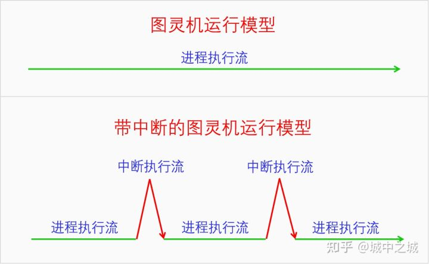
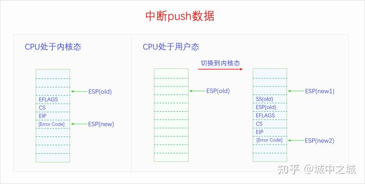
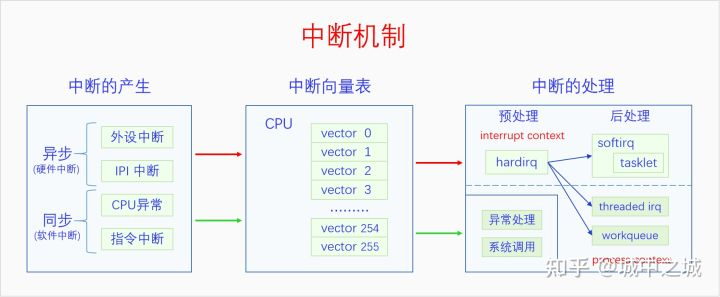
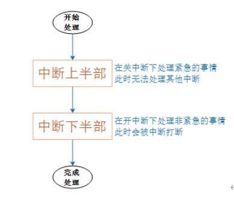

## Linux中断机制

### 一、中断基本原理

#### 1.1 中断的定义

中断机制：CPU在执行指令时，收到某个中断信号转而去执行预先设定好的代码，然后再返回到原指令流中继续执行，这就是中断机制。

可以发现中断的定义非常简单。我们根据中断的定义来画一张图：

#### 1.2 中断的作用

设计中断机制的目的在于中断机制有以下4个作用，这些作用可以帮助操作系统实现自己的功能。这四个作用分别是：

**1. 外设异步通知CPU：** 外设发生了什么事情或者完成了什么任务或者有什么消息要告诉CPU，都可以异步给CPU发通知。例如，网卡收到了网络包，磁盘完成了IO任务，定时器的间隔时间到了，都可以给CPU发中断信号。

**2.CPU之间发送消息：** 在SMP系统中，一个CPU想要给另一个CPU发送消息，可以给其发送IPI(处理器间中断)。

**3.处理CPU异常：** CPU在执行指令的过程中遇到了异常会给自己发送中断信号来处理异常。例如，做整数除法运算的时候发现被除数是0，访问虚拟内存的时候发现虚拟内存没有映射到物理内存上。

**4.实现系统调用：** 早期的系统调用就是靠中断指令来实现的，后期虽然开发了专用的系统调用指令，但是其基本原理还是相似的。

#### 1.3 中断的产生

那么中断信号又是如何产生的呢？中断信号的产生有以下4个来源：

1. 外设，外设产生的中断信号是异步的，一般也叫做硬件中断(注意硬中断是另外一个概念)。硬件中断按照是否可以屏蔽分为可屏蔽中断和不可屏蔽中断。例如，网卡、磁盘、定时器都可以产生硬件中断。

2. CPU，这里指的是一个CPU向另一个CPU发送中断，这种中断叫做IPI(处理器间中断)。IPI也可以看出是一种特殊的硬件中断，因为它和硬件中断的模式差不多，都是异步的。
3. CPU异常，CPU在执行指令的过程中发现异常会向自己发送中断信号，这种中断是同步的，一般也叫做软件中断(注意软中断是另外一个概念)。CPU异常按照是否需要修复以及是否能修复分为3类：1.**陷阱(trap)**，不需要修复，中断处理完成后继续执行下一条指令，2.**故障(fault)**，需要修复也有可能修复，**中断处理完成后重新执行之前的指令**，3.中止(abort)，需要修复但是无法修复，中断处理完成后，进程或者内核将会崩溃。例如，缺页异常是一种故障，所以也叫缺页故障，缺页异常处理完成后会重新执行刚才的指令。
4. 中断指令，直接用CPU指令来产生中断信号，这种中断和CPU异常一样是同步的，也可以叫做软件中断。例如，中断指令int 0x80可以用来实现系统调用。

中断信号的4个来源正好对应着中断的4个作用。前两种中断都可以叫做硬件中断，都是异步的；后两种中断都可以叫做软件中断，都是同步的。**很多书上也把硬件中断叫做中断，把软件中断叫做异常**。

#### 1.4 中断的处理

##### 执行场景

在继续讲解之前，我们先引入一个概念，执行场景(execute context)。在中断产生之前是没有这个概念的，有了中断之后，CPU就分为两个执行场景了，进程执行场景(process context)和中断执行场景(interrupt context)。

进程的执行是进程执行场景，同步中断的处理也是进程执行场景，异步中断的处理是中断执行场景。可能有的人会对同步中断的处理是进程执行场景感到疑惑，但是这也很好理解，因为同步中断处理是和当前指令相关的，可以看做是进程执行的一部分。而异步中断的处理和当前指令没有关系，所以不是进程执行场景。

进程执行场景和中断执行场景有两个区别：一是进程执行场景是可以调度、可以休眠的，而中断执行场景是不可以调度不可用休眠的；二是**在进程执行场景中是可以接受中断信号的，而在中断执行场景中是屏蔽中断信号的**。所以如果中断执行场景的执行时间太长的话，就会影响我们对新的中断信号的响应性，所以我们需要尽量缩短中断执行场景的时间。

**为此我们对异步中断的处理有下面两类办法：**

**1.立即完全处理:**

对于简单好处理的异步中断可以立即进行完全处理。

**2.立即预处理 + 稍后完全处理:**

对于处理起来比较耗时的中断可以采取立即预处理加稍后完全处理的方式来处理。

为了方便表述**，我们把立即完全处理和立即预处理都叫做中断预处理，把稍后完全处理叫做中断后处理。**中断预处理只有一种实现方式，就是直接处理。

但是中断后处理却有很多种方法，其处理方法可以运行在中断执行场景，也可以运行在进程执行场景，前者叫做直接中断后处理，后者叫做线程化中断后处理。

**在Linux中，中断预处理叫做上半部，中断后处理叫做下半部。由于“上半部、下半部”词义不明晰，我们在本文中都用中断预处理、中断后处理来称呼。**

**中断预处理**只有一种方法，叫做hardirq(硬中断)。

**中断后处理**有很多种方法，分为两类，直接中断后处理有softirq(软中断)、tasklet(微任务)，线程化中断后处理有workqueue(工作队列)、threaded_irq(中断线程)。

**硬中断、软中断是什么意思呢？本来的异步中断处理是直接把中断处理完的，整个过程是屏蔽中断的，现在，把整个过程分成了两部分，前半部分还是屏蔽中断的，叫做硬中断，处理与硬件相关的紧急事物，后半部分不再屏蔽中断，叫做软中断，处理剩余的事物。由于软中断中不再屏蔽中断信号，所以提高了系统对中断的响应性。**

**注意硬件中断、软件中断，硬中断、软中断是不同的概念，分别指的是中断的来源和中断的处理方式。**

#### 1.5 中断向量号

不同的中断信号需要有不同的处理方式，那么系统是怎么区分不同的中断信号呢？是靠中断向量号。每一个中断信号都有一个中断向量号，中断向量号是一个整数。CPU收到一个中断信号会根据这个信号的中断的向量号去查询中断向量表，根据向量表里面的指示去调用相应的处理函数。

中断信号和中断向量号是如何对应的呢？对于CPU异常来说，其向量号是由CPU架构标准规定的。对于外设来说，其向量号是由设备驱动动态申请的。对于IPI中断和指令中断来说，其向量号是由内核规定的。

#### 1.6 中断框架结构

有了前面这么多基础知识，下面我们对中断机制做个概览。

中断信号的产生有两类，分别是异步中断和同步中断，异步中断包括外设中断和IPI中断，同步中断包括CPU异常和指令中断。无论是同步中断还是异步中断，都要经过中断向量表进行处理。对于同步中断的处理是异常处理或者系统调用，它们都是进程执行场景，所以没有过多的处理方法，就是直接执行。

**对于异步中断的处理，由于直接调用处理是属于中断执行场景，默认的中断执行场景是会屏蔽中断的，这会降低系统对中断的响应性，所以内核开发出了很多的方法来解决这个问题。**

### 二、中断流程

CPU收到中断信号后会首先保存被中断程序的状态，然后再去执行中断处理程序，最后再返回到原程序中被中断的点去执行。

#### 2.1 保存现场

CPU收到中断信号后会首先把一些数据push到内核栈上，保存的数据是和当前执行点相关的，这样中断完成后就可以返回到原执行点。如果CPU当前处于用户态，则会先切换到内核态，把用户栈切换为内核栈再去保存数据(内核栈的位置是在当前线程的TSS中获取的)。下面我们画个图看一下：

CPU都push了哪些数据呢？

分为两种情况。当CPU处于内核态时，会push寄存器EFLAGS、CS、EIP的值到栈上，对于有些CPU异常还会push Error Code。Push CS、EIP是为了中断完成后返回到原执行点，push EFLAGS是为了恢复之前的CPU状态。

当CPU处于用户态时，会先切换到内核态，把栈切换到内核栈，然后push寄存器SS(old)、ESP(old)、EFLAGS、CS、EIP的值到新的内核栈，对于有些CPU异常还会push Error Code。Push SS(old)、ESP(old)，是为了中断返回的时候可以切换回原来的栈。

#### 2.2 查找向量表

保存完被中断程序的信息之后，就要去执行中断处理程序了。CPU会根据当前中断信号的向量号去查询中断向量表找到中断处理程序。CPU是如何获得当前中断信号的向量号的呢，如果是CPU异常可以在CPU内部获取，如果是指令中断，在指令中就有向量号，如果是硬件中断，则可以从中断控制器中获取中断向量号。

CPU现在已经把被中断的程序现场保存到内核栈上了，又得到了中断向量号，然后就根据中断向量号从中断向量表中找到对应的中断处理函数。开始执行中断处理函数。中断处理函数的最末尾执行IRET指令，这个指令会根据前面保存在栈上的数据跳回到原来的指令继续执行。

### 三、中断处理

终于讲到中断处理了，我们再把之前的中间机制图搬过来，再回顾一下：

无论是硬件中断还是软件中断，都是通过中断向量表进行处理的。但是不同的是，软件中断的处理程序是属于进程执行场景，所以直接把中断处理程序设置好就行了，中断处理程序怎么写也没有什么要顾虑的。

而硬件中断的处理程序就不同了，它是属于中断执行场景。不仅其中断处理函数中不能调用会阻塞、休眠的函数，而且处理程序本身要尽量的短，越短越好。所以为了使硬件中断处理函数尽可能的短，Linux内核开发了一大堆方法。这些方法包括硬中断(hardirq)、软中断(softirq)、微任务(tasklet)、中断线程(threaded irq)、工作队列(workqueue)。其实硬中断严格来说不算是一种方法，因为它是中断处理的必经之路，它就是中断向量表里面设置的处理函数。为了和软中断进行区分，才把硬中断叫做硬中断。硬中断和软中断都是属于中断执行场景，而中断线程和工作队列是属于进程执行场景。把硬件中断的处理任务放到进程场景里面来做，大大提高了中断处理的灵活性。

### 四、补充

#### 4.1 什么是软中断？

中断请求的处理程序应该要短且快，这样才能减少对正常进程运行调度地影响，而且中断处理程序可能会暂时关闭中断，这时如果中断处理程序执行时间过长，可能在还未执行完中断处理程序前，会丢失当前其他设备的中断请求。

那 Linux 系统**为了解决中断处理程序执行过长和中断丢失的问题，将中断过程分成了两个阶段，分别是「上半部和下半部分」**。

- **上半部用来快速处理中断**，一般会暂时关闭中断请求，主要负责处理跟硬件紧密相关或者时间敏感的事情。
- **下半部用来延迟处理上半部未完成的工作**，一般以「内核线程」的方式运行。

举一个计算机中的例子，常见的网卡接收网络包的例子。

网卡收到网络包后，会通过**硬件中断**通知内核有新的数据到了，于是内核就会调用对应的中断处理程序来响应该事件，这个事件的处理也是会分成上半部和下半部。

上部分要做到快速处理，所以只要把网卡的数据读到内存中，然后更新一下硬件寄存器的状态，比如把状态更新为表示数据已经读到内存中的状态值。

接着，内核会触发一个**软中断**，把一些处理比较耗时且复杂的事情，交给「软中断处理程序」去做，也就是中断的下半部，其主要是需要从内存中找到网络数据，再按照网络协议栈，对网络数据进行逐层解析和处理，最后把数据送给应用程序。

所以，中断处理程序的上部分和下半部可以理解为：

- **上半部直接处理硬件请求，也就是硬中断**，主要是负责耗时短的工作，特点是快速执行；
- **下半部是由内核触发，也就说软中断**，主要是负责上半部未完成的工作，通常都是耗时比较长的事情，特点是延迟执行

还有一个区别，硬中断（上半部）是会打断 CPU 正在执行的任务，然后立即执行中断处理程序，而软中断（下半部）是以内核线程的方式执行，并且每一个 CPU 都对应一个软中断内核线程，名字通常为「ksoftirqd/CPU 编号」，比如 0 号 CPU 对应的软中断内核线程的名字是 `ksoftirqd/0`

