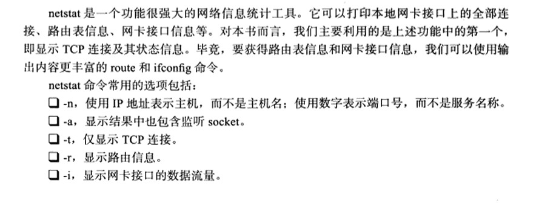

## Linux命令

### 1、top

top命令用于实时的监控系统的处理器状态，以及其他硬件负载信息还有动态的进程信息等等。

还可以按照排名先后的显示 ，比如某个进程CPU，内存的使用情况排名。

> top命令的第一大板块，系统的负载信息

```c
top - 08:41:43 up 10 days, 19:28, 13 users,  load average: 1.22, 1.00, 0.84
Tasks: 1905 total,   2 running, 1903 sleeping,   0 stopped,   0 zombie
%Cpu(s):  0.0 us,  0.3 sy,  0.0 ni, 99.6 id,  0.0 wa,  0.0 hi,  0.0 si,  0.0 st
MiB Mem : 515878.1 total,  82799.0 free,  10683.7 used, 422395.4 buff/cache
MiB Swap:   8192.0 total,   8102.7 free,     89.3 used. 501153.0 avail Mem 
    
08:41:43 up 10 days // 当前的机器时间  date命令可以查看时间
19:28 // 当前系统运行了多久
13 users // 当前机器几个用户在使用
load average: 1.22, 1.00, 0.84 // 显示系统的平均负载情况
Tasks: 1905 total,   2 running, 1903 sleeping,   0 stopped,   0 zombie // 总共的进程任务情况
%Cpu(s):  0.0 us,  0.3 sy,  0.0 ni, 99.6 id,  0.0 wa,  0.0 hi,  0.0 si,  0.0 st // cpu的使用百分比情况 us 用户占用的cpu百分比情况 sy 系统内核空间占用的cpu百分比 ni 用户进程空间占用的cpu百分比 id 空闲的cpu百分比情况 wa 等待输入输出占用的cpu百分比情况
MiB Mem : 515878.1 total,  82799.0 free,  10683.7 used, 422395.4 buff/cache // 内存的状态 
          // 物理内存总大小      // 空闲    
MiB Swap:   8192.0 total,   8102.7 free,     89.3 used. 501153.0 avail Mem // 交换空间的状态
```

> 系统负载（System Load）是系统CPU繁忙程度的度量，即有多少进程在等待被CPU调度（进程等待队列的长度）。
>
> 平均负载（Load Average）是一段时间内系统的平均负载，这个一段时间一般取1分钟、5分钟、15分钟。

> top命令的第二大板块

```bash
PID USER      PR  NI    VIRT    RES    SHR S  %CPU  %MEM     TIME+ COMMAND 
PID 进程id号
USER 执行进程的用户是谁
PR 进程的优先级
NI nice值 越高优先级越高
VIRT 进程使用的虚拟内存总量 VIRT = RES + swap
RES 进程使用的物理内存大小
SHR 共享内存大小
S 进程状态

%CPU
%MEM cpu和内存的使用百分比情况
```

> top的实际使用

```bash
1 查看linux逻辑cpu个数
M 内存使用量，从大到小排序
top -c 会显示进程的绝对路径
top -d 秒数 // top进程刷新时间
top -n num // 刷新num次不刷新
top -p pid // 查看某一个进程的信息
```

### 2、Linux三剑客（grep sed awk）

文本处理工具，均支持正则表达式引擎

+ grep：文本过滤工具
+ sed：stream editor 流编辑器 文本编辑工具（对文本替换、删除）
+ awk：Linux的文本报告生成器（格式化文本）Linux是gawk

#### 正则表达式


#### grep

作用：文本搜索工具，根据用户指定的“模式”（过滤条件）对目标文本逐行进行匹配检查，打印匹配到的行

```bash
grep [options] [pattern] file
      参数       匹配模式
参数：
    -i 忽略字符大小写
    -o 仅显示匹配到的字符串本身
    -v 显示不能被模式匹配到的行
    -E 支持使用扩展的正则表达式
    -q 静默模式 不输出任何信息 
    -n 显示匹配的行号

匹配模式：
	可以是普通的文字符号，也可以是正则表达式
```

#### sed

sed是操作、过滤和转换文本内容的强大工具

常用功能包括结合正则表达式对文件实现快速增删改查，其中查询的功能中最常用的两大功能就是过滤（过滤指定字符串）、取行（取出指定行）。


```bash
sed [选项] [sed内置命令字符] file
选项：
	-n 取消默认sed的输出 常和sed内置命令p一起使用
	-i 直接将修改结果写入文件 不用-i sed修改的是内存数据
	-e 多次编辑
	-r 支持正则表达式
内置命令字符：
	a append对文本进行追加 在指定行后添加一行/多行文本
	d delete 删除匹配行
	i insert 插入文本，在指定行前插入一行/多行文本
	p print 打印匹配行内容
	s/正则/替换内容/g 匹配正则内容，然后替换内容（支持正则），结尾g代表全局匹配

sed匹配范围：
	空地址 全文处理
	单地址 指定文件某一行
	/pattern/ 被模式匹配到的每一行
	范围区间 10,20 十到二十行  10,+5 第10行向下5行  /pattern1/, /pattern2/
	步长 1~2 表示1、3、5、7  2~2 表示2、4、6、8
```

##### 案例

数据

```
My name is chaoge.
I teach linux.
I like play computer game.
My qq is 877348180.
My website is https://pvthonav.cn.
```

**输出第2、3行**

```bash
sed -n '2,3p' xf.txt 
/*
I teach linux.
I like play computer game.
*/ 
sed -n '2,+3p' xf.txt 
I teach linux.
I like play computer game.
My qq is 877348180.
```

**过滤出含有linux的字符串行**

```bash
sed -n "/linux/p" xf.txt 

I teach linux.
```

**删除含有game的行**

```bash
sed "/game/d" xf.txt
// 没加-n 会默认输出到屏幕
// 此时文件中是没有改变的，修改的是内存数据 加-i会将文件中删除
```

**将文件中My全部替换位His**

```bash
sed 's/My/His/g' xf.txt
```

**替换所有My为His，同时换掉QQ号为888**

```bash
sed -e 's/My/His/g' -e 's/877348180/888/g' xf.txt
```

> -e 多次编辑

**在文件第二行追加内容a字符XX，写入到文件，还得添加-i**

```bash
sed -i '2a XX' xf.txt
```

**对文件每一行都加一个X**

```bash
sed 'a X' xf.txt
```

> 空格表示全文处理

#### awk

格式化文本内容，对文本进行复杂处理，更像是一门编程语言，支持条件判断、数组、循环等功能

```bash
awk [option] 'pattern {action}' file 
awk 参数 '条件动作' 文件
```


action指的是动作，awk擅长文本格式化，且输出格式化的结果，因此最常用的动作就是print和printf

> 当执行命令 awk '{print $2}' xf.txt 表示把xf文本第二列信息输出
>
> awk默认以空格为分隔符，且多个空格也识别为一个空格，作为分隔符
>
> awk是按行处理文件，一行处理完毕，处理下一行，根据用户指定的分隔符去工作，没有就默认空格

指定分隔符后，awk把每一行切割后的数据对应到内置变量


##### awk内置变量


**案例**

```
xf1 xf2 xf3 xf4 xf5 
xf6 xf13 xf14 xf19 xf111 
xf7 xf12 xf15 xf18 xf122
xf8 xf11 xf16 xf17 xf133 
```

**一次性输出多列**

```bash
awk '{print $1,$2}' xf.txt

加逗号相当于会输出空格
```

**自定义输出内容**

awk必须外层单引号，内层双引号，内置变量不得添加双引号，否则会被识别为文本。

```bash
awk '{print "第一列",$1,"第二列",$2}' xf.txt 
第一列 xf1 第二列 xf2
第一列 xf6 第二列 xf13
第一列 xf7 第二列 xf12
第一列 xf8 第二列 xf11
```

##### awk参数


**案例**

测试文件

```
 1 sync:x:5:0:sync:/sbin:/bin/sync
 2 shutdown:x:6:0:shutdown:/sbin:/sbin/shutdown
 3 halt:x:7:0:halt:/sbin:/sbin/halt
 4 mail:x:8:12:mail:/var/spool/mail:/sbin/nologin
 5 operator:x:11:0:operator:/root:/sbin/nologin
 6 games:x:12:100:games:/usr/games:/sbin/nologin
 7 ftp:x:14:50:FTP User:/var/ftp:/sbin/nologin
 8 nobody:x:99:99:Nobody:/:/sbin/nologin
 9 systemd-network:x:192:192:systemd Network Management:/
 10 dbus:x:81:81:System message bus:/:/sbin/nologin
 11 polkitd:x:999:998:User for polkitd:/:/sbin/nologin
 12 libstoragemgmt:x:998:997:daemon account for libstorage
 13 rpc:x:32:32:Rpcbind Daemon:/var/lib/rpcbind:/sbin/nolo
 14 ntp:x:38:38::/etc/ntp:/sbin/nologin
```

**显示文件第五行**

```bash
# NR在awk表示行号，NR==5表示行号是5的那一行
# 一个等号是修改变量值
awk 'NR==5' pwd.txt

operator:x:11:0:operator:/root:/sbin/nologin
```

**显示3-5行且输出行号**

```bash
awk 'NR==2,NR==5' pwd.txt
```

给每一行的内容添加行号

```bash
awk '{print NR,$0}' alex.txt

1 alex1 alex2 alex3 alex4 alex5
2 alex6 alex7 alex8 alex9 alex10
3 alex11 alex12 alex13 alex14 alex15
4 alex16 alex17 alex18 alex19 alex20
5 alex21 alex22 alex23 alex24 alex25
6 alex26 alex27 alex28 alex29 alex30
7 alex31 alex32 alex33 alex34 alex35
8 alex36 alex37 alex38 alex39 alex40
9 alex41 alex42 alex43 alex44 alex45
10 alex46 alex47 alex48 alex49 alex50 alex51

```

##### awk分隔符

awk分隔符有两种

+ 输入分隔符，awk默认是空格，空白字符，变量名FS
+ 输出分隔符，OFS

**FS**

当我们处理特殊文件，没有空格的时候，可以自由指定分隔符

```bash
awk -F '#' '{print $1}' chaoge.txt
```

处理使用-F选项，还可以使用-v修改FS变量

```bash
awk -v FS='#' '{print $1}' chaoge.txt
```

**OFS**

awk执行完命令，默认用空格隔开每一列，这个空格是awk默认输出符


**输出分隔符与逗号**

awk是否存在输出分隔符，特点在于`'{print $1,$3}'`逗号的区别

+ 添加逗号，默认是空格分隔符


+ 不加逗号

  

+ 修改输出分隔符

  

##### awk变量

**awk参数**


对于awk而言，变量为：

+ 内置变量
+ 自定义变量


##### awk格式化输出


##### awk模式

awk是按行处理文本，现在讲解特殊pattern：BEIGIN和END

+ BEGIN模式是处理文本前需要执行的操作。
+ END是处理完所有行之后执行的操作。


这里就简单介绍一下。还有其他的，类似如下


三种模式

+ 空模式：没有指定任何模式（条件），因此每一行都执行了对应的动作，空模式会匹配文档的每一行。每一行都满足了空模式
+ 关系运算符模式
+ BEGIN/END模式

##### awk与正则表达式

正则表达式主要与awk的模式结合使用

+ 不指定模式，awk每一行都会执行对应的动作
+ 指定了模式，只有被模式匹配到的、符合条件的行才会执行

正则要加两个/

比如：找出pwd.txt中以games开头的行

```c++
grep '^games' pwd.txt

awk '/^games/{print $0}' pwd.txt
```


比grep更强大的格式化文本的功能


好了 以上就是全部内容了，我也是简单的摘取了一点，内容其实是不详实的，但我感觉应付面试够了，实际工作中你不会直接google就完事了，谁还慢慢看教程啊！

### 3、ps

用于显示当前进程的状态。

显示其他用户启动的进程（a）
查看系统中属于自己的进程（x）
启动这个进程的用户和它启动的时间（u）

### 4、find

查找目录下的文件

语法

```bash
find path -option 
```

简单的option

```bash
-name name, -iname name : 文件名称符合 name 的文件。iname 会忽略大小写

-size n : 文件大小 是 n 单位，b 代表 512 位元组的区块，c 表示字元数，k 表示 kilo bytes，w 是二个位元组。

-type c : 文件类型是 c 的文件。
```

举例

```bash
find /home -iname "*.txt"
```

上述是简单的说了一下find 还有更深层的就不提了，记不住，用到再查。

### 5、netstate




### 6、常用命令

#### 6.1 文件相关

查看工作路径：`pwd`

创建文件夹：`mkdir`

进入到某个目录：`cd`

递归查看当前文件夹下面的文件：`tree`

创建文件：`touch file`、`ls >file`、`vi file`

查看当前目录下文件：`ls`，`-l`显示详细信息，`-a`显示全部文件包括隐藏文件，`-R`连子目录一起显示

文件搜索：`find`

查看文件内容：`cat`

复制文件：`cp file targetAdress `

移动文件到某个文件夹：`mv`，`-f`强制执行，若已存在则直接覆盖，`-i`会询问是否覆盖，`u`若当前文件比目标文件新才进行覆盖更新

修改文件权限：`chmod`

改变文件所有者：`chown`

改变文件所属命令组：`chgrp`

给文件重命名：`rename`

合并文件内容:`paste`

排序文件内容:`sort`

解压缩文件：`tar`

删除：`rm`，`-f`强制删除,`-i`在删除前会询问用户是否删除,`-r`递归删除，就是全删

#### 6.2 系统状态相关

查看内存：`free`、`cat /proc/meminfo`可以读取

- 可用/闲置物理内存数量
- 等待被写入缓存的数量
- 已写回磁盘的数量

查看磁盘使用情况：`df -h`

**查看进程**：`ps`,`-A`显示所有进程，`-a`不与terminal有关的所有进程，`-u`有效用户的相关进程，`-l`将PID详细信息列出

**查看系统进程的资源占用情况：**`top`

#### 6.3 网络相关

查看能否连通某个网络：`ping`

查看网口ip：`ifconfig`

### 7、system和exec的区别？

*system*是用*shell*来调用程序*=fork+exec+waitpid*，而*exec*是直接让你的程序代替原来的程序运行。

*system* 是在单独的进程中执行命令，完了还会回到你的程序中。而*exec*函数是直接在你的进程中执行新的程序，新的程序会把你的程序覆盖，除非调用出错，否则你再也回不到*exec*后面的代码，就是说你的程序就变成了*exec*调用的那个程序了。

**1）system中的进程一般要能够执行完，而不是死循环，否则无法返回了。**

**2）exec系列函数中在Linux下常会和fork语句一起用，否则的话，当前进程被新进程替代了，无法继续执行，而使用fork创建子进程，在子进程中使用exec,当前进程仍能执行原先的任务。**

