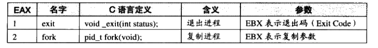
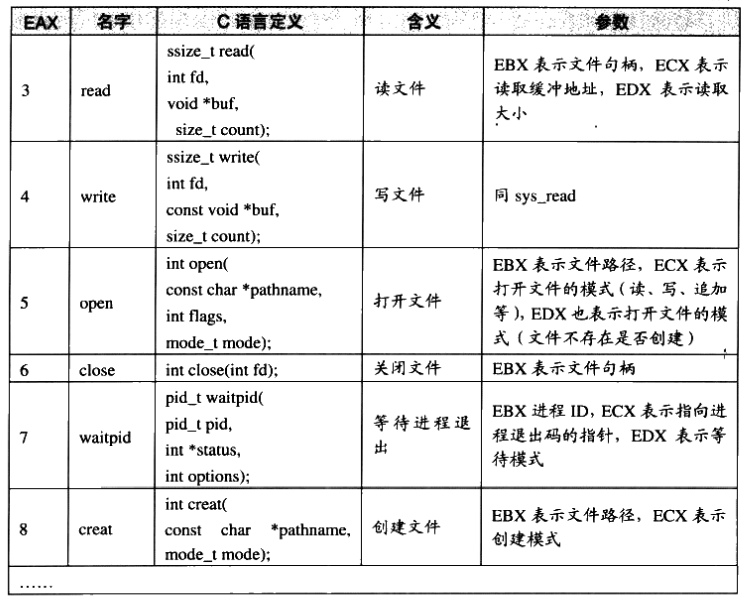
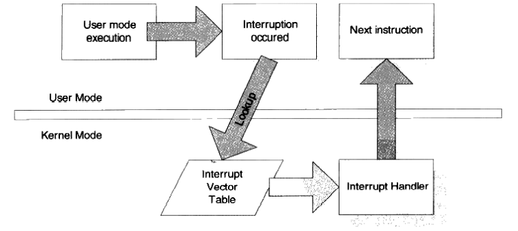
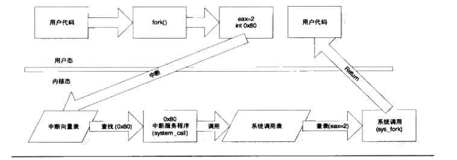
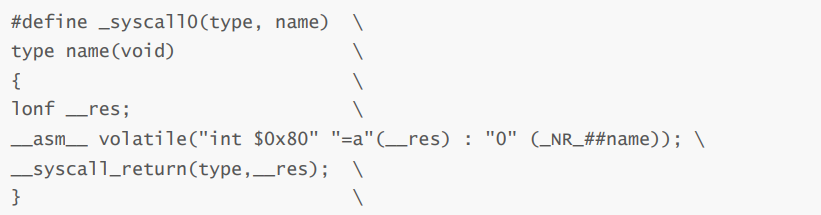
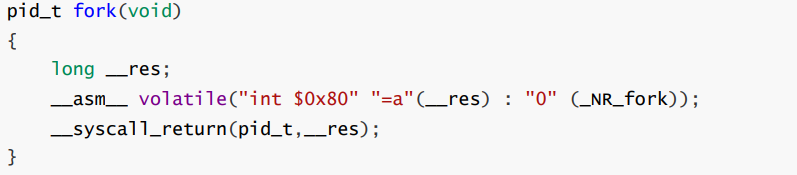
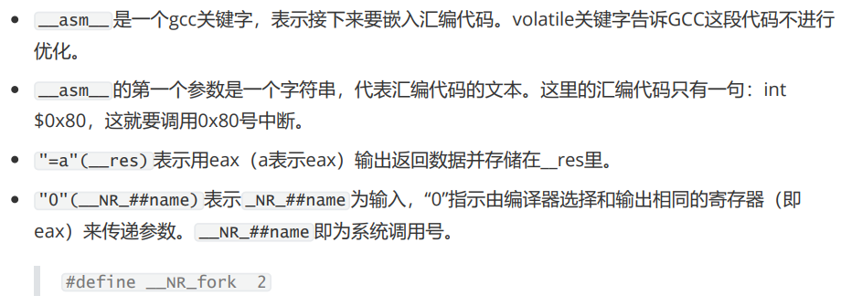
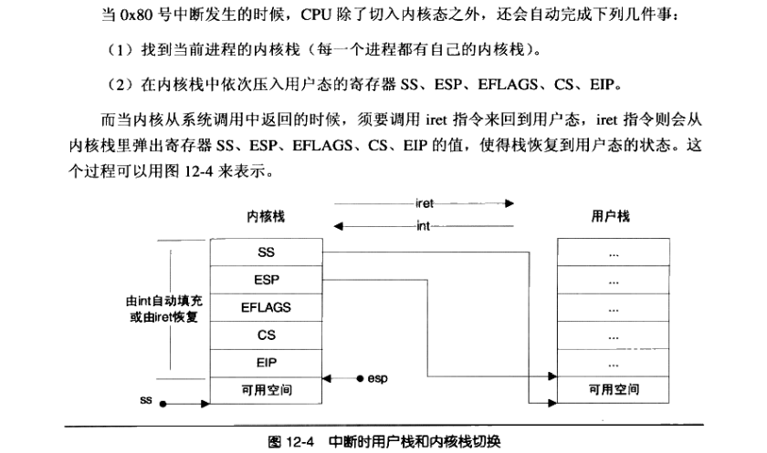
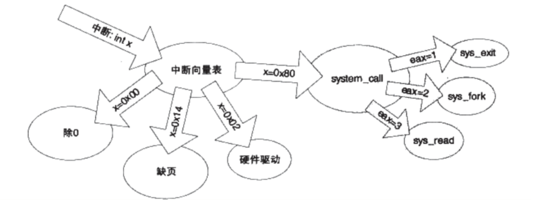
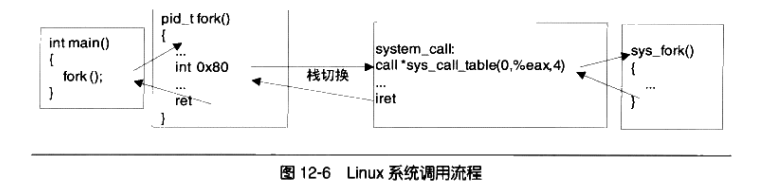

## Linux系统调用详解


在os里，程序运行的时候，本身是没有权利访问多少系统资源的。由于系统有限的资源有可能被多个不同的应用程序同时访问，因此，如果不加以保护，那么各个应用程序难免产生冲突。所以os都将这些资源保护了起来。比如程序员都没有机会擅自去访问硬盘的某扇区上的数据，而必须通过文件系统。

为了让应用程序有能力去访问系统资源，也为了让程序能借助os做一些必须os支持的行为，每个os都会提供一套接口，以供应用程序使用。这些接口往往通过中断来实现。比如Linux使用0x80号中断来作为系统调用的入口。

### 1 Linux系统调用

下面我来看看Linux系统调用的定义，已有一个比较直观的概念。在x86下，系统调用由0x80中断完成，各个通用寄存器用于传递参数，EAX寄存器用于表示系统调用的接口号，EAX=1表示退出进程（exit）。EAX=2表示创建进程（fork）。

每个系统调用都对应于内核源码中的一个函数，它们是以“sys_”开头的，比如exit调用对应内核中的sys_exit函数。当系统调用返回时，EAX又作为调用结果的返回值。





但大部分os有以下两个特点：

+ 使用不便，os提供的系统调用接口往往过于原始。
+ 各个os之间系统调用不兼容

为了解决问题，运行库挺身而出，它作为系统调用与程序之间的一个抽象层可以保持以下特点：

+ 使用简便。
+ 形式统一。运行库有它的标准，叫做标准库。

这样我们使用运行库提供的接口写程序，就不会面临这些问题。

例如C语言的fread，用于读取文件，在windows这个函数实现可能是调用ReadFile，而在Linux下可能是调用read这个系统调用。但无论哪个平台，我们使用C语言运行库fread来读文件。

### 2 系统调用原理

#### 2.1 特权级和中断

在os中，通常有两种特权级别，用户模式和内核模式，也称为内核态和用户态。由于有多种特权模式存在，os可以让不同代码运行在不同的模式上。以提高稳定性和安全性。普通应用程序运行在用户态，诸多操作受到限制，比如访问硬件设备啥的。

系统调用是运行在内核态，而应用程序基本运行在用户态，用户态程序如何运行内核态的代码呢？os一般通过中断来从用户态切到内核态。

中断一般有两个属性，中断号和中断处理程序，不同中断有不同的中断号，而同时一个中断处理程序一一对应一个中断号。在内核中，有一个数组叫中断向量表，第n项包含了指向第n号中断的中断处理程序的指针。当中断到来，CPU会暂停当前执行的代码，根据中断的中断号，在中断向量表中找到对应的中断处理程序，并调用它。中断处理程序完成后，CPU会继续执行原来的代码。



中断有硬件中断和软件中断，软件中断通常是一条指令，带有一个参数记录中断号，使用这条指令用户可以手动触发某个中断并执行其中断处理程序。比如int 0x80指令会调用第0x80号中断的处理程序。

由于中断号有限，os不会舍得用一个中断号来对应一个系统调用，所以Linux使用0x80来触发所有的系统调用。对于一个中断号，os如何知道哪个系统调用被调用呢？这里系统调用会有一个系统调用号，通常就是系统调用在系统调用表的位置。这个系统调用号在执行int指令前会放到某个寄存器，对应中断代码会拿到这个系统调用号，并调用正确函数。比如Linux系统调用号由eax传入。

#### 2.2 基于int的Linux经典系统调用实现

Linux系统调用流程



##### 2.2.1 触发中断

首先当程序在代码里调用一个系统调用时，是以一个函数的形式调用的，例如程序调用fork：

```c++
int main()
{
	fork();
}
```

fork函数是一个对系统调用fork的封装，可以用下列宏来定义它：

```
_syscall0(pid_t, fork);
```

_syscall0是一个宏函数，用于定义一个没有参数的系统调用的封装。它的第一个参数为这个系统调用的返回值类型，这里为pid_t，是一个Linux自定义类型，代表进程id，第二个参数是系统调用名称。



对于_syscall0(pid_t, fork)，将上面宏展开：





> static inline _syscall0(int,fork)
> 其中_syscall0()是unistd.h中的内嵌宏代码，在编译链接前会对源文件进行预处理，它会将源文件中的头文件以及宏(在这里就是把用#define定义的_syscall宏展开)都展开。
>
> gcc会把上述“函数”体中的语句直接插入到调用fork()语句的代码处，因此执行fork()不会引起函数调用。另外，宏名称字符串“syscall0”中最后的0表示无参数，1表示带1个参数。如果系统调用带有1个参数，那么就应该使用宏_syscall1()。

当用户调用了某个系统调用的时候，实际上是执行了一段汇编代码，CPU执行到int $0x80时，会保存现场以便恢复，接着会将特权状态切换到内核态。然后CPU便会查找中断向量表中的第0x80号元素。

##### 2.2.2 切换堆栈

在实际执行中断向量表中的第0x80号元素所对应的函数之前，CPU首先还要执行栈的切换。Linux用户 态和内核态使用不同的栈，两者各自负责各自的函数调用，互不干扰。但在应用程序调用0x80号中断 时，程序的执行流程从用户态转换到内核态，这时程序的当前栈也必须相应从用户栈切换到内核栈。从 中断处理函数中返回时，程序的当前栈还要从内核栈切换到用户栈。

所谓当前栈，指的是ESP的值所在的栈空间，如果ESP的值位于用户栈范围，那么当前栈就是用户栈，反之亦然。此外寄存器SS的值还应该指向当前栈所在的页。所以栈切换实际行为：

1. 保存当前ESP、SS的值
2. 将ESP、SS值设置为内核栈对应值

反过来：

1. 恢复原来ESP、SS的值
2. 用户态的ESP、SS的值保存在内核栈中。这一行为都是由中断指令自动由硬件完成




##### 2.2.3 中断处理程序

当完成栈的切换后，程序的流程切换到中断向量表中记录的0x80号中断处理程序。



整个调用过程如下：


