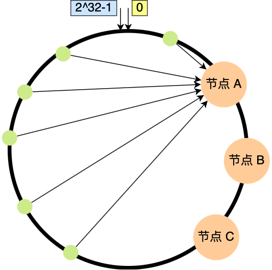

## OS补充

### 1 调度算法

#### 1.1 内存页面置换算法

 在了解内存页面置换算法前，我们得先谈一下**缺页异常（缺页中断）**。

当 CPU 访问的页面不在物理内存时，便会产生一个缺页中断，请求操作系统将所缺页调入到物理内存。那它与一般中断的主要区别在于：

- 缺页中断在指令执行「期间」产生和处理中断信号，而一般中断在一条指令执行「完成」后检查和处理中断信号。
- 缺页中断返回到该指令的开始重新执行「该指令」，而一般中断返回回到该指令的「下一个指令」执行。


1. 在 CPU 里访问一条 Load M 指令，然后 CPU 会去找 M 所对应的页表项。
2. 如果该页表项的状态位是「有效的」，那 CPU 就可以直接去访问物理内存了，如果状态位是「无效的」，则 CPU 则会发送缺页中断请求。
3. 操作系统收到了缺页中断，则会执行缺页中断处理函数，先会查找该页面在磁盘中的页面的位置。
4. 找到磁盘中对应的页面后，需要把该页面换入到物理内存中，但是在换入前，需要在物理内存中找空闲页，如果找到空闲页，就把页面换入到物理内存中。
5. 页面从磁盘换入到物理内存完成后，则把页表项中的状态位修改为「有效的」。
6. 最后，CPU 重新执行导致缺页异常的指令。

上面所说的过程，第 4 步是能在物理内存找到空闲页的情况，那如果找不到呢？

找不到空闲页的话，就说明此时内存已满了，这时候，就需要「页面置换算法」选择一个物理页，如果该物理页有被修改过（脏页），则把它换出到磁盘，然后把该被置换出去的页表项的状态改成「无效的」，最后把正在访问的页面装入到这个物理页中。

这里提一下，页表项通常有如下图的字段：


那其中：

- *状态位*：用于表示该页是否有效，也就是说是否在物理内存中，供程序访问时参考。
- *访问字段*：用于记录该页在一段时间被访问的次数，供页面置换算法选择出页面时参考。
- *修改位*：表示该页在调入内存后是否有被修改过，由于内存中的每一页都在磁盘上保留一份副本，因此，如果没有修改，在置换该页时就不需要将该页写回到磁盘上，以减少系统的开销；如果已经被修改，则将该页重写到磁盘上，以保证磁盘中所保留的始终是最新的副本。
- *硬盘地址*：用于指出该页在硬盘上的地址，通常是物理块号，供调入该页时使用。

所以，页面置换算法的功能是，**当出现缺页异常，需调入新页面而内存已满时，选择被置换的物理页面**，也就是说选择一个物理页面换出到磁盘，然后把需要访问的页面换入到物理页。

那其算法目标则是，尽可能减少页面的换入换出的次数，常见的页面置换算法有如下几种：

- 最佳页面置换算法（*OPT*）
- 先进先出置换算法（*FIFO*）
- 最近最久未使用的置换算法（*LRU*）
- 时钟页面置换算法（*Lock*）
- 最不常用置换算法（*LFU*）

##### 最佳页面置换算法

最佳页面置换算法基本思路是，**置换在「未来」最长时间不访问的页面**。

所以，该算法实现需要计算内存中每个逻辑页面的「下一次」访问时间，然后比较，选择未来最长时间不访问的页面。

这很理想，但是实际系统中无法实现，因为程序访问页面时是动态的，我们是无法预知每个页面在「下一次」访问前的等待时间。

所以，最佳页面置换算法作用是为了衡量你的算法的效率，你的算法效率越接近该算法的效率，那么说明你的算法是高效的。

##### 先进先出置换算法

既然我们无法预知页面在下一次访问前所需的等待时间，那我们可以**选择在内存驻留时间很长的页面进行中置换**，这个就是「先进先出置换」算法的思想。

##### 最近最久未使用的置换算法

最近最久未使用（*LRU*）的置换算法的基本思路是，发生缺页时，**选择最长时间没有被访问的页面进行置换**，也就是说，该算法假设已经很久没有使用的页面很有可能在未来较长的一段时间内仍然不会被使用。


##### 时钟页面置换算法

那有没有一种即能优化置换的次数，也能方便实现的算法呢？

时钟页面置换算法就可以两者兼得，它跟 LRU 近似，又是对 FIFO 的一种改进。

该算法的思路是，把所有的页面都保存在一个类似钟面的「环形链表」中，一个表针指向最老的页面。

当发生缺页中断时，算法首先检查表针指向的页面：

- 如果它的访问位位是 0 就淘汰该页面，并把新的页面插入这个位置，然后把表针前移一个位置；
- 如果访问位是 1 就清除访问位，并把表针前移一个位置，重复这个过程直到找到了一个访问位为 0 的页面为止；

我画了一副时钟页面置换算法的工作流程图，你可以在下方看到：


##### 最不常用算法

最不常用（*LFU*）算法，这名字听起来很调皮，但是它的意思不是指这个算法不常用，而是**当发生缺页中断时，选择「访问次数」最少的那个页面，并将其淘汰**。

它的实现方式是，对每个页面设置一个「访问计数器」，每当一个页面被访问时，该页面的访问计数器就累加 1。在发生缺页中断时，淘汰计数器值最小的那个页面。

#### 1.2 硬盘调度算法

我们来看看磁盘的结构，如下图：


常见的机械磁盘是上图左边的样子，中间圆的部分是磁盘的盘片，一般会有多个盘片，每个盘面都有自己的磁头。右边的图就是一个盘片的结构，盘片中的每一层分为多个磁道，每个磁道分多个扇区，每个扇区是 `512` 字节。那么，多个具有相同编号的磁道形成一个圆柱，称之为磁盘的柱面，如上图里中间的样子。

磁盘调度算法的目的很简单，就是为了提高磁盘的访问性能，一般是通过优化磁盘的访问请求顺序来做到的。

寻道的时间是磁盘访问最耗时的部分，如果请求顺序优化的得当，必然可以节省一些不必要的寻道时间，从而提高磁盘的访问性能。

假设有下面一个请求序列，每个数字代表磁道的位置：

98，183，37，122，14，124，65，67

初始磁头当前的位置是在第 `53` 磁道。

接下来，分别对以上的序列，作为每个调度算法的例子，那常见的磁盘调度算法有：

- 先来先服务算法
- 最短寻道时间优先算法
- 扫描算法
- 循环扫描算法
- LOOK 与 C-LOOK 算法

##### 先来先服务

先来先服务（*First-Come，First-Served，FCFS*），顾名思义，先到来的请求，先被服务。

那按照这个序列的话：

98，183，37，122，14，124，65，67

那么，磁盘的写入顺序是从左到右，如下图：


先来先服务算法总共移动了 `640` 个磁道的距离，这么一看这种算法，比较简单粗暴，但是如果大量进程竞争使用磁盘，请求访问的磁道可能会很分散，那先来先服务算法在性能上就会显得很差，因为寻道时间过长。

##### 最短寻道时间优先

最短寻道时间优先（*Shortest Seek First，SSF*）算法的工作方式是，优先选择从当前磁头位置所需寻道时间最短的请求，还是以这个序列为例子：

98，183，37，122，14，124，65，67

那么，那么根据距离磁头（ 53 位置）最近的请求的算法，具体的请求则会是下列从左到右的顺序：

65，67，37，14，98，122，124，183


磁头移动的总距离是 `236` 磁道，相比先来先服务性能提高了不少。

但这个算法可能存在某些请求的**饥饿**，因为本次例子我们是静态的序列，看不出问题，假设是一个动态的请求，如果后续来的请求都是小于 183 磁道的，那么 183 磁道可能永远不会被响应，于是就产生了饥饿现象，这里**产生饥饿的原因是磁头在一小块区域来回移动**。

##### 扫描算法

最短寻道时间优先算法会产生饥饿的原因在于：磁头有可能再一个小区域内来回得移动。

为了防止这个问题，可以规定：**磁头在一个方向上移动，访问所有未完成的请求，直到磁头到达该方向上的最后的磁道，才调换方向，这就是扫描（Scan）算法**。

这种算法也叫做电梯算法，比如电梯保持按一个方向移动，直到在那个方向上没有请求为止，然后改变方向。

还是以这个序列为例子，磁头的初始位置是 53：

98，183，37，122，14，124，65，67

那么，假设扫描调度算先朝磁道号减少的方向移动，具体请求则会是下列从左到右的顺序：

37，14，`0`，65，67，98，122，124，183


磁头先响应左边的请求，直到到达最左端（ 0 磁道）后，才开始反向移动，响应右边的请求。

扫描调度算法性能较好，不会产生饥饿现象，但是存在这样的问题，中间部分的磁道会比较占便宜，中间部分相比其他部分响应的频率会比较多，也就是说每个磁道的响应频率存在差异。

##### 循环扫描算法

循环扫描（*Circular Scan, CSCAN* ）规定：只有磁头朝某个特定方向移动时，才处理磁道访问请求，而返回时直接快速移动至最靠边缘的磁道，也就是复位磁头，这个过程是很快的，并且**返回中途不处理任何请求**，该算法的特点，就是**磁道只响应一个方向上的请求**。

还是以这个序列为例子，磁头的初始位置是 53：

98，183，37，122，14，124，65，67

那么，假设循环扫描调度算先朝磁道增加的方向移动，具体请求会是下列从左到右的顺序：

65，67，98，122，124，183，`199`，`0`，14，37


磁头先响应了右边的请求，直到碰到了最右端的磁道 199，就立即回到磁盘的开始处（磁道 0），但这个返回的途中是不响应任何请求的，直到到达最开始的磁道后，才继续顺序响应右边的请求。

循环扫描算法相比于扫描算法，对于各个位置磁道响应频率相对比较平均。

##### LOOK 与 C-LOOK算法

我们前面说到的扫描算法和循环扫描算法，都是磁头移动到磁盘「最始端或最末端」才开始调换方向。

那这其实是可以优化的，优化的思路就是**磁头在移动到「最远的请求」位置，然后立即反向移动。**

那针对 SCAN 算法的优化则叫 LOOK 算法，它的工作方式，磁头在每个方向上仅仅移动到最远的请求位置，然后立即反向移动，而不需要移动到磁盘的最始端或最末端，**反向移动的途中会响应请求**。


而针 C-SCAN 算法的优化则叫 C-LOOK，它的工作方式，磁头在每个方向上仅仅移动到最远的请求位置，然后立即反向移动，而不需要移动到磁盘的最始端或最末端，**反向移动的途中不会响应请求**。


### 2 键盘敲入 A 字母时，操作系统期间发生了什么？

我们先来看看 CPU 的硬件架构图：


CPU 里面的内存接口，直接和系统总线通信，然后系统总线再接入一个 I/O 桥接器，这个 I/O 桥接器，另一边接入了内存总线，使得 CPU 和内存通信。再另一边，又接入了一个 I/O 总线，用来连接 I/O 设备，比如键盘、显示器等。

那当用户输入了键盘字符，**键盘控制器**就会产生扫描码数据，并将其缓冲在键盘控制器的寄存器中，紧接着键盘控制器通过总线给 CPU 发送**中断请求**。

CPU 收到中断请求后，操作系统会**保存被中断进程的 CPU 上下文**，然后调用键盘的**中断处理程序**。

键盘的中断处理程序是在**键盘驱动程序**初始化时注册的，那键盘**中断处理函数**的功能就是从键盘控制器的寄存器的缓冲区读取扫描码，再根据扫描码找到用户在键盘输入的字符，如果输入的字符是显示字符，那就会把扫描码翻译成对应显示字符的 ASCII 码，比如用户在键盘输入的是字母 A，是显示字符，于是就会把扫描码翻译成 A 字符的 ASCII 码。

得到了显示字符的 ASCII 码后，就会把 ASCII 码放到「读缓冲区队列」，接下来就是要把显示字符显示屏幕了，显示设备的驱动程序会定时从「读缓冲区队列」读取数据放到「写缓冲区队列」，最后把「写缓冲区队列」的数据一个一个写入到显示设备的控制器的寄存器中的数据缓冲区，最后将这些数据显示在屏幕里。

显示出结果后，**恢复被中断进程的上下文**。

### 3 什么是零拷贝？

#### 3.1 为什么要有 DMA 技术?

在没有 DMA 技术前，I/O 的过程是这样的：

- CPU 发出对应的指令给磁盘控制器，然后返回；
- 磁盘控制器收到指令后，于是就开始准备数据，会把数据放入到磁盘控制器的内部缓冲区中，然后产生一个**中断**；
- CPU 收到中断信号后，停下手头的工作，接着把磁盘控制器的缓冲区的数据一次一个字节地读进自己的寄存器，然后再把寄存器里的数据写入到内存，而在数据传输的期间 CPU 是无法执行其他任务的。


可以看到，整个数据的传输过程，都要需要 CPU 亲自参与搬运数据的过程，而且这个过程，CPU 是不能做其他事情的。

简单的搬运几个字符数据那没问题，但是如果我们用千兆网卡或者硬盘传输大量数据的时候，都用 CPU 来搬运的话，肯定忙不过来。

计算机科学家们发现了事情的严重性后，于是就发明了 DMA 技术，也就是**直接内存访问（\*Direct Memory Access\*）** 技术。

什么是 DMA 技术？简单理解就是，**在进行 I/O 设备和内存的数据传输的时候，数据搬运的工作全部交给 DMA 控制器，而 CPU 不再参与任何与数据搬运相关的事情，这样 CPU 就可以去处理别的事务**。

那使用 DMA 控制器进行数据传输的过程究竟是什么样的呢？下面我们来具体看看。


具体过程：

- 用户进程调用 read 方法，向操作系统发出 I/O 请求，请求读取数据到自己的内存缓冲区中，进程进入阻塞状态；
- 操作系统收到请求后，进一步将 I/O 请求发送 DMA，然后让 CPU 执行其他任务；
- DMA 进一步将 I/O 请求发送给磁盘；
- 磁盘收到 DMA 的 I/O 请求，把数据从磁盘读取到磁盘控制器的缓冲区中，当磁盘控制器的缓冲区被读满后，向 DMA 发起中断信号，告知自己缓冲区已满；
- **DMA 收到磁盘的信号，将磁盘控制器缓冲区中的数据拷贝到内核缓冲区中，此时不占用 CPU，CPU 可以执行其他任务**；
- 当 DMA 读取了足够多的数据，就会发送中断信号给 CPU；
- CPU 收到 DMA 的信号，知道数据已经准备好，于是将数据从内核拷贝到用户空间，系统调用返回；

可以看到， 整个数据传输的过程，CPU 不再参与数据搬运的工作，而是全程由 DMA 完成，但是 CPU 在这个过程中也是必不可少的，因为传输什么数据，从哪里传输到哪里，都需要 CPU 来告诉 DMA 控制器。

#### 3.2 传统的文件传输有多糟糕？

如果服务端要提供文件传输的功能，我们能想到的最简单的方式是：将磁盘上的文件读取出来，然后通过网络协议发送给客户端。

传统 I/O 的工作方式是，数据读取和写入是从用户空间到内核空间来回复制，而内核空间的数据是通过操作系统层面的 I/O 接口从磁盘读取或写入。

代码通常如下，一般会需要两个系统调用：

```c
read(file, tmp_buf, len);
write(socket, tmp_buf, len);
```

代码很简单，虽然就两行代码，但是这里面发生了不少的事情。


首先，期间共**发生了 4 次用户态与内核态的上下文切换**，因为发生了两次系统调用，一次是 `read()` ，一次是 `write()`，每次系统调用都得先从用户态切换到内核态，等内核完成任务后，再从内核态切换回用户态。

上下文切换到成本并不小，一次切换需要耗时几十纳秒到几微秒，虽然时间看上去很短，但是在高并发的场景下，这类时间容易被累积和放大，从而影响系统的性能。

其次，还**发生了 4 次数据拷贝**，其中两次是 DMA 的拷贝，另外两次则是通过 CPU 拷贝的，下面说一下这个过程：

- *第一次拷贝*，把磁盘上的数据拷贝到操作系统内核的缓冲区里，这个拷贝的过程是通过 DMA 搬运的。
- *第二次拷贝*，把内核缓冲区的数据拷贝到用户的缓冲区里，于是我们应用程序就可以使用这部分数据了，这个拷贝到过程是由 CPU 完成的。
- *第三次拷贝*，把刚才拷贝到用户的缓冲区里的数据，再拷贝到内核的 socket 的缓冲区里，这个过程依然还是由 CPU 搬运的。
- *第四次拷贝*，把内核的 socket 缓冲区里的数据，拷贝到网卡的缓冲区里，这个过程又是由 DMA 搬运的。

我们回过头看这个文件传输的过程，我们只是搬运一份数据，结果却搬运了 4 次，过多的数据拷贝无疑会消耗 CPU 资源，大大降低了系统性能。

这种简单又传统的文件传输方式，存在冗余的上文切换和数据拷贝，在高并发系统里是非常糟糕的，多了很多不必要的开销，会严重影响系统性能。

所以，**要想提高文件传输的性能，就需要减少「用户态与内核态的上下文切换」和「内存拷贝」的次数**。

#### 3.3 如何优化文件传输的性能？

> 先来看看，如何减少「用户态与内核态的上下文切换」的次数呢？

读取磁盘数据的时候，之所以要发生上下文切换，这是因为用户空间没有权限操作磁盘或网卡，内核的权限最高，这些操作设备的过程都需要交由操作系统内核来完成，所以一般要通过内核去完成某些任务的时候，就需要使用操作系统提供的系统调用函数。

而一次系统调用必然会发生 2 次上下文切换：首先从用户态切换到内核态，当内核执行完任务后，再切换回用户态交由进程代码执行。

所以，**要想减少上下文切换到次数，就要减少系统调用的次数**。

> 再来看看，如何减少「数据拷贝」的次数？

在前面我们知道了，传统的文件传输方式会历经 4 次数据拷贝，而且这里面，「从内核的读缓冲区拷贝到用户的缓冲区里，再从用户的缓冲区里拷贝到 socket 的缓冲区里」，这个过程是没有必要的。

因为文件传输的应用场景中，在用户空间我们并不会对数据「再加工」，所以数据实际上可以不用搬运到用户空间，因此**用户的缓冲区是没有必要存在的**。

#### 3.4 如何实现零拷贝？

零拷贝技术实现的方式通常有 2 种：

- mmap + write
- sendfile

下面就谈一谈，它们是如何减少「上下文切换」和「数据拷贝」的次数。

##### mmap + write

在前面我们知道，`read()` 系统调用的过程中会把内核缓冲区的数据拷贝到用户的缓冲区里，于是为了减少这一步开销，我们可以用 `mmap()` 替换 `read()` 系统调用函数。

```c
buf = mmap(file, len);
write(sockfd, buf, len);
```

`mmap()` 系统调用函数会直接把内核缓冲区里的数据「**映射**」到用户空间，这样，操作系统内核与用户空间就不需要再进行任何的数据拷贝操作。


具体过程如下：

- 应用进程调用了 `mmap()` 后，DMA 会把磁盘的数据拷贝到内核的缓冲区里。接着，应用进程跟操作系统内核「共享」这个缓冲区；
- 应用进程再调用 `write()`，操作系统直接将内核缓冲区的数据拷贝到 socket 缓冲区中，这一切都发生在内核态，由 CPU 来搬运数据；
- 最后，把内核的 socket 缓冲区里的数据，拷贝到网卡的缓冲区里，这个过程是由 DMA 搬运的。

我们可以得知，通过使用 `mmap()` 来代替 `read()`， 可以减少一次数据拷贝的过程。

但这还不是最理想的零拷贝，因为仍然需要通过 CPU 把内核缓冲区的数据拷贝到 socket 缓冲区里，而且仍然需要 4 次上下文切换，因为系统调用还是 2 次。

##### sendfile

在 Linux 内核版本 2.1 中，提供了一个专门发送文件的系统调用函数 `sendfile()`，函数形式如下：

```c
#include <sys/socket.h>
ssize_t sendfile(int out_fd, int in_fd, off_t *offset, size_t count);
```

它的前两个参数分别是目的端和源端的文件描述符，后面两个参数是源端的偏移量和复制数据的长度，返回值是实际复制数据的长度。

首先，它可以替代前面的 `read()` 和 `write()` 这两个系统调用，这样就可以减少一次系统调用，也就减少了 2 次上下文切换的开销。

其次，该系统调用，可以直接把内核缓冲区里的数据拷贝到 socket 缓冲区里，不再拷贝到用户态，这样就只有 2 次上下文切换，和 3 次数据拷贝。如下图：


#### 3.5 PageCache 有什么作用？

回顾前面说道文件传输过程，其中第一步都是先需要先把磁盘文件数据拷贝「内核缓冲区」里，这个「内核缓冲区」实际上是**磁盘高速缓存（\*PageCache\*）**。

由于零拷贝使用了 PageCache 技术，可以使得零拷贝进一步提升了性能，我们接下来看看 PageCache 是如何做到这一点的。

读写磁盘相比读写内存的速度慢太多了，所以我们应该想办法把「读写磁盘」替换成「读写内存」。于是，我们会通过 DMA 把磁盘里的数据搬运到内存里，这样就可以用读内存替换读磁盘。

但是，内存空间远比磁盘要小，内存注定只能拷贝磁盘里的一小部分数据。

那问题来了，选择哪些磁盘数据拷贝到内存呢？

我们都知道程序运行的时候，具有「局部性」，所以通常，刚被访问的数据在短时间内再次被访问的概率很高，于是我们可以用 **PageCache 来缓存最近被访问的数据**，当空间不足时淘汰最久未被访问的缓存。

所以，读磁盘数据的时候，优先在 PageCache 找，如果数据存在则可以直接返回；如果没有，则从磁盘中读取，然后缓存 PageCache 中。

还有一点，读取磁盘数据的时候，需要找到数据所在的位置，但是对于机械磁盘来说，就是通过磁头旋转到数据所在的扇区，再开始「顺序」读取数据，但是旋转磁头这个物理动作是非常耗时的，为了降低它的影响，**PageCache 使用了「预读功能」**。

比如，假设 read 方法每次只会读 `32 KB` 的字节，虽然 read 刚开始只会读 0 ～ 32 KB 的字节，但内核会把其后面的 32～64 KB 也读取到 PageCache，这样后面读取 32～64 KB 的成本就很低，如果在 32～64 KB 淘汰出 PageCache 前，进程读取到它了，收益就非常大。

**所以，PageCache 的优点主要是两个：**

- **缓存最近被访问的数据；**
- **预读功能；**

这两个做法，将大大提高读写磁盘的性能。

**但是，在传输大文件（GB 级别的文件）的时候，PageCache 会不起作用，那就白白浪费 DMA 多做的一次数据拷贝，造成性能的降低，即使使用了 PageCache 的零拷贝也会损失性能**

这是因为如果你有很多 GB 级别文件需要传输，每当用户访问这些大文件的时候，内核就会把它们载入 PageCache 中，于是 PageCache 空间很快被这些大文件占满。

另外，由于文件太大，可能某些部分的文件数据被再次访问的概率比较低，这样就会带来 2 个问题：

- PageCache 由于长时间被大文件占据，其他「热点」的小文件可能就无法充分使用到 PageCache，于是这样磁盘读写的性能就会下降了；
- PageCache 中的大文件数据，由于没有享受到缓存带来的好处，但却耗费 DMA 多拷贝到 PageCache 一次；

所以，针对大文件的传输，不应该使用 PageCache，也就是说不应该使用零拷贝技术，因为可能由于 PageCache 被大文件占据，而导致「热点」小文件无法利用到 PageCache，这样在高并发的环境下，会带来严重的性能问题。

#### 3.6 大文件传输用什么方式实现？

那针对大文件的传输，我们应该使用什么方式呢？

我们先来看看最初的例子，当调用 read 方法读取文件时，进程实际上会阻塞在 read 方法调用，因为要等待磁盘数据的返回，如下图：


具体过程：

- 当调用 read 方法时，会阻塞着，此时内核会向磁盘发起 I/O 请求，磁盘收到请求后，便会寻址，当磁盘数据准备好后，就会向内核发起 I/O 中断，告知内核磁盘数据已经准备好；
- 内核收到 I/O 中断后，就将数据从磁盘控制器缓冲区拷贝到 PageCache 里；
- 最后，内核再把 PageCache 中的数据拷贝到用户缓冲区，于是 read 调用就正常返回了。

对于阻塞的问题，可以用异步 I/O 来解决，它工作方式如下图：


它把读操作分为两部分：

- 前半部分，内核向磁盘发起读请求，但是可以**不等待数据就位就可以返回**，于是进程此时可以处理其他任务；
- 后半部分，当内核将磁盘中的数据拷贝到进程缓冲区后，进程将接收到内核的**通知**，再去处理数据；

而且，我们可以发现，异步 I/O 并没有涉及到 PageCache，所以使用异步 I/O 就意味着要绕开 PageCache。

**绕开 PageCache 的 I/O 叫直接 I/O，使用 PageCache 的 I/O 则叫缓存 I/O。**

通常，对于磁盘，异步 I/O 只支持直接 I/O。

前面也提到，大文件的传输不应该使用 PageCache，因为可能由于 PageCache 被大文件占据，而导致「热点」小文件无法利用到 PageCache。

于是，**在高并发的场景下，针对大文件的传输的方式，应该使用「异步 I/O + 直接 I/O」来替代零拷贝技术**。

直接 I/O 应用场景常见的两种：

- 应用程序已经实现了磁盘数据的缓存，那么可以不需要 PageCache 再次缓存，减少额外的性能损耗。在 MySQL 数据库中，可以通过参数设置开启直接 I/O，默认是不开启；
- 传输大文件的时候，由于大文件难以命中 PageCache 缓存，而且会占满 PageCache 导致「热点」文件无法充分利用缓存，从而增大了性能开销，因此，这时应该使用直接 I/O。

所以，传输文件的时候，我们要根据文件的大小来使用不同的方式：

- 传输大文件的时候，使用「异步 I/O + 直接 I/O」；
- 传输小文件的时候，则使用「零拷贝技术」；

### 4 什么是一致性哈希？

**一致性哈希是什么，使用场景，解决了什么问题？**

#### 4.1 如何分配请求？

大多数网站背后肯定不是只有一台服务器提供服务，因为单机的并发量和数据量都是有限的，所以都会用多台服务器构成集群来对外提供服务。

但是问题来了，现在有那么多个节点（后面统称服务器为节点，因为少一个字），要如何分配客户端的请求呢？


其实这个问题就是「负载均衡问题」。解决负载均衡问题的算法很多，不同的负载均衡算法，对应的就是不同的分配策略，适应的业务场景也不同。

最简单的方式，引入一个中间的负载均衡层，让它将外界的请求「轮流」的转发给内部的集群。比如集群有 3 个节点，外界请求有 3 个，那么每个节点都会处理 1 个请求，达到了分配请求的目的。


考虑到每个节点的硬件配置有所区别，我们可以引入权重值，将硬件配置更好的节点的权重值设高，然后根据各个节点的权重值，按照一定比重分配在不同的节点上，让硬件配置更好的节点承担更多的请求，这种算法叫做加权轮询。

**加权轮询算法使用场景是建立在每个节点存储的数据都是相同的前提。所以，每次读数据的请求，访问任意一个节点都能得到结果。**

但是，加权轮询算法是无法应对「分布式系统（数据分片的系统）」的，因为分布式系统中，每个节点存储的数据是不同的。

当我们想提高系统的容量，就会将数据水平切分到不同的节点来存储，也就是将数据分布到了不同的节点。比如**一个分布式 KV（key-valu） 缓存系统，某个 key 应该到哪个或者哪些节点上获得，应该是确定的**，不是说任意访问一个节点都可以得到缓存结果的。

因此，我们要想一个能应对分布式系统的负载均衡算法。

#### 4.2 使用哈希算法有什么问题？

有的同学可能很快就想到了：**哈希算法**。因为对同一个关键字进行哈希计算，每次计算都是相同的值，这样就可以将某个 key 确定到一个节点了，可以满足分布式系统的负载均衡需求。

哈希算法最简单的做法就是进行取模运算，比如分布式系统中有 3 个节点，基于 `hash(key) % 3` 公式对数据进行了映射。

如果客户端要获取指定 key 的数据，通过下面的公式可以定位节点：

```text
hash(key) % 3
```

如果经过上面这个公式计算后得到的值是 0，就说明该 key 需要去第一个节点获取。

但是有一个很致命的问题，**如果节点数量发生了变化，也就是在对系统做扩容或者缩容时，必须迁移改变了映射关系的数据**，否则会出现查询不到数据的问题。

举个例子，假设我们有一个由 A、B、C 三个节点组成分布式 KV 缓存系统，基于计算公式 `hash(key) % 3` 将数据进行了映射，每个节点存储了不同的数据：


现在有 3 个查询 key 的请求，分别查询 key-01，key-02，key-03 的数据，这三个 key 分别经过 hash() 函数计算后的值为 hash( key-01) = 6、hash( key-02) = 7、hash(key-03) = 8，然后再对这些值进行取模运算。

通过这样的哈希算法，每个 key 都可以定位到对应的节点。


当 3 个节点不能满足业务需求了，这时我们增加了一个节点，节点的数量从 3 变化为 4，意味取模哈希函数中基数的变化，这样会导致**大部分映射关系改变**，如下图：


比如，之前的 hash(key-01) % `3` = 0，就变成了 hash(key-01) % `4` = 2，查询 key-01 数据时，寻址到了节点 C，而 key-01 的数据是存储在节点 A 上的，不是在节点 C，所以会查询不到数据。

同样的道理，如果我们对分布式系统进行缩容，比如移除一个节点，也会因为取模哈希函数中基数的变化，可能出现查询不到数据的问题。

要解决这个问题的办法，就需要我们进行**迁移数据**，比如节点的数量从 3 变化为 4 时，要基于新的计算公式 hash(key) % 4 ，重新对数据和节点做映射。

假设总数据条数为 M，哈希算法在面对节点数量变化时，**最坏情况下所有数据都需要迁移，所以它的数据迁移规模是 O(M)**，这样数据的迁移成本太高了。

所以，我们应该要重新想一个新的算法，来避免分布式系统在扩容或者缩容时，发生过多的数据迁移。

#### 4.3 使用一致性哈希算法有什么问题？

一致性哈希算法就很好地解决了分布式系统在扩容或者缩容时，发生过多的数据迁移的问题。

一致哈希算法也用了取模运算，但与哈希算法不同的是，哈希算法是对节点的数量进行取模运算，而**一致哈希算法是对 2^32 进行取模运算，是一个固定的值**。

我们可以把一致哈希算法是对 2^32 进行取模运算的结果值组织成一个圆环，就像钟表一样，钟表的圆可以理解成由 60 个点组成的圆，而此处我们把这个圆想象成由 2^32 个点组成的圆，这个圆环被称为**哈希环**，如下图：


一致性哈希要进行两步哈希：

- 第一步：对存储节点进行哈希计算，也就是对存储节点做哈希映射，比如根据节点的 IP 地址进行哈希；
- 第二步：当对数据进行存储或访问时，对数据进行哈希映射；

所以，**一致性哈希是指将「存储节点」和「数据」都映射到一个首尾相连的哈希环上**。

问题来了，对「数据」进行哈希映射得到一个结果要怎么找到存储该数据的节点呢？

答案是，映射的结果值往**顺时针的方向的找到第一个节点**，就是存储该数据的节点。

举个例子，有 3 个节点经过哈希计算，映射到了如下图的位置：


接着，对要查询的 key-01 进行哈希计算，确定此 key-01 映射在哈希环的位置，然后从这个位置往顺时针的方向找到第一个节点，就是存储该 key-01 数据的节点。

比如，下图中的 key-01 映射的位置，往顺时针的方向找到第一个节点就是节点 A。


所以，当需要对指定 key 的值进行读写的时候，要通过下面 2 步进行寻址：

- 首先，对 key 进行哈希计算，确定此 key 在环上的位置；
- 然后，从这个位置沿着顺时针方向走，遇到的第一节点就是存储 key 的节点。

知道了一致哈希寻址的方式，我们来看看，如果增加一个节点或者减少一个节点会发生大量的数据迁移吗？

假设节点数量从 3 增加到了 4，新的节点 D 经过哈希计算后映射到了下图中的位置：


你可以看到，key-01、key-03 都不受影响，只有 key-02 需要被迁移节点 D。

假设节点数量从 3 减少到了 2，比如将节点 A 移除：


你可以看到，key-02 和 key-03 不会受到影响，只有 key-01 需要被迁移节点 B。

因此，**在一致哈希算法中，如果增加或者移除一个节点，仅影响该节点在哈希环上顺时针相邻的后继节点，其它数据也不会受到影响**。

上面这些图中 3 个节点映射在哈希环还是比较分散的，所以看起来请求都会「均衡」到每个节点。

但是**一致性哈希算法并不保证节点能够在哈希环上分布均匀**，这样就会带来一个问题，会有大量的请求集中在一个节点上。

比如，下图中 3 个节点的映射位置都在哈希环的右半边：



这时候有一半以上的数据的寻址都会找节点 A，也就是访问请求主要集中的节点 A 上，这肯定不行的呀，说好的负载均衡呢，这种情况一点都不均衡。

另外，在这种节点分布不均匀的情况下，进行容灾与扩容时，哈希环上的相邻节点容易受到过大影响，容易发生雪崩式的连锁反应。

比如，上图中如果节点 A 被移除了，当节点 A 宕机后，根据一致性哈希算法的规则，其上数据应该全部迁移到相邻的节点 B 上，这样，节点 B 的数据量、访问量都会迅速增加很多倍，一旦新增的压力超过了节点 B 的处理能力上限，就会导致节点 B 崩溃，进而形成雪崩式的连锁反应。

所以，**一致性哈希算法虽然减少了数据迁移量，但是存在节点分布不均匀的问题**。

####  4.4 如何通过虚拟节点提高均衡度？

要想解决节点能在哈希环上分配不均匀的问题，就是要有大量的节点，节点数越多，哈希环上的节点分布的就越均匀。

但问题是，实际中我们没有那么多节点。所以这个时候我们就加入**虚拟节点**，也就是对一个真实节点做多个副本。

具体做法是，**不再将真实节点映射到哈希环上，而是将虚拟节点映射到哈希环上，并将虚拟节点映射到实际节点，所以这里有「两层」映射关系。**

比如对每个节点分别设置 3 个虚拟节点：

- 对节点 A 加上编号来作为虚拟节点：A-01、A-02、A-03
- 对节点 B 加上编号来作为虚拟节点：B-01、B-02、B-03
- 对节点 C 加上编号来作为虚拟节点：C-01、C-02、C-03

引入虚拟节点后，原本哈希环上只有 3 个节点的情况，就会变成有 9 个虚拟节点映射到哈希环上，哈希环上的节点数量多了 3 倍。


你可以看到，**节点数量多了后，节点在哈希环上的分布就相对均匀了**。这时候，如果有访问请求寻址到「A-01」这个虚拟节点，接着再通过「A-01」虚拟节点找到真实节点 A，这样请求就能访问到真实节点 A 了。

上面为了方便你理解，每个真实节点仅包含 3 个虚拟节点，这样能起到的均衡效果其实很有限。而在实际的工程中，虚拟节点的数量会大很多，比如 Nginx 的一致性哈希算法，每个权重为 1 的真实节点就含有160 个虚拟节点。

另外，虚拟节点除了会提高节点的均衡度，还会提高系统的稳定性。**当节点变化时，会有不同的节点共同分担系统的变化，因此稳定性更高**。

比如，当某个节点被移除时，对应该节点的多个虚拟节点均会移除，而这些虚拟节点按顺时针方向的下一个虚拟节点，可能会对应不同的真实节点，即这些不同的真实节点共同分担了节点变化导致的压力。

而且，有了虚拟节点后，还可以为硬件配置更好的节点增加权重，比如对权重更高的节点增加更多的虚拟机节点即可。

因此，**带虚拟节点的一致性哈希方法不仅适合硬件配置不同的节点的场景，而且适合节点规模会发生变化的场景**。
