## 内存管理

### 1 为什么要有虚拟内存？

#### 1.1 虚拟内存

如果你是电子相关专业的，肯定在大学里捣鼓过单片机。

单片机是没有操作系统的，所以每次写完代码，都需要借助工具把程序烧录进去，这样程序才能跑起来。

另外，**单片机的 CPU 是直接操作内存的「物理地址」**。


在这种情况下，要想在内存中同时运行两个程序是不可能的。如果第一个程序在 2000 的位置写入一个新的值，将会擦掉第二个程序存放在相同位置上的所有内容，所以同时运行两个程序是根本行不通的，这两个程序会立刻崩溃。

> 操作系统是如何解决这个问题呢？

这里关键的问题是这两个程序都引用了绝对物理地址，而这正是我们最需要避免的。

我们可以把进程所使用的地址「隔离」开来，即让操作系统为每个进程分配独立的一套「**虚拟地址**」，人人都有，大家自己玩自己的地址就行，互不干涉。但是有个前提每个进程都不能访问物理地址，至于虚拟地址最终怎么落到物理内存里，对进程来说是透明的，操作系统已经把这些都安排的明明白白了。

**操作系统会提供一种机制，将不同进程的虚拟地址和不同内存的物理地址映射起来。**

如果程序要访问虚拟地址的时候，由操作系统转换成不同的物理地址，这样不同的进程运行的时候，写入的是不同的物理地址，这样就不会冲突了。

于是，这里就引出了两种地址的概念：

- 我们程序所使用的内存地址叫做**虚拟内存地址**（*Virtual Memory Address*）
- 实际存在硬件里面的空间地址叫**物理内存地址**（*Physical Memory Address*）。

操作系统引入了虚拟内存，进程持有的虚拟地址会通过 CPU 芯片中的内存管理单元（MMU）的映射关系，来转换变成物理地址，然后再通过物理地址访问内存，如下图所示：

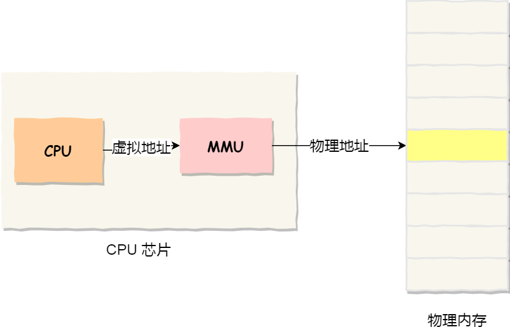

> 操作系统是如何管理虚拟地址与物理地址之间的关系？

主要有两种方式，分别是**内存分段和内存分页**，分段是比较早提出的，我们先来看看内存分段。

#### 1.2 内存分段

程序是由若干个逻辑分段组成的，如可由代码分段、数据分段、栈段、堆段组成。**不同的段是有不同的属性的，所以就用分段（\*Segmentation\*）的形式把这些段分离出来。**

> 分段机制下，虚拟地址和物理地址是如何映射的？

分段机制下的虚拟地址由两部分组成，**段选择因子**和**段内偏移量**。

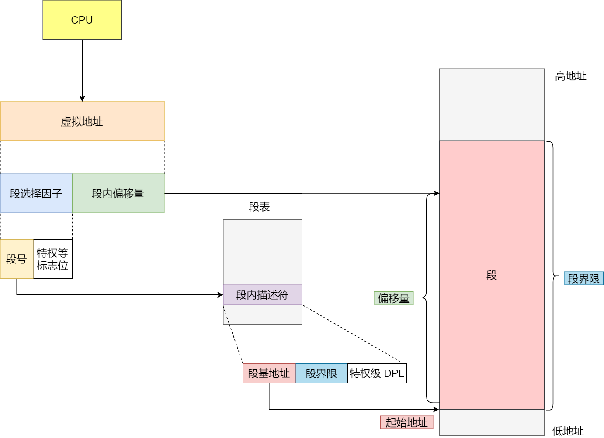

段选择因子和段内偏移量：

- **段选择因子**就保存在段寄存器里面。段选择子里面最重要的是**段号**，用作段表的索引。**段表**里面保存的是这个**段的基地址、段的界限和特权等级**等。
- 虚拟地址中的**段内偏移量**应该位于 0 和段界限之间，如果段内偏移量是合法的，就将段基地址加上段内偏移量得到物理内存地址。

在上面，知道了虚拟地址是通过**段表**与物理地址进行映射的，分段机制会把程序的虚拟地址分成 4 个段，每个段在段表中有一个项，在这一项找到段的基地址，再加上偏移量，于是就能找到物理内存中的地址，如下图：

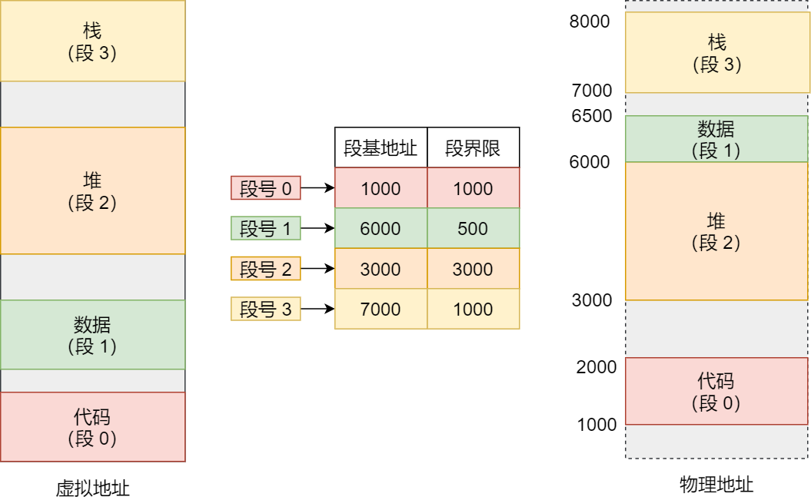

如果要访问段 3 中偏移量 500 的虚拟地址，我们可以计算出物理地址为，段 3 基地址 7000 + 偏移量 500 = 7500。

分段的办法很好，解决了程序本身不需要关心具体的物理内存地址的问题，但它也有一些不足之处：

- 第一个就是**内存碎片**的问题。
- 第二个就是**内存交换的效率低**的问题。

接下来，说说为什么会有这两个问题。

> 我们先来看看，分段为什么会产生内存碎片的问题？

我们来看看这样一个例子。假设有 1G 的物理内存，用户执行了多个程序，其中：

- 游戏占用了 512MB 内存
- 浏览器占用了 128MB 内存
- 音乐占用了 256 MB 内存。

这个时候，如果我们关闭了浏览器，则空闲内存还有 1024 - 512 - 256 = 256MB。

如果这个 256MB 不是连续的，被分成了两段 128 MB 内存，这就会导致没有空间再打开一个 200MB 的程序。

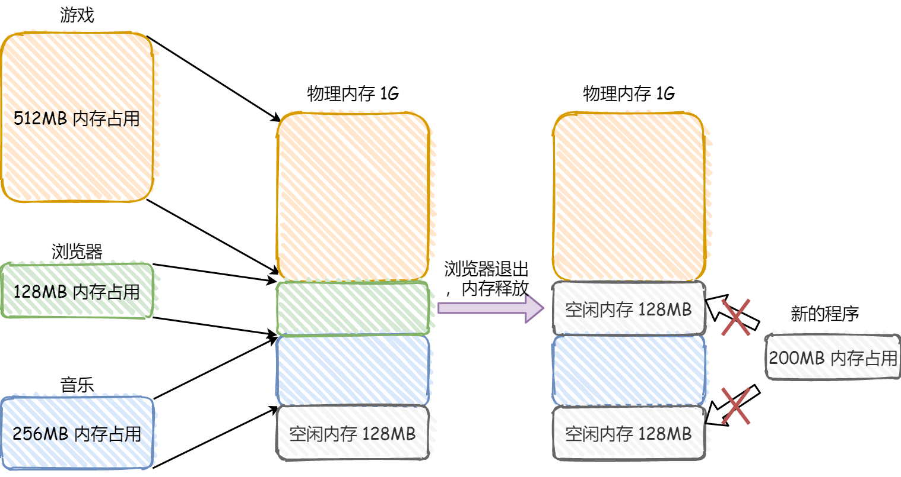

> 内存分段会出现内存碎片吗？

内存碎片主要分为，内部内存碎片和外部内存碎片。

内存分段管理可以做到段根据实际需求分配内存，所以有多少需求就分配多大的段，所以**不会出现内部内存碎片**。

但是由于每个段的长度不固定，所以多个段未必能恰好使用所有的内存空间，会产生了多个不连续的小物理内存，导致新的程序无法被装载，所以**会出现外部内存碎片**的问题。

解决「外部内存碎片」的问题就是**内存交换**。

可以把音乐程序占用的那 256MB 内存写到硬盘上，然后再从硬盘上读回来到内存里。不过再读回的时候，我们不能装载回原来的位置，而是紧紧跟着那已经被占用了的 512MB 内存后面。这样就能空缺出连续的 256MB 空间，于是新的 200MB 程序就可以装载进来。

这个内存交换空间，在 Linux 系统里，也就是我们常看到的 Swap 空间，这块空间是从硬盘划分出来的，用于内存与硬盘的空间交换。

> 再来看看，分段为什么会导致内存交换效率低的问题？

对于多进程的系统来说，用分段的方式，外部内存碎片是很容易产生的，产生了外部内存碎片，那不得不重新 `Swap` 内存区域，这个过程会产生性能瓶颈。

因为硬盘的访问速度要比内存慢太多了，每一次内存交换，我们都需要把一大段连续的内存数据写到硬盘上。

所以，**如果内存交换的时候，交换的是一个占内存空间很大的程序，这样整个机器都会显得卡顿。**

为了解决内存分段的「外部内存碎片和内存交换效率低」的问题，就出现了内存分页。

#### 1.3 内存分页

分段的好处就是能产生连续的内存空间，但是会出现「外部内存碎片和内存交换的空间太大」的问题。

要解决这些问题，那么就要想出能少出现一些内存碎片的办法。另外，当需要进行内存交换的时候，让需要交换写入或者从磁盘装载的数据更少一点，这样就可以解决问题了。这个办法，也就是**内存分页**（*Paging*）。

**分页是把整个虚拟和物理内存空间切成一段段固定尺寸的大小**。这样一个连续并且尺寸固定的内存空间，我们叫**页**（*Page*）。在 Linux 下，每一页的大小为 `4KB`。

虚拟地址与物理地址之间通过**页表**来映射，如下图：

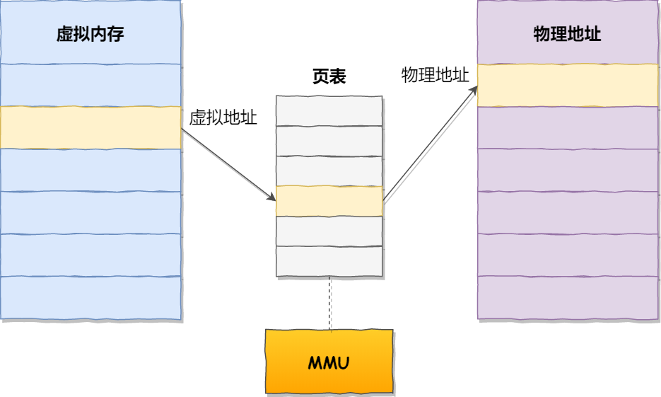

页表是存储在内存里的，**内存管理单元** （*MMU*）就做将虚拟内存地址转换成物理地址的工作。

而当进程访问的虚拟地址在页表中查不到时，系统会产生一个**缺页异常**，进入系统内核空间分配物理内存、更新进程页表，最后再返回用户空间，恢复进程的运行。

> 分页是怎么解决分段的「外部内存碎片和内存交换效率低」的问题？

内存分页由于内存空间都是预先划分好的，也就不会像内存分段一样，在段与段之间会产生间隙非常小的内存，这正是分段会产生外部内存碎片的原因。而**采用了分页，页与页之间是紧密排列的，所以不会有外部碎片。**

但是，因为内存分页机制分配内存的最小单位是一页，即使程序不足一页大小，我们最少只能分配一个页，所以页内会出现内存浪费，所以针对**内存分页机制会有内部内存碎片**的现象。

如果内存空间不够，操作系统会把其他正在运行的进程中的「最近没被使用」的内存页面给释放掉，也就是暂时写在硬盘上，称为**换出**（*Swap Out*）。一旦需要的时候，再加载进来，称为**换入**（*Swap In*）。所以，一次性写入磁盘的也只有少数的一个页或者几个页，不会花太多时间，**内存交换的效率就相对比较高。**


更进一步地，分页的方式使得我们在加载程序的时候，不再需要一次性都把程序加载到物理内存中。我们完全可以在进行虚拟内存和物理内存的页之间的映射之后，并不真的把页加载到物理内存里，而是**只有在程序运行中，需要用到对应虚拟内存页里面的指令和数据时，再加载到物理内存里面去。**

> 分页机制下，虚拟地址和物理地址是如何映射的？

在分页机制下，虚拟地址分为两部分，**页号**和**页内偏移**。页号作为页表的索引，**页表**包含物理页每页所在**物理内存的基地址**，这个基地址与页内偏移的组合就形成了物理内存地址，见下图。

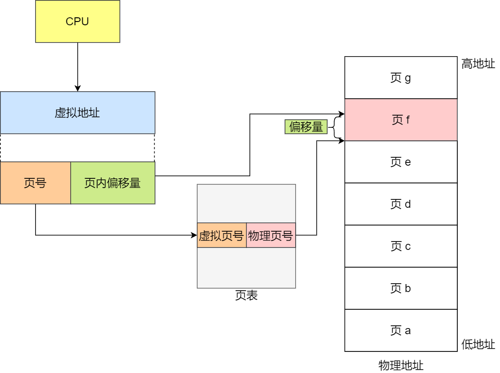

总结一下，对于一个内存地址转换，其实就是这样三个步骤：

- 把虚拟内存地址，切分成页号和偏移量；
- 根据页号，从页表里面，查询对应的物理页号；
- 直接拿物理页号，加上前面的偏移量，就得到了物理内存地址。

> 简单的分页有什么缺陷吗？

有空间上的缺陷。

因为操作系统是可以同时运行非常多的进程的，那这不就意味着页表会非常的庞大。

在 32 位的环境下，虚拟地址空间共有 4GB，假设一个页的大小是 4KB（$2^{12}$），那么就需要大约 100 万 （$2^{20}$） 个页。每个「页表项」需要 4 个字节大小来存储，那么整个 4GB 空间的映射就需要有 `4MB` 的内存来存储页表。

这 4MB 大小的页表，看起来也不是很大。但是要知道每个进程都是有自己的虚拟地址空间的，也就说都有自己的页表。

那么，`100` 个进程的话，就需要 `400MB` 的内存来存储页表，这是非常大的内存了，更别说 64 位的环境了。

##### 多级页表

要解决上面的问题，就需要采用一种叫作**多级页表**（*Multi-Level Page Table*）的解决方案。

在前面我们知道了，对于单页表的实现方式，在 32 位和页大小 `4KB` 的环境下，一个进程的页表需要装下 $2^{20}$个「页表项」，并且每个页表项是占用 4 字节大小的，于是相当于每个页表需占用 4MB 大小的空间。

我们把这个  $2^{20}$个「页表项」的单级页表再分页，将页表（一级页表）分为 `1024` （$2^{10}$）个页表（二级页表），每个表（二级页表）中包含 `1024` 个「页表项」，形成**二级分页**。如下图所示：

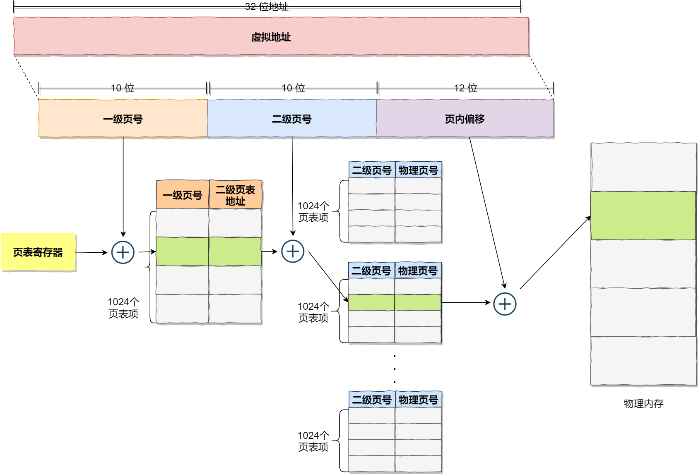

> 你可能会问，分了二级表，映射 4GB 地址空间就需要 4KB（一级页表）+ 4MB（二级页表）的内存，这样占用空间不是更大了吗？

当然如果 4GB 的虚拟地址全部都映射到了物理内存上的话，二级分页占用空间确实是更大了，但是，我们往往不会为一个进程分配那么多内存。

其实我们应该换个角度来看问题，还记得计算机组成原理里面无处不在的**局部性原理**么？

每个进程都有 4GB 的虚拟地址空间，而显然对于大多数程序来说，其使用到的空间远未达到 4GB，因为会存在部分对应的页表项都是空的，根本没有分配，对于已分配的页表项，如果存在最近一定时间未访问的页表，在物理内存紧张的情况下，操作系统会将页面换出到硬盘，也就是说不会占用物理内存。

如果使用了二级分页，一级页表就可以覆盖整个 4GB 虚拟地址空间，但**如果某个一级页表的页表项没有被用到，也就不需要创建这个页表项对应的二级页表了，即可以在需要时才创建二级页表**。做个简单的计算，假设只有 20% 的一级页表项被用到了，那么页表占用的内存空间就只有 4KB（一级页表） + 20% * 4MB（二级页表）= `0.804MB`，这对比单级页表的 `4MB` 是不是一个巨大的节约？

那么为什么不分级的页表就做不到这样节约内存呢？

我们从页表的性质来看，保存在内存中的页表承担的职责是将虚拟地址翻译成物理地址。假如虚拟地址在页表中找不到对应的页表项，计算机系统就不能工作了。

所以**页表一定要覆盖全部虚拟地址空间，不分级的页表就需要有 100 多万个页表项来映射，而二级分页则只需要 1024 个页表项**（此时一级页表覆盖到了全部虚拟地址空间，二级页表在需要时创建）。

> 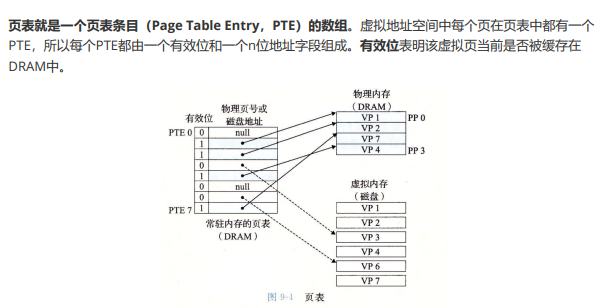

我们把二级分页再推广到多级页表，就会发现页表占用的内存空间更少了，这一切都要归功于对局部性原理的充分应用。

对于 64 位的系统，两级分页肯定不够了，就变成了四级目录，分别是：

- 全局页目录项 PGD（*Page Global Directory*）；
- 上层页目录项 PUD（*Page Upper Directory*）；
- 中间页目录项 PMD（*Page Middle Directory*）；
- 页表项 PTE（*Page Table Entry*）；


##### TLB

多级页表虽然解决了空间上的问题，但是虚拟地址到物理地址的转换就多了几道转换的工序，这显然就降低了这俩地址转换的速度，也就是带来了时间上的开销。

程序是有局部性的，即在一段时间内，整个程序的执行仅限于程序中的某一部分。相应地，执行所访问的存储空间也局限于某个内存区域。

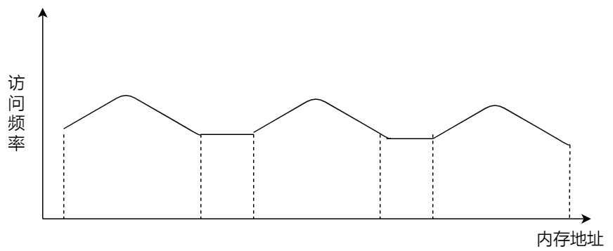

我们就可以利用这一特性，把最常访问的几个页表项存储到访问速度更快的硬件，于是计算机科学家们，就在 CPU 芯片中，加入了一个专门存放程序最常访问的页表项的 Cache，这个 Cache 就是 TLB（*Translation Lookaside Buffer*） ，通常称为页表缓存、转址旁路缓存、快表等。

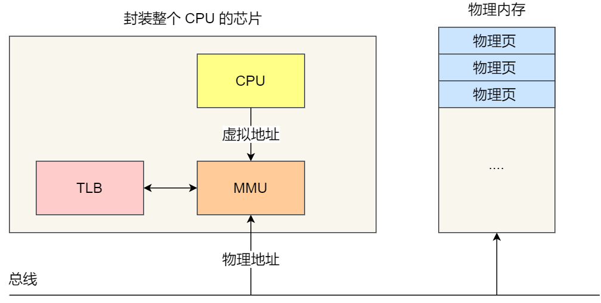

在 CPU 芯片里面，封装了内存管理单元（*Memory Management Unit*）芯片，它用来完成地址转换和 TLB 的访问与交互。

有了 TLB 后，那么 CPU 在寻址时，会先查 TLB，如果没找到，才会继续查常规的页表。

TLB 的命中率其实是很高的，因为程序最常访问的页就那么几个。

#### 1.4 段页式内存管理

内存分段和内存分页并不是对立的，它们是可以组合起来在同一个系统中使用的，那么组合起来后，通常称为**段页式内存管理**。


段页式内存管理实现的方式：

- 先将程序划分为多个有逻辑意义的段，也就是前面提到的分段机制；
- 接着再把每个段划分为多个页，也就是对分段划分出来的连续空间，再划分固定大小的页；

这样，地址结构就由**段号、段内页号和页内位移**三部分组成。

用于段页式地址变换的数据结构是每一个程序一张段表，每个段又建立一张页表，段表中的地址是页表的起始地址，而页表中的地址则为某页的物理页号，如图所示：

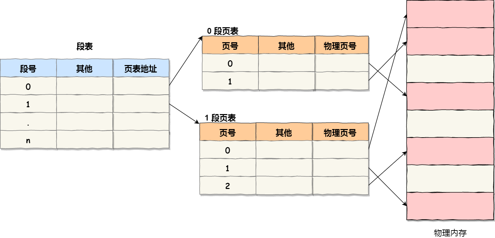

段页式地址变换中要得到物理地址须经过三次内存访问：

- 第一次访问段表，得到页表起始地址；
- 第二次访问页表，得到物理页号；
- 第三次将物理页号与页内位移组合，得到物理地址。

可用软、硬件相结合的方法实现段页式地址变换，这样虽然增加了硬件成本和系统开销，但提高了内存的利用率。

#### 1.5 Linux内存管理

那么，Linux 操作系统采用了哪种方式来管理内存呢？

> 在回答这个问题前，我们得先看看 Intel 处理器的发展历史。

早期 Intel 的处理器从 80286 开始使用的是段式内存管理。但是很快发现，光有段式内存管理而没有页式内存管理是不够的，这会使它的 X86 系列会失去市场的竞争力。因此，在不久以后的 80386 中就实现了页式内存管理。也就是说，80386 除了完成并完善从 80286 开始的段式内存管理的同时还实现了页式内存管理。

但是这个 80386 的页式内存管理设计时，没有绕开段式内存管理，而是建立在段式内存管理的基础上，这就意味着，**页式内存管理的作用是在由段式内存管理所映射而成的地址上再加上一层地址映射。**

由于此时由段式内存管理映射而成的地址不再是“物理地址”了，Intel 就称之为“线性地址”（也称虚拟地址）。于是，段式内存管理先将逻辑地址映射成线性地址，然后再由页式内存管理将线性地址映射成物理地址。


这里说明下逻辑地址和线性地址：

- 程序所使用的地址，通常是没被段式内存管理映射的地址，称为逻辑地址；
- 通过段式内存管理映射的地址，称为线性地址，也叫虚拟地址；

> 逻辑地址也叫相对地址，一个逻辑地址由两部份组成，段标识符: 段内偏移量。段标识符是由一个16位长的字段组成，称为段选择符。其中前13位是个索引号，后面3位包含一些硬件细节 。CPU将一个逻辑地址转换为物理地址，需要进行两步：首先将给定一个逻辑地址（其实是段内偏移量，这个一定要理解！！！），CPU要**利用其段式内存管理单元，先将逻辑地址转换成线性地址，再利用其页式内存管理单元，转换为最终物理地址**。

**如果CPU没有开启分页功能，线性地址就是物理地址；如果CPU开启了分页功能，MMU还需要查询业表来将线性地址转换为物理地址。**

逻辑地址是「段式内存管理」转换前的地址，线性地址则是「页式内存管理」转换前的地址。

> 了解完 Intel 处理器的发展历史后，我们再来说说 Linux 采用了什么方式管理内存？

**Linux 内存主要采用的是页式内存管理，但同时也不可避免地涉及了段机制**。

这主要是上面 Intel 处理器发展历史导致的，因为 Intel X86 CPU 一律对程序中使用的地址先进行段式映射，然后才能进行页式映射。既然 CPU 的硬件结构是这样，Linux 内核也只好服从 Intel 的选择。

但是事实上，Linux 内核所采取的办法是使段式映射的过程实际上不起什么作用。也就是说，“上有政策，下有对策”，若惹不起就躲着走。

**Linux 系统主要采用了分页管理，但是由于 Intel 处理器的发展史，Linux 系统无法避免分段管理**。于是 Linux 就把所有段的基地址设为 `0`，也就意味着程序的地址空间都是线性地址空间（虚拟地址），相当于屏蔽了 CPU 逻辑地址的概念，所以段只被用于访问控制和内存保护。

> 因为每个段的基地址为0，因此，逻辑地 址到线性地址映射保持不变，也就是说，偏移量就是线性地址，我们以后所提到的逻辑地址 和线性地址指的也就是同一地址。看来，Linux 巧妙地把段机制给绕过去了， 而完全利用了分页机制。如果不这么做的话，你的逻辑地址显然不是0~4G，还得通过段式管理去转换，很麻烦....

> 我们再来瞧一瞧，Linux 的虚拟地址空间是如何分布的？

在 Linux 操作系统中，虚拟地址空间的内部又被分为**内核空间和用户空间**两部分，不同位数的系统，地址空间的范围也不同。比如最常见的 32 位和 64 位系统，如下所示：


通过这里可以看出：

- `32` 位系统的内核空间占用 `1G`，位于最高处，剩下的 `3G` 是用户空间；
- `64` 位系统的内核空间和用户空间都是 `128T`，分别占据整个内存空间的最高和最低处，剩下的中间部分是未定义的。

再来说说，内核空间与用户空间的区别：

- 进程在用户态时，只能访问用户空间内存；
- 只有进入内核态后，才可以访问内核空间的内存；

虽然每个进程都各自有独立的虚拟内存，但是**每个虚拟内存中的内核地址，其实关联的都是相同的物理内存**。这样，进程切换到内核态后，就可以很方便地访问内核空间内存。

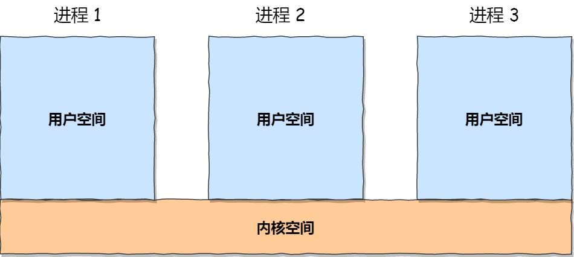

接下来，进一步了解虚拟空间的划分情况，用户空间和内核空间划分的方式是不同的，内核空间的分布情况就不多说了。

我们看看用户空间分布的情况，以 32 位系统为例，我画了一张图来表示它们的关系：


通过这张图你可以看到，用户空间内存，从**低到高**分别是 6 种不同的内存段：

- 程序文件段（.text），包括二进制可执行代码；
- 已初始化数据段（.data），包括静态常量；
- 未初始化数据段（.bss），包括未初始化的静态变量；
- 堆段，包括动态分配的内存，从低地址开始向上增长；
- 文件映射段，包括动态库、共享内存等，从低地址开始向上增长
- 栈段，包括局部变量和函数调用的上下文等。栈的大小是固定的，一般是 `8 MB`。当然系统也提供了参数，以便我们自定义大小；

在这 7 个内存段中，堆和文件映射段的内存是动态分配的。比如说，使用 C 标准库的 `malloc()` 或者 `mmap()` ，就可以分别在堆和文件映射段动态分配内存。

> 最后，说下虚拟内存有什么作用？

- 第一，虚拟内存可以使得进程对运行内存超过物理内存大小，因为程序运行符合局部性原理，CPU 访问内存会有很明显的重复访问的倾向性，对于那些没有被经常使用到的内存，我们可以把它换出到物理内存之外，比如硬盘上的 swap 区域。
- 第二，由于每个进程都有自己的页表，所以每个进程的虚拟内存空间就是相互独立的。进程也没有办法访问其他进程的页表，所以这些页表是私有的，这就解决了多进程之间地址冲突的问题。
- 第三，页表里的页表项中除了物理地址之外，还有一些标记属性的比特，比如控制一个页的读写权限，标记该页是否存在等。在内存访问方面，操作系统提供了更好的安全性。

#### 1.6 对于内存分段的补充

逻辑地址如何转换为线性地址 一个逻辑地址由两部份组成，段标识符: 段内偏移量。段标识符是由一个16位长的字段组成，称为段选择符。其中前13位是一个索引号。后面3位包含一些硬件细节，如图：

 

**最后两位涉及权限检查，也就是对内存访问的保护，一般os代码特权级很高，如果你此时的请求者特权级不高就访问不了os代码。** 索引号，或者直接理解成数组下标——那它总要对应一个数组吧，它又是什么索引呢？这是“段描述符(segment descriptor)”，段描述符具体地址描述了一个段。这样，很多个段描述符，就组了一个数组，叫“段描述符表”，这样，可以通过段标识符的前13位，直接在段描述符表中找到一个具体的段描述符，这个描述符就描述了一个段，由8个字节组成，如下图：

 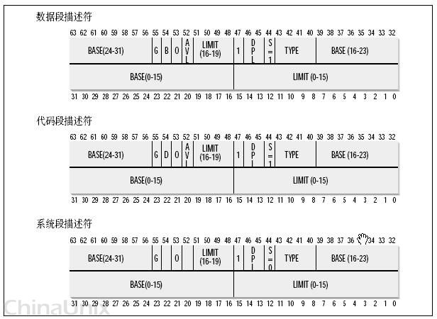

图示比较复杂，可以利用一个数据结构来定义它，不过，在此只关心一样，就是Base字段，它描述了一个段的开始位置的线性地址。 Intel设计的本意是，一些全局的段描述符，就放在“全局段描述符表(GDT)”中，一些局部的，例如每个进程自己的，就放在所谓的“局部段描述符表(LDT)”中。那究竟什么时候该用GDT，什么时候该用LDT呢？这是由段选择符中的T1字段表示的，=0，表示用GDT，=1表示用LDT。 GDT在内存中的地址和大小存放在CPU的gdtr控制寄存器中，而LDT则在ldtr寄存器中。 再看这张图比起来要直观些：

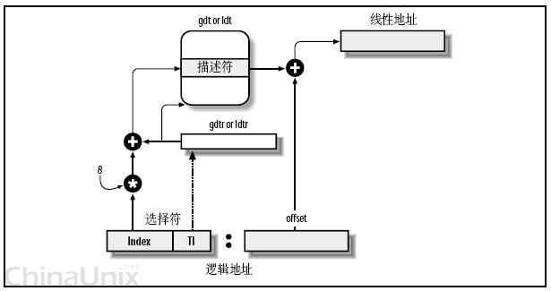 

 

首先，给定一个完整的逻辑地址[段选择符：段内偏移地址]，

1、看段选择符的T1=0还是1，知道当前要转换是GDT中的段，还是LDT中的段，再根据相应寄存器，得到其地址和大小。我们就有了一个数组了。

2、拿出段选择符中前13位，可以在这个数组中，查找到对应的段描述符，这样，它了Base，即基地址就知道了。

3、把Base + offset，就是要转换的线性地址了。 还是挺简单的，对于软件来讲，原则上就需要把硬件转换所需的信息准备好，就可以让硬件来完成这个转换了。

### 2 malloc是如何分配内存的？

#### 2.1  malloc是如何分配内存的？

实际上，malloc() 并不是系统调用，而是 C 库里的函数，用于动态分配内存。

malloc 申请内存的时候，会有两种方式向操作系统申请堆内存。

- 方式一：通过 brk() 系统调用从堆分配内存
- 方式二：通过 mmap() 系统调用在文件映射区域分配内存；

方式一实现的方式很简单，就是通过 brk() 函数将「堆顶」指针向高地址移动，获得新的内存空间。如下图：


方式二通过 mmap() 系统调用中「私有匿名映射」的方式，在文件映射区分配一块内存，也就是从文件映射区“偷”了一块内存。如下图：


> 什么场景下 malloc() 会通过 brk() 分配内存？又是什么场景下通过 mmap() 分配内存？

malloc() 源码里默认定义了一个阈值：

- 如果用户分配的内存小于 128 KB，则通过 brk() 申请内存；
- 如果用户分配的内存大于 128 KB，则通过 mmap() 申请内存；

#### 2.2 malloc() 分配的是物理内存吗？

不是的，**malloc() 分配的是虚拟内存**。

如果分配后的虚拟内存没有被访问的话，是不会将虚拟内存不会映射到物理内存，这样就不会占用物理内存了。

只有在访问已分配的虚拟地址空间的时候，操作系统通过查找页表，发现虚拟内存对应的页没有在物理内存中，就会触发缺页中断，然后操作系统会建立虚拟内存和物理内存之间的映射关系。

#### 2.3 malloc(1) 会分配多大的虚拟内存？

malloc() 在分配内存的时候，并不是老老实实按用户预期申请的字节数来分配内存空间大小，而是**会预分配更大的空间作为内存池**。

具体会预分配多大的空间，跟 malloc 使用的内存管理器有关系，我们就以 malloc 默认的内存管理器（Ptmalloc2）来分析。

接下里，我们做个实验，用下面这个代码，通过 malloc 申请 1 字节的内存时，看看操作系统实际分配了多大的内存空间。

```c++
#include <stdio.h>
#include <malloc.h>

int main() {

      //申请1字节的内存
      void *addr = malloc(1);
      printf("此1字节的内存起始地址：%x\n", addr);
      printf("使用cat /proc/%d/maps查看内存分配\n",getpid());

      //将程序阻塞，当输入任意字符时才往下执行
      getchar();

      //释放内存
      free(addr);
      printf("释放了1字节的内存，但heap堆并不会释放\n");

      getchar();
      return 0;
}
```


我们可以通过 /proc//maps 文件查看进程的内存分布情况。我在 maps 文件通过此 1 字节的内存起始地址过滤出了内存地址的范围。

```shell
[root@xiaolin ~]# cat /proc/3191/maps | grep d730
00d73000-00d94000 rw-p 00000000 00:00 0                                  [heap]
```

这个例子分配的内存小于 128 KB，所以是通过 brk() 系统调用向堆空间申请的内存，因此可以看到最右边有 [heap] 的标识。

可以看到，堆空间的内存地址范围是 00d73000-00d94000，这个范围大小是 132KB，也就说明了 **malloc(1) 实际上预分配 132K 字节的内存**。

可能有的同学注意到了，程序里打印的内存起始地址是 `d73010`，而 maps 文件显示堆内存空间的起始地址是 `d73000`，为什么会多出来 `0x10` （16字节）呢？这个问题，我们先放着，后面会说。

#### 2.4 free 释放内存，会归还给操作系统吗？

我们在上面的进程往下执行，看看通过 free() 函数释放内存后，堆内存还在吗？

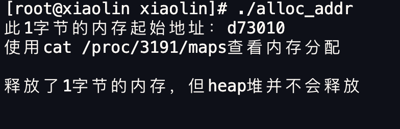

从下图可以看到，通过 free 释放内存后，堆内存还是存在的，并没有归还给操作系统。

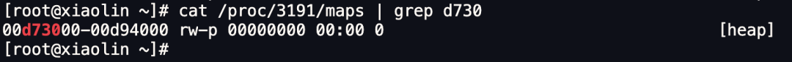

这是因为与其把这 1 字节释放给操作系统，不如先缓存着放进 malloc 的内存池里，当进程再次申请 1 字节的内存时就可以直接复用，这样速度快了很多。

当然，当进程退出后，操作系统就会回收进程的所有资源。

上面说的 free 内存后堆内存还存在，是针对 malloc 通过 brk() 方式申请的内存的情况。

如果 malloc 通过 mmap 方式申请的内存，free 释放内存后就会归归还给操作系统。

我们做个实验验证下， 通过 malloc 申请 128 KB 字节的内存，来使得 malloc 通过 mmap 方式来分配内存。

```c++
#include <stdio.h>
#include <malloc.h>

int main() {
      void *addr = malloc(128*1024);
      printf("此128KB字节的内存起始地址：%x\n", addr);
      printf("使用cat /proc/%d/maps查看内存分配\n",getpid());

      //将程序阻塞，当输入任意字符时才往下执行
      getchar();

      //释放内存
      free(addr);
      printf("释放了128KB字节的内存，内存也归还给了操作系统\n");

      getchar();
      return 0;
}
```

执行代码：

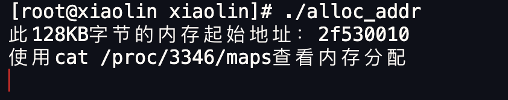

查看进程的内存的分布情况，可以发现最右边没有 [head] 标志，说明是通过 mmap 以匿名映射的方式从文件映射区分配的匿名内存。


然后我们释放掉这个内存看看：

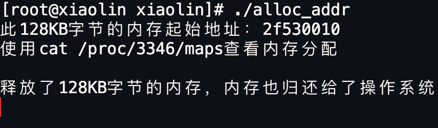

再次查看该 128 KB 内存的起始地址，可以发现已经不存在了，说明归还给了操作系统。


对于 「malloc 申请的内存，free 释放内存会归还给操作系统吗？」这个问题，我们可以做个总结了：

- malloc 通过 **brk()** 方式申请的内存，free 释放内存的时候，**并不会把内存归还给操作系统，而是缓存在 malloc 的内存池中，待下次使用**；
- malloc 通过 **mmap()** 方式申请的内存，free 释放内存的时候，**会把内存归还给操作系统，内存得到真正的释放**。

#### 2.5 为什么不全部使用 mmap 来分配内存？

因为向操作系统申请内存，是要通过系统调用的，执行系统调用是要进入内核态的，然后在回到用户态，运行态的切换会耗费不少时间。

所以，申请内存的操作应该避免频繁的系统调用，如果都用 mmap 来分配内存，等于每次都要执行系统调用。

另外，因为 mmap 分配的内存每次释放的时候，都会归还给操作系统，于是每次 mmap 分配的虚拟地址都是缺页状态的，然后在第一次访问该虚拟地址的时候，就会触发缺页中断。

也就是说，**频繁通过 mmap 分配的内存话，不仅每次都会发生运行态的切换，还会发生缺页中断（在第一次访问虚拟地址后），这样会导致 CPU 消耗较大**。

为了改进这两个问题，malloc 通过 brk() 系统调用在堆空间申请内存的时候，由于堆空间是连续的，所以直接预分配更大的内存来作为内存池，当内存释放的时候，就缓存在内存池中。

**等下次在申请内存的时候，就直接从内存池取出对应的内存块就行了，而且可能这个内存块的虚拟地址与物理地址的映射关系还存在，这样不仅减少了系统调用的次数，也减少了缺页中断的次数，这将大大降低 CPU 的消耗**。

#### 2.6 既然 brk 那么牛逼，为什么不全部使用 brk 来分配？

前面我们提到通过 brk 从堆空间分配的内存，并不会归还给操作系统，那么我们那考虑这样一个场景。

如果我们连续申请了 10k，20k，30k 这三片内存，如果 10k 和 20k 这两片释放了，变为了空闲内存空间，如果下次申请的内存小于 30k，那么就可以重用这个空闲内存空间。

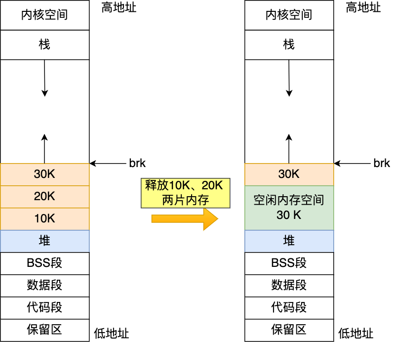

但是如果下次申请的内存大于 30k，没有可用的空闲内存空间，必须向 OS 申请，实际使用内存继续增大。

因此，随着系统频繁地 malloc 和 free ，尤其对于小块内存，堆内将产生越来越多不可用的碎片，导致“内存泄露”。而这种“泄露”现象使用 valgrind 是无法检测出来的。

所以，malloc 实现中，充分考虑了 sbrk 和 mmap 行为上的差异及优缺点，默认分配大块内存 (128KB) 才使用 mmap 分配内存空间。

#### 2.7 free() 函数只传入一个内存地址，为什么能知道要释放多大的内存？

 还记得，我前面提到， malloc 返回给用户态的内存起始地址比进程的堆空间起始地址多了 16 字节吗？

这个多出来的 16 字节就是保存了该内存块的描述信息，比如有该内存块的大小。


这样当执行 free() 函数时，free 会对传入进来的内存地址向左偏移 16 字节，然后从这个 16 字节的分析出当前的内存块的大小，自然就知道要释放多大的内存了。

### 3 内存满了，会发生什么？

先来说说第一个问题：虚拟内存有什么作用？

- 第一，**虚拟内存可以使得进程运行内存超过物理内存大小**，因为程序运行符合局部性原理，CPU 访问内存会有很明显的重复访问的倾向性，对于那些没有被经常使用到的内存，我们可以把它换出到物理内存之外，比如硬盘上的 swap 区域。
- 第二，由于每个进程都有自己的页表，所以每个进程的虚拟内存空间就是相互独立的。进程也没有办法访问其他进程的页表，所以这些页表是私有的，这就解决了多进程之间地址冲突的问题。
- 第三，页表里的页表项中除了物理地址之外，还有一些标记属性的比特，比如控制一个页的读写权限，标记该页是否存在等。在内存访问方面，操作系统提供了更好的安全性。

然后今天主要是聊聊第二个问题，「**系统内存紧张时，会发生什么？**」

#### 3.1 内存分配的过程是怎么样的？

应用程序通过 malloc 函数申请内存的时候，实际上申请的是虚拟内存，此时并不会分配物理内存。

当应用程序读写了这块虚拟内存，CPU 就会去访问这个虚拟内存， 这时会发现这个虚拟内存没有映射到物理内存， CPU 就会产生**缺页中断**，进程会从用户态切换到内核态，并将缺页中断交给内核的 Page Fault Handler （缺页中断函数）处理。

缺页中断处理函数会看是否有空闲的物理内存，如果有，就直接分配物理内存，并建立虚拟内存与物理内存之间的映射关系。

如果没有空闲的物理内存，那么内核就会开始进行**回收内存**的工作，回收的方式主要是两种：直接内存回收和后台内存回收。

- **后台内存回收**（kswapd）：在物理内存紧张的时候，会唤醒 kswapd 内核线程来回收内存，这个回收内存的过程**异步**的，不会阻塞进程的执行。
- **直接内存回收**（direct reclaim）：如果后台异步回收跟不上进程内存申请的速度，就会开始直接回收，这个回收内存的过程是**同步**的，会阻塞进程的执行。

如果直接内存回收后，空闲的物理内存仍然无法满足此次物理内存的申请，那么内核就会放最后的大招了 ——**触发 OOM （Out of Memory）机制**。

OOM Killer 机制会根据算法选择一个占用物理内存较高的进程，然后将其杀死，以便释放内存资源，如果物理内存依然不足，OOM Killer 会继续杀死占用物理内存较高的进程，直到释放足够的内存位置。

申请物理内存的过程如下图：

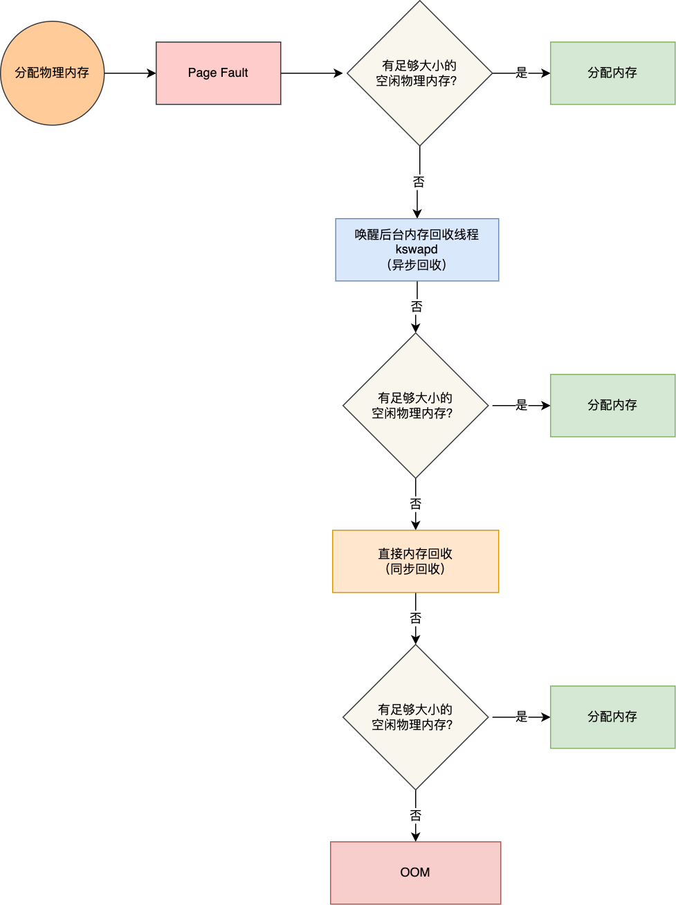

#### 3.2 哪些内存可以被回收？

系统内存紧张的时候，就会进行回收内测的工作，那具体哪些内存是可以被回收的呢？

主要有两类内存可以被回收，而且它们的回收方式也不同。

- **文件页**（File-backed Page）：内核缓存的磁盘数据（Buffer）和内核缓存的文件数据（Cache）都叫作文件页。大部分文件页，都可以直接释放内存，以后有需要时，再从磁盘重新读取就可以了。而那些被应用程序修改过，并且暂时还没写入磁盘的数据（也就是脏页），就得先写入磁盘，然后才能进行内存释放。所以，**回收干净页的方式是直接释放内存，回收脏页的方式是先写回磁盘后再释放内存**。
- **匿名页**（Anonymous Page）：这部分内存没有实际载体，不像文件缓存有硬盘文件这样一个载体，比如堆、栈数据等。这部分内存很可能还要再次被访问，所以不能直接释放内存，它们**回收的方式是通过 Linux 的 Swap 机制**，**Swap 会把不常访问的内存先写到磁盘中，然后释放这些内存，给其他更需要的进程使用。再次访问这些内存时，重新从磁盘读入内存就可以了。**

文件页和匿名页的回收都是基于 LRU 算法，也就是优先回收不常访问的内存。LRU 回收算法，实际上维护着 active 和 inactive 两个双向链表，其中：

- **active_list** 活跃内存页链表，这里存放的是最近被访问过（活跃）的内存页；
- **inactive_list** 不活跃内存页链表，这里存放的是很少被访问（非活跃）的内存页；

越接近链表尾部，就表示内存页越不常访问。这样，在回收内存时，系统就可以根据活跃程度，优先回收不活跃的内存。

活跃和非活跃的内存页，按照类型的不同，又分别分为文件页和匿名页。可以从 /proc/meminfo 中，查询它们的大小，比如：

```shell
# grep表示只保留包含active的指标（忽略大小写）
# sort表示按照字母顺序排序
[root@xiaolin ~]# cat /proc/meminfo | grep -i active | sort
Active:           901456 kB
Active(anon):     227252 kB
Active(file):     674204 kB
Inactive:         226232 kB
Inactive(anon):    41948 kB
Inactive(file):   184284 kB
```

#### 3.3 回收内存带来的性能影响

在前面我们知道了回收内存有两种方式。

- 一种是后台内存回收，也就是唤醒 kswapd 内核线程，这种方式是异步回收的，不会阻塞进程。
- 一种是直接内存回收，这种方式是同步回收的，会阻塞进程，这样就会造成很长时间的延迟，以及系统的 CPU 利用率会升高，最终引起系统负荷飙高。

可被回收的内存类型有文件页和匿名页：

- 文件页的回收：对于干净页是直接释放内存，这个操作不会影响性能，而对于脏页会先写回到磁盘再释放内存，这个操作会发生磁盘 I/O 的，这个操作是会影响系统性能的。
- 匿名页的回收：如果开启了 Swap 机制，那么 Swap 机制会将不常访问的匿名页换出到磁盘中，下次访问时，再从磁盘换入到内存中，这个操作是会影响系统性能的。

**可以看到，回收内存的操作基本都会发生磁盘 I/O 的，如果回收内存的操作很频繁，意味着磁盘 I/O 次数会很多，这个过程势必会影响系统的性能，整个系统给人的感觉就是很卡。**

下面针对回收内存导致的性能影响，说说常见的解决方式。

##### **调整文件页和匿名页的回收倾向**

从文件页和匿名页的回收操作来看，文件页的回收操作对系统的影响相比匿名页的回收操作会少一点，因为文件页对于干净页回收是不会发生磁盘 I/O 的，而匿名页的 Swap 换入换出这两个操作都会发生磁盘 I/O。

Linux 提供了一个 `/proc/sys/vm/swappiness` 选项，用来调整文件页和匿名页的回收倾向。

swappiness 的范围是 0-100，数值越大，越积极使用 Swap，也就是更倾向于回收匿名页；数值越小，越消极使用 Swap，也就是更倾向于回收文件页。

```shell
[root@xiaolin ~]# cat /proc/sys/vm/swappiness
0
```

一般建议 swappiness 设置为 0（默认值是 60），这样在回收内存的时候，会更倾向于文件页的回收，但是并不代表不会回收匿名页。

##### 尽早触发kswapd内核线程异步回收内存

> 如何查看系统的直接内存回收和后台内存回收的指标？

我们可以使用 `sar -B 1` 命令来观察：

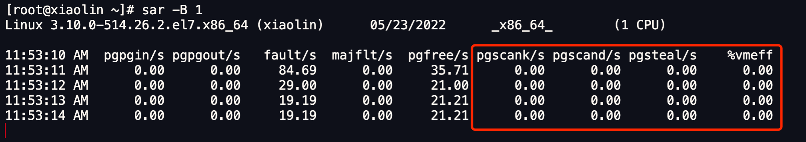

图中红色框住的就是后台内存回收和直接内存回收的指标，它们分别表示：

- pgscank/s : kswapd(后台回收线程) 每秒扫描的 page 个数。
- pgscand/s: 应用程序在内存申请过程中每秒直接扫描的 page 个数。
- pgsteal/s: 扫描的 page 中每秒被回收的个数（pgscank+pgscand）。

如果系统时不时发生抖动，并且在抖动的时间段里如果通过 sar -B 观察到 pgscand 数值很大，那大概率是因为「直接内存回收」导致的。

> 抖动：频繁缺页中断

针对这个问题，解决的办法就是，可以通过尽早的触发「后台内存回收」来避免应用程序进行直接内存回收。

> 什么条件下才能触发 kswapd 内核线程回收内存呢？

内核定义了三个内存阈值（watermark，也称为水位），用来衡量当前剩余内存（pages_free）是否充裕或者紧张，分别是：

- 页最小阈值（pages_min）；
- 页低阈值（pages_low）；
- 页高阈值（pages_high）；

这三个内存阈值会划分为四种内存使用情况，如下图：

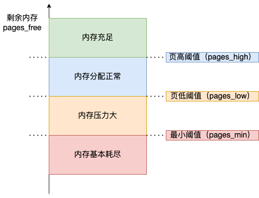

kswapd 会定期扫描内存的使用情况，根据剩余内存（pages_free）的情况来进行内存回收的工作。

- 图中绿色部分：如果剩余内存（pages_free）大于 页高阈值（pages_high），说明剩余内存是充足的；
- 图中蓝色部分：如果剩余内存（pages_free）在页高阈值（pages_high）和页低阈值（pages_low）之间，说明内存有一定压力，但还可以满足应用程序申请内存的请求；
- 图中橙色部分：如果剩余内存（pages_free）在页低阈值（pages_low）和页最小阈值（pages_min）之间，说明内存压力比较大，剩余内存不多了。**这时 kswapd0 会执行内存回收，直到剩余内存大于高阈值（pages_high）为止**。虽然会触发内存回收，但是不会阻塞应用程序，因为两者关系是异步的。

- 图中红色部分：如果剩余内存（pages_free）小于页最小阈值（pages_min），说明用户可用内存都耗尽了，此时就会**触发直接内存回收**，这时应用程序就会被阻塞，因为两者关系是同步的。

可以看到，当剩余内存页（pages_free）小于页低阈值（pages_low），就会触发 kswapd 进行后台回收，然后 kswapd 会一直回收到剩余内存页（pages_free）大于页高阈值（pages_high）。

也就是说 kswapd 的活动空间只有 pages_low 与 pages_min 之间的这段区域，如果剩余内存低于了 pages_min 会触发直接内存回收，高于了 pages_high 又不会唤醒 kswapd。

页低阈值（pages_low）可以通过内核选项 `/proc/sys/vm/min_free_kbytes` （该参数代表系统所保留空闲内存的最低限）来间接设置。

min_free_kbytes 虽然设置的是页最小阈值（pages_min），但是页高阈值（pages_high）和页低阈值（pages_low）都是根据页最小阈值（pages_min）计算生成的，它们之间的计算关系如下：

```text
pages_min = min_free_kbytes
pages_low = pages_min*5/4
pages_high = pages_min*3/2
```

如果系统时不时发生抖动，并且通过 sar -B 观察到 pgscand 数值很大，那大概率是因为直接内存回收导致的，这时可以增大 min_free_kbytes 这个配置选项来及早地触发后台回收，然后继续观察 pgscand 是否会降为 0。

增大了 min_free_kbytes 配置后，这会使得系统预留过多的空闲内存，从而在一定程度上降低了应用程序可使用的内存量，这在一定程度上浪费了内存。极端情况下设置 min_free_kbytes 接近实际物理内存大小时，留给应用程序的内存就会太少而可能会频繁地导致 OOM 的发生。

> 增大了pages_min，pages_low这些后，在这之间虽然还有很多空闲内存，但还是会启动kswapd来进行回收进程的内存页。

所以在调整 min_free_kbytes 之前，需要先思考一下，应用程序更加关注什么，如果关注延迟那就适当地增大 min_free_kbytes，如果关注内存的使用量那就适当地调小 min_free_kbytes。

### NUMA 架构下的内存回收策略

> 什么是 NUMA 架构？

再说 NUMA 架构前，先给大家说说 SMP 架构，这两个架构都是针对 CPU 的。

SMP 指的是一种**多个 CPU 处理器共享资源的电脑硬件架构**，也就是说每个 CPU 地位平等，它们共享相同的物理资源，包括总线、内存、IO、操作系统等。每个 CPU 访问内存所用时间都是相同的，因此，这种系统也被称为一致存储访问结构（UMA，Uniform Memory Access）。

随着 CPU 处理器核数的增多，多个 CPU 都通过一个总线访问内存，这样总线的带宽压力会越来越大，同时每个 CPU 可用带宽会减少，这也就是 SMP 架构的问题。

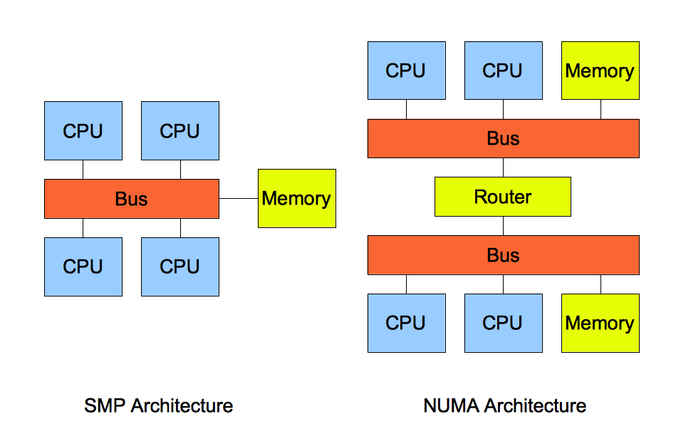

为了解决 SMP 架构的问题，就研制出了 NUMA 结构，即非一致存储访问结构（Non-uniform memory access，NUMA）。

NUMA 架构将每个 CPU 进行了分组，每一组 CPU 用 Node 来表示，一个 Node 可能包含多个 CPU 。

**每个 Node 有自己独立的资源，包括内存、IO 等**，每个 Node 之间可以通过互联模块总线（QPI）进行通信，所以，也就意味着每个 Node 上的 CPU 都可以访问到整个系统中的所有内存。但是，访问远端 Node 的内存比访问本地内存要耗时很多。

> NUMA 架构跟回收内存有什么关系？

在 NUMA 架构下，当某个 Node 内存不足时，系统可以从其他 Node 寻找空闲内存，也可以从本地内存中回收内存。

具体选哪种模式，可以通过 /proc/sys/vm/zone_reclaim_mode 来控制。它支持以下几个选项：

- 0 （默认值）：在回收本地内存之前，在其他 Node 寻找空闲内存；
- 1：只回收本地内存；
- 2：只回收本地内存，在本地回收内存时，可以将文件页中的脏页写回硬盘，以回收内存。
- 4：只回收本地内存，在本地回收内存时，可以用 swap 方式回收内存。

在使用 NUMA 架构的服务器，如果系统出现还有一半内存的时候，却发现系统频繁触发「直接内存回收」，导致了影响了系统性能，那么大概率是因为 zone_reclaim_mode 没有设置为 0 ，导致当本地内存不足的时候，只选择回收本地内存的方式，而不去使用其他 Node 的空闲内存。

虽然说访问远端 Node 的内存比访问本地内存要耗时很多，但是相比内存回收的危害而言，访问远端 Node 的内存带来的性能影响还是比较小的。因此，zone_reclaim_mode 一般建议设置为 0。

#### 3.4 如何保护一个进程不被 OOM 杀掉呢？ 

在系统空闲内存不足的情况，进程申请了一个很大的内存，如果直接内存回收都无法回收出足够大的空闲内存，那么就会触发 OOM 机制，内核就会根据算法选择一个进程杀掉。

Linux 到底是根据什么标准来选择被杀的进程呢？这就要提到一个在 Linux 内核里有一个 `oom_badness()` 函数，它会把系统中可以被杀掉的进程扫描一遍，并对每个进程打分，得分最高的进程就会被首先杀掉。

进程得分的结果受下面这两个方面影响：

- 第一，进程已经使用的物理内存页面数。
- 第二，每个进程的 OOM 校准值 oom_score_adj。它是可以通过 `/proc/[pid]/oom_score_adj` 来配置的。我们可以在设置 -1000 到 1000 之间的任意一个数值，调整进程被 OOM Kill 的几率。

函数 oom_badness() 里的最终计算方法是这样的：

```c
// points 代表打分的结果
// process_pages 代表进程已经使用的物理内存页面数
// oom_score_adj 代表 OOM 校准值
// totalpages 代表系统总的可用页面数
points = process_pages + oom_score_adj*totalpages/1000
```

**用「系统总的可用页面数」乘以 「OOM 校准值 oom_score_adj」再除以 1000，最后再加上进程已经使用的物理页面数，计算出来的值越大，那么这个进程被 OOM Kill 的几率也就越大**。

每个进程的 oom_score_adj 默认值都为 0，所以最终得分跟进程自身消耗的内存有关，消耗的内存越大越容易被杀掉。我们可以通过调整 oom_score_adj 的数值，来改成进程的得分结果：

- 如果你不想某个进程被首先杀掉，那你可以调整该进程的 oom_score_adj，从而改变这个进程的得分结果，降低该进程被 OOM 杀死的概率。
- 如果你想某个进程无论如何都不能被杀掉，那你可以将 oom_score_adj 配置为 -1000。

我们最好将一些很重要的系统服务的 oom_score_adj 配置为 -1000，比如 sshd，因为这些系统服务一旦被杀掉，我们就很难再登陆进系统了。

但是，不建议将我们自己的业务程序的 oom_score_adj 设置为 -1000，因为业务程序一旦发生了内存泄漏，而它又不能被杀掉，这就会导致随着它的内存开销变大，OOM killer 不停地被唤醒，从而把其他进程一个个给杀掉。

### 4 在4GB物理内存的机器上申请8G内存会怎么样？

这个问题在没有前置条件下，就说出答案就是耍流氓。这个问题要考虑三个前置条件：

- 操作系统是 32 位的，还是 64 位的？
- 申请完 8G 内存后会不会被使用？
- 操作系统有没有使用 Swap 机制？

#### 4.1 操作系统虚拟内存大小

应用程序通过 malloc 函数申请内存的时候，实际上申请的是虚拟内存，此时并不会分配物理内存。

当应用程序读写了这块虚拟内存，CPU 就会去访问这个虚拟内存， 这时会发现这个虚拟内存没有映射到物理内存， CPU 就会产生**缺页中断**，进程会从用户态切换到内核态，并将缺页中断交给内核的 Page Fault Handler （缺页中断函数）处理。

缺页中断处理函数会看是否有空闲的物理内存：

- 如果有，就直接分配物理内存，并建立虚拟内存与物理内存之间的映射关系。
- 如果没有空闲的物理内存，那么内核就会开始进行[回收内存 (opens new window)](https://xiaolincoding.com/os/3_memory/mem_reclaim.html)的工作，如果回收内存工作结束后，空闲的物理内存仍然无法满足此次物理内存的申请，那么内核就会放最后的大招了触发 OOM （Out of Memory）机制。

32 位操作系统和 64 位操作系统的虚拟地址空间大小是不同的，在 Linux 操作系统中，虚拟地址空间的内部又被分为**内核空间和用户空间**两部分，如下所示：

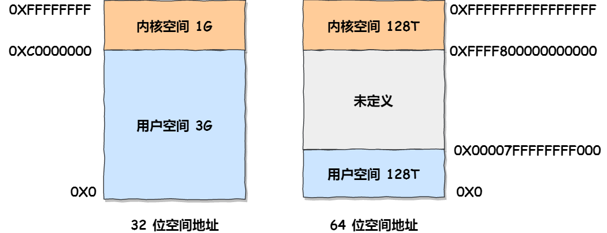

通过这里可以看出：

- `32` 位系统的内核空间占用 `1G`，位于最高处，剩下的 `3G` 是用户空间
- `64` 位系统的内核空间和用户空间都是 `128T`，分别占据整个内存空间的最高和最低处，剩下的中间部分是未定义的。

> 现在可以回答这个问题了：在 32 位操作系统、4GB 物理内存的机器上，申请 8GB 内存，会怎么样？

因为 32 位操作系统，进程最多只能申请 3 GB 大小的虚拟内存空间，所以进程申请 8GB 内存的话，在申请虚拟内存阶段就会失败（我手上没有 32 位操作系统测试，我估计失败的原因是 OOM）。

64 位操作系统，进程可以使用 128 TB 大小的虚拟内存空间，所以进程申请 8GB 内存是没问题的，因为进程申请内存是申请虚拟内存，只要不读写这个虚拟内存，操作系统就不会分配物理内存。

我们可以简单做个测试，我的服务器是 64 位操作系统，但是物理内存只有 2 GB：

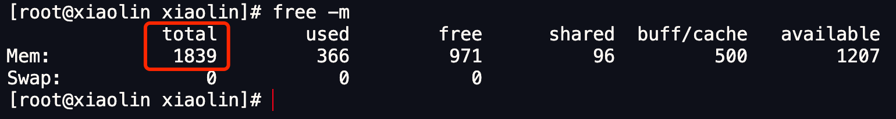

现在，我在机器上，连续申请 4 次 1 GB 内存，也就是一共申请了 4 GB 内存，注意下面代码只是单纯分配了虚拟内存，并没有使用该虚拟内存：

```c++
#include <stdio.h>
#include <stdlib.h>
#include <string.h>
#include <errno.h>

#define MEM_SIZE 1024 * 1024 * 1024

int main() {
    char* addr[4];
    int i = 0;
    for(i = 0; i < 4; ++i) {
        addr[i] = (char*) malloc(MEM_SIZE);
        if(!addr[i]) {
            printf("执行 malloc 失败, 错误：%s\n",strerror(errno));
		        return -1;
        }
        printf("主线程调用malloc后，申请1gb大小得内存，此内存起始地址：0X%x\n", addr[i]);
    }
    
    //输入任意字符后，才结束
    getchar();
    return 0;
}
```

然后运行这个代码，可以看到，我的物理内存虽然只有 2GB，但是程序正常分配了 4GB 大小的虚拟内存：


我们可以通过下面这条命令查看进程（test）的虚拟内存大小：

```shell
# ps aux | grep test
USER       PID %CPU %MEM    VSZ   RSS TTY      STAT START   TIME COMMAND
root      7797  0.0  0.0 4198540  352 pts/1    S+   16:58   0:00 ./test
```

其中，VSZ 就代表进程使用的虚拟内存大小，RSS 代表进程使用的物理内存大小。可以看到，VSZ 大小为 4198540，也就是 4GB 的虚拟内存。

#### 4.2 swap机制的作用

前面讨论在 32 位/64 位操作系统环境下，申请的虚拟内存超过物理内存后会怎么样？

- 在 32 位操作系统，因为进程最大只能申请 3 GB 大小的虚拟内存，所以直接申请 8G 内存，会申请失败。
- 在 64 位操作系统，因为进程最大只能申请 128 TB 大小的虚拟内存，即使物理内存只有 4GB，申请 8G 内存也是没问题，因为申请的内存是虚拟内存。

**程序申请的虚拟内存，如果没有被使用，它是不会占用物理空间的。**

**当访问这块虚拟内存后，操作系统才会进行物理内存分配。**

**如果申请物理内存大小超过了空闲物理内存大小，就要看操作系统有没有开启 Swap 机制**：

- 如果没有开启 Swap 机制，程序就会直接 OOM；
- 如果有开启 Swap 机制，程序可以正常运行。

> 什么是 Swap 机制？

当系统的物理内存不够用的时候，就需要将物理内存中的一部分空间释放出来，以供当前运行的程序使用。那些被释放的空间可能来自一些很长时间没有什么操作的程序，这些被释放的空间会被临时保存到磁盘，等到那些程序要运行时，再从磁盘中恢复保存的数据到内存中。

另外，当内存使用存在压力的时候，会开始触发内存回收行为，会把这些不常访问的内存先写到磁盘中，然后释放这些内存，给其他更需要的进程使用。再次访问这些内存时，重新从磁盘读入内存就可以了。

这种，将内存数据换出磁盘，又从磁盘中恢复数据到内存的过程，就是 Swap 机制负责的。

Swap 就是把一块磁盘空间或者本地文件，当成内存来使用，它包含换出和换入两个过程：

- **换出（Swap Out）** ，是把进程暂时不用的内存数据存储到磁盘中，并释放这些数据占用的内存；
- **换入（Swap In）**，是在进程再次访问这些内存的时候，把它们从磁盘读到内存中来；

Swap 换入换出的过程如下图：

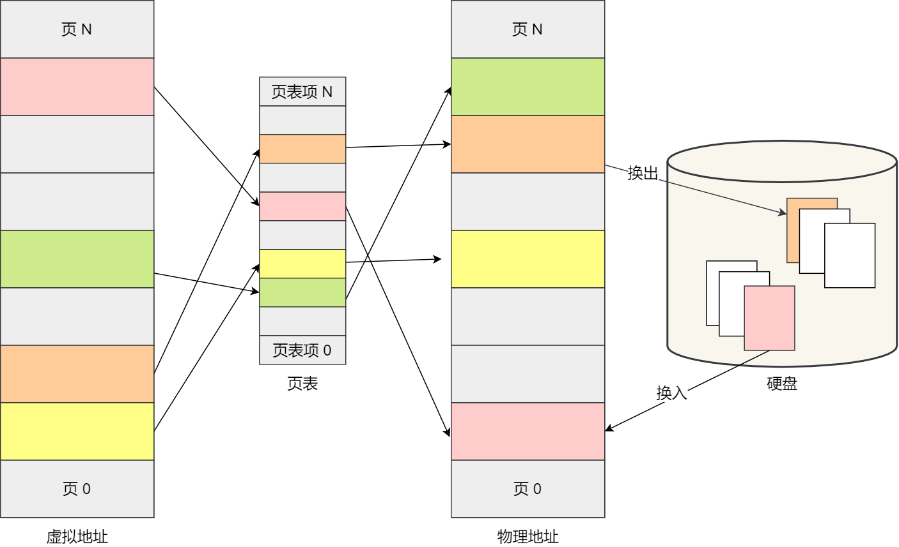

使用 Swap 机制优点是，应用程序实际可以使用的内存空间将远远超过系统的物理内存。

由于硬盘空间的价格远比内存要低，因此这种方式无疑是经济实惠的。当然，频繁地读写硬盘，会显著降低操作系统的运行速率，这也是 Swap 的弊端。

Linux 中的 Swap 机制会在内存不足和内存闲置的场景下触发：

- **内存不足**：当系统需要的内存超过了可用的物理内存时，内核会将内存中不常使用的内存页交换到磁盘上为当前进程让出内存，保证正在执行的进程的可用性，这个内存回收的过程是强制的直接内存回收（Direct Page Reclaim）。直接内存回收是同步的过程，会阻塞当前申请内存的进程。
- **内存闲置**：应用程序在启动阶段使用的大量内存在启动后往往都不会使用，通过后台运行的守护进程（kSwapd），我们可以将这部分只使用一次的内存交换到磁盘上为其他内存的申请预留空间。kSwapd 是 Linux 负责页面置换（Page replacement）的守护进程，它也是负责交换闲置内存的主要进程，它会在[空闲内存低于一定水位 (opens new window)](https://xiaolincoding.com/os/3_memory/mem_reclaim.html#尽早触发-kSwapd-内核线程异步回收内存)时，回收内存页中的空闲内存保证系统中的其他进程可以尽快获得申请的内存。kSwapd 是后台进程，所以回收内存的过程是异步的，不会阻塞当前申请内存的进程。

Linux 提供了两种不同的方法启用 Swap，分别是 Swap 分区（Swap Partition）和 Swap 文件。

- Swap 分区是硬盘上的独立区域，该区域只会用于交换分区，其他的文件不能存储在该区域上，我们可以使用 `Swapon -s` 命令查看当前系统上的交换分区；
- Swap 文件是文件系统中的特殊文件，它与文件系统中的其他文件也没有太多的区别；

> Swap 换入换出的是什么类型的内存？

内核缓存的文件数据，因为都有对应的磁盘文件，所以在回收文件数据的时候， 直接写回到对应的文件就可以了。

但是像进程的堆、栈数据等，它们是没有实际载体，这部分内存被称为匿名页。而且这部分内存很可能还要再次被访问，所以不能直接释放内存，于是就需要有一个能保存匿名页的磁盘载体，这个载体就是 Swap 分区。

匿名页回收的方式是通过 Linux 的 Swap 机制，Swap 会把不常访问的内存先写到磁盘中，然后释放这些内存，给其他更需要的进程使用。再次访问这些内存时，重新从磁盘读入内存就可以了。

接下来，通过两个实验，看看申请的物理内存超过物理内存会怎样？

- 实验一：没有开启 Swap 机制
- 实验二：有开启 Swap 机制

##### 实验一：没有开启Swap机制

我的服务器是 64 位操作系统，但是物理内存只有 2 GB，而且没有 Swap 分区：


我们改一下前面的代码，使得在申请完 4GB 虚拟内存后，通过 memset 函数访问这个虚拟内存，看看在没有 Swap 分区的情况下，会发生什么？

```c
#include <stdio.h>
#include <stdlib.h>
#include <string.h>
#include <errno.h>

#define MEM_SIZE 1024 * 1024 * 1024

int main() {
    char* addr[4];
    int i = 0;
    for(i = 0; i < 4; ++i) {
        addr[i] = (char*) malloc(MEM_SIZE);
        if(!addr[i]) {
            printf("执行 malloc 失败, 错误：%s\n",strerror(errno));
            return -1;
        }
        printf("主线程调用malloc后，申请1gb大小得内存，此内存起始地址：0X%x\n", addr[i]);
    }

    for(i = 0; i < 4; ++i) {
        printf("开始访问第 %d 块虚拟内存(每一块虚拟内存为 1 GB)\n", i + 1);
        memset(addr[i], 0, MEM_SIZE); // 填充数据
    }
    
    //输入任意字符后，才结束
    getchar();
    return 0;
}
```

运行结果：


可以看到，在访问第 2 块虚拟内存（每一块虚拟内存是 1 GB）的时候，因为超过了机器的物理内存（2GB），进程（test）被操作系统杀掉了。

通过查看 message 系统日志，可以发现该进程是被操作系统 OOM killer 机制杀掉了，日志里报错了 Out of memory，也就是发生 OOM（内存溢出错误）。


> 什么是 OOM?

内存溢出(Out Of Memory，简称OOM)是指应用系统中存在无法回收的内存或使用的内存过多，最终使得程序运行要用到的内存大于能提供的最大内存。此时程序就运行不了，系统会提示内存溢出。

##### 实验二：有开启Swap机制

笔记本是 64 位操作系统，物理内存是 8 GB， 目前 Swap 分区大小为 1 GB（注意这个大小不是固定不变的，Swap 分区总大小是会动态变化的，当没有使用 Swap 分区时，Swap 分区总大小是 0；当使用了 Swap 分区，Swap 分区总大小会增加至 1 GB；当 Swap 分区已使用的大小超过 1 GB 时；Swap 分区总大小就会增加到至 2 GB；当 Swap 分区已使用的大小超过 2 GB 时；Swap 分区总大小就增加至 3GB，如此往复。这个估计是 macos 自己实现的，Linux 的分区则是固定大小的，Swap 分区不会根据使用情况而自动增长）。

为了方便观察磁盘 I/O 情况，我们改进一下前面的代码，分配完 32 GB虚拟内存后（笔记本物理内存是 8 GB），通过一个 while 循环频繁访问虚拟内存，代码如下：

```c
#include <stdio.h>
#include <stdlib.h>
#include <string.h>

#define MEM_SIZE 32 * 1024 * 1024 * 1024

int main() {
    char* addr = (char*) malloc((long)MEM_SIZE);
    printf("主线程调用malloc后，目前共申请了 32gb 的虚拟内存\n");
    
    //循环频繁访问虚拟内存
    while(1) {
          printf("开始访问 32gb 大小的虚拟内存...\n");
          memset(addr, 0, (long)MEM_SIZE);
    }
    return 0;
}
```

运行结果如下：


可以看到，在有 Swap 分区的情况下，即使笔记本物理内存是 8 GB，申请并使用 32 GB 内存是没问题，程序正常运行了，并没有发生 OOM。

> 有了 Swap 分区，是不是意味着进程可以使用的内存是无上限的？

当然不是，我把上面的代码改成了申请 64GB 内存后，当进程申请完 64GB 虚拟内存后，使用到 56 GB （这个不要理解为占用的物理内存，理解为已被访问的虚拟内存大小，也就是在物理内存呆过的内存大小）的时候，进程就被系统 kill 掉了

#### 4.3 总结

至此， 验证完成了。简单总结下：

- 在 32 位操作系统，因为进程最大只能申请 3 GB 大小的虚拟内存，所以直接申请 8G 内存，会申请失败。
- 在 64位 位操作系统，因为进程最大只能申请 128 TB 大小的虚拟内存，即使物理内存只有 4GB，申请 8G 内存也是没问题，因为申请的内存是虚拟内存。如果这块虚拟内存被访问了，要看系统有没有 Swap 分区：
  - 如果没有 Swap 分区，因为物理空间不够，进程会被操作系统杀掉，原因是 OOM（内存溢出）；
  - 如果有 Swap 分区，即使物理内存只有 4GB，程序也能正常使用 8GB 的内存，进程可以正常运行；

