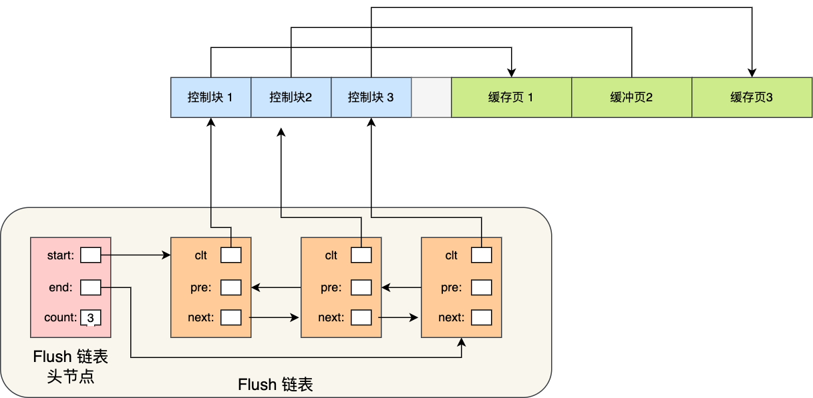
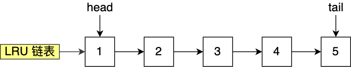
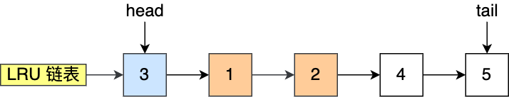
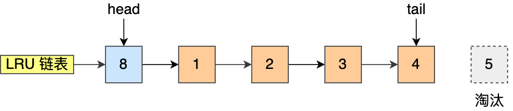
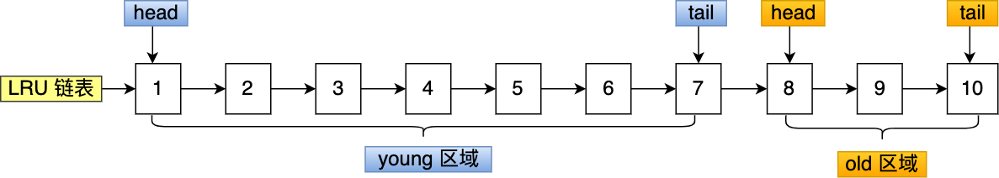
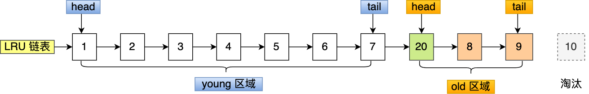
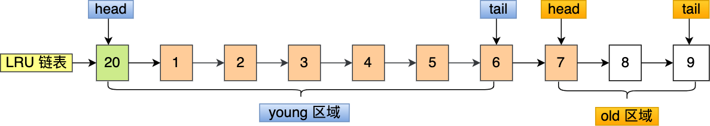
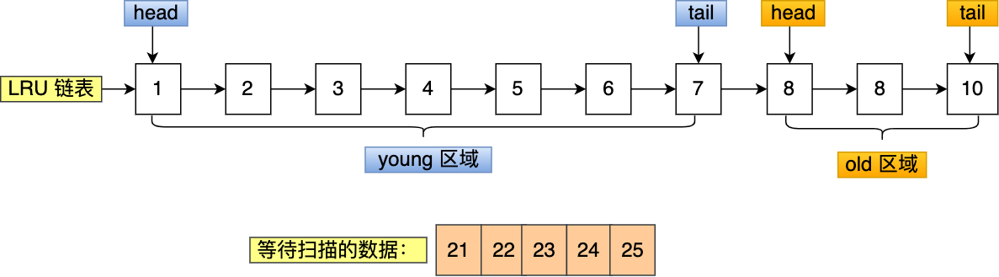
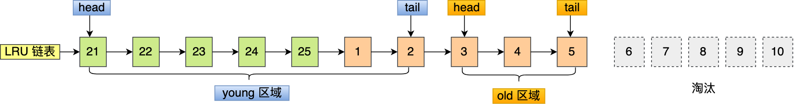
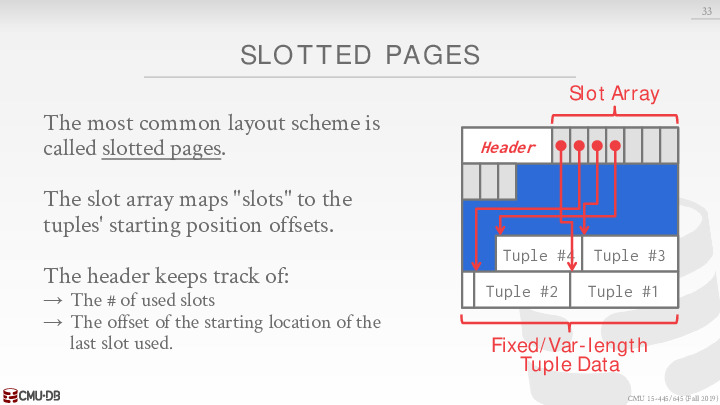

## 内存篇

### 1 为什么要有Buffer Pool？

虽然说 MySQL 的数据是存储在磁盘里的，但是也不能每次都从磁盘里面读取数据，这样性能是极差的。

要想提升查询性能，加个缓存就行了嘛。所以，当数据从磁盘中取出后，缓存内存中，下次查询同样的数据的时候，直接从内存中读取。

为此，Innodb 存储引擎设计了一个**缓冲池（\*Buffer Pool\*）**，来提高数据库的读写性能。


有了缓冲池后：

- 当读取数据时，如果数据存在于 Buffer Pool 中，客户端就会直接读取 Buffer Pool 中的数据，否则再去磁盘中读取。
- 当修改数据时，首先是修改 Buffer Pool 中数据所在的页，然后将其页设置为脏页，最后由后台线程将脏页写入到磁盘。

#### 1.1 Buffer Pool有多大？

Buffer Pool 是在 MySQL 启动的时候，向操作系统申请的一片连续的内存空间，默认配置下 Buffer Pool 只有 `128MB` 。

可以通过调整 `innodb_buffer_pool_size` 参数来设置 Buffer Pool 的大小，一般建议设置成可用物理内存的 60%~80%。

#### 1.2 Buffer Pool缓存什么？

InnoDB 会把存储的数据划分为若干个「页」，以页作为磁盘和内存交互的基本单位，一个页的默认大小为 16KB。因此，Buffer Pool 同样需要按「页」来划分。

在 MySQL 启动的时候，**InnoDB 会为 Buffer Pool 申请一片连续的内存空间，然后按照默认的`16KB`的大小划分出一个个的页， Buffer Pool 中的页就叫做缓存页**。此时这些缓存页都是空闲的，之后随着程序的运行，才会有磁盘上的页被缓存到 Buffer Pool 中。

所以，MySQL 刚启动的时候，你会观察到使用的虚拟内存空间很大，而使用到的物理内存空间却很小，这是因为只有这些虚拟内存被访问后，操作系统才会触发缺页中断，接着将虚拟地址和物理地址建立映射关系。

Buffer Pool 除了缓存「索引页」和「数据页」，还包括了 undo 页，插入缓存、自适应哈希索引、锁信息等等。


为了更好的管理这些在 Buffer Pool 中的缓存页，InnoDB 为每一个缓存页都创建了一个**控制块**，控制块信息包括「缓存页的表空间、页号、缓存页地址、链表节点」等等。

控制块也是占有内存空间的，它是放在 Buffer Pool 的最前面，接着才是缓存页，如下图：


上图中控制块和缓存页之间灰色部分称为碎片空间。

> 为什么会有碎片空间呢？

你想想啊，每一个控制块都对应一个缓存页，那在分配足够多的控制块和缓存页后，可能剩余的那点儿空间不够一对控制块和缓存页的大小，自然就用不到喽，这个用不到的那点儿内存空间就被称为碎片了。

当然，如果你把 Buffer Pool 的大小设置的刚刚好的话，也可能不会产生碎片。

> 查询一条记录，就只需要缓冲一条记录吗？

不是的。

当我们查询一条记录时，InnoDB 是会把整个页的数据加载到 Buffer Pool 中，因为，通过索引只能定位到磁盘中的页，而不能定位到页中的一条记录。将页加载到 Buffer Pool 后，再通过页里的页目录去定位到某条具体的记录。

### 2 如何管理Buffer Pool？

#### 2.1 如何管理空闲页

uffer Pool 是一片连续的内存空间，当 MySQL 运行一段时间后，这片连续的内存空间中的缓存页既有空闲的，也有被使用的。

那当我们从磁盘读取数据的时候，总不能通过遍历这一片连续的内存空间来找到空闲的缓存页吧，这样效率太低了。

所以，为了能够快速找到空闲的缓存页，可以使用链表结构，将空闲缓存页的「控制块」作为链表的节点，这个链表称为 **Free 链表**（空闲链表）。


Free 链表上除了有控制块，还有一个头节点，该头节点包含链表的头节点地址，尾节点地址，以及当前链表中节点的数量等信息。

Free 链表节点是一个一个的控制块，而每个控制块包含着对应缓存页的地址，所以相当于 Free 链表节点都对应一个空闲的缓存页。

有了 Free 链表后，每当需要从磁盘中加载一个页到 Buffer Pool 中时，就从 Free链表中取一个空闲的缓存页，并且把该缓存页对应的控制块的信息填上，然后把该缓存页对应的控制块从 Free 链表中移除。

#### 2.2 如何管理脏页？

设计 Buffer Pool 除了能提高读性能，还能提高写性能，也就是更新数据的时候，不需要每次都要写入磁盘，而是将 Buffer Pool 对应的缓存页标记为**脏页**，然后再由后台线程将脏页写入到磁盘。

那为了能快速知道哪些缓存页是脏的，于是就设计出 **Flush 链表**，它跟 Free 链表类似的，链表的节点也是控制块，区别在于 Flush 链表的元素都是脏页。



有了 Flush 链表后，后台线程就可以遍历 Flush 链表，将脏页写入到磁盘。

#### 2.3 如何提高缓存命中率？

Buffer Pool 的大小是有限的，对于一些频繁访问的数据我们希望可以一直留在 Buffer Pool 中，而一些很少访问的数据希望可以在某些时机可以淘汰掉，从而保证 Buffer Pool 不会因为满了而导致无法再缓存新的数据，同时还能保证常用数据留在 Buffer Pool 中。

要实现这个，最容易想到的就是 LRU（Least recently used）算法。

该算法的思路是，链表头部的节点是最近使用的，而链表末尾的节点是最久没被使用的。那么，当空间不够了，就淘汰最久没被使用的节点，从而腾出空间。

简单的 LRU 算法的实现思路是这样的：

- 当访问的页在 Buffer Pool 里，就直接把该页对应的 LRU 链表节点移动到链表的头部。
- 当访问的页不在 Buffer Pool 里，除了要把页放入到 LRU 链表的头部，还要淘汰 LRU 链表末尾的节点。

比如下图，假设 LRU 链表长度为 5，LRU 链表从左到右有 1，2，3，4，5 的页。



如果访问了 3 号的页，因为 3 号页在 Buffer Pool 里，所以把 3 号页移动到头部即可。



而如果接下来，访问了 8 号页，因为 8 号页不在 Buffer Pool 里，所以需要先淘汰末尾的 5 号页，然后再将 8 号页加入到头部。



到这里我们可以知道，Buffer Pool 里有三种页和链表来管理数据。

图中：

- Free Page（空闲页），表示此页未被使用，位于 Free 链表；
- Clean Page（干净页），表示此页已被使用，但是页面未发生修改，位于LRU 链表。
- Dirty Page（脏页），表示此页「已被使用」且「已经被修改」，其数据和磁盘上的数据已经不一致。当脏页上的数据写入磁盘后，内存数据和磁盘数据一致，那么该页就变成了干净页。脏页同时存在于 LRU 链表和 Flush 链表。

简单的 LRU 算法并没有被 MySQL 使用，因为简单的 LRU 算法无法避免下面这两个问题：

- 预读失效；
- Buffer Pool 污染；

> 什么是预读失效？

先来说说 MySQL 的预读机制。程序是有空间局部性的，靠近当前被访问数据的数据，在未来很大概率会被访问到。

所以，MySQL 在加载数据页时，会提前把它相邻的数据页一并加载进来，目的是为了减少磁盘 IO。

但是可能这些**被提前加载进来的数据页，并没有被访问**，相当于这个预读是白做了，这个就是**预读失效**。

如果使用简单的 LRU 算法，就会把预读页放到 LRU 链表头部，而当 Buffer Pool空间不够的时候，还需要把末尾的页淘汰掉。

如果这些预读页如果一直不会被访问到，就会出现一个很奇怪的问题，不会被访问的预读页却占用了 LRU 链表前排的位置，而末尾淘汰的页，可能是频繁访问的页，这样就大大降低了缓存命中率。

> 怎么解决预读失效而导致缓存命中率降低的问题？

我们不能因为害怕预读失效，而将预读机制去掉，大部分情况下，局部性原理还是成立的。

要避免预读失效带来影响，最好就是**让预读的页停留在 Buffer Pool 里的时间要尽可能的短，让真正被访问的页才移动到 LRU 链表的头部，从而保证真正被读取的热数据留在 Buffer Pool 里的时间尽可能长**。

那到底怎么才能避免呢？

MySQL 是这样做的，它改进了 LRU 算法，将 LRU 划分了 2 个区域：**old 区域 和 young 区域**。

young 区域在 LRU 链表的前半部分，old 区域则是在后半部分，如下图：


old 区域占整个 LRU 链表长度的比例可以通过 `innodb_old_blocks_pc` 参数来设置，默认是 37，代表整个 LRU 链表中 young 区域与 old 区域比例是 63:37。

**划分这两个区域后，预读的页就只需要加入到 old 区域的头部，当页被真正访问的时候，才将页插入 young 区域的头部**。如果预读的页一直没有被访问，就会从 old 区域移除，这样就不会影响 young 区域中的热点数据。

接下来，给大家举个例子。

假设有一个长度为 10 的 LRU 链表，其中 young 区域占比 70 %，old 区域占比 30 %。



现在有个编号为 20 的页被预读了，这个页只会被插入到 old 区域头部，而 old 区域末尾的页（10号）会被淘汰掉。



如果 20 号页一直不会被访问，它也没有占用到 young 区域的位置，而且还会比 young 区域的数据更早被淘汰出去。

如果 20 号页被预读后，立刻被访问了，那么就会将它插入到 young 区域的头部，young 区域末尾的页（7号），会被挤到 old 区域，作为 old 区域的头部，这个过程并不会有页被淘汰。



虽然通过划分 old 区域 和 young 区域避免了预读失效带来的影响

> 什么是 Buffer Pool 污染？

当某一个 SQL 语句**扫描了大量的数据**时，在 Buffer Pool 空间比较有限的情况下，可能会将 **Buffer Pool 里的所有页都替换出去，导致大量热数据被淘汰了**，等这些热数据又被再次访问的时候，由于缓存未命中，就会产生大量的磁盘 IO，MySQL 性能就会急剧下降，这个过程被称为 **Buffer Pool 污染**。

注意， Buffer Pool 污染并不只是查询语句查询出了大量的数据才出现的问题，即使查询出来的结果集很小，也会造成 Buffer Pool 污染。

比如，在一个数据量非常大的表，执行了这条语句：

```sql
select * from t_user where name like "%xiaolin%";
```

可能这个查询出来的结果就几条记录，但是由于这条语句会发生索引失效，所以这个查询过程是全表扫描的，接着会发生如下的过程：

- 从磁盘读到的页加入到 LRU 链表的 old 区域头部；
- 当从页里读取行记录时，也就是页被访问的时候，就要将该页放到 young 区域头部；
- 接下来拿行记录的 name 字段和字符串 xiaolin 进行模糊匹配，如果符合条件，就加入到结果集里；
- 如此往复，直到扫描完表中的所有记录。

经过这一番折腾，原本 young 区域的热点数据都会被替换掉。

举个例子，假设需要批量扫描：21，22，23，24，25 这五个页，这些页都会被逐一访问（读取页里的记录）。



在批量访问这些数据的时候，会被逐一插入到 young 区域头部。



可以看到，原本在 young 区域的热点数据 6 和 7 号页都被淘汰了，这就是 Buffer Pool 污染的问题。

> 怎么解决出现 Buffer Pool 污染而导致缓存命中率下降的问题？

像前面这种全表扫描的查询，很多缓冲页其实只会被访问一次，但是它却只因为被访问了一次而进入到 young 区域，从而导致热点数据被替换了。

LRU 链表中 young 区域就是热点数据，只要我们提高进入到 young 区域的门槛，就能有效地保证 young 区域里的热点数据不会被替换掉。

MySQL 是这样做的，进入到 young 区域条件增加了一个**停留在 old 区域的时间判断**。

具体是这样做的，在对某个处在 old 区域的缓存页进行第一次访问时，就在它对应的控制块中记录下来这个访问时间：

- 如果后续的访问时间与第一次访问的时间**在某个时间间隔内**，那么**该缓存页就不会被从 old 区域移动到 young 区域的头部**；
- 如果后续的访问时间与第一次访问的时间**不在某个时间间隔内**，那么**该缓存页移动到 young 区域的头部**；

这个间隔时间是由 `innodb_old_blocks_time` 控制的，默认是 1000 ms。

也就说，**只有同时满足「被访问」与「在 old 区域停留时间超过 1 秒」两个条件，才会被插入到 young 区域头部**，这样就解决了 Buffer Pool 污染的问题 。

#### 2.4 脏页什么时候会被刷入磁盘？

引入了 Buffer Pool 后，当修改数据时，首先是修改 Buffer Pool 中数据所在的页，然后将其页设置为脏页，但是磁盘中还是原数据。

因此，脏页需要被刷入磁盘，保证缓存和磁盘数据一致，但是若每次修改数据都刷入磁盘，则性能会很差，因此一般都会在一定时机进行批量刷盘。

可能大家担心，如果在脏页还没有来得及刷入到磁盘时，MySQL 宕机了，不就丢失数据了吗？

这个不用担心，InnoDB 的更新操作采用的是 Write Ahead Log 策略，即先写日志，再写入磁盘，通过 redo log 日志让 MySQL 拥有了崩溃恢复能力。

下面几种情况会触发脏页的刷新：

- 当 redo log 日志满了的情况下，会主动触发脏页刷新到磁盘；
- Buffer Pool 空间不足时，需要将一部分数据页淘汰掉，如果淘汰的是脏页，需要先将脏页同步到磁盘；
- MySQL 认为空闲时，后台线程回定期将适量的脏页刷入到磁盘；
- MySQL 正常关闭之前，会把所有的脏页刷入到磁盘；

### 3 补充

#### 3.1 mmap

##### 3.1.1 mmap基础概念

mmap是一种内存映射文件的方法，即将一个文件或者其它对象映射到进程的地址空间，实现文件磁盘地址和进程虚拟地址空间中一段虚拟地址的一一对映关系。实现这样的映射关系后，进程就可以采用指针的方式读写操作这一段内存，而系统会自动回写脏页面到对应的文件磁盘上，即完成了对文件的操作而不必再调用read,write等系统调用函数。


由上图可以看出，进程的虚拟地址空间，由多个虚拟内存区域构成。虚拟内存区域是进程的虚拟地址空间中的一个同质区间，即具有同样特性的连续地址范围。上图中所示的text数据段（代码段）、初始数据段、BSS数据段、堆、栈和内存映射，都是一个独立的虚拟内存区域。而为内存映射服务的地址空间处在堆栈之间的空余部分。

linux内核使用vm_area_struct结构来表示一个独立的虚拟内存区域，由于每个不同质的虚拟内存区域功能和内部机制都不同，因此一个进程使用多个vm_area_struct结构来分别表示不同类型的虚拟内存区域。各个vm_area_struct结构使用链表或者树形结构链接，方便进程快速访问，如下图所示：

​     

mmap函数就是要创建一个新的vm_area_struct结构，并将其与文件的物理磁盘地址相连。

##### 3.1.2 mmap内存映射原理

mmap内存映射的实现过程，总的来说可以分为三个阶段：

**（一）进程启动映射过程，并在虚拟地址空间中为映射创建虚拟映射区域**

1、进程在用户空间调用库函数mmap，原型：void *mmap(void *start, size_t length, int prot, int flags, int fd, off_t offset);

2、在当前进程的虚拟地址空间中，寻找一段空闲的满足要求的连续的虚拟地址

3、为此虚拟区分配一个vm_area_struct结构，接着对这个结构的各个域进行了初始化

4、将新建的虚拟区结构（vm_area_struct）插入进程的虚拟地址区域链表或树中

**（二）调用内核空间的系统调用函数mmap（不同于用户空间函数），实现文件物理地址和进程虚拟地址的一一映射关系**

5、为映射分配了新的虚拟地址区域后，通过待映射的文件指针，在文件描述符表中找到对应的文件描述符，通过文件描述符，链接到内核“已打开文件集”中该文件的文件结构体（struct file），每个文件结构体维护着和这个已打开文件相关各项信息。

6、通过该文件的文件结构体，链接到file_operations模块，调用内核函数mmap，其原型为：int mmap(struct file *filp, struct vm_area_struct *vma)，不同于用户空间库函数。

7、内核mmap函数通过虚拟文件系统inode模块定位到文件磁盘物理地址。

8、通过remap_pfn_range函数建立页表，即实现了文件地址和虚拟地址区域的映射关系。此时，这片虚拟地址并没有任何数据关联到主存中。

**（三）进程发起对这片映射空间的访问，引发缺页异常，实现文件内容到物理内存（主存）的拷贝**

注：前两个阶段仅在于创建虚拟区间并完成地址映射，但是并没有将任何文件数据的拷贝至主存。真正的文件读取是当进程发起读或写操作时。

9、进程的读或写操作访问虚拟地址空间这一段映射地址，通过查询页表，发现这一段地址并不在物理页面上。因为目前只建立了地址映射，真正的硬盘数据还没有拷贝到内存中，因此引发缺页异常。

10、缺页异常进行一系列判断，确定无非法操作后，内核发起请求调页过程。

11、调页过程先在交换缓存空间（swap cache）中寻找需要访问的内存页，如果没有则调用nopage函数把所缺的页从磁盘装入到主存中。

12、之后进程即可对这片主存进行读或者写的操作，如果写操作改变了其内容，一定时间后系统会自动回写脏页面到对应磁盘地址，也即完成了写入到文件的过程。

注：修改过的脏页面并不会立即更新回文件中，而是有一段时间的延迟，可以调用msync()来强制同步, 这样所写的内容就能立即保存到文件里了。

##### 3.1.3 mmap和常规文件操作的区别

我们首先简单的回顾一下常规文件系统操作（调用read/fread等类函数）中，函数的调用过程：

1、进程发起读文件请求。

2、内核通过查找进程文件符表，定位到内核已打开文件集上的文件信息，从而找到此文件的inode。

3、inode在address_space上查找要请求的文件页是否已经缓存在页缓存中。如果存在，则直接返回这片文件页的内容。

4、如果不存在，则通过inode定位到文件磁盘地址，将数据从磁盘复制到页缓存。之后再次发起读页面过程，进而将页缓存中的数据发给用户进程。

总结来说，常规文件操作为了提高读写效率和保护磁盘，使用了页缓存（Page Cache）机制。

**这样造成读文件时需要先将文件页从磁盘拷贝到页缓存中，由于页缓存处在内核空间，不能被用户进程直接寻址，所以还需要将页缓存中数据页再次拷贝到内存对应的用户空间中。这样，通过了两次数据拷贝过程，才能完成进程对文件内容的获取任务。写操作也是一样，待写入的buffer在内核空间不能直接访问，必须要先拷贝至内核空间对应的主存，再写回磁盘中（延迟写回），也是需要两次数据拷贝。**

**而使用mmap操作文件中，创建新的虚拟内存区域和建立文件磁盘地址和虚拟内存区域映射这两步，没有任何文件拷贝操作。而之后访问数据时发现内存中并无数据而发起的缺页异常过程，可以通过已经建立好的映射关系，只使用一次数据拷贝，就从磁盘中将数据传入内存的用户空间中，供进程使用。**

**总而言之，常规文件操作需要从磁盘到页缓存再到用户主存的两次数据拷贝。而mmap操控文件，只需要从磁盘到用户主存的一次数据拷贝过程。**说白了，mmap的关键点是实现了用户空间和内核空间的数据直接交互而省去了空间不同数据不通的繁琐过程。因此mmap效率更高。

##### 3.1.4 两种映射方式

**1. 基于文件的映射：**

适用于任何进程之间, 此时，需要打开或创建一个文件，然后再调用mmap()

这样用户进程就可以像读取内存一样读取文件了,效率非常高。

**2. 匿名映射：**

匿名映射是一种没用对应文件的一种映射，是使用特殊文件提供的匿名内存映射：一个匿名映射没有对应的文件，这种映射的分页会被初始化为0。可以把它看成是一个内容总是被初始化为0的虚拟文件映射，比如在具有血缘关系的进程之间，如父子进程之间,　当一个进程调用mmap().之后又调用了fork(), 之后子进程会继承(拷贝)父进程映射后的空间，同时也继承了mmap()的返回地址，通过修改数据共享内存里的数据,　父子进程够可以感知到数据的变化，这样一来，父子进程就可以通过这块共享内存来实现进程间通信。

#### 3.2 那既然操作系统和数据库的缓存页机制类似，为什么数据库不直接用操作系统的页，而浪费时间开发一个 buffer pool manager 做类似的事情呢？

我们已知 `mmap` 会被 blocked, 这个阻断时间中，数据库上面也做不了，只能等待新的 page 加载结束。这会带来性能下降问题。

另外操作系统不能将一个 page 立即写回硬盘，这一点会在事务 Logging 中使正确性不能被保证。

由于**性能问题**和**正确性问题**，`mmap` 比较少在数据库中被采用。

#### 3.3 数据库存储

##### 3.3.1 存储管理

DBMS 如何将数据库的数据放到磁盘文件上？ 这里有个选择，DBMS 是否要用操作系统的文件系统，还是拿一块 raw storage 自己管理。现在一般的选择是还是使用操作系统文件系统，毕竟方便。既然用文件系统，那么 DBMS 就需要把数据库数据存成一个或多个文件。每个文件有多个 page 组成。page 其实就是固定大小的数据块，那为什么要有这层抽象？这个和我们使用的存储的磁盘有关，它除了慢，还有个特点是对顺序读写比较友好，因为随机读需要磁头不断的机械移动的。所以操作系统的文件系统和磁盘间的 I/O，需要**尽量批量读**，读写数据的最小单位称为数据块 block，一般是 4KB，因为 4KB 比较经济。而数据库的 page 是基于文件系统的，所以设计成 **4KB 的倍数**会比较合理。（16KB）

##### 3.3.2 数据库页

OS 的文件系统通常将文件切分成 pages 进行管理，DBMS 也不例外。通常 page 是固定大小的一块数据，每个 page 内部可能存储着 tuples、meta-data、indexes 以及 logs 等等，大多数 DBMS 不会把不同类型数据存储在同一个 page 上。每个 page 带着一个唯一的 id，DBMS 使用一个 indirection layer 将 page id 与数据实际存储的物理位置关联起来。

注意：有几个不同的 page 概念需要分清楚

- Hardware Page：通常大小为 4KB
- OS Page: 通常大小为 4KB
- Database Page：(1-16KB)

不同 DBMS 管理 pages 的方式不同，主要分为以下几种：

- Heap File Organization
- Sequential/Sorted File Organization
- Hashing File Organization

> - Self-contained 指这个 page 拥有 metadata (元数据)，这个 metadata 用来告诉我们如何 interpret 该 page。
> - 每一个 page 有一个唯一的 page id:
>   - 如果数据库只有一个文件，在这种简单的情况下，page id 可以是对应数据在该文件的 offset
>   - 大多数情况，数据库有多个文件。这是 page id 可以是对应数据所在的**那一个**文件的路径＋在该文件中的 offset
>   - 因此每一个 page id 可以对应上某些数据，这些数据的大小是一个 page 的大小
>   - 在数据库的高层组成成分中 (比如 execution engine)，都需要将对应的 page id 当做参数，从 buffer pool manager 中获得对应的 page (和数据)。

##### 3.3.3 页布局

每个 page 被分为两个部分：header 和 data，如下图所示：


header 中通常包含以下信息：

- Page Size
- Checksum
- DBMS Version
- Transaction Visibility
- Compression Information

data 中记录着真正存储的数据，数据记录的形式主要有两种：

- Tuple-oriented：记录数据本身
- Log-structured：记录数据的操作日志

**Tuple-oriented**

***Slotted Pages***

如下图所示，header 中的 slot array 记录每个 slot 的信息，如大小、位移等 




对于 slotted pages，如果我们删除 tuple3 与更改 header 后，　我们可以有两种选择：

+ 将原 tuple3 的位置留空，不改变其他 tuple 的位置
+ 将 tuple4 向右移动，占有原 tuple3 的空间，也调整 tuple4 的指针和 header (当然在普遍情况下，需要调整**所有** tuple3之后的 tuple)

> **例子**：
>
> + 新增记录时：在 slot array 中新增一条记录，记录着改记录的入口地址。slot array 与 data 从 page 的两端向中间生长，二者相遇时，就认为这个 page 已经满了
> + 删除记录时：假设删除 tuple #3，可以将 slot array 中的第三条记录删除，并将 tuple #4 及其以后的数据都都向下移动，填补 tuple #3 的空位。而这些细节对于 page 的使用者来说是透明的
> + 处理定长和变长 tuple 数据都游刃有余

**Log-Structured** 

Log-structured 只存储日志记录

Log-structured 只存储日志记录，如下图所示：


每次记录新的操作日志即可，增删改的操作都很快，但有得必有失，在查询场景下，就需要遍历 page 信息来生成数据才能返回查询结果。

为了加快查询效率，通常会对操作日志在记录 id 上建立索引，如下图所示：


优点：

- 速度很快，只需要向文件中写入一行 log 信息
- 自带 log, 在 recovery 很大帮助
- 适合 append only 的存储形式　(大部分的分布式存储是 append only)

缺点:

- 数据读写较慢，需要依靠 log 生成 tuple (这个生成过程叫 replay)
- 数据分散，且难以缓存 (data ends up spread out wide and hard to cache.)

##### 3.3.4 Tuple布局

上节讨论了 page 的 layout 可以分成 header 与 data 两部分，而 data 部分又分为 tuple-oriented 和 log structured 两种，那么在 tuple-oriented 的 layout 中，DMBS 如何存储 tuple 本身呢？

由于 tuple 本身还有别的元信息，如：

- Visibility Info (concurrency control)：即 tuple 粒度的权限和并发控制
- Bit Map for **NULL** values

因此不难猜到，tuple 中还可以分为 header 和 data 两部分，如下图所示：


通常 DBMS 会按照你在建表时候指定的顺序（并不绝对）来存储 tuple 的 attribute data，如下图所示：


