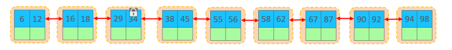
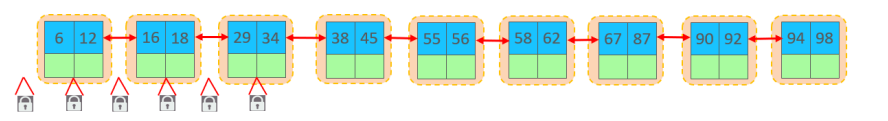
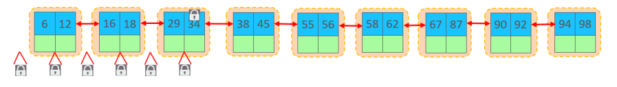
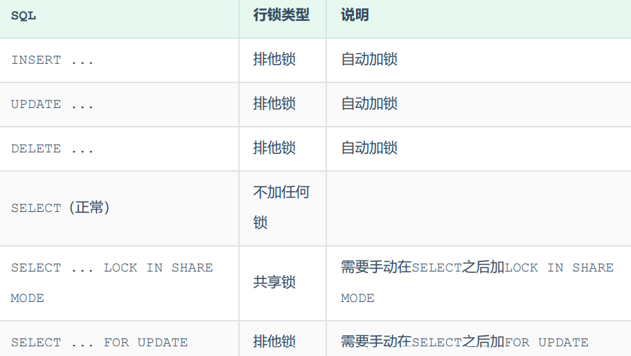

## 行级锁补充

行级锁，每次操作锁住对应的行数据。锁定粒度最小，发生锁冲突的概率最低，并发度最高。应用在 InnoDB存储引擎中。 InnoDB的数据是基于索引组织的，行锁是通过对索引上的索引项加锁来实现的，而不是对记录加的锁。

对于行级锁，主要分为以下三类：

+ 行锁（Record Lock）：锁定单个行记录的锁，防止其他事务对此行进行update和delete。在 RC、RR隔离级别下都支持。

  

+ 间隙锁（Gap Lock）：锁定索引记录间隙（不含该记录），确保索引记录间隙不变，防止其他事 务在这个间隙进行insert，产生幻读。在RR隔离级别下都支持。

  

+ 临键锁（Next-Key Lock）：行锁和间隙锁组合，同时锁住数据，并锁住数据前面的间隙Gap。 在RR隔离级别下支持。

  

InnoDB实现了以下两种类型的行锁： 

+ 共享锁（S）：允许一个事务去读一行，阻止其他事务获得相同数据集的排它锁。 
+ 排他锁（X）：允许获取排他锁的事务更新数据，阻止其他事务获得相同数据集的共享锁和排他锁。

注意：间隙锁唯一目的是防止其他事务插入间隙。间隙锁可以共存，一个事务采用的间隙锁不会 阻止另一个事务在同一间隙上采用间隙锁。