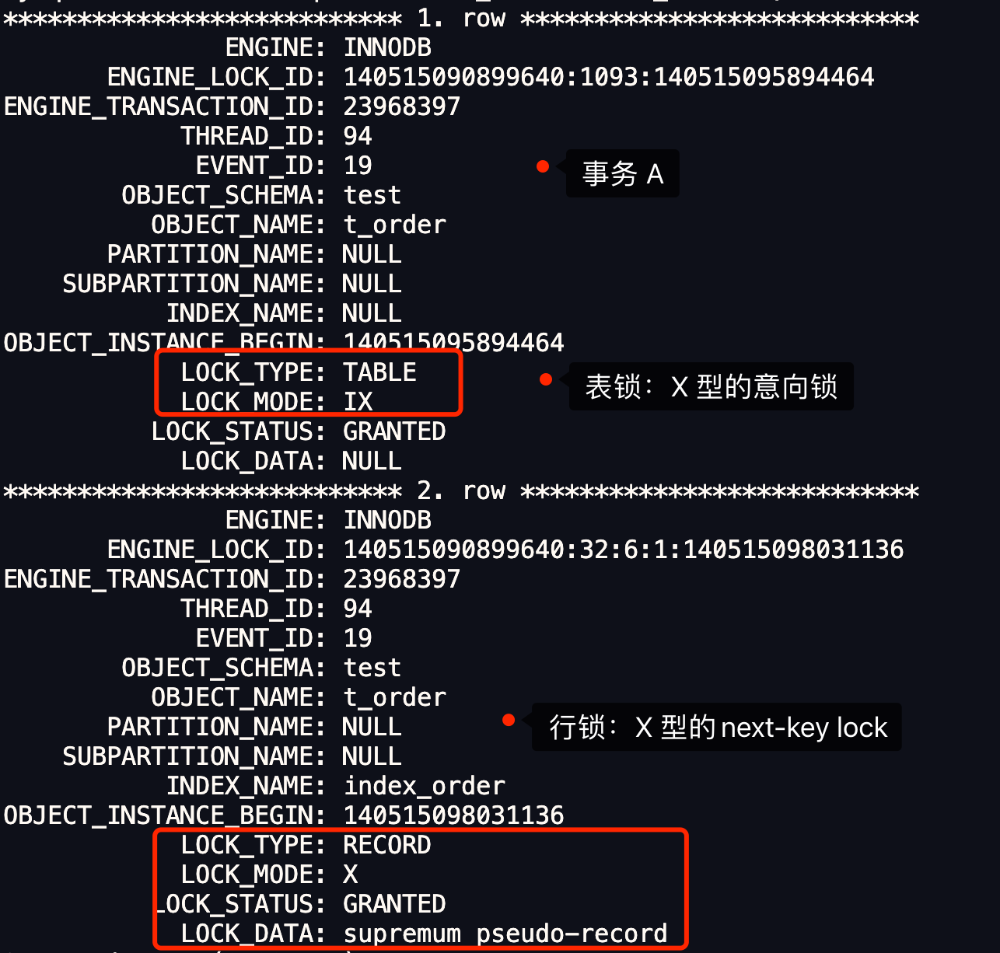

## 锁篇

### 1 MySQL有哪些锁？

在 MySQL 里，根据加锁的范围，可以分为**全局锁、表级锁和行锁**三类。


#### 1.1 全局锁

> 全局锁是怎么用的？

要使用全局锁，则要执行这条命：

```sql
flush tables with read lock
```

执行后，**整个数据库就处于只读状态了**，这时其他线程执行以下操作，都会被阻塞：

- 对数据的增删改操作，比如 insert、delete、update等语句；
- 对表结构的更改操作，比如 alter table、drop table 等语句。

如果要释放全局锁，则要执行这条命令：

```sql
unlock tables
```

当然，当会话断开了，全局锁会被自动释放。

> 全局锁应用场景是什么？

全局锁主要应用于做**全库逻辑备份**，这样在备份数据库期间，不会因为数据或表结构的更新，而出现备份文件的数据与预期的不一样。

举个例子大家就知道了。

在全库逻辑备份期间，假设不加全局锁的场景，看看会出现什么意外的情况。

如果在全库逻辑备份期间，有用户购买了一件商品，一般购买商品的业务逻辑是会涉及到多张数据库表的更新，比如在用户表更新该用户的余额，然后在商品表更新被购买的商品的库存。

那么，有可能出现这样的顺序：

1. 先备份了用户表的数据；
2. 然后有用户发起了购买商品的操作；
3. 接着再备份商品表的数据。

也就是在备份用户表和商品表之间，有用户购买了商品。

这种情况下，备份的结果是用户表中该用户的余额并没有扣除，反而商品表中该商品的库存被减少了，如果后面用这个备份文件恢复数据库数据的话，用户钱没少，而库存少了，等于用户白嫖了一件商品。

所以，在全库逻辑备份期间，加上全局锁，就不会出现上面这种情况了。

> 加全局锁又会带来什么缺点呢？

加上全局锁，意味着整个数据库都是只读状态。

那么如果数据库里有很多数据，备份就会花费很多的时间，关键是备份期间，业务只能读数据，而不能更新数据，这样会造成业务停滞。

> 既然备份数据库数据的时候，使用全局锁会影响业务，那有什么其他方式可以避免？

有的，如果数据库的引擎支持的事务支持**可重复读的隔离级别**，那么在备份数据库之前先开启事务，会先创建 Read View，然后整个事务执行期间都在用这个 Read View，而且由于 MVCC 的支持，备份期间业务依然可以对数据进行更新操作。

因为在可重复读的隔离级别下，即使其他事务更新了表的数据，也不会影响备份数据库时的 Read View，这就是事务四大特性中的隔离性，这样备份期间备份的数据一直是在开启事务时的数据。

但是，对于 MyISAM 这种不支持事务的引擎，在备份数据库时就要使用全局锁的方法。

#### 1.2 表级锁

> MySQL 表级锁有哪些？具体怎么用的。

MySQL 里面表级别的锁有这几种：

- 表锁；
- 元数据锁（MDL）;
- 意向锁；
- AUTO-INC 锁；

##### 表锁

先来说说**表锁**。

如果我们想对学生表（t_student）加表锁，可以使用下面的命令：

```sql
//表级别的共享锁，也就是读锁；
lock tables t_student read;

//表级别的独占锁，也就是写锁；
lock tables t_stuent write;
```

需要注意的是，表锁除了会限制别的线程的读写外，也会限制本线程接下来的读写操作。

也就是说如果本线程对学生表加了「共享表锁」，那么本线程接下来如果要对学生表执行写操作的语句，是会被阻塞的，当然其他线程对学生表进行写操作时也会被阻塞，直到锁被释放。

要释放表锁，可以使用下面这条命令，会释放当前会话的所有表锁：

```sql
unlock tables
```

另外，当会话退出后，也会释放所有表锁。

不过尽量避免在使用 InnoDB 引擎的表使用表锁，因为表锁的颗粒度太大，会影响并发性能，**InnoDB 牛逼的地方在于实现了颗粒度更细的行级锁**。

##### 元数据锁

再来说说**元数据锁**（MDL）。

我们不需要显示的使用 MDL，因为当我们对数据库表进行操作时，会自动给这个表加上 MDL：

- 对一张表进行 CRUD 操作时，加的是 **MDL 读锁**；
- 对一张表做结构变更操作的时候，加的是 **MDL 写锁**；

**MDL 是为了保证当用户对表执行 CRUD 操作时，防止其他线程对这个表结构做了变更。**

当有线程在执行 select 语句（ 加 MDL 读锁）的期间，如果有其他线程要更改该表的结构（ 申请 MDL 写锁），那么将会被阻塞，直到执行完 select 语句（ 释放 MDL 读锁）。

反之，当有线程对表结构进行变更（ 加 MDL 写锁）的期间，如果有其他线程执行了 CRUD 操作（ 申请 MDL 读锁），那么就会被阻塞，直到表结构变更完成（ 释放 MDL 写锁）。

> MDL 不需要显示调用，那它是在什么时候释放的?

MDL 是在事务提交后才会释放，这意味着**事务执行期间，MDL 是一直持有的**。

那如果数据库有一个长事务（所谓的长事务，就是开启了事务，但是一直还没提交），那在对表结构做变更操作的时候，可能会发生意想不到的事情，比如下面这个顺序的场景：

1. 首先，线程 A 先启用了事务（但是一直不提交），然后执行一条 select 语句，此时就先对该表加上 MDL 读锁；
2. 然后，线程 B 也执行了同样的 select 语句，此时并不会阻塞，因为「读读」并不冲突；
3. 接着，**线程 C 修改了表字段，此时由于线程 A 的事务并没有提交，也就是 MDL 读锁还在占用着，这时线程 C 就无法申请到 MDL 写锁，就会被阻塞，**

那么在线程 C 阻塞后，后续有对该表的 select 语句，就都会被阻塞，如果此时有大量该表的 select 语句的请求到来，就会有大量的线程被阻塞住，这时数据库的线程很快就会爆满了。

> 为什么线程 C 因为申请不到 MDL 写锁，而导致后续的申请读锁的查询操作也会被阻塞？

这是因为申请 MDL 锁的操作会形成一个队列，队列中**写锁获取优先级高于读锁**，一旦出现 MDL 写锁等待，会阻塞后续该表的所有 CRUD 操作。

所以为了能安全的对表结构进行变更，在对表结构变更前，先要看看数据库中的长事务，是否有事务已经对表加上了 MDL 读锁，如果可以考虑 kill 掉这个长事务，然后再做表结构的变更。


##### 意向锁

接着，说说**意向锁**。

- 在使用 InnoDB 引擎的表里对某些记录加上「共享锁」之前，需要先在表级别加上一个「意向共享锁」；
- 在使用 InnoDB 引擎的表里对某些纪录加上「独占锁」之前，需要先在表级别加上一个「意向独占锁」；

也就是，当执行插入、更新、删除操作，需要先对表加上「意向独占锁」，然后对该记录加独占锁。

而普通的 select 是不会加行级锁的，普通的 select 语句是利用 MVCC 实现一致性读，是无锁的。

不过，select 也是可以对记录加共享锁和独占锁的，具体方式如下：

```sql
//先在表上加上意向共享锁，然后对读取的记录加共享锁
select ... lock in share mode;

//先表上加上意向独占锁，然后对读取的记录加独占锁
select ... for update;
```

**意向共享锁和意向独占锁是表级锁，不会和行级的共享锁和独占锁发生冲突，而且意向锁之间也不会发生冲突，只会和共享表锁（lock tables ... read）和独占表锁（lock tables ... write）发生冲突。**

表锁和行锁是满足读读共享、读写互斥、写写互斥的。

如果没有「意向锁」，那么加「独占表锁」时，就需要遍历表里所有记录，查看是否有记录存在独占锁，这样效率会很慢。

那么有了「意向锁」，由于在对记录加独占锁前，先会加上表级别的意向独占锁，那么在加「独占表锁」时，直接查该表是否有意向独占锁，如果有就意味着表里已经有记录被加了独占锁，这样就不用去遍历表里的记录。

所以，**意向锁的目的是为了快速判断表里是否有记录被加锁**。


##### AUTO-INC锁

最后，说说 **AUTO-INC 锁**。

在为某个字段声明 `AUTO_INCREMENT` 属性时，之后可以在插入数据时，可以不指定该字段的值，数据库会自动给该字段赋值递增的值，这主要是通过 AUTO-INC 锁实现的。

AUTO-INC 锁是特殊的表锁机制，锁**不是再一个事务提交后才释放，而是再执行完插入语句后就会立即释放**。

**在插入数据时，会加一个表级别的 AUTO-INC 锁**，然后为被 `AUTO_INCREMENT` 修饰的字段赋值递增的值，等插入语句执行完成后，才会把 AUTO-INC 锁释放掉。

那么，一个事务在持有 AUTO-INC 锁的过程中，其他事务的如果要向该表插入语句都会被阻塞，从而保证插入数据时，被 `AUTO_INCREMENT` 修饰的字段的值是连续递增的。

但是， AUTO-INC 锁再对大量数据进行插入的时候，会影响插入性能，因为另一个事务中的插入会被阻塞。


#### 1.3 行级锁

InnoDB 引擎是支持行级锁的，而 MyISAM 引擎并不支持行级锁。

行级锁的类型主要有三类：

- Record Lock，记录锁，也就是仅仅把一条记录锁上；
- Gap Lock，间隙锁，锁定一个范围，但是不包含记录本身；
- Next-Key Lock：Record Lock + Gap Lock 的组合，锁定一个范围，并且锁定记录本身。

前面也提到，普通的 select 语句是不会对记录加锁的，如果要在查询时对记录加行锁，可以使用下面这两个方式：

```sql
//对读取的记录加共享锁
select ... lock in share mode;

//对读取的记录加独占锁
select ... for update;
```

上面这两条语句必须在一个事务中，**因为当事务提交了，锁就会被释放**，所以在使用这两条语句的时候，要加上 begin、start transaction 或者 set autocommit = 0。

### 2 MySQL是怎么加锁的？

对记录加锁时，**加锁的基本单位是 next-key lock**，它是由记录锁和间隙锁组合而成的，**next-key lock 是前开后闭区间，而间隙锁是前开后开区间**。

但是，next-key lock 在一些场景下会退化成记录锁或间隙锁。

那到底是什么场景呢？今天，我们就以下面这个表来进行实验说明。


其中，id 是主键索引（唯一索引），b 是普通索引（非唯一索引），a 是普通的列。

#### 2.1 唯一索引等值查询

当我们用唯一索引进行等值查询的时候，查询的记录存不存在，加锁的规则也会不同：

- **当查询的记录是存在的，在用「唯一索引进行等值查询」时，next-key lock 会退化成「记录锁」**。
- **当查询的记录是不存在的，在用「唯一索引进行等值查询」时，next-key lock 会退化成「间隙锁」**。

接下里用两个案例来说明。

> 先看看记录是存在的。

来看下面这个例子：


会话1加锁变化过程如下：

1. 加锁的基本单位是 next-key lock，因此会话1的加锁范围是(8, 16];
2. 但是由于是用唯一索引进行等值查询，且查询的记录存在，所以 **next-key lock 退化成记录锁，因此最终加锁的范围是 id = 16 这一行**。

所以，会话 2 在修改 id=16 的记录时会被锁住，而会话 3 插入 id=9 的记录可以被正常执行。

> 接下来，看看记录不存在的情况

来看看，下面这个例子：


会话1加锁变化过程如下：

1. 加锁的基本单位是 next-key lock，因此主键索引 id 的加锁范围是(8, 16];
2. 但是由于查询记录不存在，next-key lock 退化成间隙锁，因此最终加锁的范围是 (8,16)。

所以，会话 2 要往这个间隙里面插入 id=9 的记录会被锁住，但是会话 3 修改 id =16 是可以正常执行的，因为 id = 16 这条记录并没有加锁。

#### 2.2 唯一索引范围查询

范围查询和等值查询的加锁规则是不同的。

举个例子，下面这两条查询语句，查询的结果虽然是一样的，但是加锁的范围是不一样的。

```text
select * from t_test where id=8 for update;
select * from t_test where id>=8 and id<9 for update;
```

做个实验就知道了。


会话 1 加锁变化过程如下：

1. 最开始要找的第一行是 id = 8，因此 next-key lock(4,8]，但是由于 id 是唯一索引，且该记录是存在的，因此会退化成记录锁，也就是只会对 id = 8 这一行加锁；
2. 由于是范围查找，就会继续往后找存在的记录，也就是会找到 id = 16 这一行停下来，然后加 next-key lock (8, 16]，但由于 id = 16 不满足 id < 9，所以会退化成间隙锁，加锁范围变为 (8, 16)。

所以，会话 1 这时候主键索引的锁是记录锁 id=8 和间隙锁(8, 16)。

会话 2 由于往间隙锁里插入了 id = 9 的记录，所以会被锁住了，而 id = 8 是被加锁的，因此会话 3 的语句也会被阻塞。

由于 id = 16 并没有加锁，所以会话 4 是可以正常被执行。

#### 2.3 非唯一索引等值查询

当我们用非唯一索引进行等值查询的时候，查询的记录存不存在，加锁的规则也会不同：

- **当查询的记录存在时，除了会加 next-key lock 外，还额外加间隙锁，也就是会加两把锁**。
- **当查询的记录不存在时，只会加 next-key lock，然后会退化为间隙锁，也就是只会加一把锁。**

接下里用两个案例来说明。

> 我们先来看看查询的值存在的情况。

比如下面这个例子：


会话 1 加锁变化过程如下：

1. 先会对普通索引 b 加上 next-key lock，范围是(4,8];
2. 然后因为是非唯一索引，且查询的记录是存在的，所以还会加上间隙锁，规则是向下遍历到第一个不符合条件的值才能停止，因此间隙锁的范围是(8,16)。

所以，会话1的普通索引 b 上共有两个锁，分别是 next-key lock (4,8] 和间隙锁 (8,16) 。

那么，当会话 2 往间隙锁里插入 id = 9 的记录就会被锁住，而会话 3 和会话 4 是因为更改了 next-key lock 范围里的记录而被锁住的。

然后因为 b = 16 这条记录没有加锁，所以会话 5 是可以正常执行的。

> 接下来，我们看看查询的值不存在的情况

直接看案例：


会话 1 加锁变化过程如下：

1. 先会对普通索引 b 加上 next-key lock，范围是(8,16];
2. 但是由于查询的记录是不存在的，所以不会再额外加个间隙锁，但是 next-key lock 会退化为间隙锁，最终加锁范围是 (8,16)。

会话 2 因为往间隙锁里插入了 b = 9 的记录，所以会被锁住，而 b = 16 是没有被加锁的，因此会话 3 的语句可以正常执行。

#### 2.4 非唯一索引范围查询

非唯一索引和主键索引的范围查询的加锁也有所不同，不同之处在于**普通索引范围查询，next-key lock 不会退化为间隙锁和记录锁**。

来看下面这个案例：


会话 1 加锁变化过程如下：

1. 最开始要找的第一行是 b = 8，因此 next-key lock(4,8]，但是由于 b 不是唯一索引，并不会退化成记录锁。
2. 但是由于是范围查找，就会继续往后找存在的记录，也就是会找到 b = 16 这一行停下来，然后加 next-key lock (8, 16]，因为是普通索引查询，所以并不会退化成间隙锁。

所以，会话 1 的普通索引 b 有两个 next-key lock，分别是 (4,8] 和(8, 16]。这样，你就明白为什么会话 2 、会话 3 、会话 4 的语句都会被锁住了。

#### 2.5 总结

唯一索引等值查询：

- 当查询的记录是存在的，next-key lock 会退化成「记录锁」。
- 当查询的记录是不存在的，next-key lock 会退化成「间隙锁」。

非唯一索引等值查询：

- 当查询的记录存在时，除了会加 next-key lock 外，还额外加间隙锁，也就是会加两把锁。
- 当查询的记录不存在时，只会加 next-key lock，然后会退化为间隙锁，也就是只会加一把锁。

非唯一索引和主键索引的范围查询的加锁规则不同之处在于：

- 唯一索引在满足一些条件的时候，next-key lock 退化为间隙锁和记录锁。
- 非唯一索引范围查询，next-key lock 不会退化为间隙锁和记录锁。

### 3 update没加索引会锁全表？


#### 3.1 为什么会发生这种的事故？

InnoDB 存储引擎的默认事务隔离级别是「可重复读」，但是在这个隔离级别下，在多个事务并发的时候，会出现幻读的问题，所谓的幻读是指在同一事务下，连续执行两次同样的查询语句，第二次的查询语句可能会返回之前不存在的行。

因此 InnoDB 存储引擎自己实现了行锁，通过 next-key 锁（记录锁和间隙锁的组合）来锁住记录本身和记录之间的“间隙”，防止其他事务在这个记录之间插入新的记录，从而避免了幻读现象。

当我们执行 update 语句时，实际上是会对记录加独占锁（X 锁）的，如果其他事务对持有独占锁的记录进行修改时是会被阻塞的。另外，这个锁并不是执行完 update 语句就会释放的，而是会等事务结束时才会释放。

在 InnoDB 事务中，对记录加锁带基本单位是 next-key 锁，但是会因为一些条件会退化成间隙锁，或者记录锁。**加锁的位置准确的说，锁是加在索引上的而非行上。**

比如，在 update 语句的 where 条件使用了唯一索引，那么 next-key 锁会退化成记录锁，也就是只会给一行记录加锁。

这里举个例子，这里有一张数据库表，其中 id 为主键索引。


假设有两个事务的执行顺序如下：


可以看到，事务 A 的 update 语句中 where 是等值查询，并且 id 是唯一索引，所以只会对 id = 1 这条记录加锁，因此，事务 B 的更新操作并不会阻塞。

但是，**在 update 语句的 where 条件没有使用索引，就会全表扫描，于是就会对所有记录加上 next-key 锁（记录锁 + 间隙锁），相当于把整个表锁住了**。

假设有两个事务的执行顺序如下：


可以看到，这次事务 B 的 update 语句被阻塞了。

这是因为事务 A的 update 语句中 where 条件没有索引列，所有记录都会被加锁，也就是这条 update 语句产生了 4 个记录锁和 5 个间隙锁，相当于锁住了全表。


因此，当在数据量非常大的数据库表执行 update 语句时，如果没有使用索引，就会给全表的加上 next-key 锁， 那么锁就会持续很长一段时间，直到事务结束，而这期间除了 `select ... from`语句，其他语句都会被锁住不能执行，业务会因此停滞，接下来等着你的，就是老板的挨骂。

那 update 语句的 where 带上索引就能避免全表记录加锁了吗？

并不是。

**关键还得看这条语句在执行过程种，优化器最终选择的是索引扫描，还是全表扫描，如果走了全表扫描，就会对全表的记录加锁了**。

### 4 MySQL死锁了，怎么办？

#### 4.1 死锁的发生

本次案例使用存储引擎 Innodb，隔离级别为可重复读（RR）。

接下来，我用实战的方式来带大家看看死锁是怎么发生的。

我建了一张订单表，其中 id 字段为主键索引，order_no 字段普通索引，也就是非唯一索引：

```sql
CREATE TABLE `t_order` (
  `id` int NOT NULL AUTO_INCREMENT,
  `order_no` int DEFAULT NULL,
  `create_date` datetime DEFAULT NULL,
  PRIMARY KEY (`id`),
  KEY `index_order` (`order_no`) USING BTREE
) ENGINE=InnoDB ;
```

然后，先 `t_order` 表里现在已经有了 6 条记录：


假设这时有两事务，一个事务要插入订单 1007 ，另外一个事务要插入订单 1008，因为需要对订单做幂等性校验，所以两个事务先要查询该订单是否存在，不存在才插入记录，过程如下：


可以看到，两个事务都陷入了等待状态（前提没有打开死锁检测），也就是发生了死锁，因为都在相互等待对方释放锁。

这里在查询记录是否存在的时候，使用了 `select ... for update` 语句，目的为了防止事务执行的过程中，有其他事务插入了记录，而出现幻读的问题。

如果没有使用 `select ... for update` 语句，而使用了单纯的 select 语句，如果是两个订单号一样的请求同时进来，就会出现两个重复的订单，有可能出现幻读，如下图：


#### 4.2 为什么会产生死锁？

**Innodb 引擎为了解决「可重复读」隔离级别下的幻读问题，就引出了 next-key 锁**，它是记录锁和间隙锁的组合。

- Record Loc，记录锁，锁的是记录本身；
- Gap Lock，间隙锁，锁的就是两个值之间的空隙，以防止其他事务在这个空隙间插入新的数据，从而避免幻读现象。

普通的 select 语句是不会对记录加锁的，因为它是通过 MVCC 的机制实现的快照读，如果要在查询时对记录加行锁，可以使用下面这两个方式：

```sql
begin;
//对读取的记录加共享锁
select ... lock in share mode;
commit; //锁释放

begin;
//对读取的记录加排他锁
select ... for update;
commit; //锁释放
```

行锁的释放时机是在事务提交（commit）后，锁就会被释放，并不是一条语句执行完就释放行锁。

比如，下面事务 A 查询语句会锁住 `(2, +∞]` 范围的记录，然后期间如果有其他事务在这个锁住的范围插入数据就会被阻塞。


回到前面死锁的例子。


事务 A 在执行下面这条语句的时候：

```sql
select id from t_order where order_no = 1007 for update;
```

我们可以通过 `select * from performance_schema.data_locks\G;` 这条语句，查看事务执行 SQL 过程中加了什么锁。



从上图可以看到，共加了两个锁，分别是：

- 表锁：X 类型的意向锁；
- 行锁：X 类型的间隙锁；

这里我们重点关注行锁，图中 LOCK_TYPE 中的 RECORD 表示行级锁，而不是记录锁的意思，通过 LOCK_MODE 可以确认是 next-key 锁，还是间隙锁，还是记录锁：

- 如果 LOCK_MODE 为 `X`，说明是 X 型的 next-key 锁；
- 如果 LOCK_MODE 为 `X, REC_NOT_GAP`，说明是 X 型的记录锁；
- 如果 LOCK_MODE 为 `X, GAP`，说明是 X 型的间隙锁；

**因此，此时事务 A 在二级索引（INDEX_NAME : index_order）上加的是 X 型的 next-key 锁，锁范围是`(1006, +∞]`**。

next-key 锁的范围 (1006, +∞]，是怎么确定的？

根据我的经验，如果 LOCK_MODE 是 next-key 锁或者间隙锁，那么 LOCK_DATA 就表示锁的范围最右值，此次的事务 A 的 LOCK_DATA 是 supremum pseudo-record，表示的是 +∞。然后锁范围的最左值是 t_order 表中最后一个记录的 index_order 的值，也就是 1006。因此，next-key 锁的范围 (1006, +∞]。

> 非唯一索引等值查询时，说「当查询的记录不存在时，加 next-key lock，然后会退化为间隙锁」。为什么上面事务 A 的 next-key lock 并没有退化为间隙锁？
>
> 如果表中最后一个记录的 order_no 为 1005，那么等值查询 order_no = 1006（不存在），就是 next key lock，如上面事务 A 的情况。
>
> 如果表中最后一个记录的 order_no 为 1010，那么等值查询 order_no = 1006（不存在），就是间隙锁,比如下图：
>
> 

当事务 B 往事务 A next-key 锁的范围 (1006, +∞] 里插入 id = 1008 的记录就会被锁住：

```sql
Insert into t_order (order_no, create_date) values (1008, now());
```

因为当我们执行以下插入语句时，会在插入间隙上获取插入意向锁，**而插入意向锁与间隙锁是冲突的，所以当其它事务持有该间隙的间隙锁时，需要等待其它事务释放间隙锁之后，才能获取到插入意向锁。而间隙锁与间隙锁之间是兼容的，所以所以两个事务中 `select ... for update` 语句并不会相互影响**。

案例中的事务 A 和事务 B 在执行完后 `select ... for update` 语句后都持有范围为`(1006,+∞]`的next-key 锁，而接下来的插入操作为了获取到插入意向锁，都在等待对方事务的间隙锁释放，于是就造成了循环等待，导致死锁。

> 为什么间隙锁与间隙锁之间是兼容的？

**间隙锁的意义只在于阻止区间被插入**，因此是可以共存的。**一个事务获取的间隙锁不会阻止另一个事务获取同一个间隙范围的间隙锁**，共享和排他的间隙锁是没有区别的，他们相互不冲突，且功能相同，即两个事务可以同时持有包含共同间隙的间隙锁。

这里的共同间隙包括两种场景：

- 其一是两个间隙锁的间隙区间完全一样；
- 其二是一个间隙锁包含的间隙区间是另一个间隙锁包含间隙区间的子集。

但是有一点要注意，**next-key lock 是包含间隙锁+记录锁的，如果一个事务获取了 X 型的 next-key lock，那么另外一个事务在获取相同范围的 X 型的 next-key lock 时，是会被阻塞的**。

比如，一个事务持有了范围为 (1, 10] 的 X 型的 next-key lock，那么另外一个事务在获取相同范围的 X 型的 next-key lock 时，就会被阻塞。

虽然相同范围的间隙锁是多个事务相互兼容的，但对于记录锁，我们是要考虑 X 型与 S 型关系。X 型的记录锁与 X 型的记录锁是冲突的，比如一个事务执行了 select ... where id = 1 for update，后一个事务在执行这条语句的时候，就会被阻塞的。

但是还要注意！对于这种范围为 (1006, +∞] 的 next-key lock，两个事务是可以同时持有的，不会冲突。因为 +∞ 并不是一个真实的记录，自然就不需要考虑 X 型与 S 型关系。

> X 排他锁 S 共享锁

> 插入意向锁是什么？

注意！插入意向锁名字虽然有意向锁，但是它并不是意向锁，它是一种特殊的间隙锁。

这段话表明尽管**插入意向锁是一种特殊的间隙锁，但不同于间隙锁的是，该锁只用于并发插入操作**。

如果说间隙锁锁住的是一个区间，那么「插入意向锁」锁住的就是一个点。因而从这个角度来说，插入意向锁确实是一种特殊的间隙锁。

插入意向锁与间隙锁的另一个非常重要的差别是：尽管「插入意向锁」也属于间隙锁，但两个事务却不能在同一时间内，一个拥有间隙锁，另一个拥有该间隙区间内的插入意向锁（当然，插入意向锁如果不在间隙锁区间内则是可以的）。

另外，我补充一点，插入意向锁的生成时机：

- 每插入一条新记录，都需要看一下待插入记录的下一条记录上是否已经被加了间隙锁，如果已加间隙锁，那 Insert 语句应该被阻塞，并生成一个插入意向锁 。

#### 4.3 如何避免死锁？

死锁的四个必要条件：**互斥、占有且等待、不可强占用、循环等待**。只要系统发生死锁，这些条件必然成立，但是只要破坏任意一个条件就死锁就不会成立。

在数据库层面，有两种策略通过「打破循环等待条件」来解除死锁状态：

- **设置事务等待锁的超时时间**。当一个事务的等待时间超过该值后，就对这个事务进行回滚，于是锁就释放了，另一个事务就可以继续执行了。在 InnoDB 中，参数 `innodb_lock_wait_timeout` 是用来设置超时时间的，默认值时 50 秒。
- **开启主动死锁检测**。主动死锁检测在发现死锁后，主动回滚死锁链条中的某一个事务，让其他事务得以继续执行。

### 5 字节面试：加了什么锁，导致死锁的？


如果对 MySQL 加锁机制比较熟悉的同学，应该一眼就能看出**会发生死锁**，但是具体加了什么锁而导致死锁，是需要我们具体分析的。

先创建一张 t_student 表，假设除了 id 字段，其他字段都是普通字段。

```sql
CREATE TABLE `t_student` (
  `id` int NOT NULL,
  `no` varchar(255) DEFAULT NULL,
  `name` varchar(255) DEFAULT NULL,
  `age` int DEFAULT NULL,
  `score` int DEFAULT NULL,
  PRIMARY KEY (`id`)
) ENGINE=InnoDB DEFAULT CHARSET=utf8mb4;
```

然后，插入相关的数据后，t_student 表中的记录如下：


在实验开始前，先说明下实验环境：

- MySQL 版本：8.0.26
- 隔离级别：可重复读（RR）

启动两个事务，按照题目的 SQL 执行顺序，过程如下表格：


可以看到，事务 A 和 事务 B 都在执行 insert 语句后，都陷入了等待状态（前提没有打开死锁检测），也就是发生了死锁，因为都在相互等待对方释放锁。

#### 5.1 Time 1 阶段加锁分析

Time 1 阶段，事务 A 执行以下语句：

```sql
# 事务 A
mysql> begin;
Query OK, 0 rows affected (0.00 sec)

mysql> update t_student set score = 100 where id = 25;
Query OK, 0 rows affected (0.01 sec)
Rows matched: 0  Changed: 0  Warnings: 0
```

共加了两个锁，分别是：

- 表锁：X 类型的意向锁；
- 行锁：X 类型的间隙锁；

**因此，此时事务 A 在主键索引（INDEX_NAME : PRIMARY）上加的是间隙锁，锁范围是`(20, 30)`**。

#### 5.2 Time 2 阶段加锁分析

Time 2 阶段，事务 B 执行以下语句：

```sql
# 事务 B
mysql> begin;
Query OK, 0 rows affected (0.00 sec)

mysql> update t_student set score = 100 where id = 26;
Query OK, 0 rows affected (0.01 sec)
Rows matched: 0  Changed: 0  Warnings: 0
```

从上图可以看到，行锁是 X 类型的间隙锁，间隙锁的范围是`(20, 30)`。

> 事务 A 和 事务 B 的间隙锁范围都是一样的，为什么不会冲突？

**两个事务的间隙锁之间是相互兼容的，不会产生冲突。**

**间隙锁的意义只在于阻止区间被插入**，因此是可以共存的。**一个事务获取的间隙锁不会阻止另一个事务获取同一个间隙范围的间隙锁**，共享（S型）和排他（X型）的间隙锁是没有区别的，他们相互不冲突，且功能相同。

#### 5.3 Time 3 阶段加锁分析

Time 3，事务 A 插入了一条记录：

```sql
# Time 3 阶段，事务 A 插入了一条记录
mysql> insert into t_student(id, no, name, age,score) value (25, 'S0025', 'sony', 28, 90);
    /// 阻塞等待......
```

此时，事务 A 就陷入了等待状态。

可以看到，事务 A 的状态为等待状态（LOCK_STATUS: WAITING），因为向事务 B 生成的间隙锁（范围 `(20, 30)`）中插入了一条记录，所以事务 A 的插入操作生成了一个插入意向锁

#### 5.4 Time 4 阶段加锁分析

Time 4，事务 B 插入了一条记录：

```sql
# Time 4 阶段，事务 B 插入了一条记录
mysql> insert into t_student(id, no, name, age,score) value (26, 'S0026', 'ace', 28, 90);
    /// 阻塞等待......
```

此时，事务 B 就陷入了等待状态。

可以看到，事务 B 在生成插入意向锁时而导致被阻塞，这是因为事务 B 向事务 A 生成的范围为 (20, 30) 的间隙锁插入了一条记录，而插入意向锁和间隙锁是冲突的，所以事务 B 在获取插入意向锁时就陷入了等待状态。
