## HTTP篇

[TOC]

### 1 HTTP常见面试题

#### 1.1 HTTP基本概念

##### HTTP是什么？

HTTP 是超文本传输协议。


**HTTP 是一个在计算机世界里专门在「两点」之间「传输」文字、图片、音频、视频等「超文本」数据的「约定和规范」。**

##### HTTP常见的状态码有哪些？


`1xx` 类状态码属于**提示信息**，是协议处理中的一种中间状态，实际用到的比较少。

`2xx` 类状态码表示服务器**成功**处理了客户端的请求，也是我们最愿意看到的状态。

+ 「**200 OK**」是最常见的成功状态码，表示一切正常。如果是非 `HEAD` 请求，服务器返回的响应头都会有 body 数据。
+ 「**204 No Content**」也是常见的成功状态码，与 200 OK 基本相同，但响应头没有 body 数据。
+ 「**206 Partial Content**」是应用于 HTTP 分块下载或断点续传，表示响应返回的 body 数据并不是资源的全部，而是其中的一部分，也是服务器处理成功的状态。

`3xx` 类状态码表示客户端请求的资源发生了变动，需要客户端用新的 URL 重新发送请求获取资源，也就是**重定向**。

- 「**301 Moved Permanently**」表示永久重定向，说明请求的资源已经不存在了，需改用新的 URL 再次访问。
- 「**302 Found**」表示临时重定向，说明请求的资源还在，但暂时需要用另一个 URL 来访问。

301 和 302 都会在响应头里使用字段 `Location`，指明后续要跳转的 URL，浏览器会自动重定向新的 URL。

- **304 Not Modified**」不具有跳转的含义，表示资源未修改，重定向已存在的缓冲文件，也称缓存重定向，也就是告诉客户端可以继续使用缓存资源，用于缓存控制。

`4xx` 类状态码表示客户端发送的**报文有误**，服务器无法处理，也就是错误码的含义。

- 「**400 Bad Request**」表示客户端请求的报文有错误，但只是个笼统的错误。
- 「**403 Forbidden**」表示服务器禁止访问资源，并不是客户端的请求出错。
- 「**404 Not Found**」表示请求的资源在服务器上不存在或未找到，所以无法提供给客户端。

`5xx` 类状态码表示客户端请求报文正确，但是**服务器处理时内部发生了错误**，属于服务器端的错误码。

- 「**500 Internal Server Error**」与 400 类型，是个笼统通用的错误码，服务器发生了什么错误，我们并不知道。
- 「**501 Not Implemented**」表示客户端请求的功能还不支持，类似“即将开业，敬请期待”的意思。

- 「**502 Bad Gateway**」通常是服务器作为网关或代理时返回的错误码，表示服务器自身工作正常，访问后端服务器发生了错误。
- 「**503 Service Unavailable**」表示服务器当前很忙，暂时无法响应客户端，类似“网络服务正忙，请稍后重试”的意思。

##### HTTP常见字段有哪些？

*Host* 字段

客户端发送请求时，用来指定服务器的域名。


```text
Host: www.A.com
```

有了 `Host` 字段，就可以将请求发往「同一台」服务器上的不同网站。

*Content-Length 字段*

服务器在返回数据时，会有 `Content-Length` 字段，表明本次回应的数据长度。


```text
Content-Length: 1000
```

如上面则是告诉浏览器，本次服务器回应的数据长度是 1000 个字节，后面的字节就属于下一个回应了。

*Connection 字段*

`Connection` 字段最常用于客户端要求服务器使用 TCP 持久连接，以便其他请求复用。


HTTP/1.1 版本的默认连接都是持久连接，但为了兼容老版本的 HTTP，需要指定 `Connection` 首部字段的值为 `Keep-Alive`。

```text
Connection: keep-alive
```

一个可以复用的 TCP 连接就建立了，直到客户端或服务器主动关闭连接。但是，这不是标准字段。

*Content-Type 字段*

`Content-Type` 字段用于服务器回应时，告诉客户端，本次数据是什么格式。


```text
Content-Type: text/html; charset=utf-8
```

上面的类型表明，发送的是网页，而且编码是UTF-8。

客户端请求的时候，可以使用 `Accept` 字段声明自己可以接受哪些数据格式。

```text
Accept: */*
```

上面代码中，客户端声明自己可以接受任何格式的数据。

*Content-Encoding 字段*

`Content-Encoding` 字段说明数据的压缩方法。表示服务器返回的数据使用了什么压缩格式


```text
Content-Encoding: gzip
```

上面表示服务器返回的数据采用了 gzip 方式压缩，告知客户端需要用此方式解压。

客户端在请求时，用 `Accept-Encoding` 字段说明自己可以接受哪些压缩方法。

```text
Accept-Encoding: gzip, deflate
```

#### 1.2 GET与POST

##### GET和POST有什么区别？

**GET 的语义是从服务器获取指定的资源**，这个资源可以是静态的文本、页面、图片视频等。GET 请求的参数位置一般是写在 URL 中，URL 规定只能支持 ASCII，所以 GET 请求的参数只允许 ASCII 字符 ，而且浏览器会对 URL 的长度有限制（HTTP协议本身对 URL长度并没有做任何规定）。

比如，你打开我的文章，浏览器就会发送 GET 请求给服务器，服务器就会返回文章的所有文字及资源。


**POST 的语义是根据请求负荷（报文body）对指定的资源做出处理**，具体的处理方式视资源类型而不同。POST 请求携带数据的位置一般是写在报文 body 中， body 中的数据可以是任意格式的数据，只要客户端与服务端协商好即可，而且浏览器不会对 body 大小做限制。

比如，你在我文章底部，敲入了留言后点击「提交」，浏览器就会执行一次 POST 请求，把你的留言文字放进了报文 body 里，然后拼接好 POST 请求头，通过 TCP 协议发送给服务器。


##### GET和POST都是安全和幂等的吗？ 

先说明下安全和幂等的概念：

- 在 HTTP 协议里，所谓的「安全」是指请求方法不会「破坏」服务器上的资源。
- 所谓的「幂等」，意思是多次执行相同的操作，结果都是「相同」的。

- **GET 方法就是安全且幂等的**，因为它是「只读」操作，无论操作多少次，服务器上的数据都是安全的，且每次的结果都是相同的。所以，**可以对 GET 请求的数据做缓存，这个缓存可以做到浏览器本身上（彻底避免浏览器发请求），也可以做到代理上（如nginx），而且在浏览器中 GET 请求可以保存为书签**。
- **POST** 因为是「新增或提交数据」的操作，会修改服务器上的资源，所以是**不安全**的，且多次提交数据就会创建多个资源，所以**不是幂等**的。所以，**浏览器一般不会缓存 POST 请求，也不能把 POST 请求保存为书签**。

> GET请求可以带body吗？

RFC 规范并没有规定 GET 请求不能带 body 的。理论上，任何请求都可以带 body 的。只是因为 RFC 规范定义的 GET 请求是获取资源，所以根据这个语义不需要用到 body。

另外，URL 中的查询参数也不是 GET 所独有的，POST 请求的 URL 中也可以有参数的。

#### 1.3 HTTP缓存技术

##### HTTP缓存有哪些实现方式

对于一些具有重复性的 HTTP 请求，比如每次请求得到的数据都一样的，我们可以把这对「请求-响应」的数据都**缓存在本地**，那么下次就直接读取本地的数据，不必在通过网络获取服务器的响应了，这样的话 HTTP/1.1 的性能肯定肉眼可见的提升。

所以，避免发送 HTTP 请求的方法就是通过**缓存技术**，HTTP 设计者早在之前就考虑到了这点，因此 HTTP 协议的头部有不少是针对缓存的字段。

HTTP 缓存有两种实现方式，分别是**强制缓存和协商缓存**。

##### 什么是强制缓存

强缓存指的是只要浏览器判断缓存没有过期，则直接使用浏览器的本地缓存，决定是否使用缓存的主动性在于浏览器这边。

如下图中，返回的是 200 状态码，但在 size 项中标识的是 from disk cache，就是使用了强制缓存。

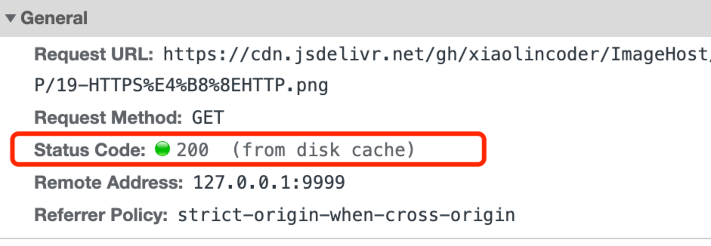

强缓存是利用下面这两个 HTTP 响应头部（Response Header）字段实现的，它们都用来表示资源在客户端缓存的有效期：

强缓存是利用下面这两个 HTTP 响应头部（Response Header）字段实现的，它们都用来表示资源在客户端缓存的有效期：

- `Cache-Control`， 是一个相对时间；
- `Expires`，是一个绝对时间；

如果 HTTP 响应头部同时有 Cache-Control 和 Expires 字段的话，**Cache-Control的优先级高于 Expires** 。

Cache-control 选项更多一些，设置更加精细，所以建议使用 Cache-Control 来实现强缓存。具体的实现流程如下：

- 当浏览器第一次请求访问服务器资源时，服务器会在返回这个资源的同时，在 Response 头部加上 Cache-Control，Cache-Control 中设置了过期时间大小；
- 浏览器再次请求访问服务器中的该资源时，会先**通过请求资源的时间与 Cache-Control 中设置的过期时间大小，来计算出该资源是否过期**，如果没有，则使用该缓存，否则重新请求服务器；
- 服务器再次收到请求后，会再次更新 Response 头部的 Cache-Control。

##### 什么是协商缓存？

当我们在浏览器使用开发者工具的时候，你可能会看到过某些请求的响应码是 `304`，这个是告诉浏览器可以使用本地缓存的资源，通常这种通过服务端告知客户端是否可以使用缓存的方式被称为协商缓存。


上图就是一个协商缓存的过程，所以**协商缓存就是与服务端协商之后，通过协商结果来判断是否使用本地缓存**。

协商缓存可以基于两种头部来实现。

协商缓存可以基于两种头部来实现。

第一种：请求头部中的 `If-Modified-Since` 字段与响应头部中的 `Last-Modified` 字段实现，这两个字段的意思是：

- 响应头部中的 `Last-Modified`：标示这个响应资源的最后修改时间；
- 请求头部中的 `If-Modified-Since`：当资源过期了，发现响应头中具有 Last-Modified 声明，则再次发起请求的时候带上 Last-Modified 的时间，服务器收到请求后发现有 If-Modified-Since 则与被请求资源的最后修改时间进行对比（Last-Modified），如果最后修改时间较新（大），说明资源又被改过，则返回最新资源，HTTP 200 OK；如果最后修改时间较旧（小），说明资源无新修改，响应 HTTP 304 走缓存。

第二种：请求头部中的 `If-None-Match` 字段与响应头部中的 `ETag` 字段，这两个字段的意思是：

- 响应头部中 `Etag`：唯一标识响应资源；
- 请求头部中的 `If-None-Match`：当资源过期时，浏览器发现响应头里有 Etag，则再次向服务器发起请求时，会将请求头If-None-Match 值设置为 Etag 的值。服务器收到请求后进行比对，如果资源没有变化返回 304，如果资源变化了返回 200。

第一种实现方式是基于时间实现的，第二种实现方式是基于一个唯一标识实现的，相对来说后者可以更加准确地判断文件内容是否被修改，避免由于时间篡改导致的不可靠问题。

如果 HTTP 响应头部同时有 Etag 和 Last-Modified 字段的时候， Etag 的优先级更高，也就是先会判断 Etag 是否变化了，如果 Etag 没有变化，然后再看 Last-Modified。

注意，**协商缓存这两个字段都需要配合强制缓存中 Cache-control 字段来使用，只有在未能命中强制缓存的时候，才能发起带有协商缓存字段的请求**。

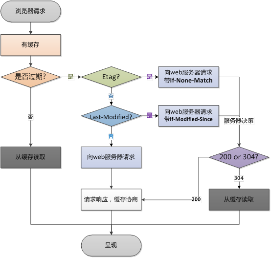

使用 ETag 字段实现的协商缓存的过程如下；

- 当浏览器第一次请求访问服务器资源时，服务器会在返回这个资源的同时，在 Response 头部加上 ETag 唯一标识，这个唯一标识的值是根据当前请求的资源生成的；

- 当浏览器再次请求访问服务器中的该资源时，首先会先检查强制缓存是否过期，如果没有过期，则直接使用本地缓存；如果缓存过期了，会在 Request 头部加上 If-None-Match 字段，该字段的值就是 ETag 唯一标识；

- 服务器再次收到请求后，

  会根据请求中的 If-None-Match 值与当前请求的资源生成的唯一标识进行比较：

  - **如果值相等，则返回 304 Not Modified，不会返回资源**；
  - 如果不相等，则返回 200 状态码和返回资源，并在 Response 头部加上新的 ETag 唯一标识；

- 如果浏览器收到 304 的请求响应状态码，则会从本地缓存中加载资源，否则更新资源。

#### 1.4 HTTP特性

##### HTTP(1.1)的优点有哪些？

HTTP 最凸出的优点是「简单、灵活和易于扩展、应用广泛和跨平台」。

+ **简单**：HTTP 基本的报文格式就是 `header + body`，头部信息也是 `key-value` 简单文本的形式，**易于理解**，降低了学习和使用的门槛。
+ **灵活和易于扩展**：HTTP协议里的各类请求方法、URI/URL、状态码、头字段等每个组成要求都没有被固定死，都允许开发人员**自定义和扩充**。同时 HTTP 由于是工作在应用层（ `OSI` 第七层），则它**下层可以随意变化**。HTTPS 也就是在 HTTP 与 TCP 层之间增加了 SSL/TLS 安全传输层。
+ **应用广泛和跨平台**：互联网发展至今，HTTP 的应用范围非常的广泛。

##### HTTP(1.1)的缺点有哪些？

HTTP 协议里有优缺点一体的**双刃剑**，分别是「无状态、明文传输」，同时还有一大缺点「不安全」。

**无状态双刃剑**

+ **好处**：因为服务器不会去记忆 HTTP 的状态，所以不需要额外的资源来记录状态信息，这能减轻服务器的负担，能够把更多的 CPU 和内存用来对外提供服务。

+ **坏处**：既然服务器没有记忆能力，它在完成有关联性的操作时会非常麻烦。

  例如登录->添加购物车->下单->结算->支付，这系列操作都要知道用户的身份才行。但服务器不知道这些请求是有关联的，每次都要问一遍身份信息。

  这样每操作一次，都要验证信息，这样的购物体验还能愉快吗？别问，问就是**酸爽**！

  对于无状态的问题，解法方案有很多种，其中比较简单的方式用 **Cookie** 技术。

  `Cookie` 通过在请求和响应报文中写入 Cookie 信息来控制客户端的状态。

  相当于，**在客户端第一次请求后，服务器会下发一个装有客户信息的「小贴纸」，后续客户端请求服务器的时候，带上「小贴纸」，服务器就能认得了**

  

**明文传输双刃剑**

明文意味着在传输过程中的信息，是可方便阅读的，通过浏览器的 F12 控制台或 Wireshark 抓包都可以直接肉眼查看，为我们调试工作带了极大的便利性。

但是这正是这样，HTTP 的所有信息都暴露在了光天化日下，相当于**信息裸奔**。在传输的漫长的过程中，信息的内容都毫无隐私可言，很容易就能被窃取，如果里面有你的账号密码信息，那**你号没了**。

**不安全**

HTTP 比较严重的缺点就是不安全：

- 通信使用明文（不加密），内容可能会被窃听。比如，**账号信息容易泄漏，那你号没了。**
- 不验证通信方的身份，因此有可能遭遇伪装。比如，**访问假的淘宝、拼多多，那你钱没了。**
- 无法证明报文的完整性，所以有可能已遭篡改。比如，**网页上植入垃圾广告，视觉污染，眼没了。**

HTTP 的安全问题，可以用 HTTPS 的方式解决，也就是通过引入 SSL/TLS 层，使得在安全上达到了极致。

##### HTTP(1.1)性能如何？

HTTP 协议是基于 **TCP/IP**，并且使用了「**请求 - 应答**」的通信模式，所以性能的关键就在这**两点**里。

*1. 长连接*

早期 HTTP/1.0 性能上的一个很大的问题，那就是每发起一个请求，都要新建一次 TCP 连接（三次握手），而且是串行请求，做了无谓的 TCP 连接建立和断开，增加了通信开销。

为了解决上述 TCP 连接问题，HTTP/1.1 提出了**长连接**的通信方式，也叫持久连接。这种方式的好处在于减少了 TCP 连接的重复建立和断开所造成的额外开销，减轻了服务器端的负载。

持久连接的特点是，只要任意一端没有明确提出断开连接，则保持 TCP 连接状态。


*2. 管道网络传输*

HTTP/1.1 采用了长连接的方式，这使得管道（pipeline）网络传输成为了可能。

即可在同一个 TCP 连接里面，客户端可以发起多个请求，只要第一个请求发出去了，不必等其回来，就可以发第二个请求出去，可以**减少整体的响应时间。**

举例来说，客户端需要请求两个资源。以前的做法是，在同一个 TCP 连接里面，先发送 A 请求，然后等待服务器做出回应，收到后再发出 B 请求。那么，管道机制则是允许浏览器同时发出 A 请求和 B 请求，如下图：


但是**服务器必须按照接收请求的顺序发送对这些管道化请求的响应**。

如果服务端在处理 A 请求时耗时比较长，那么后续的请求的处理都会被阻塞住，这称为「队头堵塞」。

所以，**HTTP/1.1 管道解决了请求的队头阻塞，但是没有解决响应的队头阻塞**。

***注意：实际上 HTTP/1.1 管道化技术不是默认开启，而且浏览器基本都没有支持，所以后面讨论HTTP/1.1 都是建立在没有使用管道化的前提。***

*3. 队头阻塞*

「请求 - 应答」的模式加剧了 HTTP 的性能问题。

因为当顺序发送的请求序列中的一个请求因为某种原因被阻塞时，在后面排队的所有请求也一同被阻塞了，会招致客户端一直请求不到数据，这也就是「**队头阻塞**」，好比上班的路上塞车。


总之 HTTP/1.1 的性能一般般，后续的 HTTP/2 和 HTTP/3 就是在优化 HTTP 的性能。

#### 1.5 HTTP与HTTPS

##### HTTP与HTTPS有哪些区别？

1. HTTP 是超文本传输协议，信息是明文传输，存在安全风险的问题。HTTPS 则解决 HTTP 不安全的缺陷，在 TCP 和 HTTP 网络层之间加入了 SSL/TLS 安全协议，使得报文能够加密传输。
2. HTTP 连接建立相对简单， TCP 三次握手之后便可进行 HTTP 的报文传输。而 HTTPS 在 TCP 三次握手之后，还需进行 SSL/TLS 的握手过程，才可进入加密报文传输。
3. HTTP 的端口号是 80，HTTPS 的端口号是 443。
4. HTTPS 协议需要向 CA（证书权威机构）申请数字证书，来保证服务器的身份是可信的。

##### HTTP解决了HTTP的哪些问题？

HTTP 由于是明文传输，所以安全上存在以下三个风险：

- **窃听风险**，比如通信链路上可以获取通信内容，用户号容易没。
- **篡改风险**，比如强制植入垃圾广告，视觉污染，用户眼容易瞎。
- **冒充风险**，比如冒充淘宝网站，用户钱容易没。


HTTP**S** 在 HTTP 与 TCP 层之间加入了 `SSL/TLS` 协议，可以很好的解决了上述的风险：

- **信息加密**：交互信息无法被窃取
- **校验机制**：无法篡改通信内容，篡改了就不能正常显示
- **身份证书**：证明淘宝是真的淘宝网

> HTTPS 是如何解决上面的三个风险的？

- **混合加密**的方式实现信息的**机密性**，解决了窃听的风险。
- **摘要算法**的方式来实现**完整性**，它能够为数据生成独一无二的「指纹」，指纹用于校验数据的完整性，解决了篡改的风险。
- 将服务器公钥放入到**数字证书**中，解决了冒充的风险。

*1. 混合加密*

通过**混合加密**的方式可以保证信息的**机密性**，解决了窃听的风险。


HTTPS 采用的是**对称加密**和**非对称加密**结合的「混合加密」方式：

+ 在通信建⽴前采⽤⾮对称加密的⽅式交换「会话秘钥」，后续就不再使⽤ ⾮对称加密。

  > 客户端和服务器端在通信建立前需要沟通一下之后通信的时候用的统 一的密钥，那么这个密钥咋知道呢？利用非对称加密技术，利用公钥 私钥的方式去传输这个密钥（更完全）。之后的发数据就使用这个密 钥来进行对称加密了。

+ 在通信过程中全部使⽤对称加密的「会话秘钥」的⽅式加密明⽂数据。

  > 对称加密只使⽤⼀个密钥，运算速度快，密钥必须保密，⽆法做到安 全的密钥交换。
  >
  >  ⾮对称加密使⽤两个密钥：公钥和私钥，公钥可以任意分发⽽私钥保 密，解决了密钥交换问题但速度慢。

> 服务器生成一对公钥私钥，公钥加密，私钥解密，把公钥给客户端，客户端用公钥加密好要传递的密钥，给服务端，服务端用私钥解密就知道要传递的密钥是啥了。

*2. 摘要算法 + 数字签名* （服务端到客户端）

为了保证传输的内容不被篡改，我们需要对内容计算出一个「指纹」，然后同内容一起传输给对方。

对方收到后，先是对内容也计算出一个「指纹」，然后跟发送方发送的「指纹」做一个比较，如果「指纹」相同，说明内容没有被篡改，否则就可以判断出内容被篡改了。

那么，在计算机里会**用摘要算法（哈希函数）来计算出内容的哈希值**，也就是内容的「指纹」，这个**哈希值是唯一的，且无法通过哈希值推导出内容**。


通过哈希算法可以确保内容不会被篡改，**但是并不能保证「内容 + 哈希值」不会被中间人替换**，因为这里缺少对客户端收到的消息是否来源于服务端的证明**。**


那为了避免这种情况，计算机里会用**非对称加密算法**来解决，共有两个密钥：

- 一个是公钥，这个是可以公开给所有人的；
- 一个是私钥，这个必须由本人管理，不可泄露。

这两个密钥可以**双向加解密**的，比如可以用公钥加密内容，然后用私钥解密，也可以用私钥加密内容，公钥解密内容。

流程的不同，意味着目的也不相同：

- **公钥加密，私钥解密**。这个目的是为了**保证内容传输的安全**，因为被公钥加密的内容，其他人是无法解密的，只有持有私钥的人，才能解密出实际的内容
- **私钥加密，公钥解密**。这个目的是为了**保证消息不会被冒充**，因为私钥是不可泄露的，如果公钥能正常解密出私钥加密的内容，就能证明这个消息是来源于持有私钥身份的人发送的。

一般我们不会用非对称加密来加密实际的传输内容，因为非对称加密的计算比较耗费性能的。

所以非对称加密的用途主要在于**通过「私钥加密，公钥解密」的方式，来确认消息的身份**，我们常说的**数字签名算法**，就是用的是这种方式，不过私钥加密内容不是内容本身，而是**对内容的哈希值加密**。


私钥是由服务端保管，然后服务端会向客户端颁发对应的公钥。如果客户端收到的信息，能被公钥解密，就说明该消息是由服务器发送的。

*3. 数字证书*

前面我们知道：

- 可以通过哈希算法来保证消息的完整性；
- 可以通过数字签名来保证消息的来源可靠性（能确认消息是由持有私钥的一方发送的）

但是这还远远不够，**还缺少身份验证的环节**，万一公钥是被伪造的呢？

就是我们可以伪造一对公私钥！那么咋办？


服务器把自己的公钥拿到CA，CA用自己的私钥给这个公钥的摘要加密，得到一个数字签名，服务器把这个【公钥 + 数字签名】打包成一个数字证书，客户端拿到服务器的数字证书后，使用CA的公钥解密这个数字签名，看看服务器这个公钥对不对，然后发现是对的。就可以拿这个公钥加密去传递通信时候需要的密钥。

> 验证这个公钥就使用了数字签名 + 摘要算法。

##### HTTPS是如何建立连接的？其间交互了什么？

SSL/TLS 协议基本流程：

- 客户端向服务器索要并验证服务器的公钥。（这一步就是前面的数字证书）
- 双方协商生产「会话秘钥」。
- 双方采用「会话秘钥」进行加密通信。

前两步也就是 SSL/TLS 的建立过程，**也就是 TLS 握手阶段。**

SSL/TLS 的「握手阶段」涉及**四次**通信， [基于 RSA 握手过程的 HTTPS (opens new window)](https://mp.weixin.qq.com/s?__biz=MzUxODAzNDg4NQ==&mid=2247487650&idx=1&sn=dfee83f6773a589c775ccd6f40491289&scene=21#wechat_redirect)见下图：


SSL/TLS 协议建立的详细流程：

*1. ClientHello*

首先，由客户端向服务器发起加密通信请求，也就是 `ClientHello` 请求。

在这一步，客户端主要向服务器发送以下信息：

（1）客户端支持的 SSL/TLS 协议版本，如 TLS 1.2 版本。

（2）客户端生产的随机数（`Client Random`），后面用于生成「会话秘钥」条件之一。

（3）客户端支持的密码套件列表，如 RSA 加密算法。

*2. SeverHello*

服务器收到客户端请求后，向客户端发出响应，也就是 `SeverHello`。服务器回应的内容有如下内容：

（1）确认 SSL/ TLS 协议版本，如果浏览器不支持，则关闭加密通信。

（2）服务器生产的随机数（`Server Random`），也是后面用于生产「会话秘钥」条件之一。

（3）确认的密码套件列表，如 RSA 加密算法。

（4）服务器的数字证书。

*3.客户端回应*

客户端收到服务器的回应之后，首先通过浏览器或者操作系统中的 CA 公钥，确认服务器的数字证书的真实性。

如果证书没有问题，客户端会**从数字证书中取出服务器的公钥**，然后使用它加密报文，向服务器发送如下信息：

（1）一个随机数（`pre-master key`）。该随机数会被服务器公钥加密。

（2）加密通信算法改变通知，表示随后的信息都将用「会话秘钥」加密通信。

（3）客户端握手结束通知，表示客户端的握手阶段已经结束。这一项同时把之前所有内容的发生的数据做个摘要，用来供服务端校验。

上面第一项的随机数是整个握手阶段的第三个随机数，会发给服务端，所以这个随机数客户端和服务端都是一样的。

**服务器和客户端有了这三个随机数（Client Random、Server Random、pre-master key），接着就用双方协商的加密算法，各自生成本次通信的「会话秘钥」**。

*4. 服务器的最后回应*

服务器收到客户端的第三个随机数（`pre-master key`）之后，通过协商的加密算法，计算出本次通信的「会话秘钥」。

然后，向客户端发送最后的信息：

（1）加密通信算法改变通知，表示随后的信息都将用「会话秘钥」加密通信。

（2）服务器握手结束通知，表示服务器的握手阶段已经结束。这一项同时把之前所有内容的发生的数据做个摘要，用来供客户端校验。

至此，整个 SSL/TLS 的握手阶段全部结束。接下来，客户端与服务器进入加密通信，就完全是使用普通的 HTTP 协议，只不过用「会话秘钥」加密内容。

##### HTTPS的应用数据是如何保证完整性的？

TLS 在实现上分为**握手协议**和**记录协议**两层：

- TLS 握手协议就是我们前面说的 TLS 四次握手的过程，负责协商加密算法和生成对称密钥，后续用此密钥来保护应用程序数据（即 HTTP 数据）；
- TLS 记录协议负责保护应用程序数据并验证其完整性和来源，所以对 HTTP 数据加密是使用记录协议

TLS 记录协议主要负责消息（HTTP 数据）的压缩，加密及数据的认证，过程如下图：


具体过程如下：

- 首先，消息被分割成多个较短的片段,然后分别对每个片段进行压缩。
- 接下来，经过压缩的片段会被**加上消息认证码（MAC 值，这个是通过哈希算法生成的），这是为了保证完整性，并进行数据的认证**。通过附加消息认证码的 MAC 值，可以识别出篡改。与此同时，为了防止重放攻击，在计算消息认证码时，还加上了片段的编码。
- 再接下来，经过压缩的片段再加上消息认证码会一起通过对称密码进行加密。
- 最后，上述经过加密的数据再加上由数据类型、版本号、压缩后的长度组成的报头就是最终的报文数据。

记录协议完成后，最终的报文数据将传递到传输控制协议 (TCP) 层进行传输。

#### 1.6 HTTP/1.1相比HTTP/1.0提高了什么性能？

HTTP/1.1 相比 HTTP/1.0 性能上的改进：

- 使用长连接的方式改善了 HTTP/1.0 短连接造成的性能开销。
- 支持管道（pipeline）网络传输，只要第一个请求发出去了，不必等其回来，就可以发第二个请求出去，可以减少整体的响应时间。

但 HTTP/1.1 还是有性能瓶颈：

- 请求 / 响应头部（Header）未经压缩就发送，首部信息越多延迟越大。只能压缩 `Body` 的部分；
- 发送冗长的首部。每次互相发送相同的首部造成的浪费较多；
- 服务器是按请求的顺序响应的，如果服务器响应慢，会招致客户端一直请求不到数据，也就是队头阻塞；
- 没有请求优先级控制；
- 请求只能从客户端开始，服务器只能被动响应。

### 2 HTTP1.1 如何优化？

我们可以从下面这三种优化思路来优化 HTTP/1.1 协议：

- *尽量避免发送 HTTP 请求*；
- *在需要发送 HTTP 请求时，考虑如何减少请求次数*；
- *减少服务器的 HTTP 响应的数据大小*；


#### 2.1 如何避免发送HTTP请求？

对于一些具有重复性的 HTTP 请求，比如每次请求得到的数据都一样的，我们可以把这对「请求-响应」的数据都**缓存在本地**，那么下次就直接读取本地的数据，不必在通过网络获取服务器的响应了，这样的话 HTTP/1.1 的性能肯定肉眼可见的提升。

所以，避免发送 HTTP 请求的方法就是通过**缓存技术**，HTTP 设计者早在之前就考虑到了这点，因此 HTTP 协议的头部有不少是针对缓存的字段。

那缓存是如何做到的呢？

客户端会把第一次请求以及响应的数据保存在本地磁盘上，其中将请求的 URL 作为 key，而响应作为 value，两者形成映射关系。

这样当后续发起相同的请求时，就可以先在本地磁盘上通过 key 查到对应的 value，也就是响应，如果找到了，就直接从本地读取该响应。毋庸置疑，读取本地磁盘的速度肯定比网络请求快得多，如下图：


聪明的你可能想到了，万一缓存的响应不是最新的，而客户端并不知情，那么该怎么办呢？

放心，这个问题 HTTP 设计者早已考虑到。

所以，服务器在发送 HTTP 响应时，会估算一个过期的时间，并把这个信息放到响应头部中，这样客户端在查看响应头部的信息时，一旦发现缓存的响应是过期的，则就会重新发送网络请求。

如果客户端从第一次请求得到的响应头部中发现该响应过期了，客户端重新发送请求，假设服务器上的资源并没有变更，还是老样子，那么你觉得还要在服务器的响应带上这个资源吗？

很显然不带的话，可以提高 HTTP 协议的性能，那具体如何做到呢？

只需要客户端在重新发送请求时，在请求的 `Etag` 头部带上第一次请求的响应头部中的摘要，这个摘要是唯一标识响应的资源，当服务器收到请求后，会将本地资源的摘要与请求中的摘要做个比较。

如果不同，那么说明客户端的缓存已经没有价值，服务器在响应中带上最新的资源。

如果相同，说明客户端的缓存还是可以继续使用的，那么服务器**仅返回不含有包体的 `304 Not Modified` 响应**，告诉客户端仍然有效，这样就可以减少响应资源在网络中传输的延时，如下图：


缓存真的是性能优化的一把万能钥匙。

#### 2.2 如何减少HTTP请求次数？

减少 HTTP 请求次数自然也就提升了 HTTP 性能，可以从这 3 个方面入手：

- *减少重定向请求次数*；
- *合并请求*；
- *延迟发送请求*；

##### 减少重定向请求次数

我们先来看看什么是**重定向请求**？

服务器上的一个资源可能由于迁移、维护等原因从 url1 移至 url2 后，而客户端不知情，它还是继续请求 url1，这时服务器不能粗暴地返回错误，而是通过 `302` 响应码和 `Location` 头部，告诉客户端该资源已经迁移至 url2 了，于是客户端需要再发送 url2 请求以获得服务器的资源。

那么，如果重定向请求越多，那么客户端就要多次发起 HTTP 请求，每一次的 HTTP 请求都得经过网络，这无疑会越降低网络性能。

另外，服务端这一方往往不只有一台服务器，比如源服务器上一级是代理服务器，然后代理服务器才与客户端通信，这时客户端重定向就会导致客户端与代理服务器之间需要 2 次消息传递，如下图：


如果**重定向的工作交由代理服务器完成，就能减少 HTTP 请求次数了**，如下图：


而且当代理服务器知晓了重定向规则后，可以进一步减少消息传递次数，如下图：


除了 `302` 重定向响应码，还有其他一些重定向的响应码，你可以从下图看到：


其中，`301` 和 `308` 响应码是告诉客户端可以将重定向响应缓存到本地磁盘，之后客户端就自动用 url2 替代 url1 访问服务器的资源。

##### 合并请求

如果把多个访问小文件的请求合并成一个大的请求，虽然传输的总资源还是一样，但是减少请求，也就意味着**减少了重复发送的 HTTP 头部**。

另外由于 HTTP/1.1 是请求响应模型，如果第一个发送的请求，未收到对应的响应，那么后续的请求就不会发送，于是为了防止单个请求的阻塞，所以一般浏览器会同时发起 5-6 个请求，每一个请求都是不同的 TCP 连接，那么如果合并了请求，也就会**减少 TCP 连接的数量，因而省去了 TCP 握手和慢启动过程耗费的时间**。

接下来，具体看看合并请求的几种方式。


##### 延迟发送请求

不要一口气吃成大胖子，一般 HTML 里会含有很多 HTTP 的 URL，当前不需要的资源，我们没必要也获取过来，于是可以通过「**按需获取**」的方式，来减少第一时间的 HTTP 请求次数。

请求网页的时候，没必要把全部资源都获取到，而是只获取当前用户所看到的页面资源，当用户向下滑动页面的时候，再向服务器获取接下来的资源，这样就达到了延迟发送请求的效果。

有的网页会含有很多小图片、小图标，有多少个小图片，客户端就要发起多少次请求。那么对于这些小图片，我们可以考虑使用 `CSS Image Sprites` 技术把它们合成一个大图片，这样浏览器就可以用一次请求获得一个大图片，然后再根据 CSS 数据把大图片切割成多张小图片。


这种方式就是**通过将多个小图片合并成一个大图片来减少 HTTP 请求的次数，以减少 HTTP 请求的次数，从而减少网络的开销**。

除了将小图片合并成大图片的方式，还有服务端使用 `webpack` 等打包工具将 js、css 等资源合并打包成大文件，也是能达到类似的效果。

另外，还可以将图片的二进制数据用 `base64` 编码后，以 URL 的形式潜入到 HTML 文件，跟随 HTML 文件一并发送.

```text
<image src="data:image/png;base64,iVBORw0KGgoAAAANSUhEUgAAAPoAAAFKCAIAAAC7M9WrAAAACXBIWXMAA ... />
```

这样客户端收到 HTML 后，就可以直接解码出数据，然后直接显示图片，就不用再发起图片相关的请求，这样便减少了请求的次数。


可以看到，**合并请求的方式就是合并资源，以一个大资源的请求替换多个小资源的请求**。

但是这样的合并请求会带来新的问题，**当大资源中的某一个小资源发生变化后，客户端必须重新下载整个完整的大资源文件**，这显然带来了额外的网络消耗。

#### 2.3 如何减少HTTP响应的数据大小？

对于 HTTP 的请求和响应，通常 HTTP 的响应的数据大小会比较大，也就是服务器返回的资源会比较大。

于是，我们可以考虑对响应的资源进行**压缩**，这样就可以减少响应的数据大小，从而提高网络传输的效率。

压缩的方式一般分为 2 种，分别是：

- *无损压缩*
- *有损压缩*

##### 无损压缩

无损压缩是指资源经过压缩后，信息不被破坏，还能完全恢复到压缩前的原样，适合用在文本文件、程序可执行文件、程序源代码。

首先，我们针对代码的语法规则进行压缩，因为通常代码文件都有很多换行符或者空格，这些是为了帮助程序员更好的阅读，但是机器执行时并不要这些符，把这些多余的符号给去除掉。

接下来，就是无损压缩了，需要对原始资源建立统计模型，利用这个统计模型，将常出现的数据用较短的二进制比特序列表示，将不常出现的数据用较长的二进制比特序列表示，生成二进制比特序列一般是「霍夫曼编码」算法。

gzip 就是比较常见的无损压缩。客户端支持的压缩算法，会在 HTTP 请求中通过头部中的 `Accept-Encoding` 字段告诉服务器：

```text
Accept-Encoding: gzip, deflate, br
```

服务器收到后，会从中选择一个服务器支持的或者合适的压缩算法，然后使用此压缩算法对响应资源进行压缩，最后通过响应头部中的 `content-encoding` 字段告诉客户端该资源使用的压缩算法。

```text
content-encoding: gzip
```

##### 有损压缩

与无损压缩相对的就是有损压缩，经过此方法压缩，解压的数据会与原始数据不同但是非常接近。

有损压缩主要将次要的数据舍弃，牺牲一些质量来减少数据量、提高压缩比，这种方法经常用于压缩多媒体数据，比如音频、视频、图片。

可以通过 HTTP 请求头部中的 `Accept` 字段里的「 q 质量因子」，告诉服务器期望的资源质量。

```c++
Accept: audio/*; q=0.2, audio/basic
```

### 3 HTTP/2介绍

#### 3.1 HTTP/1.1 协议的性能问题

现在的站点相比以前变化太多了，比如：

- *消息的大小变大了*，从几 KB 大小的消息，到几 MB 大小的消息；
- *页面资源变多了*，从每个页面不到 10 个的资源，到每页超 100 多个资源；
- *内容形式变多样了*，从单纯到文本内容，到图片、视频、音频等内容；
- *实时性要求变高了*，对页面的实时性要求的应用越来越多；

这些变化带来的最大性能问题就是 **HTTP/1.1 的高延迟**，延迟高必然影响的就是用户体验。主要原因如下几个：

- *延迟难以下降*，虽然现在网络的「带宽」相比以前变多了，但是延迟降到一定幅度后，就很难再下降了，说白了就是到达了延迟的下限；
- *并发连接有限*，谷歌浏览器最大并发连接数是 6 个，而且每一个连接都要经过 TCP 和 TLS 握手耗时，以及 TCP 慢启动过程给流量带来的影响；
- *队头阻塞问题*，同一连接只能在完成一个 HTTP 事务（请求和响应）后，才能处理下一个事务；

- *HTTP 头部巨大且重复*，由于 HTTP 协议是无状态的，每一个请求都得携带 HTTP 头部，特别是对于有携带 cookie 的头部，而 cookie 的大小通常很大；
- *不支持服务器推送消息*，因此当客户端需要获取通知时，只能通过定时器不断地拉取消息，这无疑浪费大量了带宽和服务器资源。

尽管对 HTTP/1.1 协议的优化手段如此之多，但是效果还是不尽人意，因为这些手段都是对 HTTP/1.1 协议的“外部”做优化，**而一些关键的地方是没办法优化的，比如请求-响应模型、头部巨大且重复、并发连接耗时、服务器不能主动推送等，要改变这些必须重新设计 HTTP 协议，于是 HTTP/2 就出来了！**

#### 3.2 兼容HTTP/1.1

HTTP/2 出来的目的是为了改善 HTTP 的性能。协议升级有一个很重要的地方，就是要**兼容**老版本的协议，否则新协议推广起来就相当困难，所幸 HTTP/2 做到了兼容 HTTP/1.1 。

那么，HTTP/2 是怎么做的呢？

第一点，HTTP/2 没有在 URI 里引入新的协议名，仍然用「http://」表示明文协议，用「https://」表示加密协议，于是只需要浏览器和服务器在背后自动升级协议，这样可以让用户意识不到协议的升级，很好的实现了协议的平滑升级。

第二点，只在应用层做了改变，还是基于 TCP 协议传输，应用层方面为了保持功能上的兼容，HTTP/2 把 HTTP 分解成了「语义」和「语法」两个部分，「语义」层不做改动，与 HTTP/1.1 完全一致，比如请求方法、状态码、头字段等规则保留不变。

但是，HTTP/2 在「语法」层面做了很多改造，基本改变了 HTTP 报文的传输格式。

#### 3.3 头部压缩

HTTP 协议的报文是由「Header + Body」构成的，对于 Body 部分，HTTP/1.1 协议可以使用头字段 「Content-Encoding」指定 Body 的压缩方式，比如用 gzip 压缩，这样可以节约带宽，但报文中的另外一部分 Header，是没有针对它的优化手段。

HTTP/1.1 报文中 Header 部分存在的问题：

- 含很多固定的字段，比如Cookie、User Agent、Accept 等，这些字段加起来也高达几百字节甚至上千字节，所以有必要**压缩**；
- 大量的请求和响应的报文里有很多字段值都是重复的，这样会使得大量带宽被这些冗余的数据占用了，所以有必须要**避免重复性**；
- 字段是 ASCII 编码的，虽然易于人类观察，但效率低，所以有必要改成**二进制编码**；

HTTP/2 对 Header 部分做了大改造，把以上的问题都解决了。

HTTP/2 没使用常见的 gzip 压缩方式来压缩头部，而是开发了 **HPACK** 算法，HPACK 算法主要包含三个组成部分：

- 静态字典；
- 动态字典；
- Huffman 编码（压缩算法）；

客户端和服务器两端都会建立和维护「**字典**」，用长度较小的索引号表示重复的字符串，再用 Huffman 编码压缩数据，**可达到 50%~90% 的高压缩率**。

##### 静态表编码

HTTP/2 为高频出现在头部的字符串和字段建立了一张**静态表**，它是写入到 HTTP/2 框架里的，不会变化的，静态表里共有 `61` 组，如下图：


表中的 `Index` 表示索引（Key），`Header Value` 表示索引对应的 Value，`Header Name` 表示字段的名字，比如 Index 为 2 代表 GET，Index 为 8 代表状态码 200。

你可能注意到，表中有的 Index 没有对应的 Header Value，这是因为这些 Value 并不是固定的而是变化的，这些 Value 都会经过 Huffman 编码后，才会发送出去。

这么说有点抽象，我们来看个具体的例子，下面这个 `server` 头部字段，在 HTTP/1.1 的形式如下：

```text
server: nghttpx\r\n
```

算上冒号空格和末尾的\r\n，共占用了 17 字节，**而使用了静态表和 Huffman 编码，可以将它压缩成 8 字节，压缩率大概 47 %**。

我抓了个 HTTP/2 协议的网络包，你可以从下图看到，高亮部分就是 `server` 头部字段，只用了 8 个字节来表示 `server` 头部数据。


根据 RFC7541 规范，如果头部字段属于静态表范围，并且 Value 是变化，那么它的 HTTP/2 头部前 2 位固定为 `01`，所以整个头部格式如下图：


HTTP/2 头部由于基于**二进制编码**，就不需要冒号空格和末尾的\r\n作为分隔符，于是改用表示字符串长度（Value Length）来分割 Index 和 Value。

接下来，根据这个头部格式来分析上面抓包的 `server` 头部的二进制数据。

首先，从静态表中能查到 `server` 头部字段的 Index 为 54，二进制为 110110，再加上固定 01，头部格式第 1 个字节就是 `01110110`，这正是上面抓包标注的红色部分的二进制数据。

然后，第二个字节的首个比特位表示 Value 是否经过 Huffman 编码，剩余的 7 位表示 Value 的长度，比如这次例子的第二个字节为 `10000110`，首位比特位为 1 就代表 Value 字符串是经过 Huffman 编码的，经过 Huffman 编码的 Value 长度为 6。

最后，字符串 `nghttpx` 经过 Huffman 编码后压缩成了 6 个字节，Huffman 编码的原理是将高频出现的信息用「较短」的编码表示，从而缩减字符串长度。

于是，在统计大量的 HTTP 头部后，HTTP/2 根据出现频率将 ASCII 码编码为了 Huffman 编码表，可以在 RFC7541 文档找到这张**静态 Huffman 表**，我就不把表的全部内容列出来了，我只列出字符串 `nghttpx` 中每个字符对应的 Huffman 编码，如下图：

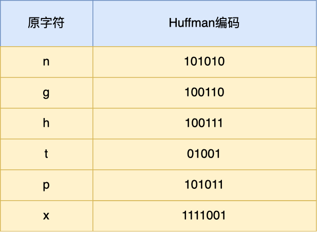

通过查表后，字符串 `nghttpx` 的 Huffman 编码在下图看到，共 6 个字节，每一个字符的 Huffman 编码，我用相同的颜色将他们对应起来了，最后的 7 位是补位的。

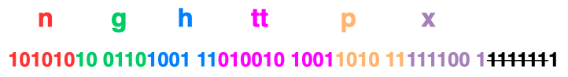

最终，`server` 头部的二进制数据对应的静态头部格式如下：


##### 动态表编码

静态表只包含了 61 种高频出现在头部的字段，不在静态表范围内的头部字符串就要自行构建**动态表**，它的 Index 从 `62` 起步，会在编码解码的时候随时更新。

比如，第一次发送时头部中的「`user-agent` 」字段数据有上百个字节，经过 Huffman 编码发送出去后，客户端和服务器双方都会更新自己的动态表，添加一个新的 Index 号 62。**那么在下一次发送的时候，就不用重复发这个字段的数据了，只用发 1 个字节的 Index 号就好了，因为双方都可以根据自己的动态表获取到字段的数据**。

所以，使得动态表生效有一个前提：**必须同一个连接上，重复传输完全相同的 HTTP 头部字段**。如果消息字段在 1 个连接上只发送了 1 次，**或者重复传输时，该字段总是略有变化，动态表就无法被充分利用了**。

**因此，随着在同一 HTTP/2 连接上发送的报文越来越多，客户端和服务器双方的「字典」积累的越来越多，理论上最终每个头部字段都会变成 1 个字节的 Index，这样便避免了大量的冗余数据的传输，大大节约了带宽。**

理想很美好，现实很骨感。动态表越大，占用的内存也就越大，如果占用了太多内存，是会影响服务器性能的，因此 Web 服务器都会提供类似 `http2_max_requests` 的配置，用于限制一个连接上能够传输的请求数量，避免动态表无限增大，请求数量到达上限后，就会关闭 HTTP/2 连接来释放内存。

综上，HTTP/2 头部的编码通过「静态表、动态表、Huffman 编码」共同完成的。


#### 3.4 二进制帧

将 HTTP/1 的文本格式改成二进制格式传输数据，极大提高了 HTTP 传输效率，而且二进制数据使用位运算能高效解析。

你可以从下图看到，HTTP/1.1 的响应 和 HTTP/2 的区别：


HTTP/2 把报文划分成了两类**帧（\*Frame\*）**，图中的 HEADERS（首部）和 DATA（消息负载） 是帧的类型，也就是说一条 HTTP 响应，划分成了两类帧来传输，并且采用二进制来编码。

HTTP/2 **二进制帧**的结构如下图：


帧头（Frame Header）很小，只有 9 个字节，帧开头的前 3 个字节表示帧数据（Frame Playload）的**长度**。

帧长度后面的一个字节是表示**帧的类型**，HTTP/2 总共定义了 10 种类型的帧，一般分为**数据帧**和**控制帧**两类，如下表格：


帧类型后面的一个字节是**标志位**，可以保存 8 个标志位，用于携带简单的控制信息，比如：

- **END_HEADERS** 表示头数据结束标志，相当于 HTTP/1 里头后的空行（“\r\n”）；
- **END_STREAM** 表示单方向数据发送结束，后续不会再有数据帧。
- **PRIORITY** 表示流的优先级；

帧头的最后 4 个字节是**流标识符**（Stream ID），但最高位被保留不用，只有 31 位可以使用，因此流标识符的最大值是 2^31，大约是 21 亿，它的作用是用来标识该 Frame 属于哪个 Stream，接收方可以根据这个信息从乱序的帧里找到相同 Stream ID 的帧，从而有序组装信息。

最后面就是**帧数据**了，它存放的是通过 **HPACK 算法**压缩过的 HTTP 头部和包体。

#### 3.5 并发传输

通过 Stream 这个设计，**多个 Stream 复用一条 TCP 连接，达到并发的效果**，解决了 HTTP/1.1 队头阻塞的问题，提高了 HTTP 传输的吞吐量。

> HTTP/1.1 管道解决了请求的队头阻塞，但是没有解决响应的队头阻塞。

为了理解 HTTP/2 的并发是怎样实现的，我们先来理解 HTTP/2 中的 Stream、Message、Frame 这 3 个概念。

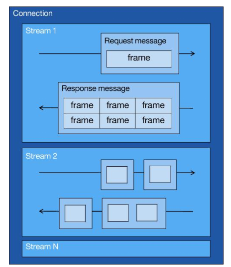

你可以从上图中看到：

- 1 个 TCP 连接包含一个或者多个 Stream，Stream 是 HTTP/2 并发的关键技术；
- Stream 里可以包含 1 个或多个 Message，Message 对应 HTTP/1 中的请求或响应，由 HTTP 头部和包体构成
- Message 里包含一条或者多个 Frame，Frame 是 HTTP/2 最小单位，以二进制压缩格式存放 HTTP/1 中的内容（头部和包体）

> 包体就是body

在 HTTP/2 连接上，**不同 Stream 的帧是可以乱序发送的（因此可以并发不同的 Stream ）**，因为每个帧的头部会携带 Stream ID 信息，所以接收端可以通过 Stream ID 有序组装成 HTTP 消息，而**同一 Stream 内部的帧必须是严格有序的**。

> 不同Stream相当于不同的请求-响应。

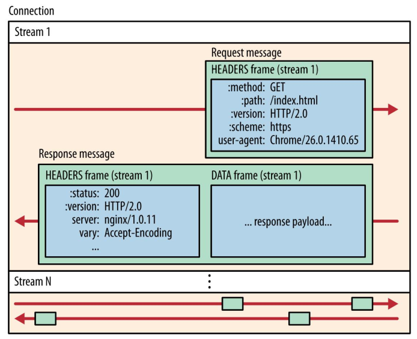

客户端和服务器**双方都可以建立 Stream**， Stream ID 也是有区别的，客户端建立的 Stream 必须是奇数号，而服务器建立的 Stream 必须是偶数号。

同一个连接中的 Stream ID 是不能复用的，只能顺序递增，所以当 Stream ID 耗尽时，需要发一个控制帧 `GOAWAY`，用来关闭 TCP 连接。

HTTP/2 通过 Stream 实现的并发，比 HTTP/1.1 通过 TCP 连接实现并发要牛逼的多，**因为当 HTTP/2 实现 100 个并发 Stream 时，只需要建立一次 TCP 连接，而 HTTP/1.1 需要建立 100 个 TCP 连接，每个 TCP 连接都要经过TCP 握手、慢启动以及 TLS 握手过程，这些都是很耗时的。**

HTTP/2 还可以对每个 Stream 设置不同**优先级**，帧头中的「标志位」可以设置优先级，比如客户端访问 HTML/CSS 和图片资源时，希望服务器先传递 HTML/CSS，再传图片，那么就可以通过设置 Stream 的优先级来实现，以此提高用户体验。

> ***注意：实际上 HTTP/1.1 管道化技术不是默认开启，而且浏览器基本都没有支持，所以后面讨论HTTP/1.1 都是建立在没有使用管道化的前提。***

#### 3.6 服务器主动推送资源

HTTP/1.1 不支持服务器主动推送资源给客户端，都是由客户端向服务器发起请求后，才能获取到服务器响应的资源。

比如，客户端通过 HTTP/1.1 请求从服务器那获取到了 HTML 文件，而 HTML 可能还需要依赖 CSS 来渲染页面，这时客户端还要再发起获取 CSS 文件的请求，需要两次消息往返，如下图左边部分：

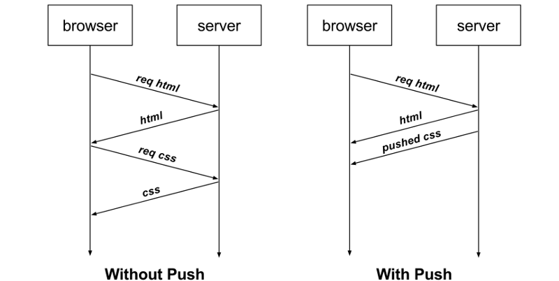

如上图右边部分，在 HTTP/2 中，客户端在访问 HTML 时，服务器可以直接主动推送 CSS 文件，减少了消息传递的次数。

#### 3.7 总结

HTTP2相较于相比 HTTP/1 大大提高了传输效率、吞吐能力。

第一点，对于常见的 HTTP 头部通过**静态表和 Huffman 编码**的方式，将体积压缩了近一半，而且针对后续的请求头部，还可以建立**动态表**，将体积压缩近 90%，大大提高了编码效率，同时节约了带宽资源。

不过，动态表并非可以无限增大， 因为动态表是会占用内存的，动态表越大，内存也越大，容易影响服务器总体的并发能力，因此服务器需要限制 HTTP/2 连接时长或者请求次数。

第二点，**HTTP/2 实现了 Stream 并发**，多个 Stream 只需复用 1 个 TCP 连接，节约了 TCP 和 TLS 握手时间，以及减少了 TCP 慢启动阶段对流量的影响。不同的 Stream ID 才可以并发，即时乱序发送帧也没问题，但是同一个 Stream 里的帧必须严格有序。

第三点，**服务器支持主动推送资源**，大大提升了消息的传输性能，服务器推送资源时，会先发送 PUSH_PROMISE 帧，告诉客户端接下来在哪个 Stream 发送资源，然后用偶数号 Stream 发送资源给客户端。


**但是！！！！！！！**

HTTP/2 通过 Stream 的并发能力，解决了 HTTP/1 队头阻塞的问题，看似很完美了，但是 HTTP/2 还是存在“队头阻塞”的问题，只不过问题不是在 HTTP 这一层面，而是在 TCP 这一层。

**HTTP/2 是基于 TCP 协议来传输数据的，TCP 是字节流协议，TCP 层必须保证收到的字节数据是完整且连续的，这样内核才会将缓冲区里的数据返回给 HTTP 应用，那么当「前 1 个字节数据」没有到达时，后收到的字节数据只能存放在内核缓冲区里，只有等到这 1 个字节数据到达时，HTTP/2 应用层才能从内核中拿到数据，这就是 HTTP/2 队头阻塞问题。**

有没有什么解决方案呢？既然是 TCP 协议自身的问题，那干脆放弃 TCP 协议，转而使用 UDP 协议作为传输层协议，这个大胆的决定， HTTP/3 协议做了！

### 4 HTTP/3介绍

#### 4.1 美中不足的HTTP/2

HTTP/2 通过头部压缩、二进制编码、多路复用、服务器推送等新特性大幅度提升了 HTTP/1.1 的性能，而美中不足的是 HTTP/2 协议是基于 TCP 实现的，于是存在的缺陷有三个。

- 队头阻塞；
- TCP 与 TLS 的握手时延迟；
- 网络迁移需要重新连接；

##### 队头阻塞

因为 TCP 是字节流协议，TCP 层必须保证收到的字节数据是完整且有序的，如果序列号较低的 TCP 段在网络传输中丢失了，即使序列号较高的 TCP 段已经被接收了，应用层也无法从内核中读取到这部分数据，从 HTTP 视角看，就是请求被阻塞了。

举个例子，如下图：


图中发送方发送了很多个 packet，每个 packet 都有自己的序号，你可以认为是 TCP 的序列号，其中 packet 3 在网络中丢失了，即使 packet 4-6 被接收方收到后，由于内核中的 TCP 数据不是连续的，于是接收方的应用层就无法从内核中读取到，只有等到 packet 3 重传后，接收方的应用层才可以从内核中读取到数据，这就是 HTTP/2 的队头阻塞问题，是在 TCP 层面发生的。

##### TCP 与 TLS 的握手时延迟

发起 HTTP 请求时，需要经过 TCP 三次握手和 TLS 四次握手（TLS 1.2）的过程，因此共需要 3 个 RTT 的时延才能发出请求数据。


另外， TCP 由于具有「拥塞控制」的特性，所以刚建立连接的 TCP 会有个「慢启动」的过程，它会对 TCP 连接产生"减速"效果。

##### 网络迁移需要重新连接

一个 TCP 连接是由四元组（源 IP 地址，源端口，目标 IP 地址，目标端口）确定的，这意味着如果 IP 地址或者端口变动了，就会导致需要 TCP 与 TLS 重新握手，这不利于移动设备切换网络的场景，比如 4G 网络环境切换成 WIFI。

这些问题都是 TCP 协议固有的问题，无论应用层的 HTTP/2 在怎么设计都无法逃脱。要解决这个问题，就必须把**传输层协议替换成 UDP**，这个大胆的决定，HTTP/3 做了！


**个人认为HTTP/3了解这么多就够了！记住一个点，HTTP/3将TCP协议换成了UDP协议！其他感觉就不用记了，脑子装不下了:cry:。**

### 5 既然有HTTP协议，为什么还要有RPC？

#### 5.1 从TCP聊起

作为一个程序员，假设我们需要在A电脑的进程发一段数据到B电脑的进程，我们一般会在代码里使用socket 进行编程。

这时候，我们可选项一般也就TCP和UDP二选一。TCP可靠，UDP不可靠。

类似下面这样。

```c
fd = socket(AF_INET,SOCK_STREAM,0);
```

其中`SOCK_STREAM`，是指使用**字节流**传输数据，说白了就是**TCP协议**。

在定义了socket之后，我们就可以愉快的对这个socket进行操作，比如用`bind()`绑定IP端口，用`connect()`发起连接。

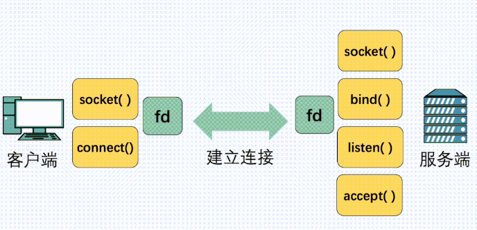

在连接建立之后，我们就可以使用`send()`发送数据，`recv()`接收数据。

光这样一个纯裸的TCP连接，就可以做到收发数据了，那是不是就够了？

不行，这么用会有问题。

#### 5.2 使用纯裸TCP会有什么问题？

八股文常背，TCP是有三个特点，**面向连接**、**可靠**、基于**字节流**。

今天我们需要关注的是**基于字节流**这一点。

字节流可以理解为一个双向的通道里流淌的数据，这个**数据**其实就是我们常说的二进制数据，简单来说就是一大堆 **01 串**。纯裸TCP收发的这些 01 串之间是**没有任何边界**的，你根本不知道到哪个地方才算一条完整消息。

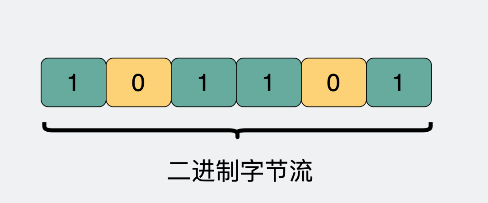

正因为这个没有**任何边界**的特点，所以当我们选择使用TCP发送**"夏洛"和"特烦恼"**的时候，接收端收到的就是**"夏洛特烦恼"**，这时候接收端没发区分你是想要表达**"夏洛"+"特烦恼"**还是**"夏洛特"+"烦恼"**。

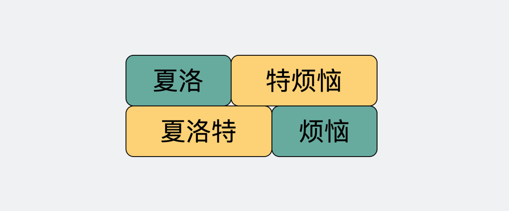

这就是所谓的**粘包问题**

说这个的目的是为了告诉大家，纯裸TCP是不能直接拿来用的，你需要在这个基础上加入一些**自定义的规则**，用于区分**消息边界**。

于是我们会把每条要发送的数据都包装一下，比如加入**消息头**，**消息头里写清楚一个完整的包长度是多少**，根据这个长度可以继续接收数据，截取出来后它们就是我们真正要传输的**消息体**。

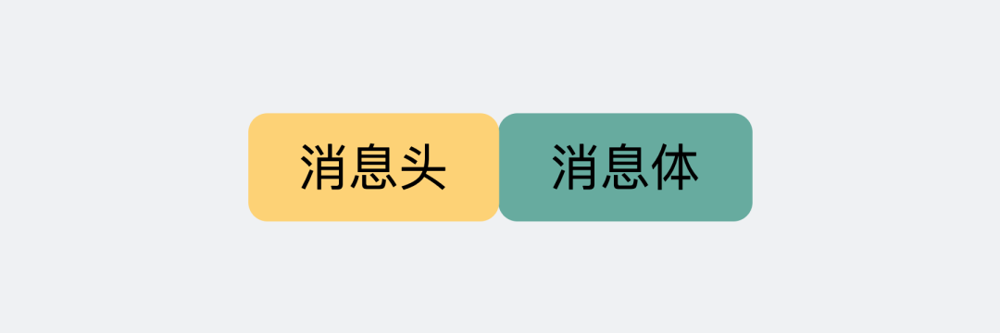

而这里头提到的**消息头**，还可以放各种东西，比如消息体是否被压缩过和消息体格式之类的，只要上下游都约定好了，互相都认就可以了，这就是所谓的**协议。**

每个使用TCP的项目都可能会定义一套类似这样的协议解析标准，他们可能**有区别，但原理都类似**。

**于是基于TCP，就衍生了非常多的协议，比如HTTP和RPC。**

#### 5.3 HTTP和RPC

我们回过头来看网络的分层图。

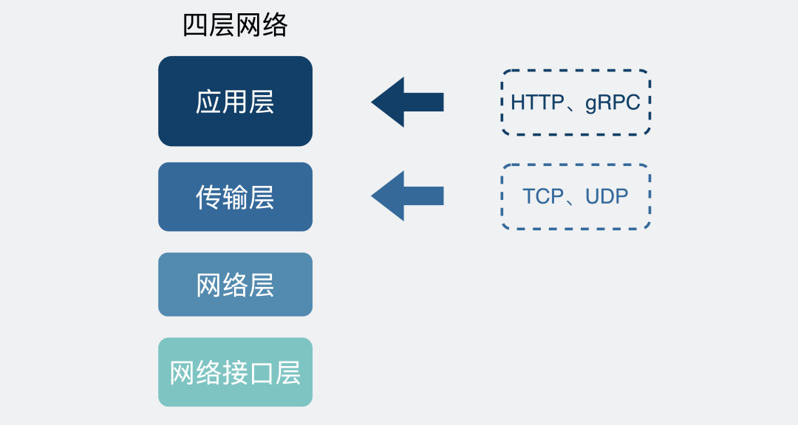

**TCP是传输层的协议**，而基于TCP造出来的HTTP和**各类**RPC协议，它们都只是定义了不同消息格式的**应用层协议**而已。

**HTTP**协议（**H**yper **T**ext **T**ransfer **P**rotocol），又叫做**超文本传输协议**。我们用的比较多，平时上网在浏览器上敲个网址就能访问网页，这里用到的就是HTTP协议。

我们回过头来看网络的分层图。


**TCP是传输层的协议**，而基于TCP造出来的HTTP和**各类**RPC协议，它们都只是定义了不同消息格式的**应用层协议**而已。

**HTTP**协议（**H**yper **T**ext **T**ransfer **P**rotocol），又叫做**超文本传输协议**。我们用的比较多，平时上网在浏览器上敲个网址就能访问网页，这里用到的就是HTTP协议。

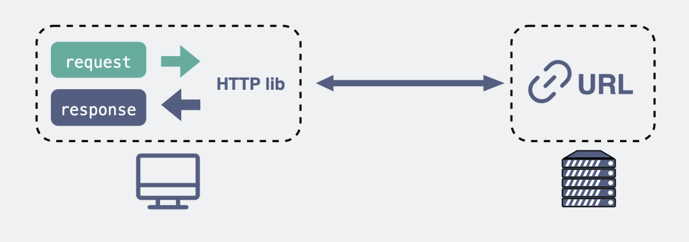

而**RPC**（**R**emote **P**rocedure **C**all），又叫做**远程过程调用**。它本身并不是一个具体的协议，而是一种**调用方式**。

举个例子，我们平时调用一个**本地方法**就像下面这样。

```text
 res = localFunc(req)
```

如果现在这不是个本地方法，而是个**远端服务器**暴露出来的一个方法`remoteFunc`，如果我们还能像调用本地方法那样去调用它，这样就可以**屏蔽掉一些网络细节**，用起来更方便，岂不美哉？

```text
 res = remoteFunc(req)
```

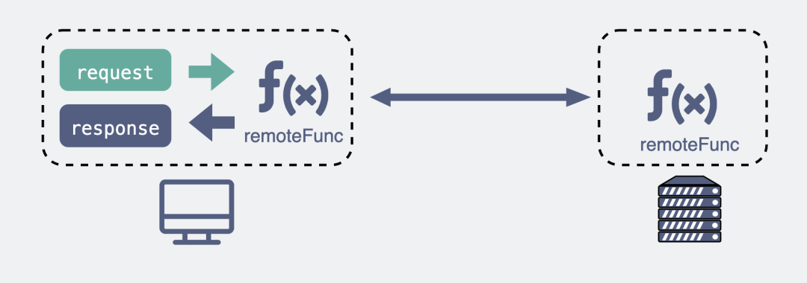

基于这个思路，大佬们造出了非常多款式的RPC协议，比如比较有名的`gRPC`，`thrift`。

值得注意的是，虽然大部分RPC协议底层使用TCP，但实际上**它们不一定非得使用TCP，改用UDP或者HTTP，其实也可以做到类似的功能。**

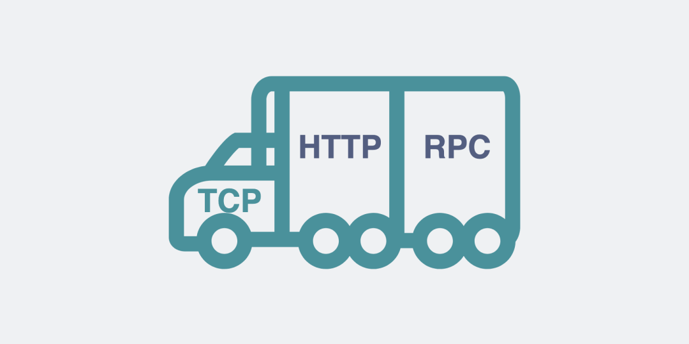

到这里，我们回到文章标题的问题。

> 既然有HTTP协议，为什么还要有RPC？

其实，`TCP`是**70年**代出来的协议，而`HTTP`是**90年代**才开始流行的。而直接使用裸TCP会有问题，可想而知，这中间这么多年有多少自定义的协议，而这里面就有**80年代**出来的`RPC`。

所以我们该问的不是**既然有HTTP协议为什么要有RPC**，而是**为什么有RPC还要有HTTP协议**。

> 那既然有 RPC 了，为什么还要有HTTP呢？

现在电脑上装的各种**联网**软件，比如xx管家，xx卫士，它们都作为**客户端（client）**需要跟**服务端（server）**建立连接收发消息，此时都会用到应用层协议，在这种**client/server (c/s)**架构下，它们可以使用自家造的RPC协议，因为它只管连自己公司的服务器就ok了。

但有个软件不同，**浏览器（browser）**，不管是chrome还是IE，它们不仅要能访问自家公司的**服务器（server）**，还需要访问其他公司的网站服务器，因此它们需要有个统一的标准，不然大家没法交流。于是，HTTP就是那个时代用于统一 **browser/server (b/s)** 的协议。

那这么说的话，**都用HTTP得了，还用什么RPC？**

#### 5.4 HTTP和RPC有什么区别？

我们来看看RPC和HTTP区别比较明显的几个点。

##### 服务发现

首先要向某个服务器发起请求，你得先建立连接，而建立连接的前提是，你得知道**IP地址和端口**。这个找到服务对应的IP端口的过程，其实就是**服务发现**。

在**HTTP**中，你知道服务的域名，就可以通过**DNS服务**去解析得到它背后的IP地址，默认80端口。

而**RPC**的话，就有些区别，一般会有专门的**中间服务**去保存服务名和IP信息，比如**consul或者etcd，甚至是redis**。想要访问某个服务，就去这些中间服务去获得IP和端口信息。由于dns也是服务发现的一种，所以也有基于dns去做服务发现的组件，比如**CoreDNS**。

可以看出服务发现这一块，两者是有些区别，但不太能分高低。

##### 底层连接形式

以主流的**HTTP1.1**协议为例，其默认在建立底层TCP连接之后会一直保持这个连接（**keep alive**），之后的请求和响应都会复用这条连接。

而**RPC**协议，也跟HTTP类似，也是通过建立TCP长链接进行数据交互，但不同的地方在于，RPC协议一般还会再建个**连接池**，在请求量大的时候，建立多条连接放在池内，要发数据的时候就从池里取一条连接出来，**用完放回去，下次再复用**，可以说非常环保。

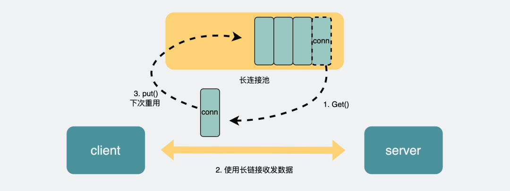

**由于连接池有利于提升网络请求性能，所以不少编程语言的网络库里都会给HTTP加个连接池**，比如**go**就是这么干的。

可以看出这一块两者也没太大区别，所以也不是关键。

##### 传输的内容

基于TCP传输的消息，说到底，无非都是**消息头header和消息体body。**

**header**是用于标记一些特殊信息，其中最重要的是**消息体长度**。

**body**则是放我们真正需要传输的内容，而这些内容只能是二进制01串，毕竟计算机只认识这玩意。所以TCP传字符串和数字都问题不大，因为字符串可以转成编码再变成01串，而数字本身也能直接转为二进制。但结构体呢，我们得想个办法将它也转为二进制01串，这样的方案现在也有很多现成的，比如**json，protobuf。**

这个将结构体转为二进制数组的过程就叫**序列化**，反过来将二进制数组复原成结构体的过程叫**反序列化**。

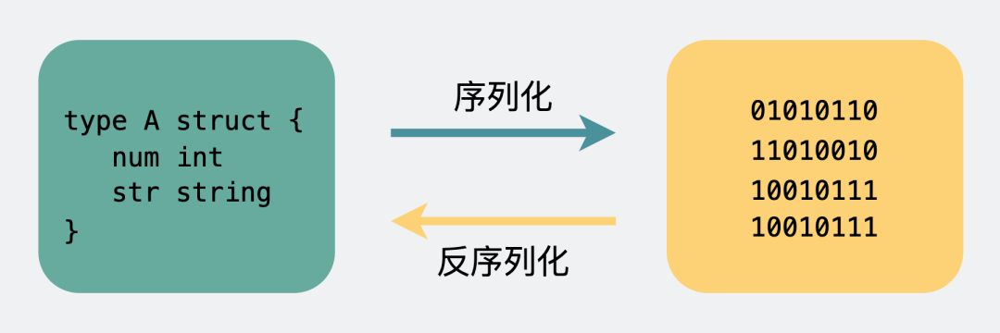

对于主流的HTTP1.1，虽然它现在叫**超文本**协议，支持音频视频，但HTTP设计初是用于做网页**文本**展示的，所以它传的内容以字符串为主。header和body都是如此。在body这块，它使用**json**来**序列化**结构体数据。

我们可以随便截个图直观看下。

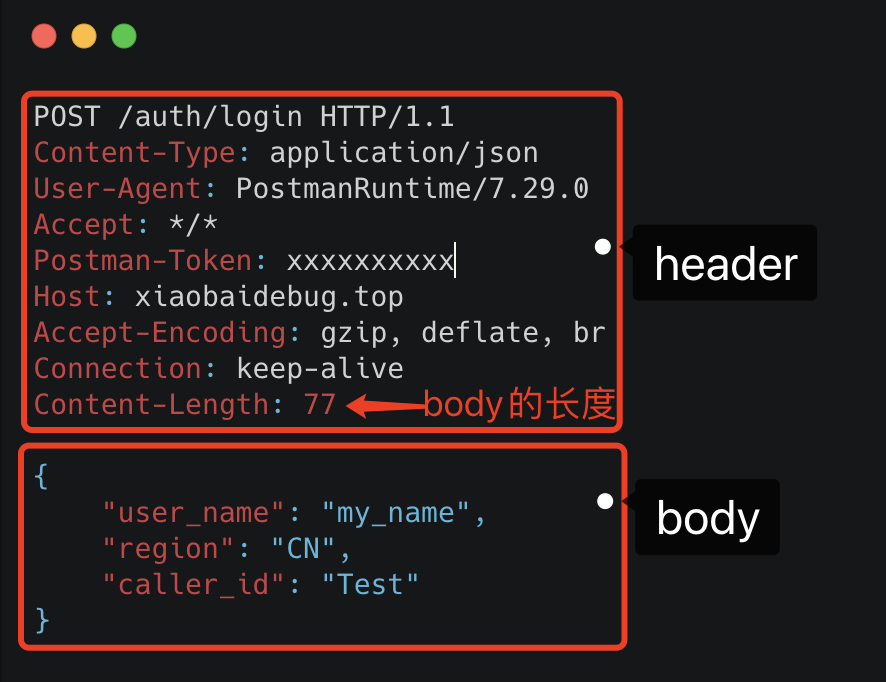

可以看到这里面的内容非常多的**冗余**，显得**非常啰嗦**。最明显的，像`header`里的那些信息，其实如果我们约定好头部的第几位是content-type，就**不需要每次都真的把"content-type"这个字段都传过来**，类似的情况其实在`body`的json结构里也特别明显。

而RPC，因为它定制化程度更高，可以采用体积更小的protobuf或其他序列化协议去保存结构体数据，同时也不需要像HTTP那样考虑各种浏览器行为，比如302重定向跳转啥的。**因此性能也会更好一些，这也是在公司内部微服务中抛弃HTTP，选择使用RPC的最主要原因。**

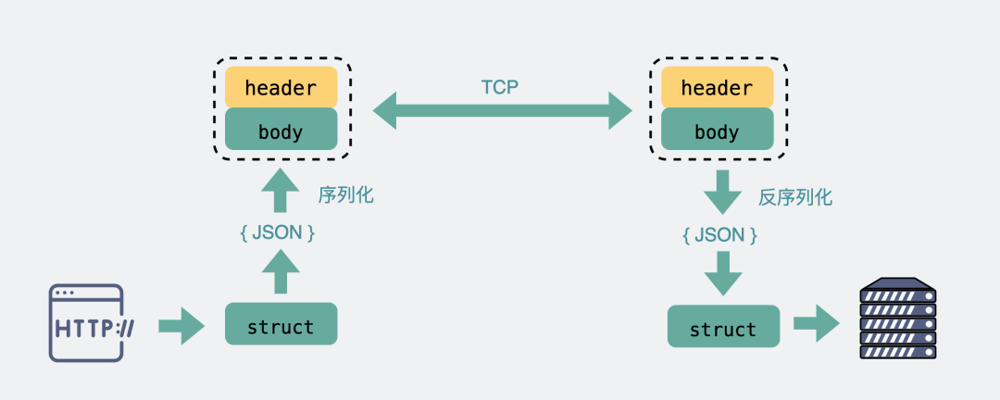

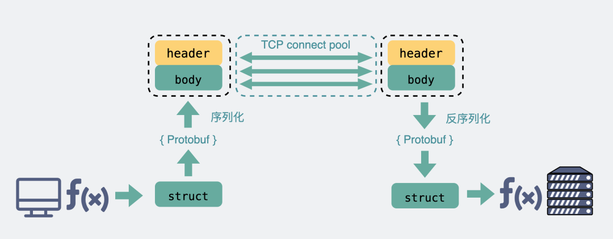

当然上面说的HTTP，其实**特指的是现在主流使用的HTTP1.1**，`HTTP2`在前者的基础上做了很多改进，所以**性能可能比很多RPC协议还要好**，甚至连`gRPC`底层都直接用的`HTTP2`。

> 那么问题又来了，为什么既然有了HTTP2，还要有RPC协议？

这个是由于 HTTP2 是2015年出来的。那时候很多公司内部的RPC协议都已经跑了好些年了，基于历史原因，一般也没必要去换了。

#### 5.5 总结

- 纯裸TCP是能收发数据，但它是个**无边界**的数据流，上层需要定义**消息格式**用于定义**消息边界**。于是就有了各种协议，HTTP和各类RPC协议就是在TCP之上定义的应用层协议。
- **RPC本质上不算是协议，而是一种调用方式**，而像gRPC和thrift这样的具体实现，才是协议，它们是实现了RPC调用的协议。目的是希望程序员能像调用本地方法那样去调用远端的服务方法。同时RPC有很多种实现方式，**不一定非得基于TCP协议**。
- 从发展历史来说，**HTTP主要用于b/s架构，而RPC更多用于c/s架构。但现在其实已经没分那么清了，b/s和c/s在慢慢融合。**很多软件同时支持多端，所以对外一般用HTTP协议，而内部集群的微服务之间则采用RPC协议进行通讯。
- RPC其实比HTTP出现的要早，且比目前主流的HTTP1.1**性能**要更好，所以大部分公司内部都还在使用RPC。
- **HTTP2.0**在**HTTP1.1**的基础上做了优化，性能可能比很多RPC协议都要好，但由于是这几年才出来的，所以也不太可能取代掉RPC。
