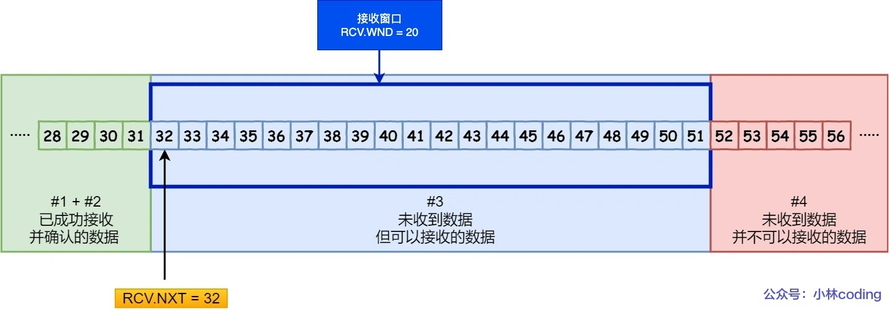
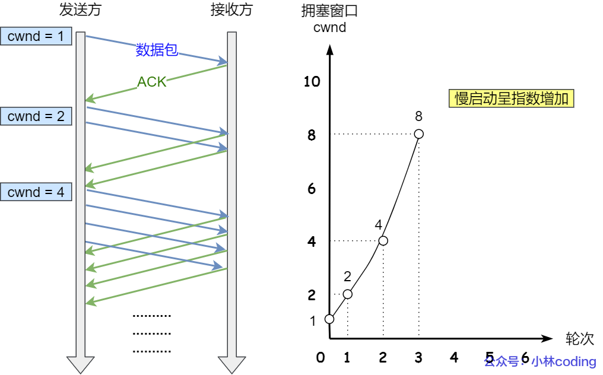
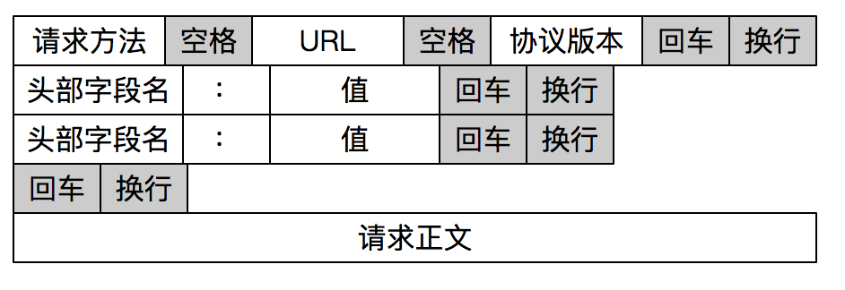
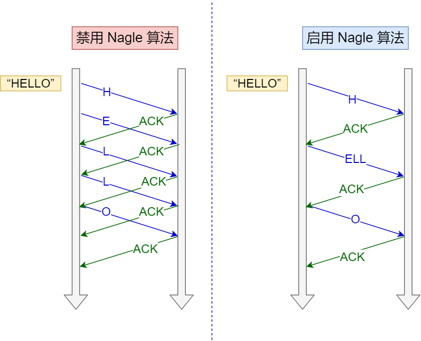

## TCP篇

### 1 TCP三次握手与四次握手面试题

#### 1.1 TCP基本认识

#####  TCP 头格式

我们先来看看 TCP 头的格式，标注颜色的表示与本文关联比较大的字段，其他字段不做详细阐述。


**序列号**：在建立连接时由计算机生成的随机数作为其初始值，通过 SYN 包传给接收端主机，每发送一次数据，就「累加」一次该「数据字节数」的大小。**用来解决网络包乱序问题。**

**确认应答号**：指下一次「期望」收到的数据的序列号，发送端收到这个确认应答以后可以认为在这个序号以前的数据都已经被正常接收。**用来解决丢包的问题。**

**控制位：**

- *ACK*：该位为 `1` 时，「确认应答」的字段变为有效，TCP 规定除了最初建立连接时的 `SYN` 包之外该位必须设置为 `1` 。
- *RST*：该位为 `1` 时，表示 TCP 连接中出现异常必须强制断开连接。
- *SYN*：该位为 `1` 时，表示希望建立连接，并在其「序列号」的字段进行序列号初始值的设定。
- *FIN*：该位为 `1` 时，表示今后不会再有数据发送，希望断开连接。当通信结束希望断开连接时，通信双方的主机之间就可以相互交换 `FIN` 位为 1 的 TCP 段。

> 为什么需要 TCP 协议？ TCP 工作在哪一层？

`IP` 层是「不可靠」的，它不保证网络包的交付、不保证网络包的按序交付、也不保证网络包中的数据的完整性。

如果需要保障网络数据包的可靠性，那么就需要由上层（传输层）的 `TCP` 协议来负责。

因为 TCP 是一个工作在**传输层**的**可靠**数据传输的服务，它能确保接收端接收的网络包是**无损坏、无间隔、非冗余和按序的。**

##### 什么是 TCP ？

TCP 是**面向连接的、可靠的、基于字节流**的传输层通信协议。

- **面向连接**：一定是「一对一」才能连接，不能像 UDP 协议可以一个主机同时向多个主机发送消息，也就是一对多是无法做到的；
- **可靠的**：无论的网络链路中出现了怎样的链路变化，TCP 都可以保证一个报文一定能够到达接收端；
- **面向字节流：**就像水流一样

> TCP一般根据MSS大小在传输层将字节流分装成各个包（TCP包），从而尽量不在IP层分包。而udp会包装整个用户消息，超过MSS也不管，因为到IP再分片。
>
> TCP以MSS分段是为了不进行IP分片。TCP要保证可靠性，所以会重传丢失的包，重传的最小粒度是一个TCP数据包。如果你不将TCP包拆成MSS大小的片段来发，而是依赖IP分片，会导致仅一个IP分组丢失的时候，你也要重传这个TCP包对应的所有IP分片，会浪费资源。

> 面向字节流和面向报文是上层协议看待TCP和UDP的视角。

> “字节流”还是“报文段”，区别在于，对使用协议的用户而言，读数据的时候，是不是有“**边界**”。
>
> 有边界，就是报文段，没边界，就是字节流。
>
> 没有边界，怎么理解呢？就是上层也不知道我这次调用read，是读到了几个TCP数据包，可能是一个，半个，也可能是好几个。因此**上层协议往往需要自己的边界**来划分
>
> 有边界，又怎么理解？每次[recvfrom](https://www.zhihu.com/search?q=recvfrom&search_source=Entity&hybrid_search_source=Entity&hybrid_search_extra={"sourceType"%3A"answer"%2C"sourceId"%3A824061061})，一定是读的一个UDP数据包，即使留的buffer太小没读全，下次recvfrom也是读下一个数据包，前一个数据包未读到的部分就丢了。
>
> 
>
> 可以看到udp收到是一个list，操作系统在收到 UDP 报文后，会将其插入到队列里，**队列里的每一个元素就是一个 UDP 报文**，这样当用户调用 recvfrom() 系统调用读数据的时候，就会从队列里取出一个数据，然后从内核里拷贝给用户缓冲区。

##### 什么是 TCP 连接？

简单来说就是，**用于保证可靠性和流量控制维护的某些状态信息，这些信息的组合，包括Socket、序列号和窗口大小称为连接。**

所以我们可以知道，建立一个 TCP 连接是需要客户端与服务器端达成上述三个信息的共识。

- **Socket**：由 IP 地址和端口号组成
- **序列号**：用来解决乱序问题等
- **窗口大小**：用来做流量控制

##### 如何唯一确定一个 TCP 连接呢？

TCP 四元组可以唯一的确定一个连接，四元组包括如下：

- 源地址
- 源端口
- 目的地址
- 目的端口

源地址和目的地址的字段（32位）是在 IP 头部中，作用是通过 IP 协议发送报文给对方主机。

源端口和目的端口的字段（16位）是在 TCP 头部中，作用是告诉 TCP 协议应该把报文发给哪个进程。

##### 有一个 IP 的服务器监听了一个端口，它的 TCP 的最大连接数是多少？

服务器通常固定在某个本地端口上监听，等待客户端的连接请求。

因此，客户端 IP 和 端口是可变的，其理论值计算公式如下:


对 IPv4，客户端的 IP 数最多为 `2` 的 `32` 次方，客户端的端口数最多为 `2` 的 `16` 次方，也就是服务端单机最大 TCP 连接数，约为 `2` 的 `48` 次方。

当然，服务端最大并发 TCP 连接数远不能达到理论上限，会受以下因素影响：

- 文件描述符限制，每个 TCP 连接都是一个文件，如果文件描述符被占满了，会发生 too many open files。Linux 对可打开的文件描述符的数量分别作了三个方面的限制：
  - **系统级**：当前系统可打开的最大数量，通过 cat /proc/sys/fs/file-max 查看；
  - **用户级**：指定用户可打开的最大数量，通过 cat /etc/security/limits.conf 查看；
  - **进程级**：单个进程可打开的最大数量，通过 cat /proc/sys/fs/nr_open 查看；
- **内存限制**，每个 TCP 连接都要占用一定内存，操作系统的内存是有限的，如果内存资源被占满后，会发生 OOM。

##### UDP和TCP区别？

> 分别的应用场景是？

UDP 不提供复杂的控制机制，利用 IP 提供面向「无连接」的通信服务。

UDP 协议真的非常简单，头部只有 `8` 个字节（ 64 位），UDP 的头部格式如下：


- 目标和源端口：主要是告诉 UDP 协议应该把报文发给哪个进程。
- 包长度：该字段保存了 UDP 首部的长度跟数据的长度之和。
- 校验和：校验和是为了提供可靠的 UDP 首部和数据而设计，防止收到在网络传输中受损的 UDP包

**TCP 和 UDP 区别：**

*1. 连接*

- TCP 是面向连接的传输层协议，传输数据前先要建立连接。
- UDP 是不需要连接，即刻传输数据。（每次发送都要获取对端socket）

*2. 服务对象*

- TCP 是一对一的两点服务，即一条连接只有两个端点。
- UDP 支持一对一、一对多、多对多的交互通信

*3. 可靠性*

- TCP 是可靠交付数据的，数据可以无差错、不丢失、不重复、按序到达。
- UDP 是尽最大努力交付，不保证可靠交付数据。

*4. 拥塞控制、流量控制*

- TCP 有拥塞控制和流量控制机制，保证数据传输的安全性。
- UDP 则没有，即使网络非常拥堵了，也不会影响 UDP 的发送速率。

*5. 首部开销*

- TCP 首部长度较长，会有一定的开销，首部在没有使用「选项」字段时是 `20` 个字节，如果使用了「选项」字段则会变长的。
- UDP 首部只有 8 个字节，并且是固定不变的，开销较小。

*6. 传输方式*

- TCP 是流式传输，没有边界，但保证顺序和可靠。
- UDP 是一个包一个包的发送，是有边界的，但可能会丢包和乱序。

*7. 分片不同*

- TCP 的数据大小如果大于 MSS 大小，则会在传输层进行分片，目标主机收到后，也同样在传输层组装 TCP 数据包，如果中途丢失了一个分片，只需要传输丢失的这个分片。
- UDP 的数据大小如果大于 MTU 大小，则会在 IP 层进行分片，目标主机收到后，在 IP 层组装完数据，接着再传给传输层。

**TCP 和 UDP 应用场景：**

由于 TCP 是面向连接，能保证数据的可靠性交付，因此经常用于：

- `FTP` 文件传输；
- HTTP / HTTPS；

由于 UDP 面向无连接，它可以随时发送数据，再加上UDP本身的处理既简单又高效，因此经常用于：

- 包总量较少的通信，如 `DNS` 、`SNMP` 等；
- 视频、音频等多媒体通信；
- 广播通信；

##### 为什么 UDP 头部没有「首部长度」字段，而 TCP 头部有「首部长度」字段呢？

原因是 TCP 有**可变长**的「选项」字段，而 UDP 头部长度则是**不会变化**的，无需多一个字段去记录 UDP 的首部长度。

##### 为什么 UDP 头部有「包长度」字段，而 TCP 头部则没有「包长度」字段呢？

先说说 TCP 是如何计算负载数据长度：


其中 IP 总长度 和 IP 首部长度，在 IP 首部格式是已知的。TCP 首部长度，则是在 TCP 首部格式已知的，所以就可以求得 TCP 数据的长度。

大家这时就奇怪了问：“ UDP 也是基于 IP 层的呀，那 UDP 的数据长度也可以通过这个公式计算呀？ 为何还要有「包长度」呢？”

这么一问，确实感觉 UDP 「包长度」是冗余的。

**因为为了网络设备硬件设计和处理方便，首部长度需要是 `4`字节的整数倍。**

如果去掉 UDP 「包长度」字段，那 UDP 首部长度就不是 `4` 字节的整数倍了，所以小林觉得这可能是为了补全 UDP 首部长度是 `4` 字节的整数倍，才补充了「包长度」字段。

#### 1.2 TCP连接建立

##### TCP 三次握手过程和状态变迁


+ 一开始，客户端和服务端都处于 `CLOSED` 状态。先是服务端主动监听某个端口，处于 `LISTEN` 状态
+ 客户端会随机初始化序号（`client_isn`），将此序号置于 TCP 首部的「序号」字段中，同时把 `SYN` 标志位置为 `1` ，表示 `SYN` 报文。接着把第一个 SYN 报文发送给服务端，表示向服务端发起连接，**该报文不包含应用层数据**，之后客户端处于 `SYN-SENT` 状态。
+ 服务端收到客户端的 `SYN` 报文后，首先服务端也随机初始化自己的序号（`server_isn`），将此序号填入 TCP 首部的「序号」字段中，其次把 TCP 首部的「确认应答号」字段填入 `client_isn + 1`, 接着把 `SYN` 和 `ACK` 标志位置为 `1`。最后把该报文发给客户端，**该报文也不包含应用层数据**，之后服务端处于 `SYN-RCVD` 状态。
+ 客户端收到服务端报文后，还要向服务端回应最后一个应答报文，首先该应答报文 TCP 首部 `ACK` 标志位置为 `1` ，其次「确认应答号」字段填入 `server_isn + 1` ，最后把报文发送给服务端，这次报文可以携带客户到服务器的数据，之后客户端处于 `ESTABLISHED` 状态。
+ 服务器收到客户端的应答报文后，也进入 `ESTABLISHED` 状态。

**第三次握手是可以携带数据的，前两次握手是不可以携带数据的**

##### 如何在 Linux 系统中查看 TCP 状态？

TCP 的连接状态查看，在 Linux 可以通过 `netstat -napt` 命令查看。


##### 为什么是三次握手？不是两次、四次？

在前面我们知道了什么是 **TCP 连接**：

- 用于保证可靠性和流量控制维护的某些状态信息，这些信息的组合，包括**Socket、序列号和窗口大小**称为连接。

所以，重要的是**为什么三次握手才可以初始化Socket、序列号和窗口大小并建立 TCP 连接。**

接下来，以三个方面分析三次握手的原因：

- 三次握手才可以阻止重复历史连接的初始化（主要原因）
- 三次握手才可以同步双方的初始序列号
- 三次握手才可以避免资源浪费

*原因一：避免历史连接*

我们考虑一个场景，客户端先发送了 SYN（seq = 90） 报文，然后客户端宕机了，而且这个 SYN 报文还被网络阻塞了，服务端并没有收到，接着客户端重启后，又重新向服务端建立连接，发送了 SYN（seq = 100） 报文（注意不是重传 SYN，重传的 SYN 的序列号是一样的）。

看看三次握手是如何阻止历史连接的：


客户端连续发送多次 SYN 建立连接的报文，在**网络拥堵**情况下：

- 一个「旧 SYN 报文」比「最新的 SYN 」 报文早到达了服务端；
- 那么此时服务端就会回一个 `SYN + ACK` 报文给客户端；
- 客户端收到后可以根据自身的上下文，判断这是一个历史连接（序列号过期或超时），那么客户端就会发送 `RST` 报文给服务端，表示中止这一次连接。

**如果是两次握手连接，就无法阻止历史连接**，那为什么 TCP 两次握手为什么无法阻止历史连接呢？

我先直接说结论，主要是因为**在两次握手的情况下，「被动发起方」没有中间状态给「主动发起方」来阻止历史连接，导致「被动发起方」可能建立一个历史连接，造成资源浪费**。

你想想，两次握手的情况下，「被动发起方」在收到 SYN 报文后，就进入 ESTABLISHED 状态，意味着这时可以给对方发送数据给，但是「主动发」起方此时还没有进入 ESTABLISHED 状态，假设这次是历史连接，主动发起方判断到此次连接为历史连接，那么就会回 RST 报文来断开连接，而「被动发起方」在第一次握手的时候就进入 ESTABLISHED 状态，所以它可以发送数据的，但是它并不知道这个是历史连接，它只有在收到 RST 报文后，才会断开连接。

「被动发起方」在向「主动发起方」发送数据前，并没有阻止掉历史连接，导致「被动发起方」建立了一个历史连接，又白白发送了数据，妥妥地浪费了「被动发起方」的资源。

所以，**TCP 使用三次握手建立连接的最主要原因是防止「历史连接」初始化了连接。**

*原因二：同步双方初始序列号*

TCP 协议的通信双方， 都必须维护一个「序列号」， 序列号是可靠传输的一个关键因素，它的作用：

- 接收方可以去除重复的数据；
- 接收方可以根据数据包的序列号按序接收；
- 可以标识发送出去的数据包中， 哪些是已经被对方收到的（通过 ACK 报文中的序列号知道）；

可见，序列号在 TCP 连接中占据着非常重要的作用，所以当客户端发送携带「初始序列号」的 `SYN` 报文的时候，需要服务端回一个 `ACK` 应答报文，表示客户端的 SYN 报文已被服务端成功接收，那当服务端发送「初始序列号」给客户端的时候，依然也要得到客户端的应答回应，**这样一来一回，才能确保双方的初始序列号能被可靠的同步。**


四次握手其实也能够可靠的同步双方的初始化序号，但由于**第二步和第三步可以优化成一步**，所以就成了「三次握手」。

而两次握手只保证了一方的初始序列号能被对方成功接收，没办法保证双方的初始序列号都能被确认接收。

*原因三：避免资源浪费*

如果只有「两次握手」，当客户端的 `SYN` 请求连接在网络中阻塞，客户端没有接收到 `ACK` 报文，就会重新发送 `SYN` ，由于没有第三次握手，服务器不清楚客户端是否收到了自己发送的建立连接的 `ACK` 确认信号，所以每收到一个 `SYN` 就只能先主动建立一个连接，这会造成什么情况呢？

如果客户端的 `SYN` 阻塞了，重复发送多次 `SYN` 报文，那么服务器在收到请求后就会**建立多个冗余的无效链接，造成不必要的资源浪费。**

*小结*

TCP 建立连接时，通过三次握手**能防止历史连接的建立，能减少双方不必要的资源开销，能帮助双方同步初始化序列号**。序列号能够保证数据包不重复、不丢弃和按序传输。

不使用「两次握手」和「四次握手」的原因：

- 「两次握手」：无法防止历史连接的建立，会造成双方资源的浪费，也无法可靠的同步双方序列号；
- 「四次握手」：三次握手就已经理论上最少可靠连接建立，所以不需要使用更多的通信次数。

##### 为什么每次建立 TCP 连接时，初始化的序列号都要求不一样呢？

主要原因有两个方面：

- 为了防止历史报文被下一个相同四元组的连接接收（主要方面）；
- 为了安全性，防止黑客伪造的相同序列号的 TCP 报文被对方接收；

接下来，详细说说第一点。

假设每次建立连接，客户端和服务端的初始化序列号都是从 0 开始：


过程如下：

- 客户端和服务端建立一个 TCP 连接，在客户端发送数据包被网络阻塞了，然后超时重传了这个数据包，而此时服务端设备断电重启了，之前与客户端建立的连接就消失了，于是在收到客户端的数据包的时候就会发送 RST 报文。
- 紧接着，客户端又与服务端建立了与上一个连接相同四元组的连接；
- 在新连接建立完成后，上一个连接中被网络阻塞的数据包正好抵达了服务端，刚好该数据包的序列号正好是在服务端的接收窗口内，所以该数据包会被服务端正常接收，就会造成数据错乱。

可以看到，**如果每次建立连接，客户端和服务端的初始化序列号都是一样的话，很容易出现历史报文被下一个相同四元组的连接接收的问题**。

##### 初始序列号 ISN 是如何随机产生的？

随机数是会基于时钟计时器递增的，基本不可能会随机成一样的初始化序列号。

##### 既然 IP 层会分片，为什么 TCP 层还需要 MSS 呢？

我们先来认识下 MTU 和 MSS


- `MTU`：一个网络包的最大长度，以太网中一般为 `1500` 字节；
- `MSS`：除去 IP 和 TCP 头部之后，一个网络包所能容纳的 TCP 数据的最大长度；

如果在 TCP 的整个报文（头部 + 数据）交给 IP 层进行分片，会有什么异常呢？

当 IP 层有一个超过 `MTU` 大小的数据（TCP 头部 + TCP 数据）要发送，那么 IP 层就要进行分片，把数据分片成若干片，保证每一个分片都小于 MTU。把一份 IP 数据报进行分片以后，由目标主机的 IP 层来进行重新组装后，再交给上一层 TCP 传输层。

这看起来井然有序，但这存在隐患的，**那么当如果一个 IP 分片丢失，整个 IP 报文的所有分片都得重传**。

因为 IP 层本身没有超时重传机制，它由传输层的 TCP 来负责超时和重传。

当接收方发现 TCP 报文（头部 + 数据）的某一片丢失后，则不会响应 ACK 给对方，那么发送方的 TCP 在超时后，就会重发「整个 TCP 报文（头部 + 数据）」。

因此，可以得知由 IP 层进行分片传输，是非常没有效率的。

所以，为了达到最佳的传输效能 TCP 协议在**建立连接的时候通常要协商双方的 MSS 值**，当 TCP 层发现数据超过 MSS 时，则就先会进行分片，当然由它形成的 IP 包的长度也就不会大于 MTU ，自然也就不用 IP 分片了。

经过 TCP 层分片后，如果一个 TCP 分片丢失后，**进行重发时也是以 MSS 为单位**，而不用重传所有的分片，大大增加了重传的效率。

##### 第一次握手丢失了，会发生什么？

当客户端想和服务端建立 TCP 连接的时候，首先第一个发的就是 SYN 报文，然后进入到 `SYN_SENT` 状态。

在这之后，如果客户端迟迟收不到服务端的 SYN-ACK 报文（第二次握手），就会触发「超时重传」机制，重传 SYN 报文。

不同版本的操作系统可能超时时间不同，有的 1 秒的，也有 3 秒的，这个超时时间是写死在内核里的，如果想要更改则需要重新编译内核，比较麻烦。

当客户端在 1 秒后没收到服务端的 SYN-ACK 报文后，客户端就会重发 SYN 报文，那到底重发几次呢？

在 Linux 里，客户端的 SYN 报文最大重传次数由 `tcp_syn_retries`内核参数控制，这个参数是可以自定义的，默认值一般是 5。

通常，第一次超时重传是在 1 秒后，第二次超时重传是在 2 秒，第三次超时重传是在 4 秒后，第四次超时重传是在 8 秒后，第五次是在超时重传 16 秒后。没错，**每次超时的时间是上一次的 2 倍**。

当第五次超时重传后，会继续等待 32 秒，如果服务端仍然没有回应 ACK，客户端就不再发送 SYN 包，然后断开 TCP 连接。

所以，总耗时是 1+2+4+8+16+32=63 秒，大约 1 分钟左右。

##### 第二次握手丢失了，会发生什么？

当服务端收到客户端的第一次握手后，就会回 SYN-ACK 报文给客户端，这个就是第二次握手，此时服务端会进入 `SYN_RCVD` 状态。

第二次握手的 `SYN-ACK` 报文其实有两个目的 ：

- 第二次握手里的 ACK， 是对第一次握手的确认报文；
- 第二次握手里的 SYN，是服务端发起建立 TCP 连接的报文；

所以，如果第二次握手丢了，就会发生比较有意思的事情，具体会怎么样呢？

因为第二次握手报文里是包含对客户端的第一次握手的 ACK 确认报文，所以，如果客户端迟迟没有收到第二次握手，那么客户端就觉得可能自己的 SYN 报文（第一次握手）丢失了，于是**客户端就会触发超时重传机制，重传 SYN 报文**。

然后，因为第二次握手中包含服务端的 SYN 报文，所以当客户端收到后，需要给服务端发送 ACK 确认报文（第三次握手），服务端才会认为该 SYN 报文被客户端收到了。

那么，如果第二次握手丢失了，服务端就收不到第三次握手，于是**服务端这边会触发超时重传机制，重传 SYN-ACK 报文**。

因此，当第二次握手丢失了，客户端和服务端都会重传：

- 客户端会重传 SYN 报文，也就是第一次握手，最大重传次数由 `tcp_syn_retries`内核参数决定；
- 服务端会重传 SYN-ACK 报文，也就是第二次握手，最大重传次数由 `tcp_synack_retries` 内核参数决定。

##### 第三次握手丢失了，会发生什么？

客户端收到服务端的 SYN-ACK 报文后，就会给服务端回一个 ACK 报文，也就是第三次握手，此时客户端状态进入到 `ESTABLISH` 状态。

因为这个第三次握手的 ACK 是对第二次握手的 SYN 的确认报文，所以当第三次握手丢失了，如果服务端那一方迟迟收不到这个确认报文，就会触发超时重传机制，重传 SYN-ACK 报文，直到收到第三次握手，或者达到最大重传次数。

注意，**ACK 报文是不会有重传的，当 ACK 丢失了，就由对方重传对应的报文**。

##### 什么是 SYN 攻击？如何避免 SYN 攻击？

*SYN 攻击*

我们都知道 TCP 连接建立是需要三次握手，假设攻击者短时间伪造不同 IP 地址的 `SYN` 报文，服务端每接收到一个 `SYN` 报文，就进入`SYN_RCVD` 状态，但服务端发送出去的 `ACK + SYN` 报文，无法得到未知 IP 主机的 `ACK` 应答，久而久之就会**占满服务端的半连接队列**，使得服务器不能为正常用户服务。

*如何避免SYN 攻击*

我们先来看下 Linux 内核的 `SYN` 队列（半连接队列）与 `Accpet` 队列（全连接队列）是如何工作的？


正常流程：

- 当服务端接收到客户端的 SYN 报文时，会将其加入到内核的「 SYN 队列」；
- 接着发送 SYN + ACK 给客户端，等待客户端回应 ACK 报文；
- 服务端接收到 ACK 报文后，从「 SYN 队列」移除放入到「 Accept 队列」；
- 应用通过调用 `accpet()` socket 接口，从「 Accept 队列」取出连接


应用程序过慢：

- 如果应用程序过慢时，就会导致「 Accept 队列」被占满。


受到 SYN 攻击：

- 如果不断受到 SYN 攻击，就会导致 SYN 队列（半连接队列）被占满，从而导致无法在建立新的连接。

`tcp_syncookies` 的方式可以应对 SYN 攻击的方法：

```text
net.ipv4.tcp_syncookies = 1
```


- 当 「 SYN 队列」满之后，后续服务器收到 SYN 包，不进入「 SYN 队列」；
- 计算出一个 `cookie` 值，再以 SYN + ACK 中的「序列号」返回客户端，
- 服务端接收到客户端的应答报文时，服务器会检查这个 ACK 包的合法性。如果合法，直接放入到「 Accept 队列」。
- 最后应用通过调用 `accpet()` socket 接口，从「 Accept 队列」取出的连接。

> SYN Cookies 的应用允许服务器当 SYN 队列被填满时避免丢弃连接。相反，服务器会表现得像 SYN 队列扩大了一样。服务器会返回适当的 [SYN+ACK](https://zh.wikipedia.org/wiki/SYN%2BACK) 响应，但会丢弃 SYN 队列条目。如果服务器接收到客户端随后的ACK响应，服务器能够使用编码在 TCP 序号内的信息重构 SYN 队列条目。
>
> 我们知道，`TCP`连接建立时，双方的起始报文序号是可以**任意**的。`SYN cookies`利用这一点，按照以下规则构造初始序列号：
>
> - 设`t`为一个缓慢增长的时间戳(典型实现是每64s递增一次)
> - 设`m`为客户端发送的`SYN`报文中的`MSS`选项值
> - 设`s`是连接的元组信息(源IP,目的IP,源端口，目的端口)和`t`经过密码学运算后的`Hash`值，即`s = hash(sip,dip,sport,dport,t)`，`s`的结果取低 **24** 位
>
> 则初始序列号`n`为：
>
> - 高 **5** 位为`t mod 32`
> - 接下来**3**位为`m`的编码值
> - 低 **24** 位为`s`
>
> 当客户端收到此`SYN+ACK`报文后，根据`TCP`标准，它会回复`ACK`报文，且报文中`ack = n + 1`，那么在服务器收到它时，将`ack - 1`就可以拿回当初发送的`SYN+ACK`报文中的序号了！服务器巧妙地通过这种方式间接保存了一部分`SYN`报文的信息。
>
> 接下来，服务器需要对`ack - 1`这个序号进行检查：
>
> - 将高 **5** 位表示的`t`与当前之间比较，看其到达地时间是否能接受。
> - 根据`t`和连接元组重新计算`s`，看是否和低 **24** 一致，若不一致，说明这个报文是被伪造的。
> - 解码序号中隐藏的`mss`信息

#### 1.3 TCP连接断开

##### TCP 四次挥手过程和状态变迁

双方都可以主动断开连接，断开连接后主机中的「资源」将被释放，四次挥手的过程如下图：


- 客户端打算关闭连接，此时会发送一个 TCP 首部 `FIN` 标志位被置为 `1` 的报文，也即 `FIN` 报文，之后客户端进入 `FIN_WAIT_1` 状态。
- 服务端收到该报文后，就向客户端发送 `ACK` 应答报文，接着服务端进入 `CLOSED_WAIT` 状态。
- 客户端收到服务端的 `ACK` 应答报文后，之后进入 `FIN_WAIT_2` 状态。
- 等待服务端处理完数据后，也向客户端发送 `FIN` 报文，之后服务端进入 `LAST_ACK` 状态。
- 客户端收到服务端的 `FIN` 报文后，回一个 `ACK` 应答报文，之后进入 `TIME_WAIT` 状态
- 服务器收到了 `ACK` 应答报文后，就进入了 `CLOSED` 状态，至此服务端已经完成连接的关闭。
- 客户端在经过 `2MSL` 一段时间后，自动进入 `CLOSED` 状态，至此客户端也完成连接的关闭

你可以看到，每个方向都需要**一个 FIN 和一个 ACK**，因此通常被称为**四次挥手**。

这里一点需要注意是：**主动关闭连接的，才有 TIME_WAIT 状态。**

##### 为什么挥手需要四次？

再来回顾下四次挥手双方发 `FIN` 包的过程，就能理解为什么需要四次了。

- 关闭连接时，客户端向服务端发送 `FIN` 时，仅仅表示客户端不再发送数据了但是还能接收数据。
- 服务器收到客户端的 `FIN` 报文时，先回一个 `ACK` 应答报文，而服务端可能还有数据需要处理和发送，等服务端不再发送数据时，才发送 `FIN` 报文给客户端来表示同意现在关闭连接。

从上面过程可知，服务端通常需要等待完成数据的发送和处理，所以服务端的 `ACK` 和 `FIN` 一般都会分开发送，从而比三次握手导致多了一次。

##### 第一次挥手丢失了，会发生什么？

如果第一次挥手丢失了，那么客户端迟迟收不到被动方的 ACK 的话，也就会触发超时重传机制，重传 FIN 报文，重发次数由 `tcp_orphan_retries` 参数控制。

当客户端重传 FIN 报文的次数超过 `tcp_orphan_retries` 后，就不再发送 FIN 报文，直接进入到 `close` 状态。

##### 第二次挥手丢失了，会发生什么？

在前面我们也提了，ACK 报文是不会重传的，所以如果服务端的第二次挥手丢失了，客户端就会触发超时重传机制，重传 FIN 报文，直到收到服务端的第二次挥手，或者达到最大的重传次数。

这里提一下，当客户端收到第二次挥手，也就是收到服务端发送的 ACK 报文后，客户端就会处于 `FIN_WAIT2` 状态，在这个状态需要等服务端发送第三次挥手，也就是服务端的 FIN 报文。

对于 close 函数关闭的连接，由于无法再发送和接收数据，所以`FIN_WAIT2` 状态不可以持续太久，而 `tcp_fin_timeout` 控制了这个状态下连接的持续时长，默认值是 60 秒。

**这意味着对于调用 close 关闭的连接，如果在 60 秒后还没有收到 FIN 报文，客户端（主动关闭方）的连接就会直接关闭。**

**但是注意，如果主动关闭方使用 shutdown 函数关闭连接，指定了只关闭发送方向，而接收方向并没有关闭，那么意味着主动关闭方还是可以接收数据的。此时，如果主动关闭方一直没收到第三次挥手，那么主动关闭方的连接将会一直处于 `FIN_WAIT2` 状态（`tcp_fin_timeout` 无法控制 shutdown 关闭的连接）。**

##### 第三次挥手丢失了，会发生什么？

当服务端（被动关闭方）收到客户端（主动关闭方）的 FIN 报文后，内核会自动回复 ACK，同时连接处于 `CLOSE_WAIT` 状态，顾名思义，它表示等待应用进程调用 close 函数关闭连接。

此时，内核是没有权利替代进程关闭连接，必须由进程主动调用 close 函数来触发服务端发送 FIN 报文。

服务端处于 CLOSE_WAIT 状态时，调用了 close 函数，内核就会发出 FIN 报文，同时连接进入 LAST_ACK 状态，等待客户端返回 ACK 来确认连接关闭。

如果迟迟收不到这个 ACK，服务端就会重发 FIN 报文，重发次数仍然由 `tcp_orphan_retrie`s 参数控制，这与客户端重发 FIN 报文的重传次数控制方式是一样的。

##### 第四次挥手丢失了，会发生什么？

当客户端收到服务端的第三次挥手的 FIN 报文后，就会回 ACK 报文，也就是第四次挥手，此时客户端连接进入 `TIME_WAIT` 状态。

在 Linux 系统，TIME_WAIT 状态会持续 2MSL 后才会进入关闭状态。

然后，服务端（被动关闭方）没有收到 ACK 报文前，还是处于 LAST_ACK 状态。

如果第四次挥手的 ACK 报文没有到达服务端，服务端就会重发 FIN 报文，重发次数仍然由前面介绍过的 `tcp_orphan_retries` 参数控制。

##### 为什么 TIME_WAIT 等待的时间是 2MSL？

`MSL` 是 Maximum Segment Lifetime，**报文最大生存时间**，它是任何报文在网络上存在的最长时间，超过这个时间报文将被丢弃。

因为 TCP 报文基于是 IP 协议的，而 IP 头中有一个 `TTL` 字段，是 IP 数据报可以经过的最大路由数，每经过一个处理他的路由器此值就减 1，当此值为 0 则数据报将被丢弃，同时发送 ICMP 报文通知源主机。

MSL 与 TTL 的区别： MSL 的单位是时间，而 TTL 是经过路由跳数。所以 **MSL 应该要大于等于 TTL 消耗为 0 的时间**，以确保报文已被自然消亡。

**TTL 的值一般是 64，Linux 将 MSL 设置为 30 秒，意味着 Linux 认为数据报文经过 64 个路由器的时间不会超过 30 秒，如果超过了，就认为报文已经消失在网络中了**。

那为啥需要等待2MSL？

比如，如果被动关闭方没有收到断开连接的最后的 ACK 报文，就会触发超时重发 `FIN` 报文， 一来一去正好 2 个 MSL。（丢失的ACK + 刚发的FIN）。

可以看到 **2MSL时长** 这其实是相当于**至少允许报文丢失一次**。比如，若 ACK 在一个 MSL 内丢失，这样被动方重发的 FIN 会在第 2 个 MSL 内到达，TIME_WAIT 状态的连接可以应对。

`2MSL` 的时间是从**客户端接收到 FIN 后发送 ACK 开始计时的**。如果在 TIME-WAIT 时间内，因为客户端的 ACK 没有传输到服务端，客户端又接收到了服务端重发的 FIN 报文，那么 **2MSL 时间将重新计时**。

##### 为什么需要 TIME_WAIT 状态？

主动发起关闭连接的一方，才会有 `TIME-WAIT` 状态。

需要 TIME-WAIT 状态，主要是两个原因：

- 防止历史连接中的数据，被后面相同四元组的连接错误的接收；
- 保证「被动关闭连接」的一方，能被正确的关闭；

*原因一：防止历史连接中的数据，被后面相同四元组的连接错误的接收*

通过前面我们知道，**序列号和初始化序列号并不是无限递增的，会发生回绕为初始值的情况，这意味着无法根据序列号来判断新老数据**。

假设 TIME-WAIT 没有等待时间或时间过短，被延迟的数据包抵达后会发生什么呢？


如上图：

- 服务端在关闭连接之前发送的 `SEQ = 301` 报文，被网络延迟了。
- 接着，服务端以相同的四元组重新打开了新连接，前面被延迟的 `SEQ = 301` 这时抵达了客户端，而且该数据报文的序列号刚好在客户端接收窗口内，因此客户端会正常接收这个数据报文，但是这个数据报文是上一个连接残留下来的，这样就产生数据错乱等严重的问题。

为了防止历史连接中的数据，被后面相同四元组的连接错误的接收，因此 TCP 设计了 TIME_WAIT 状态，状态会持续 `2MSL` 时长，这个时间**足以让两个方向上的数据包都被丢弃，使得原来连接的数据包在网络中都自然消失，再出现的数据包一定都是新建立连接所产生的。**

*原因二：保证「被动关闭连接」的一方，能被正确的关闭*

也就是说，TIME-WAIT 作用是**等待足够的时间以确保最后的 ACK 能让被动关闭方接收，从而帮助其正常关闭。**

如果客户端（主动关闭方）最后一次 ACK 报文（第四次挥手）在网络中丢失了，那么按照 TCP 可靠性原则，服务端（被动关闭方）会重发 FIN 报文。

假设客户端没有 TIME_WAIT 状态，而是在发完最后一次回 ACK 报文就直接进入 CLOSED 状态，如果该 ACK 报文丢失了，服务端则重传的 FIN 报文，而这时客户端已经进入到关闭状态了，在收到服务端重传的 FIN 报文后，就会回 RST 报文。

服务端收到这个 RST 并将其解释为一个错误（Connection reset by peer），这对于一个可靠的协议来说不是一个优雅的终止方式。

为了防止这种情况出现，客户端必须等待足够长的时间确保对端收到 ACK

##### TIME_WAIT 过多有什么危害？

过多的 TIME-WAIT 状态主要的危害有两种：

- 第一是占用系统资源，比如文件描述符、内存资源、CPU 资源、线程资源等；
- 第二是占用端口资源，端口资源也是有限的，一般可以开启的端口为 `32768～61000`

客户端和服务端 TIME_WAIT 过多，造成的影响是不同的。

**如果客户端（发起连接方）的 TIME_WAIT 状态过多**，占满了所有端口资源，那么就无法对「目的 IP+ 目的 PORT」**都一样**的服务器发起连接了，但是被使用的端口，还是可以继续对另外一个服务器发起连接的。

只要连接的是不同的服务器，端口是可以重复使用的，所以客户端还是可以向其他服务器发起连接的，这是因为内核在定位一个连接的时候，是通过四元组（源IP、源端口、目的IP、目的端口）信息来定位的，并不会因为客户端的端口一样，而导致连接冲突。

**如果服务端（发起连接方）的 TIME_WAIT 状态过多**，并不会导致端口资源受限，因为服务端只监听一个端口，而且由于一个四元组唯一确定一个 TCP 连接，因此理论上服务端可以建立很多连接，但是 TCP 连接过多，会占用系统资源，比如文件描述符、内存资源、CPU 资源、线程资源等。

##### 如何优化TIME_WAIT？

我们可以通过设置 socket 选项，来设置调用 close 关闭连接行为。

```c
struct linger so_linger;
so_linger.l_onoff = 1;
so_linger.l_linger = 0;
setsockopt(s, SOL_SOCKET, SO_LINGER, &so_linger,sizeof(so_linger));
```

**如果`l_onoff`为非 0， 且`l_linger`值为 0，那么调用`close`后，会立该发送一个`RST`标志给对端，该 TCP 连接将跳过四次挥手，也就跳过了`TIME_WAIT`状态，直接关闭。**

但这为跨越`TIME_WAIT`状态提供了一个可能，不过是一个非常危险的行为，不值得提倡。

《UNIX网络编程》一书中却说道：**TIME_WAIT 是我们的朋友，它是有助于我们的，不要试图避免这个状态，而是应该弄清楚它**。

**如果服务端要避免过多的 TIME_WAIT 状态的连接，就永远不要主动断开连接，让客户端去断开，由分布在各处的客户端去承受 TIME_WAIT**。

##### 如果已经建立了连接，但是客户端突然出现故障了怎么办？

TCP 有一个机制是**保活机制**。这个机制的原理是这样的：

定义一个时间段，在这个时间段内，如果没有任何连接相关的活动，TCP 保活机制会开始作用，每隔一个时间间隔，发送一个探测报文，该探测报文包含的数据非常少，如果连续几个探测报文都没有得到响应，则认为当前的 TCP 连接已经死亡，系统内核将错误信息通知给上层应用程序。

注意，应用程序若想使用 TCP 保活机制需要通过 socket 接口设置 `SO_KEEPALIVE` 选项才能够生效，如果没有设置，那么就无法使用 TCP 保活机制。

如果开启了 TCP 保活，需要考虑以下几种情况：

- 第一种，对端程序是正常工作的。当 TCP 保活的探测报文发送给对端, 对端会正常响应，这样 **TCP 保活时间会被重置**，等待下一个 TCP 保活时间的到来。
- 第二种，对端程序崩溃并重启。当 TCP 保活的探测报文发送给对端后，对端是可以响应的，但由于没有该连接的有效信息，**会产生一个 RST 报文**，这样很快就会发现 TCP 连接已经被重置。
- 第三种，是对端程序崩溃，或对端由于其他原因导致报文不可达。当 TCP 保活的探测报文发送给对端后，石沉大海，没有响应，连续几次，达到保活探测次数后，**TCP 会报告该 TCP 连接已经死亡**。


##### 如果已经建立了连接，但是服务端的进程崩溃会发生什么？

我自己做了个实验，使用 kill -9 来模拟进程崩溃的情况，发现**在 kill 掉进程后，服务端会发送 FIN 报文，与客户端进行四次挥手**。

#### 1.4 Socket编程

##### 针对TCP应该如何socket编程？


- 服务端和客户端初始化 `socket`，得到文件描述符；
- 服务端调用 `bind`，将绑定在 IP 地址和端口;
- 服务端调用 `listen`，进行监听；
- 服务端调用 `accept`，等待客户端连接；
- 客户端调用 `connect`，向服务器端的地址和端口发起连接请求；
- 服务端 `accept` 返回用于传输的 `socket` 的文件描述符；
- 客户端调用 `write` 写入数据；服务端调用 `read` 读取数据；
- 客户端断开连接时，会调用 `close`，那么服务端 `read` 读取数据的时候，就会读取到了 `EOF`，待处理完数据后，服务端调用 `close`，表示连接关闭。

这里需要注意的是，服务端调用 `accept` 时，连接成功了会返回一个已完成连接的 socket，后续用来传输数据。

所以，监听的 socket 和真正用来传送数据的 socket，是「两个」 socket，一个叫作**监听 socket**，一个叫作**已完成连接 socket**。

##### listen 时候参数 backlog 的意义？

Linux内核中会维护两个队列：

- 半连接队列（SYN 队列）：接收到一个 SYN 建立连接请求，处于 SYN_RCVD 状态；
- 全连接队列（Accpet 队列）：已完成 TCP 三次握手过程，处于 ESTABLISHED 状态；


```c
int listen (int socketfd, int backlog)
```

- 参数一 socketfd 为 socketfd 文件描述符
- 参数二 backlog，这参数在历史版本有一定的变化

在早期 Linux 内核 backlog 是 SYN 队列大小，也就是未完成的队列大小。

在 Linux 内核 2.2 之后，backlog 变成 accept 队列，也就是已完成连接建立的队列长度，**所以现在通常认为 backlog 是 accept 队列。**

##### accept 发生在三次握手的哪一步？


**客户端 connect 成功返回是在第二次握手，服务端 accept 成功返回是在三次握手成功之后。**

##### 客户端调用 close 了，连接是断开的流程是什么？


- 客户端调用 `close`，表明客户端没有数据需要发送了，则此时会向服务端发送 FIN 报文，进入 FIN_WAIT_1 状态；
- 服务端接收到了 FIN 报文，TCP 协议栈会为 FIN 包插入一个文件结束符 `EOF` 到接收缓冲区中，应用程序可以通过 `read` 调用来感知这个 FIN 包。这个 `EOF` 会被**放在已排队等候的其他已接收的数据之后**，这就意味着服务端需要处理这种异常情况，因为 EOF 表示在该连接上再无额外数据到达。此时，服务端进入 CLOSE_WAIT 状态；
- 接着，当处理完数据后，自然就会读到 `EOF`，于是也调用 `close` 关闭它的套接字，这会使得服务端发出一个 FIN 包，之后处于 LAST_ACK 状态；
- 客户端接收到服务端的 FIN 包，并发送 ACK 确认包给服务端，此时客户端将进入 TIME_WAIT 状态；
- 服务端收到 ACK 确认包后，就进入了最后的 CLOSE 状态；
- 客户端经过 `2MSL` 时间之后，也进入 CLOSE 状态

### 2 TCP 重传、滑动窗口、流量控制、拥塞控制

#### 2.1 重传机制

TCP 实现可靠传输的方式之一，是通过序列号与确认应答。

在 TCP 中，当发送端的数据到达接收主机时，接收端主机会返回一个确认应答消息，表示已收到消息。


但在错综复杂的网络，并不一定能如上图那么顺利能正常的数据传输，万一数据在传输过程中丢失了呢？

所以 TCP 针对数据包丢失的情况，会用**重传机制**解决。

##### 超时重传

重传机制的其中一个方式，就是在发送数据时，设定一个定时器，当超过指定的时间后，没有收到对方的 `ACK` 确认应答报文，就会重发该数据，也就是我们常说的**超时重传**。

TCP 会在以下两种情况发生超时重传：

- 数据包丢失
- 确认应答丢失


> 超时时间应该设置为多少呢？

我们先来了解一下什么是 `RTT`（Round-Trip Time 往返时延），从下图我们就可以知道：


`RTT` 指的是**数据发送时刻到接收到确认的时刻的差值**，也就是包的往返时间。

超时重传时间是以 `RTO` （Retransmission Timeout 超时重传时间）表示。

假设在重传的情况下，超时时间 `RTO` 「较长或较短」时，会发生什么事情呢？


上图中有两种超时时间不同的情况：

- 当超时时间 **RTO 较大**时，重发就慢，丢了老半天才重发，没有效率，性能差；
- 当超时时间 **RTO 较小**时，会导致可能并没有丢就重发，于是重发的就快，会增加网络拥塞，导致更多的超时，更多的超时导致更多的重发。

根据上述的两种情况，我们可以得知，**超时重传时间 RTO 的值应该略大于报文往返 RTT 的值**。

如果超时重发的数据，再次超时的时候，又需要重传的时候，TCP 的策略是**超时间隔加倍。**

也就是**每当遇到一次超时重传的时候，都会将下一次超时时间间隔设为先前值的两倍。两次超时，就说明网络环境差，不宜频繁反复发送。**

##### 快速重传

TCP 还有另外一种**快速重传（Fast Retransmit）机制**，它**不以时间为驱动，而是以数据驱动重传**。

快速重传机制，是如何工作的呢？其实很简单，一图胜千言。


在上图，发送方发出了 1，2，3，4，5 份数据：

- 第一份 Seq1 先送到了，于是就 Ack 回 2；
- 结果 Seq2 因为某些原因没收到，Seq3 到达了，于是还是 Ack 回 2；
- 后面的 Seq4 和 Seq5 都到了，但还是 Ack 回 2，因为 Seq2 还是没有收到；
- **发送端收到了三个 Ack = 2 的确认，知道了 Seq2 还没有收到，就会在定时器过期之前，重传丢失的 Seq2。**
- 最后，收到了 Seq2，此时因为 Seq3，Seq4，Seq5 都收到了，于是 Ack 回 6 。

所以，快速重传的工作方式是当收到三个相同的 ACK 报文时，会在定时器过期之前，重传丢失的报文段。

快速重传机制只解决了一个问题，就是超时时间的问题，但是它依然面临着另外一个问题。就是**重传的时候，是重传一个，还是重传所有的问题。**

举个例子，假设发送方发了 6 个数据，编号的顺序是 Seq1 ~ Seq6 ，但是 Seq2、Seq3 都丢失了，那么接收方在收到 Seq4、Seq5、Seq6 时，都是回复 ACK2 给发送方，但是发送方并不清楚这连续的 ACK2 是接收方收到哪个报文而回复的， 那是选择重传 Seq2 一个报文，还是重传 Seq2 之后已发送的所有报文呢（Seq2、Seq3、 Seq4、Seq5、 Seq6） 呢？

- 如果只选择重传 Seq2 一个报文，那么重传的效率很低。因为对于丢失的 Seq3 报文，还得在后续收到三个重复的 ACK3 才能触发重传。
- 如果选择重传 Seq2 之后已发送的所有报文，虽然能同时重传已丢失的 Seq2 和 Seq3 报文，但是 Seq4、Seq5、Seq6 的报文是已经被接收过了，对于重传 Seq4 ～Seq6 折部分数据相当于做了一次无用功，浪费资源。

可以看到，不管是重传一个报文，还是重传已发送的报文，都存在问题。

为了解决不知道该重传哪些 TCP 报文，于是就有 `SACK` 方法。

##### SACK方法

还有一种实现重传机制的方式叫：`SACK`（ Selective Acknowledgment）， **选择性确认**。

这种方式需要在 TCP 头部「选项」字段里加一个 `SACK` 的东西，它**可以将已收到的数据的信息发送给「发送方」**，这样发送方就可以知道哪些数据收到了，哪些数据没收到，知道了这些信息，就可以**只重传丢失的数据**。

如下图，发送方收到了三次同样的 ACK 确认报文，于是就会触发快速重发机制，通过 `SACK` 信息发现只有 `200~299` 这段数据丢失，则重发时，就只选择了这个 TCP 段进行重复。


#### 2.2 滑动窗口

我们都知道 TCP 是每发送一个数据，都要进行一次确认应答。当上一个数据包收到了应答了， 再发送下一个。效率不高。

所以，这样的传输方式有一个缺点：数据包的**往返时间越长，通信的效率就越低**。

为解决这个问题，TCP 引入了**窗口**这个概念。即使在往返时间较长的情况下，它也不会降低网络通信的效率。

那么有了窗口，就可以指定窗口大小，窗口大小就是指**无需等待确认应答，而可以继续发送数据的最大值**。

窗口的实现实际上是操作系统开辟的一个缓存空间，发送方主机在等到确认应答返回之前，必须在缓冲区中保留已发送的数据。如果按期收到确认应答，此时数据就可以从缓存区清除。

假设窗口大小为 `3` 个 TCP 段，那么发送方就可以「连续发送」 `3` 个 TCP 段，并且中途若有 ACK 丢失，可以通过「下一个确认应答进行确认」。如下图：


图中的 ACK 600 确认应答报文丢失，也没关系，因为可以通过下一个确认应答进行确认，只要发送方收到了 ACK 700 确认应答，就意味着 700 之前的所有数据「接收方」都收到了。这个模式就叫**累计确认**或者**累计应答**。

##### 窗口大小由哪一方决定？

TCP 头里有一个字段叫 `Window`，也就是窗口大小。

**这个字段是接收端告诉发送端自己还有多少缓冲区可以接收数据。于是发送端就可以根据这个接收端的处理能力来发送数据，而不会导致接收端处理不过来。**

所以，通常窗口的大小是由接收方的窗口大小来决定的。

发送方发送的数据大小不能超过接收方的窗口大小，否则接收方就无法正常接收到数据。

##### 发送方的滑动窗口

我们先来看看发送方的窗口，下图就是发送方缓存的数据，根据处理的情况分成四个部分，其中深蓝色方框是发送窗口，紫色方框是可用窗口：


- \#1 是已发送并收到 ACK确认的数据：1~31 字节
- \#2 是已发送但未收到 ACK确认的数据：32~45 字节
- \#3 是未发送但总大小在接收方处理范围内（接收方还有空间）：46~51字节
- \#4 是未发送但总大小超过接收方处理范围（接收方没有空间）：52字节以后

在下图，当发送方把数据「全部」都一下发送出去后，可用窗口的大小就为 0 了，表明可用窗口耗尽，在没收到 ACK 确认之前是无法继续发送数据了。


在下图，当收到之前发送的数据 `32~36` 字节的 ACK 确认应答后，如果发送窗口的大小没有变化，则**滑动窗口往右边移动 5 个字节，因为有 5 个字节的数据被应答确认**，接下来 `52~56` 字节又变成了可用窗口，那么后续也就可以发送 `52~56` 这 5 个字节的数据了。


>  程序是如何表示发送方的四个部分的呢？

TCP 滑动窗口方案使用三个指针来跟踪在四个传输类别中的每一个类别中的字节。其中两个指针是绝对指针（指特定的序列号），一个是相对指针（需要做偏移）。


- `SND.WND`：表示发送窗口的大小（大小是由接收方指定的）；
- `SND.UNA`（*Send Unacknoleged*）：是一个绝对指针，它指向的是已发送但未收到确认的第一个字节的序列号，也就是 #2 的第一个字节。
- `SND.NXT`：也是一个绝对指针，它指向未发送但可发送范围的第一个字节的序列号，也就是 #3 的第一个字节。
- 指向 #4 的第一个字节是个相对指针，它需要 `SND.UNA` 指针加上 `SND.WND` 大小的偏移量，就可以指向 #4 的第一个字节了。

那么可用窗口大小的计算就可以是：

**可用窗口大 = SND.WND -（SND.NXT - SND.UNA）**

##### 接收方的滑动窗口

接下来我们看看接收方的窗口，接收窗口相对简单一些，根据处理的情况划分成三个部分：

- \#1 + #2 是已成功接收并确认的数据（等待应用进程读取）；
- \#3 是未收到数据但可以接收的数据；
- \#4 未收到数据并不可以接收的数据；



其中三个接收部分，使用两个指针进行划分:

- `RCV.WND`：表示接收窗口的大小，它会通告给发送方。
- `RCV.NXT`：是一个指针，它指向期望从发送方发送来的下一个数据字节的序列号，也就是 #3 的第一个字节。
- 指向 #4 的第一个字节是个相对指针，它需要 `RCV.NXT` 指针加上 `RCV.WND` 大小的偏移量，就可以指向 #4 的第一个字节了。

> 接收窗口和发送窗口的大小是相等的吗？

并不是完全相等，接收窗口的大小是**约等于**发送窗口的大小的。

#### 2.3 流量控制

发送方不能无脑的发数据给接收方，要考虑接收方处理能力。

如果一直无脑的发数据给对方，但对方处理不过来，那么就会导致触发重发机制，从而导致网络流量的无端的浪费。

为了解决这种现象发生，**TCP 提供一种机制可以让「发送方」根据「接收方」的实际接收能力控制发送的数据量，这就是所谓的流量控制。**

下面举个栗子，为了简单起见，假设以下场景：

- 客户端是接收方，服务端是发送方
- 假设接收窗口和发送窗口相同，都为 `200`
- 假设两个设备在整个传输过程中都保持相同的窗口大小，不受外界影响


根据上图的流量控制，说明下每个过程：

1. 客户端向服务端发送请求数据报文。这里要说明下，本次例子是把服务端作为发送方，所以没有画出服务端的接收窗口。
2. 服务端收到请求报文后，发送确认报文和 80 字节的数据，于是可用窗口 `Usable` 减少为 120 字节，同时 `SND.NXT` 指针也向右偏移 80 字节后，指向 321，**这意味着下次发送数据的时候，序列号是 321。**
3. 客户端收到 80 字节数据后，于是接收窗口往右移动 80 字节，`RCV.NXT` 也就指向 321，**这意味着客户端期望的下一个报文的序列号是 321**，接着发送确认报文给服务端。
4. 服务端再次发送了 120 字节数据，于是可用窗口耗尽为 0，服务端无法再继续发送数据。
5. 客户端收到 120 字节的数据后，于是接收窗口往右移动 120 字节，`RCV.NXT` 也就指向 441，接着发送确认报文给服务端。
6. 服务端收到对 80 字节数据的确认报文后，`SND.UNA` 指针往右偏移后指向 321，于是可用窗口 `Usable` 增大到 80。
7. 服务端收到对 120 字节数据的确认报文后，`SND.UNA` 指针往右偏移后指向 441，于是可用窗口 `Usable` 增大到 200。
8. 服务端可以继续发送了，于是发送了 160 字节的数据后，`SND.NXT` 指向 601，于是可用窗口 `Usable` 减少到 40。
9. 客户端收到 160 字节后，接收窗口往右移动了 160 字节，`RCV.NXT` 也就是指向了 601，接着发送确认报文给服务端。
10. 服务端收到对 160 字节数据的确认报文后，发送窗口往右移动了 160 字节，于是 `SND.UNA` 指针偏移了 160 后指向 601，可用窗口 `Usable` 也就增大至了 200。

##### 操作系统缓冲区与滑动窗口的关系

前面的流量控制例子，我们假定了发送窗口和接收窗口是不变的，但是实际上，发送窗口和接收窗口中所存放的字节数，都是放在操作系统内存缓冲区中的，而操作系统的缓冲区，会**被操作系统调整**。

当应用进程没办法及时读取缓冲区的内容时，也会对我们的缓冲区造成影响。

> 那操作系统的缓冲区，是如何影响发送窗口和接收窗口的呢？

*我们先来看看第一个例子。*

当应用程序没有及时读取缓存时，发送窗口和接收窗口的变化。

考虑以下场景：

- 客户端作为发送方，服务端作为接收方，发送窗口和接收窗口初始大小为 `360`；
- 服务端非常的繁忙，当收到客户端的数据时，应用层不能及时读取数据。


可见最后窗口都收缩为 0 了，也就是发生了窗口关闭。当发送方可用窗口变为 0 时，发送方实际上会定时发送窗口探测报文，以便知道接收方的窗口是否发生了改变，这个内容后面会说，这里先简单提一下。

*我们先来看看第二个例子。*

当服务端系统资源非常紧张的时候，操作系统可能会直接减少了接收缓冲区大小，这时应用程序又无法及时读取缓存数据，那么这时候就有严重的事情发生了，会出现数据包丢失的现象。

  


所以，如果发生了先减少缓存，再收缩窗口，就会出现丢包的现象。

**为了防止这种情况发生，TCP 规定是不允许同时减少缓存又收缩窗口的，而是采用先收缩窗口，过段时间再减少缓存，这样就可以避免了丢包情况。**

##### 窗口关闭

TCP 通过让接收方指明希望从发送方接收的数据大小（窗口大小）来进行流量控制。

**如果窗口大小为 0 时，就会阻止发送方给接收方传递数据，直到窗口变为非 0 为止，这就是窗口关闭。**

> 窗口关闭潜在的危险

接收方向发送方通告窗口大小时，是通过 `ACK` 报文来通告的。

那么，当发生窗口关闭时，接收方处理完数据后，会向发送方通告一个窗口非 0 的 ACK 报文，如果这个通告窗口的 ACK 报文在网络中丢失了，那麻烦就大了。


这会导致发送方一直等待接收方的非 0 窗口通知，接收方也一直等待发送方的数据，如不采取措施，这种相互等待的过程，会造成了死锁的现象。

> TCP 是如何解决窗口关闭时，潜在的死锁现象呢？

为了解决这个问题，TCP 为每个连接设有一个持续定时器，**只要 TCP 连接一方收到对方的零窗口通知，就启动持续计时器。**

如果持续计时器超时，就会发送**窗口探测 ( Window probe ) 报文**，而对方在确认这个探测报文时，给出自己现在的接收窗口大小。


- 如果接收窗口仍然为 0，那么收到这个报文的一方就会重新启动持续计时器；
- 如果接收窗口不是 0，那么死锁的局面就可以被打破了。

窗口探测的次数一般为 3 次，每次大约 30-60 秒（不同的实现可能会不一样）。如果 3 次过后接收窗口还是 0 的话，有的 TCP 实现就会发 `RST` 报文来中断连接。

##### 糊涂窗口综合症

如果接收方太忙了，来不及取走接收窗口里的数据，那么就会导致发送方的发送窗口越来越小。

到最后，**如果接收方腾出几个字节并告诉发送方现在有几个字节的窗口，而发送方会义无反顾地发送这几个字节，这就是糊涂窗口综合症**。

要知道，我们的 `TCP + IP` 头有 `40` 个字节，**为了传输那几个字节的数据，要达上这么大的开销，这太不经济了。**

糊涂窗口综合症的现象是可以发生在发送方和接收方：

- 接收方可以通告一个小的窗口
- 而发送方可以发送小数据

于是，要解决糊涂窗口综合症，就要同时解决上面两个问题就可以了：

- 让接收方不通告小窗口给发送方
- 让发送方避免发送小数据

> 怎么让接收方不通告小窗口呢？

接收方通常的策略如下:

当「窗口大小」小于 min( MSS，缓存空间/2 ) ，也就是小于 MSS 与 1/2 缓存大小中的最小值时，就会向发送方通告窗口为 `0`，也就阻止了发送方再发数据过来。

等到接收方处理了一些数据后，窗口大小 >= MSS，或者接收方缓存空间有一半可以使用，就可以把窗口打开让发送方发送数据过来。

> MSS 最大报文段长度

> 怎么让发送方避免发送小数据呢？

发送方通常的策略如下:

使用 Nagle 算法，该算法的思路是延时处理，只有满足下面两个条件中的任意一个条件，才能可以发送数据：

- 条件一：要等到窗口大小 >= `MSS` 或是 数据大小 >= `MSS`；
- 条件二：收到之前发送数据的 `ack` 回包；

只要上面两个条件都不满足，发送方一直在囤积数据，直到满足上面的发送条件。

注意，如果接收方不能满足「不通告小窗口给发送方」，那么即使开了 Nagle 算法，也无法避免糊涂窗口综合症，因为如果对端 ACK 回复很快的话（达到 Nagle 算法的条件二），Nagle 算法就不会拼接太多的数据包，这种情况下依然会有小数据包的传输，网络总体的利用率依然很低。

所以，**接收方得满足「不通告小窗口给发送方」+ 发送方开启 Nagle 算法，才能避免糊涂窗口综合症**。

另外，Nagle 算法默认是打开的，如果对于一些需要小数据包交互的场景的程序，比如，telnet 或 ssh 这样的交互性比较强的程序，则需要关闭 Nagle 算法。

可以在 Socket 设置 `TCP_NODELAY` 选项来关闭这个算法（关闭 Nagle 算法没有全局参数，需要根据每个应用自己的特点来关闭）

```c
setsockopt(sock_fd, IPPROTO_TCP, TCP_NODELAY, (char *)&value, sizeof(int));
```

#### 2.4 拥塞控制

##### 为什么要有拥塞控制呀，不是有流量控制了吗？

前面的流量控制是避免「发送方」的数据填满「接收方」的缓存，但是并不知道网络的中发生了什么。

一般来说，计算机网络都处在一个共享的环境。因此也有可能会因为其他主机之间的通信使得网络拥堵。

**在网络出现拥堵时，如果继续发送大量数据包，可能会导致数据包时延、丢失等，这时 TCP 就会重传数据，但是一重传就会导致网络的负担更重，于是会导致更大的延迟以及更多的丢包，这个情况就会进入恶性循环被不断地放大....**

所以，TCP 不能忽略网络上发生的事，它被设计成一个无私的协议，当网络发送拥塞时，TCP 会自我牺牲，降低发送的数据量。

于是，就有了**拥塞控制**，控制的目的就是**避免「发送方」的数据填满整个网络。**

为了在「发送方」调节所要发送数据的量，定义了一个叫做「**拥塞窗口**」的概念。

##### 什么是拥塞窗口？和发送窗口有什么关系呢？

**拥塞窗口 cwnd**是发送方维护的一个的状态变量，它会根据**网络的拥塞程度动态变化的**。

我们在前面提到过发送窗口 `swnd` 和接收窗口 `rwnd` 是约等于的关系，那么由于加入了拥塞窗口的概念后，此时发送窗口的值是swnd = min(cwnd, rwnd)，也就是拥塞窗口和接收窗口中的最小值。

拥塞窗口 `cwnd` 变化的规则：

- 只要网络中没有出现拥塞，`cwnd` 就会增大；
- 但网络中出现了拥塞，`cwnd` 就减少；

> 那么怎么知道当前网络是否出现了拥塞呢？

其实只要「发送方」没有在规定时间内接收到 ACK 应答报文，也就是**发生了超时重传，就会认为网络出现了拥塞。**

> 拥塞控制有哪些控制算法？

拥塞控制主要是四个算法：

- 慢启动
- 拥塞避免
- 拥塞发生
- 快速恢复

##### 慢启动

TCP 在刚建立连接完成后，首先是有个慢启动的过程，这个慢启动的意思就是一点一点的提高发送数据包的数量，如果一上来就发大量的数据，这不是给网络添堵吗？

慢启动的算法记住一个规则就行：**当发送方每收到一个 ACK，拥塞窗口 cwnd 的大小就会加 1。**

- 连接建立完成后，一开始初始化 `cwnd = 1`，表示可以传一个 `MSS` 大小的数据。
- 当收到一个 ACK 确认应答后，cwnd 增加 1，于是一次能够发送 2 个
- 当收到 2 个的 ACK 确认应答后， cwnd 增加 2，于是就可以比之前多发2 个，所以这一次能够发送 4 个
- 当这 4 个的 ACK 确认到来的时候，每个确认 cwnd 增加 1， 4 个确认 cwnd 增加 4，于是就可以比之前多发 4 个，所以这一次能够发送 8 个。

慢启动算法的变化过程如下图：



可以看出慢启动算法，发包的个数是**指数性的增长**。

> 那慢启动涨到什么时候是个头呢？

有一个叫慢启动门限 `ssthresh` （slow start threshold）状态变量。

- 当 `cwnd` < `ssthresh` 时，使用慢启动算法。
- 当 `cwnd` >= `ssthresh` 时，就会使用「拥塞避免算法」。

##### 拥塞避免

前面说道，当拥塞窗口 `cwnd` 「超过」慢启动门限 `ssthresh` 就会进入拥塞避免算法。

一般来说 `ssthresh` 的大小是 `65535` 字节。

那么进入拥塞避免算法后，它的规则是：**每当收到一个 ACK 时，cwnd 增加 1/cwnd。**

- 当 8 个 ACK 应答确认到来时，每个确认增加 1/8，8 个 ACK 确认 cwnd 一共增加 1，于是这一次能够发送 9 个 `MSS` 大小的数据，变成了**线性增长。**

拥塞避免算法的变化过程如下图：


所以，我们可以发现，拥塞避免算法就是将原本慢启动算法的指数增长变成了线性增长，还是增长阶段，但是增长速度缓慢了一些。

就这么一直增长着后，网络就会慢慢进入了拥塞的状况了，于是就会出现丢包现象，这时就需要对丢失的数据包进行重传。

当触发了重传机制，也就进入了「拥塞发生算法」。

##### 拥塞发生

当网络出现拥塞，也就是会发生数据包重传，重传机制主要有两种：

- 超时重传
- 快速重传

这两种使用的拥塞发送算法是不同的，接下来分别来说说。

> 发生超时重传的拥塞发生算法

当发生了「超时重传」，则就会使用拥塞发生算法。

这个时候，ssthresh 和 cwnd 的值会发生变化：

- `ssthresh` 设为 `cwnd/2`，
- `cwnd` 重置为 `1` （是恢复为 cwnd 初始化值，我这里假定 cwnd 初始化值 1）


> 发生快速重传的拥塞发生算法

还有更好的方式，前面我们讲过「快速重传算法」。当接收方发现丢了一个中间包的时候，发送三次前一个包的 ACK，于是发送端就会快速地重传，不必等待超时再重传。

TCP 认为这种情况不严重，因为大部分没丢，只丢了一小部分，则 `ssthresh` 和 `cwnd` 变化如下：

- `cwnd = cwnd/2` ，也就是设置为原来的一半;
- `ssthresh = cwnd`;
- 进入快速恢复算法

##### 快速恢复

快速重传和快速恢复算法一般同时使用，快速恢复算法是认为，你还能收到 3 个重复 ACK 说明网络也不那么糟糕，所以没有必要像 `RTO` 超时那么强烈。

正如前面所说，进入快速恢复之前，`cwnd` 和 `ssthresh` 已被更新了：

- `cwnd = cwnd/2` ，也就是设置为原来的一半;
- `ssthresh = cwnd`;

然后，进入快速恢复算法如下：

- 拥塞窗口 `cwnd = ssthresh + 3` （ 3 的意思是确认有 3 个数据包被收到了）；
- 重传丢失的数据包；
- 如果再收到重复的 ACK，那么 cwnd 增加 1；
- 如果收到新数据的 ACK 后，把 cwnd 设置为第一步中的 ssthresh 的值，原因是该 ACK 确认了新的数据，说明从 duplicated ACK 时的数据都已收到，该恢复过程已经结束，可以回到恢复之前的状态了，也即再次进入拥塞避免状态


也就是没有像「超时重传」一夜回到解放前，而是还在比较高的值，后续呈线性增长。

> Tip
>
> 1. 在快速恢复的过程中，首先 ssthresh = cwnd/2，然后 cwnd = ssthresh + 3，表示网络可能出现了阻塞，所以需要减小 cwnd 以避免，加 3 代表快速重传时已经确认接收到了 3 个重复的数据包；
> 2. 随后继续重传丢失的数据包，如果再收到重复的 ACK，那么 cwnd 增加 1。加 1 代表每个收到的重复的 ACK 包，都已经离开了网络。这个过程的目的是尽快将丢失的数据包发给目标。
> 3. 如果收到新数据的 ACK 后，把 cwnd 设置为第一步中的 ssthresh 的值，恢复过程结束。
>
> **首先，快速恢复是拥塞发生后慢启动的优化，其首要目的仍然是降低 cwnd 来减缓拥塞，所以必然会出现 cwnd 从大到小的改变。**
>
> **其次，过程2（cwnd逐渐加1）的存在是为了尽快将丢失的数据包发给目标，从而解决拥塞的根本问题（三次相同的 ACK 导致的快速重传），所以这一过程中 cwnd 反而是逐渐增大的。**

### 3 TCP 半连接队列和全连接队列

#### 3.1 什么是 TCP 半连接队列和全连接队列？

在 TCP 三次握手的时候，Linux 内核会维护两个队列，分别是：

- 半连接队列，也称 SYN 队列；
- 全连接队列，也称 accept 队列；

服务端收到客户端发起的 SYN 请求后，**内核会把该连接存储到半连接队列**，并向客户端响应 SYN+ACK，接着客户端会返回 ACK，服务端收到第三次握手的 ACK 后，**内核会把连接从半连接队列移除，然后创建新的完全的连接，并将其添加到 accept 队列，等待进程调用 accept 函数时把连接取出来。**


不管是半连接队列还是全连接队列，都有最大长度限制，超过限制时，内核会直接丢弃，或返回 RST 包。


### 4 如何解决粘包？

当两个消息的某个部分内容被分到同一个 TCP 报文时，就是我们常说的 TCP 粘包问题，这时接收方不知道消息的边界的话，是无法读出有效的消息。

要解决这个问题，要交给**应用程序**。

粘包的问题出现是**因为不知道一个用户消息的边界在哪，如果知道了边界在哪，接收方就可以通过边界来划分出有效的用户消息。**

一般有三种方式分包的方式：

- 固定长度的消息；
- 特殊字符作为边界；
- 自定义消息结构。

#### 固定长度的消息

这种是最简单方法，即每个用户消息都是固定长度的，比如规定一个消息的长度是 64 个字节，当接收方接满 64 个字节，就认为这个内容是一个完整且有效的消息。

但是这种方式灵活性不高，实际中很少用

##### 特殊字符作为边界

我们可以在两个用户消息之间插入一个特殊的字符串，这样接收方在接收数据时，读到了这个特殊字符，就把认为已经读完一个完整的消息。

HTTP 是一个非常好的例子。



HTTP 通过设置回车符、换行符作为 HTTP 报文协议的边界。

有一点要注意，这个作为边界点的特殊字符，如果刚好消息内容里有这个特殊字符，我们要对这个字符转义，避免被接收方当作消息的边界点而解析到无效的数据。

##### 自定义消息结构

我们可以自定义一个消息结构，由包头和数据组成，其中包头包是固定大小的，而且包头里有一个字段来说明紧随其后的数据有多大。

比如这个消息结构体，首先 4 个字节大小的变量来表示数据长度，真正的数据则在后面。

```c
struct { 
    u_int32_t message_length; 
    char message_data[]; 
} message;
```

当接收方接收到包头的大小（比如 4 个字节）后，就解析包头的内容，于是就可以知道数据的长度，然后接下来就继续读取数据，直到读满数据的长度，就可以组装成一个完整到用户消息来处理了。

### 5 为什么 TCP 每次建立连接时，初始化序列号都要不一样呢？

主要原因是为了防止历史报文被下一个相同四元组的连接接收。

> TCP 四次挥手中的 TIME_WAIT 状态不是会持续 2 MSL 时长，历史报文不是早就在网络中消失了吗？

是的，如果能正常四次挥手，由于 TIME_WAIT 状态会持续 2 MSL 时长，历史报文会在下一个连接之前就会自然消失。

但是来了，我们并不能保证每次连接都能通过四次挥手来正常关闭连接。

假设每次建立连接，客户端和服务端的初始化序列号都是从 0 开始：


过程如下：

- 客户端和服务端建立一个 TCP 连接，在客户端发送数据包被网络阻塞了，然后超时重传了这个数据包，而此时服务端设备断电重启了，之前与客户端建立的连接就消失了，于是在收到客户端的数据包的时候就会发送 RST 报文。
- 紧接着，客户端又与服务端建立了与上一个连接相同四元组的连接；
- 在新连接建立完成后，上一个连接中被网络阻塞的数据包正好抵达了服务端，刚好该数据包的序列号正好是在服务端的接收窗口内，所以该数据包会被服务端正常接收，就会造成数据错乱。

可以看到，如果每次建立连接，客户端和服务端的初始化序列号都是一样的话，很容易出现历史报文被下一个相同四元组的连接接收的问题。

> 客户端和服务端的初始化序列号不一样不是也会发生这样的事情吗？

是的，即使客户端和服务端的初始化序列号不一样，也会存在收到历史报文的可能。

但是我们要清楚一点，历史报文能否被对方接收，还要看该历史报文的序列号是否正好在对方接收窗口内，如果不在就会丢弃，如果在才会接收。

如果每次建立连接客户端和服务端的初始化序列号都「不一样」，就有大概率因为历史报文的序列号「不在」对方接收窗口，从而很大程度上避免了历史报文，比如下图：


相反，如果每次建立连接客户端和服务端的初始化序列号都「一样」，就有大概率遇到历史报文的序列号刚「好在」对方的接收窗口内，从而导致历史报文被新连接成功接收。

所以，每次初始化序列号不一样能够很大程度上避免历史报文被下一个相同四元组的连接接收，注意是很大程度上，并不是完全避免了。

**客户端和服务端的初始化序列号都是随机生成，能很大程度上避免历史报文被下一个相同四元组的连接接收，然后又引入时间戳的机制，从而完全避免了历史报文被接收的问题。**

> **序列号和初始化序列号并不是无限递增的，会发生回绕为初始值的情况**

> 时间戳是在序列号中的。我们知道，`TCP`连接建立时，双方的起始报文序号是可以**任意**的。`SYN cookies`利用这一点，按照以下规则构造初始序列号：
>
> - 设`t`为一个缓慢增长的时间戳(典型实现是每64s递增一次)
> - 设`m`为客户端发送的`SYN`报文中的`MSS`选项值
> - 设`s`是连接的元组信息(源IP,目的IP,源端口，目的端口)和`t`经过密码学运算后的`Hash`值，即`s = hash(sip,dip,sport,dport,t)`，`s`的结果取低 **24** 位

###  6 SYN 报文什么时候情况下会被丢弃？

接下来，我就给出我遇到过 SYN 报文被丢弃的两种场景：

- 开启 tcp_tw_recycle 参数，并且在 NAT 环境下，造成 SYN 报文被丢弃
- TCP 两个队列满了（半连接队列和全连接队列），造成 SYN 报文被丢弃

#### 6.1 tcp_tw_recycle

 TCP 四次挥手过程中，主动断开连接方会有一个 TIME_WAIT 的状态，这个状态会持续 2 MSL 后才会转变为 CLOSED 状态。


在 Linux 操作系统下，TIME_WAIT 状态的持续时间是 60 秒，这意味着这 60 秒内，客户端一直会占用着这个端口。要知道，端口资源也是有限的，一般可以开启的端口为 32768~61000 ，也可以通过如下参数设置指定范围：

```text
 net.ipv4.ip_local_port_range
```

**如果客户端（发起连接方）的 TIME_WAIT 状态过多**，占满了所有端口资源，那么就无法对「目的 IP+ 目的 PORT」都一样的服务器发起连接了，但是被使用的端口，还是可以继续对另外一个服务器发起连接的。具体可以看我这篇文章：[客户端的端口可以重复使用吗？(opens new window)](https://xiaolincoding.com/network/3_tcp/port.html#客户端的端口可以重复使用吗)

因此，客户端（发起连接方）都是和「目的 IP+ 目的 PORT 」都一样的服务器建立连接的话，当客户端的 TIME_WAIT 状态连接过多的话，就会受端口资源限制，如果占满了所有端口资源，那么就无法再跟「目的 IP+ 目的 PORT」都一样的服务器建立连接了。

不过，即使是在这种场景下，只要连接的是不同的服务器，端口是可以重复使用的，所以客户端还是可以向其他服务器发起连接的，这是因为内核在定位一个连接的时候，是通过四元组（源IP、源端口、目的IP、目的端口）信息来定位的，并不会因为客户端的端口一样，而导致连接冲突。

但是 TIME_WAIT 状态也不是摆设作用，它的作用有两个：

- 防止具有相同四元组的旧数据包被收到，也就是防止历史连接中的数据，被后面的连接接受，否则就会导致后面的连接收到一个无效的数据，
- 保证「被动关闭连接」的一方能被正确的关闭，即保证最后的 ACK 能让被动关闭方接收，从而帮助其正常关闭;

不过，Linux 操作系统提供了两个可以系统参数来快速回收处于 TIME_WAIT 状态的连接，这两个参数都是默认关闭的：

- net.ipv4.tcp_tw_reuse，如果开启该选项的话，客户端（连接发起方） 在调用 connect() 函数时，**如果内核选择到的端口，已经被相同四元组的连接占用的时候，就会判断该连接是否处于 TIME_WAIT 状态，如果该连接处于 TIME_WAIT 状态并且 TIME_WAIT 状态持续的时间超过了 1 秒，那么就会重用这个连接，然后就可以正常使用该端口了。**所以该选项只适用于连接发起方。
- net.ipv4.tcp_tw_recycle，如果开启该选项的话，允许处于 TIME_WAIT 状态的连接被快速回收；

要使得这两个选项生效，有一个前提条件，就是要打开 TCP 时间戳，即 net.ipv4.tcp_timestamps=1（默认即为 1)）。

**tcp_tw_recycle 在使用了 NAT 的网络下是不安全的！**

对于服务器来说，如果同时开启了recycle 和 timestamps 选项，则会开启一种称之为「 per-host 的 PAWS 机制」。

> 首先给大家说说什么是 PAWS 机制？

tcp_timestamps 选项开启之后， PAWS 机制会自动开启，它的作用是防止 TCP 包中的序列号发生绕回。

正常来说每个 TCP 包都会有自己唯一的 SEQ，出现 TCP 数据包重传的时候会复用 SEQ 号，这样接收方能通过 SEQ 号来判断数据包的唯一性，也能在重复收到某个数据包的时候判断数据是不是重传的。**但是 TCP 这个 SEQ 号是有限的，一共 32 bit，SEQ 开始是递增，溢出之后从 0 开始再次依次递增**。

所以当 SEQ 号出现溢出后单纯通过 SEQ 号无法标识数据包的唯一性，某个数据包延迟或因重发而延迟时可能导致连接传递的数据被破坏，比如：


上图 A 数据包出现了重传，并在 SEQ 号耗尽再次从 A 递增时，第一次发的 A 数据包延迟到达了 Server，这种情况下如果没有别的机制来保证，Server 会认为延迟到达的 A 数据包是正确的而接收，反而是将正常的第三次发的 SEQ 为 A 的数据包丢弃，造成数据传输错误。

PAWS 就是为了避免这个问题而产生的，在开启 tcp_timestamps 选项情况下，一台机器发的所有 TCP 包都会带上发送时的时间戳，PAWS 要求连接双方维护最近一次收到的数据包的时间戳（Recent TSval），每收到一个新数据包都会读取数据包中的时间戳值跟 Recent TSval 值做比较，**如果发现收到的数据包中时间戳不是递增的，则表示该数据包是过期的，就会直接丢弃这个数据包**。

对于上面图中的例子有了 PAWS 机制就能做到在收到 Delay 到达的 A 号数据包时，识别出它是个过期的数据包而将其丢掉。

> 那什么是 per-host 的 PAWS 机制呢？

前面我提到，开启了 recycle 和 timestamps 选项，就会开启一种叫 per-host 的 PAWS 机制。**per-host 是对「对端 IP 做 PAWS 检查」**，而非对「IP + 端口」四元组做 PAWS 检查。

但是如果客户端网络环境是用了 NAT 网关，那么客户端环境的每一台机器通过 NAT 网关后，都会是相同的 IP 地址，在服务端看来，就好像只是在跟一个客户端打交道一样，无法区分出来。

Per-host PAWS 机制利用TCP option里的 timestamp 字段的增长来判断串扰数据，而 timestamp 是根据客户端各自的 CPU tick 得出的值。

当客户端 A 通过 NAT 网关和服务器建立 TCP 连接，然后服务器主动关闭并且快速回收 TIME-WAIT 状态的连接后，**客户端 B 也通过 NAT 网关和服务器建立 TCP 连接，注意客户端 A 和 客户端 B 因为经过相同的 NAT 网关，所以是用相同的 IP 地址与服务端建立 TCP 连接，如果客户端 B 的 timestamp 比 客户端 A 的 timestamp 小，那么由于服务端的 per-host 的 PAWS 机制的作用，服务端就会丢弃客户端主机 B 发来的 SYN 包**。

因此，tcp_tw_recycle 在使用了 NAT 的网络下是存在问题的，如果它是对 TCP 四元组做 PAWS 检查，而不是对「相同的 IP 做 PAWS 检查」，那么就不会存在这个问题了。

网上很多博客都说开启 tcp_tw_recycle 参数来优化 TCP，我信你个鬼，糟老头坏的很！

tcp_tw_recycle 在 Linux 4.12 版本后，直接取消了这一参数。

#### 6.2 半连接队列满了

在 TCP 三次握手的时候，Linux 内核会维护两个队列，分别是：

- 半连接队列，也称 SYN 队列；
- 全连接队列，也称 accepet 队列；

服务端收到客户端发起的 SYN 请求后，**内核会把该连接存储到半连接队列**，并向客户端响应 SYN+ACK，接着客户端会返回 ACK，服务端收到第三次握手的 ACK 后，**内核会把连接从半连接队列移除，然后创建新的完全的连接，并将其添加到 accept 队列，等待进程调用 accept 函数时把连接取出来。**

当服务器造成syn攻击，就有可能导致 **TCP 半连接队列满了，这时后面来的 syn 包都会被丢弃**。

### 7 已建立连接的TCP，收到SYN会发生什么？

大概意思是，一个已经建立的 TCP 连接，客户端中途宕机了，而服务端此时也没有数据要发送，一直处于 establish 状态，客户端恢复后，向服务端建立连接，此时服务端会怎么处理？

看过我的图解网络的读者都知道，TCP 连接是由「四元组」唯一确认的。

然后这个场景中，客户端的IP、服务端IP、目的端口并没有变化，所以这个问题关键要看客户端发送的 SYN 报文中的源端口是否和上一次连接的源端口相同。

**1. 客户端的 SYN 报文里的端口号与历史连接不相同**

如果客户端恢复后发送的 SYN 报文中的源端口号跟上一次连接的源端口号不一样，此时服务端会认为是新的连接要建立，于是就会通过三次握手来建立新的连接。

那旧连接里处于 establish 状态的服务端最后会怎么样呢？

如果服务端发送了数据包给客户端，由于客户端的连接已经被关闭了，此时客户的内核就会回 RST 报文，服务端收到后就会释放连接。

如果服务端一直没有发送数据包给客户端，在超过一段时间后， TCP 保活机制就会启动，检测到客户端没有存活后，接着服务端就会释放掉该连接。

**2. 客户端的 SYN 报文里的端口号与历史连接相同**

如果客户端恢复后，发送的 SYN 报文中的源端口号跟上一次连接的源端口号一样，也就是处于 establish 状态的服务端收到了这个 SYN 报文。

大家觉得服务端此时会做什么处理呢？

- 丢掉 SYN 报文？
- 回复 RST 报文？
- 回复 ACK 报文？


**处于 establish 状态的服务端如果收到了客户端的 SYN 报文（注意此时的 SYN 报文其实是乱序的，因为 SYN 报文的初始化序列号其实是一个随机数），会回复一个携带了正确序列号和确认号的 ACK 报文，这个 ACK 被称之为 Challenge ACK。**

**接着，客户端收到这个 Challenge ACK，发现序列号并不是自己期望收到的，于是就会回 RST 报文，服务端收到后，就会释放掉该连接。**

##### 如何关闭一个 TCP 连接？

这里问题大家这么一个问题，如何关闭一个 TCP 连接？

可能大家第一反应是「杀掉进程」不就行了吗？

是的，这个是最粗暴的方式，杀掉客户端进程和服务端进程影响的范围会有所不同：

- 在客户端杀掉进程的话，就会发送 FIN 报文，来断开这个客户端进程与服务端建立的所有 TCP 连接，这种方式影响范围只有这个客户端进程所建立的连接，而其他客户端或进程不会受影响。
- 而在服务端杀掉进程影响就大了，此时所有的 TCP 连接都会被关闭，服务端无法继续提供访问服务。

所以，关闭进程的方式并不可取，最好的方式要精细到关闭某一条 TCP 连接。

**要伪造一个能关闭 TCP 连接的 RST 报文，必须同时满足「四元组相同」和「序列号正好落在对方的滑动窗口内」这两个条件**。

**我们可以伪造一个四元组相同的 SYN 报文，来拿到“合法”的序列号！**

正如我们最开始学到的，如果处于 establish 状态的服务端，收到四元组相同的 SYN 报文后，**会回复一个 Challenge ACK，这个 ACK 报文里的「确认号」，正好是服务端下一次想要接收的序列号，说白了，就是可以通过这一步拿到服务端下一次预期接收的序列号。**

**然后用这个确认号作为 RST 报文的序列号，发送给服务端，此时服务端会认为这个 RST 报文里的序列号是合法的，于是就会释放连接！**

在 Linux 上有个叫 killcx 的工具，就是基于上面这样的方式实现的，它会主动发送 SYN 包获取 SEQ/ACK 号，然后利用 SEQ/ACK 号伪造两个 RST 报文分别发给客户端和服务端，这样双方的 TCP 连接都会被释放，这种方式活跃和非活跃的 TCP 连接都可以杀掉。

使用方式也很简单，只需指明客户端的 IP 和端口号。

```csharp
./killcx <IP地址>:<端口号>
```

killcx 工具的工作原理，如下图。


它伪造客户端发送 SYN 报文，服务端收到后就会回复一个携带了正确「序列号和确认号」的 ACK 报文（Challenge ACK），然后就可以利用这个 ACK 报文里面的信息，伪造两个 RST 报文：

- 用 Challenge ACK 里的确认号伪造 RST 报文发送给服务端，服务端收到 RST 报文后就会释放连接。
- 用 Challenge ACK 里的序列号伪造 RST 报文发送给客户端，客户端收到 RST 也会释放连接。

正是通过这样的方式，成功将一个 TCP 连接关闭了！

### 8 四次挥手中收到乱序的 FIN 包会如何处理？


**因为如果 FIN 报文比数据包先抵达客户端，此时 FIN 报文其实是一个乱序的报文，此时客户端的 TCP 连接并不会从 FIN_WAIT_2 状态转换到 TIME_WAIT 状态**。


因此，我们要关注到点是看「**在 FIN_WAIT_2 状态下，是如何处理收到的乱序到 FIN 报文，然后 TCP 连接又是什么时候才进入到 TIME_WAIT 状态?**」。

我这里先直接说结论：

**在 FIN_WAIT_2 状态时，如果收到乱序的 FIN 报文，那么就被会加入到「乱序队列」，并不会进入到 TIME_WAIT 状态。**

**等再次收到前面被网络延迟的数据包时，会判断乱序队列有没有数据，然后会检测乱序队列中是否有可用的数据，如果能在乱序队列中找到与当前报文的序列号保持的顺序的报文，就会看该报文是否有 FIN 标志，如果发现有 FIN 标志，这时才会进入 TIME_WAIT 状态。**

我也画了一张图，大家可以结合着图来理解。


### 9 在 TIME_WAIT 状态的 TCP 连接，收到 SYN 后会发生什么？

###  

书上说，处于 TIME_WAIT 状态的连接，在收到相同四元组的 SYN 后，会回 RST 报文，对方收到后就会断开连接。

今天就来讨论下这个问题，「**在 TCP 正常挥手过程中，处于 TIME_WAIT 状态的连接，收到相同四元组的 SYN 后会发生什么？**」

问题现象如下图，左边是服务端，右边是客户端：


针对这个问题，**关键是要看 SYN 的「序列号和时间戳」是否合法**，因为处于 TIME_WAIT 状态的连接收到 SYN 后，会判断 SYN 的「序列号和时间戳」是否合法，然后根据判断结果的不同做不同的处理。

先跟大家说明下， 什么是「合法」的 SYN？

- **合法 SYN**：客户端的 SYN 的「序列号」比服务端「期望下一个收到的序列号」要**大**，**并且** SYN 的「时间戳」比服务端「最后收到的报文的时间戳」要**大**。
- **非法 SYN**：客户端的 SYN 的「序列号」比服务端「期望下一个收到的序列号」要**小**，**或者** SYN 的「时间戳」比服务端「最后收到的报文的时间戳」要**小**。

上面 SYN 合法判断是基于双方都开启了 TCP 时间戳机制的场景，如果双方都没有开启 TCP 时间戳机制，则 SYN 合法判断如下：

- **合法 SYN**：客户端的 SYN 的「序列号」比服务端「期望下一个收到的序列号」要**大**。
- **非法 SYN**：客户端的 SYN 的「序列号」比服务端「期望下一个收到的序列号」要**小**。

#### 9.1 收到合法SYN

如果处于 TIME_WAIT 状态的连接收到「合法的 SYN 」后，**就会重用此四元组连接，跳过 2MSL 而转变为 SYN_RECV 状态，接着就能进行建立连接过程**。

用下图作为例子，双方都启用了 TCP 时间戳机制，TSval 是发送报文时的时间戳：


#### 9.2 收到非法SYN

如果处于 TIME_WAIT 状态的连接收到「非法的 SYN 」后，就会**再回复一个第四次挥手的 ACK 报文，客户端收到后，发现并不是自己期望收到确认号（ack num），就回 RST 报文给服务端**。

用下图作为例子，双方都启用了 TCP 时间戳机制，TSval 是发送报文时的时间戳：


#### 9.3 在 TIME_WAIT 状态，收到 RST 会断开连接吗？

在前面我留了一个疑问，处于 TIME_WAIT 状态的连接，收到 RST 会断开连接吗？

会不会断开，关键看 `net.ipv4.tcp_rfc1337` 这个内核参数（默认情况是为 0）：

- 如果这个参数设置为 0， 收到 RST 报文会提前结束 TIME_WAIT 状态，释放连接。
- 如果这个参数设置为 1， 就会丢掉 RST 报文。

#### 9.4 总结

在 TCP 正常挥手过程中，处于 TIME_WAIT 状态的连接，收到相同四元组的 SYN 后会发生什么？

如果双方开启了时间戳机制：

- 如果客户端的 SYN 的「序列号」比服务端「期望下一个收到的序列号」要**大**，**并且**SYN 的「时间戳」比服务端「最后收到的报文的时间戳」要**大**。那么就会重用该四元组连接，跳过 2MSL 而转变为 SYN_RECV 状态，接着就能进行建立连接过程。
- 如果客户端的 SYN 的「序列号」比服务端「期望下一个收到的序列号」要**小**，**或者**SYN 的「时间戳」比服务端「最后收到的报文的时间戳」要**小**。那么就会**再回复一个第四次挥手的 ACK 报文，客户端收到后，发现并不是自己期望收到确认号，就回 RST 报文给服务端**。

在 TIME_WAIT 状态，收到 RST 会断开连接吗？

- 如果 `net.ipv4.tcp_rfc1337` 参数为 0，则提前结束 TIME_WAIT 状态，释放连接。
- 如果 `net.ipv4.tcp_rfc1337` 参数为 1，则会丢掉该 RST 报文。

### 10 TCP 连接，一端断电和进程崩溃有什么区别？


这个问题有几个关键词：

- 没有开启 keepalive；
- 一直没有数据交互；
- 进程崩溃；
- 主机崩溃；

我们先来认识认识什么是 TCP keepalive 呢？

这东西其实就是 **TCP 的保活机制**

如果两端的 TCP 连接一直没有数据交互，达到了触发 TCP 保活机制的条件，那么内核里的 TCP 协议栈就会发送探测报文。

- 如果对端程序是正常工作的。当 TCP 保活的探测报文发送给对端, 对端会正常响应，这样 **TCP 保活时间会被重置**，等待下一个 TCP 保活时间的到来。
- 如果对端主机崩溃，或对端由于其他原因导致报文不可达。当 TCP 保活的探测报文发送给对端后，石沉大海，没有响应，连续几次，达到保活探测次数后，**TCP 会报告该 TCP 连接已经死亡**。

所以，TCP 保活机制可以在双方没有数据交互的情况，通过探测报文，来确定对方的 TCP 连接是否存活。

注意，应用程序若想使用 TCP 保活机制需要通过 socket 接口设置 `SO_KEEPALIVE` 选项才能够生效，如果没有设置，那么就无法使用 TCP 保活机制。

知道了 TCP keepalive 作用，我们再回过头看题目中的「主机崩溃」这种情况。

> 在没有开启 TCP keepalive，且双方一直没有数据交互的情况下，如果客户端的「主机崩溃」了，会发生什么。

客户端主机崩溃了，服务端是**无法感知到的**，在加上服务端没有开启 TCP keepalive，又没有数据交互的情况下，**服务端的 TCP 连接将会一直处于 ESTABLISHED 连接状态**，直到服务端重启进程。

所以，我们可以得知一个点，在没有使用 TCP 保活机制且双方不传输数据的情况下，一方的 TCP 连接处在 ESTABLISHED 状态，并不代表另一方的连接还一定正常。

> 那题目中的「进程崩溃」的情况呢？

我自己做了实验，使用 kill -9 来模拟进程崩溃的情况，发现**在 kill 掉进程后，服务端会发送 FIN 报文，与客户端进行四次挥手**。

所以，即使没有开启 TCP keepalive，且双方也没有数据交互的情况下，如果其中一方的进程发生了崩溃，这个过程操作系统是可以感知的到的，于是就会发送 FIN 报文给对方，然后与对方进行 TCP 四次挥手。

以上就是对这个面试题的回答，接下来我们看看在「**有数据传输**」的场景下的一些异常情况：

- 第一种，客户端主机宕机，又迅速重启，会发生什么？
- 第二种，客户端主机宕机，一直没有重启，会发生什么？

#### 10.1 客户端主机宕机，又迅速重启

在客户端主机宕机后，服务端向客户端发送的报文会得不到任何的响应，在一定时长后，服务端就会触发**超时重传**机制，重传未得到响应的报文。

服务端重传报文的过程中，客户端主机重启完成后，客户端的内核就会接收重传的报文，然后根据报文的信息传递给对应的进程：

- 如果客户端主机上**没有**进程监听该 TCP 报文的目标端口号，那么客户端内核就会**回复 RST 报文，重置该 TCP 连接**；
- 如果客户端主机上**有**进程监听该 TCP 报文的目标端口号，由于客户端主机重启后，之前的 TCP 连接的数据结构已经丢失了，客户端内核里协议栈会发现找不到该 TCP 连接的 socket 结构体，于是就会**回复 RST 报文，重置该 TCP 连接**。

所以，只要有一方重启完成后，收到之前 TCP 连接的报文，都会回复 RST 报文，以断开连接。

#### 10.2 客户端主机宕机，一直没有重启

这种情况，服务端超时重传报文的次数达到一定阈值后，内核就会判定出该 TCP 有问题，然后通过 Socket 接口告诉应用程序该 TCP 连接出问题了，一般就是 ETIMEOUT 状态码。

### 11 拔掉网线后， 原本的 TCP 连接还存在吗？

**拔掉网线几秒，再插回去，原本的 TCP 连接还存在吗？**

所以， 针对这个问题，要分场景来讨论：

- 拔掉网线后，有数据传输；
- 拔掉网线后，没有数据传输；

#### 11.1 拔掉网线后-有数据传输)拔掉网线后，有数据传输

在客户端拔掉网线后，服务端向客户端发送的数据报文会得不到任何的响应，在等待一定时长后，服务端就会触发**超时重传**机制，重传未得到响应的数据报文。

**如果在服务端重传报文的过程中，客户端刚好把网线插回去了**，由于拔掉网线并不会改变客户端的 TCP 连接状态，并且还是处于 ESTABLISHED 状态，所以这时客户端是可以正常接收服务端发来的数据报文的，然后客户端就会回 ACK 响应报文。

此时，客户端和服务端的 TCP 连接依然存在的，就感觉什么事情都没有发生。

但是，**如果如果在服务端重传报文的过程中，客户端一直没有将网线插回去**，服务端超时重传报文的次数达到一定阈值后，内核就会判定出该 TCP 有问题，然后通过 Socket 接口告诉应用程序该 TCP 连接出问题了，于是服务端的 TCP 连接就会断开。

而等客户端插回网线后，如果客户端向服务端发送了数据，由于服务端已经没有与客户端相同四元祖的 TCP 连接了，因此服务端内核就会回复 RST 报文，客户端收到后就会释放该 TCP 连接。

此时，客户端和服务端的 TCP 连接都已经断开了。

#### 11.2 拔掉网线后，没有数据传输

针对拔掉网线后，没有数据传输的场景，还得看是否开启了 TCP keepalive 机制 （TCP 保活机制）。

如果**没有开启** TCP keepalive 机制，在客户端拔掉网线后，并且双方都没有进行数据传输，那么客户端和服务端的 TCP 连接将会一直保持存在。

而如果**开启**了 TCP keepalive 机制，在客户端拔掉网线后，即使双方都没有进行数据传输，在持续一段时间后，TCP 就会发送探测报文：

- 如果**对端是正常工作**的。当 TCP 保活的探测报文发送给对端, 对端会正常响应，这样 **TCP 保活时间会被重置**，等待下一个 TCP 保活时间的到来。
- 如果**对端主机崩溃，或对端由于其他原因导致报文不可达**。当 TCP 保活的探测报文发送给对端后，石沉大海，没有响应，连续几次，达到保活探测次数后，**TCP 会报告该 TCP 连接已经死亡**。

### 12 tcp_tw_reuse 为什么默认是关闭的？


其实这题在变相问「**如果 TIME_WAIT 状态持续时间过短或者没有，会有什么问题？**」

因为开启 tcp_tw_reuse 参数可以快速复用处于 TIME_WAIT 状态的 TCP 连接时，相当于缩短了 TIME_WAIT 状态的持续时间。

#### 12.1 什么是 TIME_WAIT 状态？

TCP 四次挥手过程，如下图：


这里一点需要注意是：**主动关闭连接的，才有 TIME_WAIT 状态。**

可以看到，TIME_WAIT 是「主动关闭方」断开连接时的最后一个状态，该状态会持续 ***2MSL(Maximum Segment Lifetime)\*** 时长，之后进入CLOSED 状态。

MSL 指的是 TCP 协议中任何报文在网络上最大的生存时间，任何超过这个时间的数据都将被丢弃。

#### 12.2 为什么要设计TIME_WAIT状态？

设计 TIME_WAIT 状态，主要有两个原因：

- 防止历史连接中的数据，被后面相同四元组的连接错误的接收
- 保证「被动关闭连接」的一方，能被正确的关闭

#####  原因一：防止历史连接中的数据，被后面相同四元组的连接错误的接收

通过前面我们知道，**序列号和初始化序列号并不是无限递增的，会发生回绕为初始值的情况，这意味着无法根据序列号来判断新老数据**。

假设 TIME-WAIT 没有等待时间或时间过短，被延迟的数据包抵达后会发生什么呢？


- 服务端在关闭连接之前发送的 `SEQ = 301` 报文，被网络延迟了。
- 接着，服务端以相同的四元组重新打开了新连接，前面被延迟的 `SEQ = 301` 这时抵达了客户端，而且该数据报文的序列号刚好在客户端接收窗口内，因此客户端会正常接收这个数据报文，但是这个数据报文是上一个连接残留下来的，这样就产生数据错乱等严重的问题。

为了防止历史连接中的数据，被后面相同四元组的连接错误的接收，因此 TCP 设计了 TIME_WAIT 状态，状态会持续 `2MSL` 时长，这个时间**足以让两个方向上的数据包都被丢弃，使得原来连接的数据包在网络中都自然消失，再出现的数据包一定都是新建立连接所产生的。**

##### 原因二：保证「被动关闭连接」的一方，能被正确的关闭

如果客户端（主动关闭方）最后一次 ACK 报文（第四次挥手）在网络中丢失了，那么按照 TCP 可靠性原则，服务端（被动关闭方）会重发 FIN 报文。

假设客户端没有 TIME_WAIT 状态，而是在发完最后一次回 ACK 报文就直接进入 CLOSED 状态，如果该 ACK 报文丢失了，服务端则重传的 FIN 报文，而这时客户端已经进入到关闭状态了，在收到服务端重传的 FIN 报文后，就会回 RST 报文。

#### 12.3 tcp_tw_reuse 是什么？

在 Linux 操作系统下，TIME_WAIT 状态的持续时间是 60 秒，这意味着这 60 秒内，客户端一直会占用着这个端口。要知道，端口资源也是有限的，一般可以开启的端口为 32768~61000 ，也可以通过如下参数设置指定范围：

```text
 net.ipv4.ip_local_port_range
```

**如果客户端（发起连接方）的 TIME_WAIT 状态过多**，占满了所有端口资源，那么就无法对「目的 IP+ 目的 PORT」都一样的服务器发起连接了，但是被使用的端口，还是可以继续对另外一个服务器发起连接的。

因此，客户端（发起连接方）都是和「目的 IP+ 目的 PORT 」都一样的服务器建立连接的话，当客户端的 TIME_WAIT 状态连接过多的话，就会受端口资源限制，如果占满了所有端口资源，那么就无法再跟「目的 IP+ 目的 PORT」都一样的服务器建立连接了。

不过，即使是在这种场景下，只要连接的是不同的服务器，端口是可以重复使用的，所以客户端还是可以向其他服务器发起连接的，这是因为内核在定位一个连接的时候，是通过四元组（源IP、源端口、目的IP、目的端口）信息来定位的，并不会因为客户端的端口一样，而导致连接冲突。

好在，Linux 操作系统提供了两个可以系统参数来快速回收处于 TIME_WAIT 状态的连接，这两个参数都是默认关闭的：

- net.ipv4.tcp_tw_reuse，如果开启该选项的话，客户端（连接发起方） 在调用 connect() 函数时，**如果内核选择到的端口，已经被相同四元组的连接占用的时候，就会判断该连接是否处于 TIME_WAIT 状态，如果该连接处于 TIME_WAIT 状态并且 TIME_WAIT 状态持续的时间超过了 1 秒，那么就会重用这个连接，然后就可以正常使用该端口了。**所以该选项只适用于连接发起方。
- net.ipv4.tcp_tw_recycle，如果开启该选项的话，允许处于 TIME_WAIT 状态的连接被快速回收，该参数在 **NAT 的网络下是不安全的！**

要使得上面这两个参数生效，有一个前提条件，就是要打开 TCP 时间戳，即 net.ipv4.tcp_timestamps=1（默认即为 1）。开启了 tcp_timestamps 参数，TCP 头部就会使用时间戳选项，它有两个好处，**一个是便于精确计算 RTT ，另一个是能防止序列号回绕（PAWS）**

#### 12.4 为什么 tcp_tw_reuse 默认是关闭的？

#####  第一个问题

开启 tcp_tw_reuse 的同时，也需要开启 tcp_timestamps，意味着可以用时间戳的方式有效的判断回绕序列号的历史报文。

但是，在看我看了防回绕序列号函数的源码后，发现对于 **RST 报文的时间戳即使过期了，只要 RST 报文的序列号在对方的接收窗口内，也是能被接受的**

假设有这样的场景，如下图：


过程如下：

- 客户端向一个还没有被服务端监听的端口发起了 HTTP 请求，接着服务端就会回 RST 报文给对方，很可惜的是 **RST 报文被网络阻塞了**。
- 由于客户端迟迟没有收到 TCP 第二次握手，于是重发了 SYN 包，与此同时服务端已经开启了服务，监听了对应的端口。于是接下来，客户端和服务端就进行了 TCP 三次握手、数据传输（HTTP应答-响应）、四次挥手。
- 因为**客户端开启了 tcp_tw_reuse，于是快速复用 TIME_WAIT 状态的端口，又与服务端建立了一个与刚才相同的四元组的连接**。
- 接着，**前面被网络延迟 RST 报文这时抵达了客户端，而且 RST 报文的序列号在客户端的接收窗口内，由于防回绕序列号算法不会防止过期的 RST，所以 RST 报文会被客户端接受了，于是客户端的连接就断开了**。

上面这个场景就是开启 tcp_tw_reuse 风险，**因为快速复用 TIME_WAIT 状态的端口，导致新连接可能被回绕序列号的 RST 报文断开了，而如果不跳过 TIME_WAIT 状态，而是停留 2MSL 时长，那么这个 RST 报文就不会出现下一个新的连接**。

##### 第二个问题

开启 tcp_tw_reuse 来快速复用 TIME_WAIT 状态的连接，如果第四次挥手的 ACK 报文丢失了，有可能会导致被动关闭连接的一方不能被正常的关闭，如下图：


### 13 HTTPS 中 TLS 和 TCP 能同时握手吗？


**一般情况下，不管 TLS 握手次数如何，都得先经过 TCP 三次握手后才能进行**，因为 HTTPS 都是基于 TCP 传输协议实现的，得先建立完可靠的 TCP 连接才能做 TLS 握手的事情。

> 那面试官说的这句「HTTPS 中的 TLS 握手过程可以同时进行三次握手」对不对呢？

那到底什么条件下，这个场景才能发生呢？需要下面这两个条件同时满足才可以：

- **客户端和服务端都开启了 TCP Fast Open 功能，且 TLS 版本是 1.3；**
- **客户端和服务端已经完成过一次通信。**

那具体怎么做到的呢？我们先了解些 TCP Fast Open 功能和 TLSv1.3 的特性。

#### 13.1 TCP Fast Open

> 我们先来了解下什么是 TCP Fast Open？

常规的情况下，如果要使用 TCP 传输协议进行通信，则客户端和服务端通信之前，先要经过 TCP 三次握手后，建立完可靠的 TCP 连接后，客户端才能将数据发送给服务端。

其中，TCP 的第一次和第二次握手是不能够携带数据的，而 TCP 的第三次握手是可以携带数据的，因为这时候客户端的 TCP 连接状态已经是 ESTABLISHED，表明客户端这一方已经完成了 TCP 连接建立。

就算客户端携带数据的第三次握手在网络中丢失了，客户端在一定时间内没有收到服务端对该数据的应答报文，就会触发超时重传机制，然后客户端重传该携带数据的第三次握手的报文，直到重传次数达到系统的阈值，客户端就会销毁该 TCP 连接。

说完常规的 TCP 连接后，我们再来看看 TCP Fast Open。

TCP Fast Open 是为了绕过 TCP 三次握手发送数据，在 Linux 3.7 内核版本之后，提供了 TCP Fast Open 功能，这个功能可以减少 TCP 连接建立的时延。

要使用 TCP Fast Open 功能，客户端和服务端都要同时支持才会生效。

不过，开启了 TCP Fast Open 功能，**想要绕过 TCP 三次握手发送数据，得建立第二次以后的通信过程。**

在客户端首次建立连接时的过程，如下图：


具体介绍：

- 客户端发送 SYN 报文，该报文包含 Fast Open 选项，且该选项的 Cookie 为空，这表明客户端请求 Fast Open Cookie；
- 支持 TCP Fast Open 的服务器生成 Cookie，并将其置于 SYN-ACK 报文中的 Fast Open 选项以发回客户端；
- 客户端收到 SYN-ACK 后，本地缓存 Fast Open 选项中的 Cookie。

所以，第一次客户端和服务端通信的时候，还是需要正常的三次握手流程。随后，客户端就有了 Cookie 这个东西，它可以用来向服务器 TCP 证明先前与客户端 IP 地址的三向握手已成功完成。

对于客户端与服务端的后续通信，客户端可以在第一次握手的时候携带应用数据，从而达到绕过三次握手发送数据的效果，整个过程如下图：


我详细介绍下这个过程：

- 客户端发送 SYN 报文，该报文可以携带「应用数据」以及此前记录的 Cookie；
- 支持 TCP Fast Open 的服务器会对收到 Cookie 进行校验：如果 Cookie 有效，服务器将在 SYN-ACK 报文中对 SYN 和「数据」进行确认，服务器随后将「应用数据」递送给对应的应用程序；如果 Cookie 无效，服务器将丢弃 SYN 报文中包含的「应用数据」，且其随后发出的 SYN-ACK 报文将只确认 SYN 的对应序列号；
- **如果服务器接受了 SYN 报文中的「应用数据」，服务器可在握手完成之前发送「响应数据」，这就减少了握手带来的 1 个 RTT 的时间消耗**；

- 客户端将发送 ACK 确认服务器发回的 SYN 以及「应用数据」，但如果客户端在初始的 SYN 报文中发送的「应用数据」没有被确认，则客户端将重新发送「应用数据」；
- 此后的 TCP 连接的数据传输过程和非 TCP Fast Open 的正常情况一致。

所以，如果客户端和服务端同时支持 TCP Fast Open 功能，那么在完成首次通信过程后，后续客户端与服务端 的通信则可以绕过三次握手发送数据，这就减少了握手带来的 1 个 RTT 的时间消耗。

#### 13.2 TLSv1.3

在最开始的时候，我也提到 TLSv1.3 握手过程只需 1-RTT 的时间，它到整个握手过程，如下图：


如果 HTTPS 的 TLS 版本是 1.3，那么 TLS 过程只需要 1-RTT。

**因此如果「TCP Fast Open + TLSv1.3」情况下，在第二次以后的通信过程中，TLS 和 TCP 的握手过程是可以同时进行的。**

### 14 TCP Keepalive 和 HTTP Keep-Alive 是一个东西吗？   

大致问题是，**TCP 的 Keepalive 和 HTTP 的 Keep-Alive 是一个东西吗？**

这是个好问题，应该有不少人都会搞混，因为这两个东西看上去太像了，很容易误以为是同一个东西。

事实上，**这两个完全是两样不同东西**，实现的层面也不同：

- HTTP 的 Keep-Alive，是由**应用层（用户态）** 实现的，称为 HTTP 长连接；
- TCP 的 Keepalive，是由 **TCP 层（内核态）** 实现的，称为 TCP 保活机制；

#### 14.1 HTTP 的 Keep-Alive

由于 HTTP 是基于 TCP 传输协议实现的，客户端与服务端要进行 HTTP 通信前，需要先建立 TCP 连接，然后客户端发送 HTTP 请求，服务端收到后就返回响应，至此「请求-应答」的模式就完成了，随后就会释放 TCP 连接。

如果每次请求都要经历这样的过程：建立 TCP -> 请求资源 -> 响应资源 -> 释放连接，那么此方式就是 **HTTP 短连接**

这样实在太累人了，一次连接只能请求一次资源。

能不能在第一个 HTTP 请求完后，先不断开 TCP 连接，让后续的 HTTP 请求继续使用此连接？

当然可以，HTTP 的 Keep-Alive 就是实现了这个功能，可以使用同一个 TCP 连接来发送和接收多个 HTTP 请求/应答，避免了连接建立和释放的开销，这个方法称为 **HTTP 长连接**。

HTTP 长连接的特点是，只要任意一端没有明确提出断开连接，则保持 TCP 连接状态。

怎么才能使用 HTTP 的 Keep-Alive 功能？

在 HTTP 1.0 中默认是关闭的，如果浏览器要开启 Keep-Alive，它必须在请求的包头中添加：

```text
Connection: Keep-Alive
```

然后当服务器收到请求，作出回应的时候，它也添加一个头在响应中：

```text
Connection: Keep-Alive
```

这样做，连接就不会中断，而是保持连接。当客户端发送另一个请求时，它会使用同一个连接。这一直继续到客户端或服务器端提出断开连接。

**从 HTTP 1.1 开始， 就默认是开启了 Keep-Alive**，如果要关闭 Keep-Alive，需要在 HTTP 请求的包头里添加：

```text
Connection:close
```

现在大多数浏览器都默认是使用 HTTP/1.1，所以 Keep-Alive 都是默认打开的。一旦客户端和服务端达成协议，那么长连接就建立好了。

HTTP 长连接不仅仅减少了 TCP 连接资源的开销，而且这给 **HTTP 流水线**技术提供了可实现的基础。

所谓的 HTTP 流水线，是**客户端可以先一次性发送多个请求，而在发送过程中不需先等待服务器的回应**，可以减少整体的响应时间。

可能有的同学会问，如果使用了 HTTP 长连接，如果客户端完成一个 HTTP 请求后，就不再发起新的请求，此时这个 TCP 连接一直占用着不是挺浪费资源的吗？

对没错，所以为了避免资源浪费的情况，web 服务软件一般都会提供 `keepalive_timeout` 参数，用来指定 HTTP 长连接的超时时间。

比如设置了 HTTP 长连接的超时时间是 60 秒，web 服务软件就会**启动一个定时器**，如果客户端在完后一个 HTTP 请求后，在 60 秒内都没有再发起新的请求，**定时器的时间一到，就会触发回调函数来释放该连接。**

#### 14.2 TCP 的 Keepalive

TCP 的 Keepalive 这东西其实就是 **TCP 的保活机制**，它的工作原理我之前的文章写过，这里就直接贴下以前的内容。

如果两端的 TCP 连接一直没有数据交互，达到了触发 TCP 保活机制的条件，那么内核里的 TCP 协议栈就会发送探测报文。

- 如果对端程序是正常工作的。当 TCP 保活的探测报文发送给对端, 对端会正常响应，这样 **TCP 保活时间会被重置**，等待下一个 TCP 保活时间的到来。
- 如果对端主机崩溃，或对端由于其他原因导致报文不可达。当 TCP 保活的探测报文发送给对端后，石沉大海，没有响应，连续几次，达到保活探测次数后，**TCP 会报告该 TCP 连接已经死亡**。

所以，TCP 保活机制可以在双方没有数据交互的情况，通过探测报文，来确定对方的 TCP 连接是否存活，这个工作是在内核完成的。

### 15 TCP 协议有什么缺陷？

#### 15.1 TCP 建立连接的延迟

基于 TCP 实现的应用协议，都是需要先建立三次握手才能进行数据传输，比如 HTTP 1.0/1.1、HTTP/2、HTTPS。

现在大多数网站都是使用 HTTPS 的，这意味着在 TCP 三次握手之后，还需要经过 TLS 四次握手后，才能进行 HTTP 数据的传输，这在一定程序上增加了数据传输的延迟。

TCP 三次握手和 TLS 握手延迟，如图：


TCP 三次握手的延迟被 TCP Fast Open （快速打开）这个特性解决了，这个特性可以在「第二次建立连接」时减少 TCP 连接建立的时延。


过程如下：

- 在第一次建立连接的时候，服务端在第二次握手产生一个 `Cookie` （已加密）并通过 SYN、ACK 包一起发给客户端，于是客户端就会缓存这个 `Cookie`，所以第一次发起 HTTP Get 请求的时候，还是需要 2 个 RTT 的时延；
- 在下次请求的时候，客户端在 SYN 包带上 `Cookie` 发给服务端，就提前可以跳过三次握手的过程，因为 `Cookie` 中维护了一些信息，服务端可以从 `Cookie` 获取 TCP 相关的信息，这时发起的 HTTP GET 请求就只需要 1 个 RTT 的时延；

#### 15.2 TCP 存在队头阻塞问题

TCP 是字节流协议，**TCP 层必须保证收到的字节数据是完整且有序的**，如果序列号较低的 TCP 段在网络传输中丢失了，即使序列号较高的 TCP 段已经被接收了，应用层也无法从内核中读取到这部分数据。如下图：


HTTP/2 多个请求是跑在一个 TCP 连接中的，那么当 TCP 丢包时，整个 TCP 都要等待重传，那么就会阻塞该 TCP 连接中的所有请求，所以 HTTP/2 队头阻塞问题就是因为 TCP 协议导致的。


#### 15.3 网络迁移需要重新建立 TCP 连接

基于 TCP 传输协议的 HTTP 协议，由于是通过四元组（源 IP、源端口、目的 IP、目的端口）确定一条 TCP 连接。


那么**当移动设备的网络从 4G 切换到 WIFI 时，意味着 IP 地址变化了，那么就必须要断开连接，然后重新建立 TCP 连接**。

### 16 如何基于UDP协议实现可靠传输？

有的，QUIC协议就是，已经应用在http3上了，具体内容暂略，太多了记不住:cry:

### 17 TCP 和 UDP 可以同时绑定相同的端口吗？

#### 17.1 TCP 和 UDP 可以同时绑定相同的端口吗

TCP 和 UDP 服务端网络相似的一个地方，就是会调用 bind 绑定端口。

给大家贴一下 TCP 和 UDP 网络编程的区别就知道了。

TCP 网络编程如下，服务端执行 listen() 系统调用就是监听端口的动作。


UDP 网络编程如下，服务端是没有监听这个动作的，只有执行 bind() 系统调用来绑定端口的动作。


> TCP 和 UDP 可以同时绑定相同的端口吗？

答案：**可以的**。

在数据链路层中，通过 MAC 地址来寻找局域网中的主机。在网际层中，通过 IP 地址来寻找网络中互连的主机或路由器。在传输层中，需要通过端口进行寻址，来识别同一计算机中同时通信的不同应用程序。

所以，传输层的「端口号」的作用，是为了区分同一个主机上不同应用程序的数据包。

传输层有两个传输协议分别是 TCP 和 UDP，在内核中是两个完全独立的软件模块。

当主机收到数据包后，可以在 IP 包头的「协议号」字段知道该数据包是 TCP/UDP，所以可以根据这个信息确定送给哪个模块（TCP/UDP）处理，送给 TCP/UDP 模块的报文根据「端口号」确定送给哪个应用程序处理。


因此， TCP/UDP 各自的端口号也相互独立，如 TCP 有一个 80 号端口，UDP 也可以有一个 80 号端口，二者并不冲突。

#### 17.2 多个 TCP 服务进程可以绑定同一个端口吗？

还是以前面的 TCP 服务端程序作为例子，启动两个同时绑定同一个端口的 TCP 服务进程。

运行第一个 TCP 服务进程之后，netstat 命令可以查看，8888 端口已经被一个 TCP 服务进程绑定并监听了，如下图：


接着，运行第二个 TCP 服务进程的时候，就报错了“Address already in use”，如下图：


我上面的测试案例是两个 TCP 服务进程同时绑定地址和端口是：0.0.0.0 地址和8888端口，所以才出现的错误。

如果两个 TCP 服务进程绑定的 IP 地址不同，而端口相同的话，也是可以绑定成功的，如下图：


所以，默认情况下，针对「多个 TCP 服务进程可以绑定同一个端口吗？」这个问题的答案是：**如果两个 TCP 服务进程同时绑定的 IP 地址和端口都相同，那么执行 bind() 时候就会出错，错误是“Address already in use”**。

注意，如果 TCP 服务进程 A 绑定的地址是 0.0.0.0 和端口 8888，而如果 TCP 服务进程 B 绑定的地址是 192.168.1.100 地址（或者其他地址）和端口 8888，那么执行 bind() 时候也会出错。

这是因为 0.0.0.0 地址比较特殊，代表任意地址，意味着绑定了 0.0.0.0 地址，相当于把主机上的所有 IP 地址都绑定了。

> 重启 TCP 服务进程时，为什么会有“Address in use”的报错信息？

TCP 服务进程需要绑定一个 IP 地址和一个端口，然后就监听在这个地址和端口上，等待客户端连接的到来。

然后在实践中，我们可能会经常碰到一个问题，当 TCP 服务进程重启之后，总是碰到“Address in use”的报错信息，TCP 服务进程不能很快地重启，而是要过一会才能重启成功。

这是为什么呢？

当我们重启 TCP 服务进程的时候，意味着通过服务器端发起了关闭连接操作，于是就会经过四次挥手，而对于主动关闭方，会在 TIME_WAIT 这个状态里停留一段时间，这个时间大约为 2MSL。

> 重启 TCP 服务进程时，如何避免“Address in use”的报错信息？

我们可以在调用 bind 前，对 socket 设置 SO_REUSEADDR 属性，可以解决这个问题。

```c
int on = 1;
setsockopt(listenfd, SOL_SOCKET, SO_REUSEADDR, &on, sizeof(on));
```

因为 SO_REUSEADDR 作用是：**如果当前启动进程绑定的 IP+PORT 与处于TIME_WAIT 状态的连接占用的 IP+PORT 存在冲突，但是新启动的进程使用了 SO_REUSEADDR 选项，那么该进程就可以绑定成功**。

### 18 服务端没有 listen，客户端发起连接建立，会发生什么？


这位读者的角度是以为服务端没有调用 listen，客户端会 ping 不通服务器，很明显，搞错了。

ping 使用的协议是 ICMP，属于网络层的事情，而面试官问的是传输层的问题。

针对这个问题，服务端如果只 bind 了 IP 地址和端口，而没有调用 listen 的话，然后客户端对服务端发起了 TCP 连接建立，此时那么会发生什么呢？

这个问题，自己做个实验就知道了。

我用下面这个程序作为例子，绑定了 IP 地址 + 端口，而没有调用 listen。

```c
/*******服务器程序  TCPServer.c ************/
#include <stdlib.h>
#include <stdio.h>
#include <errno.h>
#include <string.h>
#include <netdb.h>
#include <sys/types.h>
#include <netinet/in.h>
#include <sys/socket.h>

int main(int argc, char *argv[])
{
    int sockfd, ret;
    struct sockaddr_in server_addr;

    /* 服务器端创建 tcp socket 描述符 */
    sockfd = socket(AF_INET, SOCK_STREAM, 0);
    if(sockfd < 0)
    {
        fprintf(stderr, "Socket error:%s\n\a", strerror(errno));
        exit(1);
    }

    /* 服务器端填充 sockaddr 结构 */
    bzero(&server_addr, sizeof(struct sockaddr_in));
    server_addr.sin_family = AF_INET;
    server_addr.sin_addr.s_addr = htonl(INADDR_ANY);
    server_addr.sin_port = htons(8888);
  
  /* 绑定 ip + 端口 */
    ret = bind(sockfd, (struct sockaddr *)(&server_addr), sizeof(struct sockaddr));
    if(ret < 0)
    {
        fprintf(stderr, "Bind error:%s\n\a", strerror(errno));
        exit(1);
    }
  
  //没有调用 listen
    
    sleep(1000);
    close(sockfd);
    return 0;
}
```

然后，我用浏览器访问这个地址：http://121.43.173.240:8888/


报错连接服务器失败。

同时，我也用抓包工具，抓了这个过程。


可以看到，客户端对服务端发起 SYN 报文后，服务端回了 RST 报文。

所以，这个问题就有了答案，**服务端如果只 bind 了 IP 地址和端口，而没有调用 listen 的话，然后客户端对服务端发起了连接建立，服务端会回 RST 报文。**

#### 19.1 没有listen？能建立 TCP 连接吗？

之前看群消息，看到有读者面试腾讯的时候，被问到这么一个问题。

> 不使用 listen ，可以建立 TCP 连接吗？

答案，**是可以的，客户端是可以自己连自己的形成连接（TCP自连接），也可以两个客户端同时向对方发出请求建立连接（TCP同时打开），这两个情况都有个共同点，就是没有服务端参与，也就是没有listen，就能建立连接**。

> 那没有listen，为什么还能建立连接？

我们知道执行 listen 方法时，会创建半连接队列和全连接队列。

三次握手的过程中会在这两个队列中暂存连接信息。

所以形成连接，前提是你得有个地方存放着，方便握手的时候能根据 IP + 端口等信息找到对应的 socket。

> 那么客户端会有半连接队列吗？

显然没有，因为客户端没有执行listen，因为半连接队列和全连接队列都是在执行 listen 方法时，内核自动创建的。

**但内核还有个全局 hash 表，可以用于存放 sock 连接的信息。**

这个全局 hash 表其实还细分为 ehash，bhash和listen_hash等，但因为过于细节，大家理解成有一个全局 hash 就够了，

**在 TCP 自连接的情况中，客户端在 connect 方法时，最后会将自己的连接信息放入到这个全局 hash 表中，然后将信息发出，消息在经过回环地址重新回到 TCP 传输层的时候，就会根据 IP + 端口信息，再一次从这个全局 hash 中取出信息。于是握手包一来一回，最后成功建立连接**。

TCP 同时打开的情况也类似，只不过从一个客户端变成了两个客户端而已。

### 19 没有 accept，能建立 TCP 连接吗？

这次，我们来讨论一下，**没有 accept，能建立 TCP 连接吗？**

对应的是下面一段简化过的服务端伪代码。

```c
int main()
{
    /*Step 1: 创建服务器端监听socket描述符listen_fd*/    
    listen_fd = socket(AF_INET, SOCK_STREAM, 0);

    /*Step 2: bind绑定服务器端的IP和端口，所有客户端都向这个IP和端口发送和请求数据*/    
    bind(listen_fd, xxx);

    /*Step 3: 服务端开启监听*/    
    listen(listen_fd, 128);

    /*Step 4: 服务器等待客户端的链接，返回值cfd为客户端的socket描述符*/    
    cfd = accept(listen_fd, xxx);

      /*Step 5: 读取客户端发来的数据*/
      n = read(cfd, buf, sizeof(buf));
}
```

估计大家也是老熟悉这段伪代码了。

需要注意的是，在执行`listen()`方法之后还会执行一个`accept()`方法。

**一般情况**下，如果启动服务器，会发现最后程序会**阻塞在**`accept()`里。

此时服务端就算ok了，就等客户端了。

那么，再看下简化过的客户端伪代码。

```c
int main()
{
    /*Step 1: 创建客户端端socket描述符cfd*/    
    cfd = socket(AF_INET, SOCK_STREAM, 0);

    /*Step 2: connect方法,对服务器端的IP和端口号发起连接*/    
    ret = connect(cfd, xxxx);

    /*Step 4: 向服务器端写数据*/
    write(cfd, buf, strlen(buf));
}
```

客户端比较简单，创建好`socket`之后，直接就发起`connect`方法。

此时回到服务端，会发现**之前一直阻塞的accept方法，返回结果了**。

这就算两端成功建立好了一条连接。之后就可以愉快的进行读写操作了。

那么，我们今天的问题是，**如果没有这个accept方法，TCP连接还能建立起来吗？**

其实只要在执行`accept()` 之前执行一个 `sleep(20)`，然后立刻执行客户端相关的方法，同时抓个包，就能得出结论。


从抓包结果看来，**就算不执行accept()方法，三次握手照常进行，并顺利建立连接。**

更骚气的是，**在服务端执行accept()前，如果客户端发送消息给服务端，服务端是能够正常回复ack确认包的。**

并且，`sleep(20)`结束后，服务端正常执行`accept()`，客户端前面发送的消息，还是能正常收到的。

通过这个现象，我们可以多想想为什么。顺便好好了解下三次握手的细节。

#### 19.1 三次握手的细节分析

我们先看面试八股文的老股，三次握手。


服务端代码，对socket执行bind方法可以绑定监听端口，然后执行`listen方法`后，就会进入监听（`LISTEN`）状态。内核会为每一个处于`LISTEN`状态的`socket` 分配两个队列，分别叫**半连接队列和全连接队列**。


##### 半连接队列、全连接队列是什么


- **半连接队列（SYN队列）**，服务端收到**第一次握手**后，会将`sock`加入到这个队列中，队列内的`sock`都处于`SYN_RECV` 状态。
- **全连接队列（ACCEPT队列）**，在服务端收到**第三次握手**后，会将半连接队列的`sock`取出，放到全连接队列中。队列里的`sock`都处于 `ESTABLISHED`状态。这里面的连接，就**等着服务端执行accept()后被取出了。**

看到这里，文章开头的问题就有了答案，建立连接的过程中根本不需要`accept()`参与， **执行accept()只是为了从全连接队列里取出一条连接。**

虽然都叫**队列**，但其实**全连接队列（icsk_accept_queue）是个链表**，而**半连接队列（syn_table）是个哈希表**。


##### 为什么半连接队列要设置成哈希表

先对比下**全连接里队列**，他本质是个链表，因为也是线性结构，说它是个队列也没毛病。它里面放的都是已经建立完成的连接，这些连接正等待被取走。而服务端取走连接的过程中，并不关心具体是哪个连接，只要是个连接就行，所以直接从队列头取就行了。这个过程算法复杂度为`O(1)`。

而**半连接队列**却不太一样，因为队列里的都是不完整的连接，嗷嗷等待着第三次握手的到来。那么现在有一个第三次握手来了，则需要从队列里把相应IP端口的连接取出，**如果半连接队列还是个链表，那我们就需要依次遍历，才能拿到我们想要的那个连接，算法复杂度就是O(n)。**

而如果将半连接队列设计成哈希表，那么查找半连接的算法复杂度就回到`O(1)`了。

因此出于效率考虑，全连接队列被设计成链表，而半连接队列被设计为哈希表。

##### 全连接队列满了怎么样？

如果队列满了，服务端还收到客户端的第三次握手ACK，默认当然会丢弃这个ACK。

但除了丢弃之外，还有一些附带行为，这会受 `tcp_abort_on_overflow` 参数的影响。

```shell
# cat /proc/sys/net/ipv4/tcp_abort_on_overflow
0
```

- `tcp_abort_on_overflow`设置为 0，全连接队列满了之后，会丢弃这个第三次握手ACK包，并且开启定时器，重传第二次握手的SYN+ACK，如果重传超过一定限制次数，还会把对应的**半连接队列里的连接**给删掉。


- `tcp_abort_on_overflow`设置为 1，全连接队列满了之后，就直接发RST给客户端，效果上看就是连接断了。

这个现象是不是很熟悉，服务端**端口未监听**时，客户端尝试去连接，服务端也会回一个RST。这两个情况长一样，所以客户端这时候收到RST之后，其实无法区分到底是**端口未监听**，还是**全连接队列满了**。


##### 半连接队列要是满了怎么办？

**一般是丢弃**，但这个行为可以通过 `tcp_syncookies` 参数去控制。

### 20 用了 TCP 协议，数据一定不会丢吗？   

我们知道TCP位于**传输层**，在它的上面还有各种**应用层协议**，比如常见的HTTP或者各类RPC协议。


TCP保证的可靠性，是**传输层的可靠性**。也就是说，**TCP只保证数据从A机器的传输层可靠地发到B机器的传输层。**

至于数据到了接收端的传输层之后，能不能保证到应用层，TCP并不管。

假设现在，我们输入一条消息，从聊天框发出，走到**传输层TCP协议的发送缓冲区**，不管中间有没有丢包，最后通过重传都保证发到了对方的**传输层TCP接收缓冲区**，此时接收端回复了一个`ack`，发送端收到这个`ack`后就会将自己**发送缓冲区**里的消息给扔掉。到这里TCP的任务就结束了。

TCP任务是结束了，但聊天软件的任务没结束。

**聊天软件还需要将数据从TCP的接收缓冲区里读出来，如果在读出来这一刻，手机由于内存不足或其他各种原因，导致软件崩溃闪退了。**

发送端以为自己发的消息已经发给对方了，但接收端却并没有收到这条消息。

于是乎，**消息就丢了。**


**虽然概率很小，但它就是发生了**

这类丢包问题怎么解决？

**现在我们重新将服务器加回来。**


大家有没有发现，有时候我们在手机里聊了一大堆内容，然后登录电脑版，它能将最近的聊天记录都同步到电脑版上。也就是说服务器**可能**记录了我们最近发过什么数据，假设**每条消息都有个id**，服务器和聊天软件每次都拿**最新消息的id**进行对比，就能知道两端消息是否一致，就像**对账**一样。

对于**发送方**，只要定时跟服务端的内容对账一下，就知道哪条消息没发送成功，直接重发就好了。

如果**接收方**的聊天软件崩溃了，重启后跟服务器稍微通信一下就知道少了哪条数据，同步上来就是了，所以也不存在上面提到的丢包情况。

### 21 TCP补充

#### 21.1 tcpdump抓包

tcpdump 提供了大量的选项以及各式各样的过滤表达式，来帮助你抓取指定的数据包，不过不要担心，只需要掌握一些常用选项和过滤表达式，就可以满足大部分场景的需要了。

假设我们要抓取下面的 ping 的数据包：

tcpdump 提供了大量的选项以及各式各样的过滤表达式，来帮助你抓取指定的数据包，不过不要担心，只需要掌握一些常用选项和过滤表达式，就可以满足大部分场景的需要了。

假设我们要抓取下面的 ping 的数据包：


要抓取上面的 ping 命令数据包，首先我们要知道 ping 的数据包是 `icmp` 协议，接着在使用 tcpdump 抓包的时候，就可以指定只抓 icmp 协议的数据包：


那么当 tcpdump 抓取到 icmp 数据包后， 输出格式如下：


从 tcpdump 抓取的 icmp 数据包，我们很清楚的看到 `icmp echo` 的交互过程了，首先发送方发起了 `ICMP echo request` 请求报文，接收方收到后回了一个 `ICMP echo reply` 响应报文，之后 `seq` 是递增的。

我在这里也帮你整理了一些最常见的用法，并且绘制成了表格，你可以参考使用。

首先，先来看看常用的选项类，在上面的 ping 例子中，我们用过 `-i` 选项指定网口，用过 `-nn` 选项不对 IP 地址和端口名称解析。其他常用的选项，如下表格：


接下来，我们再来看看常用的过滤表用法，在上面的 ping 例子中，我们用过的是 `icmp and host 183.232.231.174`，表示抓取 icmp 协议的数据包，以及源地址或目标地址为 183.232.231.174 的包。其他常用的过滤选项，我也整理成了下面这个表格。


#### 21.2 TCP 延迟确认与 Nagle 算法

当我们 TCP 报文的承载的数据非常小的时候，例如几个字节，那么整个网络的效率是很低的，因为每个 TCP 报文中都会有 20 个字节的 TCP 头部，也会有 20 个字节的 IP 头部，而数据只有几个字节，所以在整个报文中有效数据占有的比重就会非常低。

那么就出现了常见的两种策略，来减少小报文的传输，分别是：

- Nagle 算法
- 延迟确认

> Nagle 算法是如何避免大量 TCP 小数据报文的传输？

Nagle 算法的策略：

- 没有已发送未确认报文时，立刻发送数据。
- 存在未确认报文时，直到「没有已发送未确认报文」或「数据长度达到 MSS 大小」时，再发送数据。

只要没满足上面条件中的一条，发送方一直在囤积数据，直到满足上面的发送条件。



上图右侧启用了 Nagle 算法，它的发送数据的过程：

- 一开始由于没有已发送未确认的报文，所以就立刻发了 H 字符；
- 接着，在还没收到对 H 字符的确认报文时，发送方就一直在囤积数据，直到收到了确认报文后，此时没有已发送未确认的报文，于是就把囤积后的 ELL 字符一起发给了接收方；
- 待收到对 ELL 字符的确认报文后，于是把最后一个 O 字符发送了出去

可以看出，**Nagle 算法一定会有一个小报文，也就是在最开始的时候。**

另外，Nagle 算法默认是打开的，如果对于一些需要小数据包交互的场景的程序，比如，telnet 或 ssh 这样的交互性比较强的程序，则需要关闭 Nagle 算法。

可以在 Socket 设置 `TCP_NODELAY` 选项来关闭这个算法（关闭 Nagle 算法没有全局参数，需要根据每个应用自己的特点来关闭）。


> 那延迟确认又是什么？

事实上当没有携带数据的 ACK，它的网络效率也是很低的，因为它也有 40 个字节的 IP 头 和 TCP 头，但却没有携带数据报文。

为了解决 ACK 传输效率低问题，所以就衍生出了 **TCP 延迟确认**。

TCP 延迟确认的策略：

- 当有响应数据要发送时，ACK 会随着响应数据一起立刻发送给对方
- 当没有响应数据要发送时，ACK 将会延迟一段时间，以等待是否有响应数据可以一起发送
- 如果在延迟等待发送 ACK 期间，对方的第二个数据报文又到达了，这时就会立刻发送 ACK


> 延迟确认 和 Nagle 算法混合使用时，会产生新的问题

当 TCP 延迟确认 和 Nagle 算法混合使用时，会导致时耗增长，如下图：


发送方使用了 Nagle 算法，接收方使用了 TCP 延迟确认会发生如下的过程：

- 发送方先发出一个小报文，接收方收到后，由于延迟确认机制，自己又没有要发送的数据，只能干等着发送方的下一个报文到达；
- 而发送方由于 Nagle 算法机制，在未收到第一个报文的确认前，是不会发送后续的数据；
- 所以接收方只能等待最大时间 200 ms 后，才回 ACK 报文，发送方收到第一个报文的确认报文后，也才可以发送后续的数据。

很明显，这两个同时使用会造成额外的时延，这就会使得网络"很慢"的感觉。

要解决这个问题，只有两个办法：

- 要不发送方关闭 Nagle 算法
- 要不接收方关闭 TCP 延迟确认

#### 21.3 close & shutdown

**如果连接是用 shutdown 函数关闭的，连接可以一直处于 FIN_WAIT2 状态，因为它可能还可以发送或接收数据。但对于 close 函数关闭的孤儿连接，由于无法再发送和接收数据，所以这个状态不可以持续太久，而 tcp_fin_timeout 控制了这个状态下连接的持续时长**，默认值是 60 秒
